<!--
╔══════════════════════════════════════════════════════════════════════════════╗
║                          LEVEL 00: SOURCE LAYER                              ║
║                                                                              ║
║  RAW SOURCE EXPLORER · PARSER TAMER · BLOCK ARCHITECT · LINK CARTOGRAPHER   ║
║  MEDIA ENGINEER · HYBRID ENGINEER · SYNTAX CURATOR · MATHJAX ARCHITECT      ║
║  MERMAID CARTOGRAPHER · GEOJSON NAVIGATOR                                   ║
║                                                                              ║
║  M10 invariant: GeoJSON coordinates are [longitude, latitude].               ║
║  Interactive maps are data renderers, not screenshots pretending to be maps.║
╚══════════════════════════════════════════════════════════════════════════════╝
-->

<picture>
  <source media="(prefers-color-scheme: dark)" srcset="./assets/hero-dark.svg">
  <source media="(prefers-color-scheme: light)" srcset="./assets/hero-light.svg">
  
</picture>

<div align="center">

<a href="https://readme-typing-svg.demolab.com/demo/">
  
</a>

<br>

<a href="https://www.markdownguide.org/"></a>
<a href="#level-17--advanced-mathjax-mathematical-showcase"></a>
<a href="#level-18--full-mermaid-diagram-gallery"></a>
<a href="#level-19--interactive-geojson-showcase"></a>
<a href="#final-boss"></a>

<h3>This is a <strong>layer-by-layer Markdown rendering laboratory</strong>.</h3>

<sub>Markdown · GFM · Linguist · MathJax · Mermaid · GeoJSON · sanitized HTML · local SVG media</sub>

<br><br>

<a href="#act-i--markdown-core"><strong>⚡ Markdown Core</strong></a>
&nbsp;•&nbsp;
<a href="#level-08--full-syntax-highlighting-laboratory"><strong>⌘ Syntax</strong></a>
&nbsp;•&nbsp;
<a href="#level-17--advanced-mathjax-mathematical-showcase"><strong>∑ Math</strong></a>
&nbsp;•&nbsp;
<a href="#level-18--full-mermaid-diagram-gallery"><strong>◇ Mermaid</strong></a>
&nbsp;•&nbsp;
<a href="#level-19--interactive-geojson-showcase"><strong>⌖ GeoJSON</strong></a>
&nbsp;•&nbsp;
<a href="#final-boss"><strong>👑 Final Boss</strong></a>

</div>

---

> [!IMPORTANT]
> GitHub can render GeoJSON directly inside Markdown when valid GeoJSON appears in a fenced block labeled `geojson`. M10 adds the project's first genuinely **interactive geographic renderer**: the same repository source can be inspected as JSON or explored as a map.[^geojson]

## 🧭 README POWER MAP

| Act | Rendering layer | Current demonstrations | Jump |
| :---: | --- | --- | :---: |
| `00` | [Source Layer](#level-00--source-layer) | Hidden comments, source-only invariants | `RAW` |
| `I` | [Markdown Core](#act-i--markdown-core) | Typography, blocks, links, anchors | `#` |
| `II` | [GitHub Flavored Markdown](#act-ii--github-flavored-markdown) | Tables, tasks, strikethrough, autolinks | `GFM` |
| `III` | [GitHub Extensions](#act-iii--github-extensions) | Alerts, 33-mode syntax lab, footnotes | `GH` |
| `IV` | [HTML Hybrid](#act-iv--html-hybrid) | Media, semantics, details UI, sanitization | `<>` |
| `V` | [Advanced Rendering](#act-v--advanced-rendering) | **MathJax + Mermaid + GeoJSON** | `∞` |
| `VI` | [Parser & Source Lab](#act-vi--parser--source-lab) | Escapes, fences, delimiters, renderer routing | `\` |
| `VII` | [Endgame & Reference](#act-vii--endgame--reference) | Achievements, cheat sheet, QA | `✓` |
| `∞` | [Final Boss](#final-boss) | Combined mechanics | `👑` |

`Markdown` · `GFM` · `GitHub` · `Linguist` · `MathJax` · `Mermaid` · `GeoJSON` · `HTML` · `Local Asset`

---

## 🧬 THE RENDERING STACK

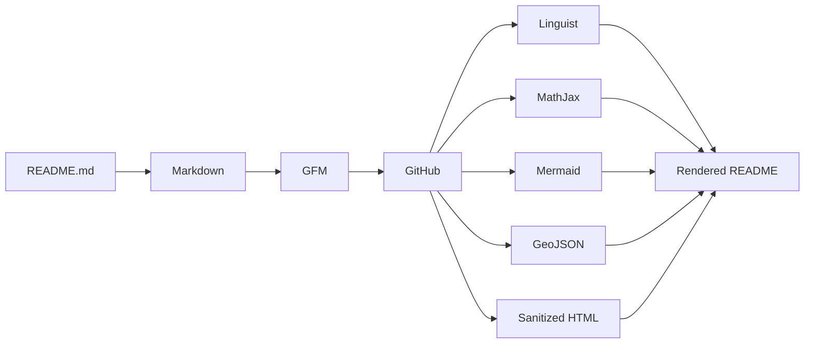
```mermaid
flowchart LR
    A[README.md] --> B[Markdown]
    B --> C[GFM]
    C --> D[GitHub]
    D --> E[Linguist]
    D --> F[MathJax]
    D --> G[Mermaid]
    D --> H[GeoJSON]
    D --> I[Sanitized HTML]
    E --> J[Rendered README]
    F --> J
    G --> J
    H --> J
    I --> J
```

---

# LEVEL 00 — SOURCE LAYER

`HTML` · `Source-only`

```html
<!-- This exists in README.md but disappears when rendered. -->
```

<!--
M10 invariants:
- GeoJSON coordinate order is [longitude, latitude], never the reverse.
- Live map examples use valid JSON. Broken examples stay inside text fences.
- The repository-owned assets/geojson-showcase.geojson file is part of M10.
- GeoJSON maps are interactive renderers, not static image replacements.
- Do not make critical prose discoverable only by clicking map features.
- Keep specialized renderer fences distinct: mermaid, math, geojson.
-->

> [!NOTE]
> Source view is part of the exhibit. A map feature is still a reviewable JSON object with explicit geometry, coordinates, and properties.

---

# ACT I — MARKDOWN CORE

## LEVEL 01 — TYPOGRAPHY & INLINE POWER

`Markdown` · `GFM` · `HTML`

| Source | Result |
| --- | --- |
| `*italic*` | *italic* |
| `**bold**` | **bold** |
| `***both***` | ***both*** |
| `~~deleted~~` | ~~deleted~~ |
| `` `code` `` | `code` |
| `<sub>2</sub>` | H<sub>2</sub>O |
| `<sup>2</sup>` | x<sup>2</sup> |
| `<ins>new</ins>` | <ins>new</ins> |

**Bold containing _italic containing `code`_.**

---

## LEVEL 02 — STRUCTURE, HEADINGS & WHITESPACE

`Markdown`

<details>
<summary><strong>Six-level ATX hierarchy</strong></summary>

# Header 1
## Header 2
### Header 3
#### Header 4
##### Header 5
###### Header 6

</details>

<details>
<summary><strong>Setext headings</strong></summary>

Setext Level One
================

Setext Level Two
----------------

</details>

Two trailing spaces create a hard break.  
This line follows it.

---

## LEVEL 03 — LIST ENGINE & QUOTATION FORTRESS

`Markdown`

- Surface
  - Nested
    - Deeper
      - List mines
        - Deeper still
          - **Maximum indentation**

1. **Quote inside list**

   > Containers can contain containers.

2. **Code inside list**

   ```bash
   printf '%s\n' "nested code"
   ```

> **Quote containing structure**
>
> - [x] list
> - [x] task
> - [x] `code`

---

## LEVEL 04 — HYPERLINK ROUTING MATRIX

`Markdown` · `GFM` · `GitHub` · `HTML`

[Markdown Guide](https://www.markdownguide.org/)  
[Markdown Guide][markdown-guide]  
[GitHub Docs][]  
[GFM Spec]

- [This README](./README.md)
- [Repository root](./)
- [Standalone GeoJSON dataset](./assets/geojson-showcase.geojson)
- [Mermaid gallery](#level-18--full-mermaid-diagram-gallery)
- [GeoJSON showcase](#level-19--interactive-geojson-showcase)
- [Final Boss](#final-boss)

<a name="m10-geojson-beacon"></a>

[Jump to the custom M10 anchor](#m10-geojson-beacon)

<https://github.com/>  
https://github.com  
www.github.com

```text
@octocat
#123
owner/repository#123
```

---

# ACT II — GITHUB FLAVORED MARKDOWN

## LEVEL 05 — TABLE ENGINE

`GFM`

| Alignment | Syntax | Example |
| :--- | :---: | ---: |
| Left | `:---` | `10` |
| Center | `:---:` | `100` |
| Right | `---:` | `1000` |

| Input | Result |
| --- | --- |
| `alpha \| beta` | alpha \| beta |
| `` `left\|right` `` | `left\|right` |

---

## LEVEL 06 — TASK-LIST SKILL TREE

`GFM`

- [x] **Markdown Core**
  - [x] Typography / structure
  - [x] Lists / quotes
  - [x] Link routing
- [x] **GFM Systems**
  - [x] Tables
  - [x] Task lists
- [x] **Media System**
  - [x] Repository-owned SVGs
  - [x] Theme-aware `<picture>`
- [x] **HTML Hybrid**
  - [x] Semantic tags
  - [x] Nested `<details>`
  - [x] Sanitization boundary
- [x] **Syntax Highlighting**
  - [x] 33 language/mode fences
  - [x] Aliases / text / diff / unknown-label control
- [x] **MathJax**
  - [x] Inline / protected inline / display / `math` fence
  - [x] Matrices / calculus / probability / Fourier
- [x] **Mermaid**
  - [x] 14 diagram families shown
  - [x] Architecture compatibility canary
- [x] **GeoJSON**
  - [x] Point
  - [x] LineString
  - [x] Polygon
  - [x] MultiPoint
  - [x] MultiLineString
  - [x] MultiPolygon
  - [x] GeometryCollection
  - [x] FeatureCollection
  - [x] Marker / stroke / fill metadata
  - [x] Repository-owned `.geojson` file
- [ ] **Next renderers**
  - [ ] TopoJSON
  - [ ] STL / 3D
- [ ] **Final Form**
  - [ ] Full rendering QA
  - [ ] Restraint discovered

---

# ACT III — GITHUB EXTENSIONS

## LEVEL 07 — ALERT COMMAND CENTER

`GitHub`

> [!NOTE]
> GeoJSON positions use **longitude first, latitude second**: `[longitude, latitude]`.

> [!TIP]
> Use a `FeatureCollection` when several points, lines, or polygons belong to one logical map.

> [!IMPORTANT]
> GitHub's map renderer expects supported geographic coordinates; its documentation currently calls out CRS84 as the supported projection.[^geojson-files]

> [!WARNING]
> Reversing latitude and longitude can place a perfectly valid feature in a completely wrong location.

> [!CAUTION]
> Do not hide essential instructions only inside clickable map popups. Maps should augment accessible prose, not replace it.

---

## LEVEL 08 — FULL SYNTAX-HIGHLIGHTING LABORATORY

`Markdown` · `GitHub` · `Linguist`

M7 remains represented with **33 distinct syntax modes**.

### Fence controls

```
const unlabeled = true;
```

```text
literal-output = true
```

```javascript
const highlighted = true;
```

```totally-not-a-language
const unknownLabelControl = true;
```

### Alias controls

```javascript
const canonical = "javascript";
```

```js
const alias = "js";
```

<details>
<summary><strong>Gallery A — Web & UI (5)</strong></summary>

```javascript
console.log("JavaScript");
```
```typescript
const phase: number = 10;
```
```html
<details><summary>HTML</summary></details>
```
```css
.readme { display: block; }
```
```json
{"phase":"M10"}
```

</details>

<details>
<summary><strong>Gallery B — Systems & compiled (8)</strong></summary>

```c
int main(void){return 0;}
```
```cpp
#include <iostream>
int main(){std::cout << "C++";}
```
```rust
fn main(){println!("Rust");}
```
```go
package main
func main(){}
```
```java
class Main { public static void main(String[] a){} }
```
```csharp
Console.WriteLine("C#");
```
```kotlin
fun main() = println("Kotlin")
```
```swift
print("Swift")
```

</details>

<details>
<summary><strong>Gallery C — Scripting (6)</strong></summary>

```python
print("Python")
```
```ruby
puts "Ruby"
```
```php
<?php echo "PHP";
```
```lua
print("Lua")
```
```bash
printf '%s\n' Bash
```
```powershell
Write-Output 'PowerShell'
```

</details>

<details>
<summary><strong>Gallery D — Data / config / infrastructure (5)</strong></summary>

```sql
SELECT 'SQL';
```
```yaml
phase: M10
```
```toml
phase = "M10"
```
```xml
<phase>M10</phase>
```
```dockerfile
FROM alpine:3.22
```

</details>

<details>
<summary><strong>Gallery E — Scientific / functional (5)</strong></summary>

```r
print(pi)
```
```julia
println(pi)
```
```haskell
main = print pi
```
```scala
@main def run() = println(math.Pi)
```
```latex
\int_0^1 x^2\,dx
```

</details>

<details>
<summary><strong>Gallery F — Documentation / literal (4)</strong></summary>

```markdown
# Markdown
```
```diff
- static map screenshot
+ interactive GeoJSON renderer
```
```text
plaintext
```
```ini
[readme]
phase=M10
```

</details>

| Gallery | Count |
| --- | ---: |
| Web & UI | 5 |
| Systems & compiled | 8 |
| Scripting | 6 |
| Data/config/infra | 5 |
| Scientific/functional | 5 |
| Docs/meta | 4 |
| **Total** | **33** |

---

## LEVEL 09 — FOOTNOTES & GITHUB-AWARE BEHAVIOR

`GitHub`

Markdown remains readable as plain text while adding structure.[^plain-text]

Relative paths keep local assets and map files branch-aware.[^relative-links]

GitHub sanitizes the HTML hybrid layer.[^sanitization]

Linguist supplies syntax grammars for fenced code.[^linguist]

GitHub renders LaTeX-formatted mathematics with MathJax.[^mathjax]

GitHub renders Mermaid diagrams and GeoJSON maps through specialized fenced-block identifiers.[^mermaid][^geojson]

---

# ACT IV — HTML HYBRID

## LEVEL 10 — REPOSITORY-OWNED MEDIA SYSTEM

`Markdown` · `HTML` · `Local Asset`

<picture>
  <source media="(prefers-color-scheme: dark)" srcset="./assets/hero-dark.svg">
  <source media="(prefers-color-scheme: light)" srcset="./assets/hero-light.svg">
  
</picture>


[](#level-19--interactive-geojson-showcase)

---

## LEVEL 11 — INLINE HTML SEMANTIC TOOLKIT

`HTML` · `Markdown`

Press <kbd>Ctrl</kbd> + <kbd>Shift</kbd> + <kbd>V</kbd>.  
H<sub>2</sub>O · x<sup>2</sup>  
<ins>Inserted</ins> · <del>Deleted</del> · <s>Obsolete</s>  
<strong>Strong HTML</strong> · <em>emphasized HTML</em> · <code>inline HTML code</code>

---

## LEVEL 12 — DETAILS INTERFACE SYSTEM

`HTML` · `Markdown` · `GitHub`

<details>
<summary><strong>Basic collapsed panel</strong></summary>

- Markdown list
- **formatting**
- `inline code`

</details>

<details open>
<summary><strong>Open by default</strong></summary>

The `open` attribute changes initial disclosure state without JavaScript.

</details>

<details>
<summary><strong>Nested disclosure tree</strong></summary>

<details>
<summary><strong>Tier 2</strong></summary>

<details>
<summary><strong>Tier 3</strong></summary>

**Markdown inside HTML inside Markdown.**

</details>

</details>

</details>

> [!TIP]
> M10 uses `<details>` to keep secondary geometry maps optional. Interactive maps can be visually large even when their source is small.

---

## LEVEL 13 — HTML TABLE & LAYOUT LAB

`HTML`

<table>
  <thead><tr><th>Element</th><th>Role</th></tr></thead>
  <tbody>
    <tr><td><code>&lt;details&gt;</code></td><td>Progressive disclosure</td></tr>
    <tr><td><code>&lt;kbd&gt;</code></td><td>Keyboard semantics</td></tr>
    <tr><td><code>&lt;picture&gt;</code></td><td>Theme-aware media</td></tr>
    <tr><td><code>&lt;table&gt;</code></td><td>Explicit table structure</td></tr>
  </tbody>
</table>

---

## LEVEL 14 — MARKDOWN / HTML BOUNDARY LAB

`Markdown` · `HTML` · `Parser`

```html
<details>
<summary>Summary</summary>

### Markdown heading

- Markdown list
- **Markdown emphasis**

</details>
```

```text
Markdown owns structure by default.
HTML adds semantics or disclosure.
Advanced renderer fences select specialized visual systems.
```

---

## LEVEL 15 — SANITIZATION BOUNDARY

`GitHub` · `HTML` · `Security`

```html
<script>alert('nope')</script>
<div style="position:fixed">not a README UI framework</div>
<div class="app" id="root">not an application mount</div>
```

| Goal | README-safe direction |
| --- | --- |
| Interaction | `<details>` / `<summary>` |
| Theme-aware media | `<picture>` / `<source>` |
| Mathematics | MathJax delimiters / `math` fence |
| Diagrams | `mermaid` fence |
| Maps | `geojson` fence or `.geojson` file |
| Styling | GitHub renderer + supported feature metadata |
| Application behavior | Build an actual webpage/app |

---

## LEVEL 16 — HYBRID INTERFACE BOSS

`Markdown` · `GFM` · `GitHub` · `HTML` · `MathJax` · `Mermaid` · `GeoJSON`

<details open>
<summary><strong>M10 SYSTEM CONSOLE</strong></summary>

<table>
  <tr><th>System</th><th>Status</th></tr>
  <tr><td>Markdown / GFM</td><td><strong>ONLINE</strong></td></tr>
  <tr><td>HTML disclosure</td><td><strong>ONLINE</strong></td></tr>
  <tr><td>Linguist syntax routing</td><td><strong>33 MODES</strong></td></tr>
  <tr><td>MathJax rendering</td><td><strong>ADVANCED</strong></td></tr>
  <tr><td>Mermaid rendering</td><td><strong>FULL GALLERY</strong></td></tr>
  <tr><td>GeoJSON mapping</td><td><strong>INTERACTIVE</strong></td></tr>
  <tr><td>README-authored JavaScript</td><td><del>ABSENT</del></td></tr>
</table>

Inline equation: $\text{coordinates}+\text{geometry}+\text{properties}=\text{map feature}$.

</details>

---

# ACT V — ADVANCED RENDERING

> Advanced renderer metadata can route Markdown source into mathematics, diagrams, maps, and eventually 3D geometry.

## LEVEL 17 — ADVANCED MATHJAX MATHEMATICAL SHOWCASE

`GitHub` · `MathJax` · `LaTeX`

M8 remains represented across all four math entry routes.

Inline: $E=mc^2$ and $\sin^2\theta+\cos^2\theta=1$.

Protected inline: $`\left\{x_i\right\}_{i=1}^{n}`$.

$$\left(\sum_{k=1}^{n}a_kb_k\right)^2\leq\left(\sum_{k=1}^{n}a_k^2\right)\left(\sum_{k=1}^{n}b_k^2\right)$$

```math
A=\begin{pmatrix}1&2\\3&4\end{pmatrix},
\qquad
Av=\lambda v,
\qquad
\operatorname{rank}(A)+\operatorname{nullity}(A)=n
```

```math
\nabla f(x)=
\begin{pmatrix}
\frac{\partial f}{\partial x_1}\\
\vdots\\
\frac{\partial f}{\partial x_n}
\end{pmatrix},
\qquad
\frac{d}{dx}\int_a^x f(t)\,dt=f(x)
```

```math
P(A\mid B)=\frac{P(B\mid A)P(A)}{P(B)},
\qquad
e^{i\pi}+1=0
```

| Concept | Expression |
| --- | --- |
| Norm | $\lVert x\rVert_2$ |
| Determinant | $\det A$ |
| Gradient | $\nabla f(x)$ |
| Expectation | $\mathbb E[X]$ |

<details>
<summary><strong>Open MathJax chamber</strong></summary>

```math
\widehat f(\xi)=\int_{-\infty}^{\infty}f(x)e^{-2\pi i x\xi}\,dx
```

</details>

---

## LEVEL 18 — FULL MERMAID DIAGRAM GALLERY

`GitHub` · `Mermaid` · `Diagram Renderer`

M9 remains represented with its multi-family gallery. Large diagrams stay collapsible.

### Flowchart

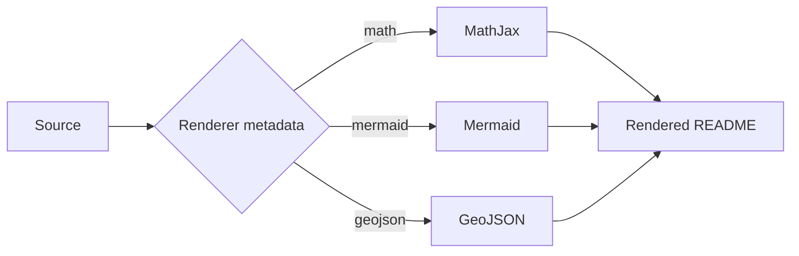
```mermaid
flowchart LR
    SRC[Source] --> TYPE{Renderer metadata}
    TYPE -- math --> MJ[MathJax]
    TYPE -- mermaid --> MM[Mermaid]
    TYPE -- geojson --> GEO[GeoJSON]
    MJ --> OUT[Rendered README]
    MM --> OUT
    GEO --> OUT
```

<details>
<summary><strong>Sequence</strong></summary>

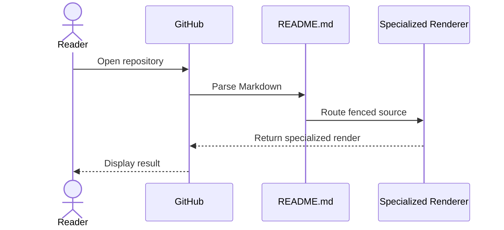
```mermaid
sequenceDiagram
    actor Reader
    participant GH as GitHub
    participant MD as README.md
    participant R as Specialized Renderer
    Reader->>GH: Open repository
    GH->>MD: Parse Markdown
    MD->>R: Route fenced source
    R-->>GH: Return specialized render
    GH-->>Reader: Display result
```

</details>

<details>
<summary><strong>State</strong></summary>

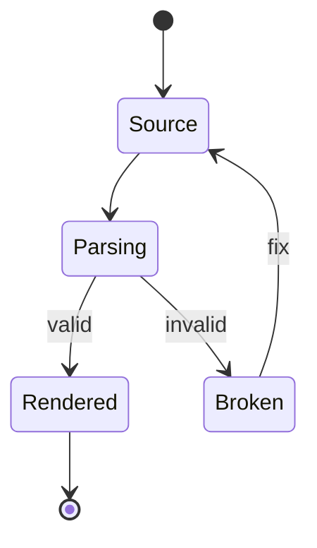
```mermaid
stateDiagram-v2
    [*] --> Source
    Source --> Parsing
    Parsing --> Rendered: valid
    Parsing --> Broken: invalid
    Broken --> Source: fix
    Rendered --> [*]
```

</details>

<details>
<summary><strong>Class + ER</strong></summary>

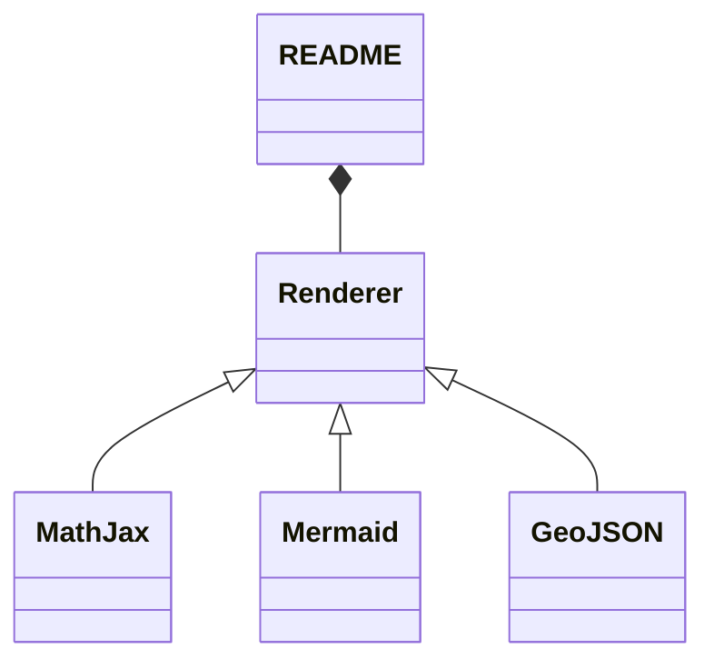
```mermaid
classDiagram
    Renderer <|-- MathJax
    Renderer <|-- Mermaid
    Renderer <|-- GeoJSON
    README *-- Renderer
```

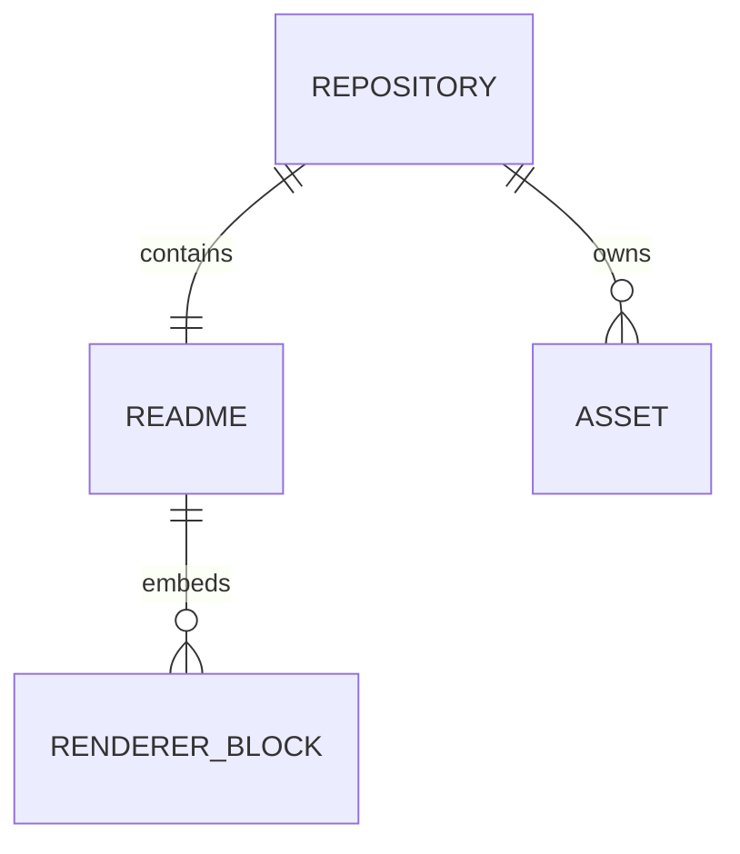
```mermaid
erDiagram
    REPOSITORY ||--|| README : contains
    REPOSITORY ||--o{ ASSET : owns
    README ||--o{ RENDERER_BLOCK : embeds
```

</details>

<details>
<summary><strong>Journey + Gantt + Pie</strong></summary>

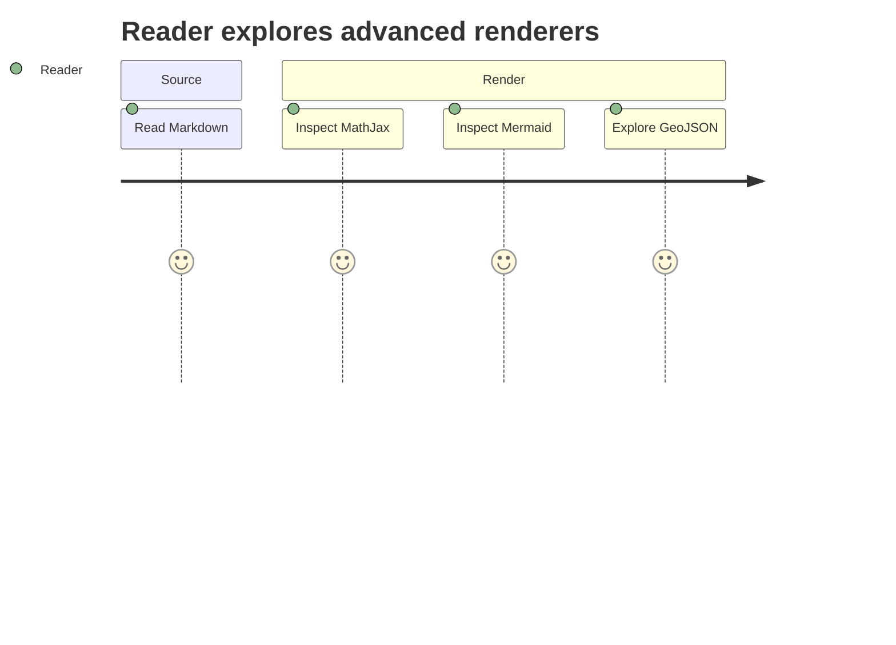
```mermaid
journey
    title Reader explores advanced renderers
    section Source
      Read Markdown: 5: Reader
    section Render
      Inspect MathJax: 5: Reader
      Inspect Mermaid: 5: Reader
      Explore GeoJSON: 5: Reader
```

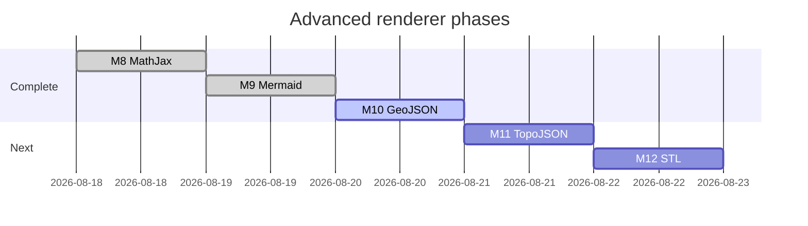
```mermaid
gantt
    title Advanced renderer phases
    dateFormat YYYY-MM-DD
    section Complete
    M8 MathJax :done, m8, 2026-08-18, 1d
    M9 Mermaid :done, m9, after m8, 1d
    M10 GeoJSON :active, m10, after m9, 1d
    section Next
    M11 TopoJSON :m11, after m10, 1d
    M12 STL :m12, after m11, 1d
```

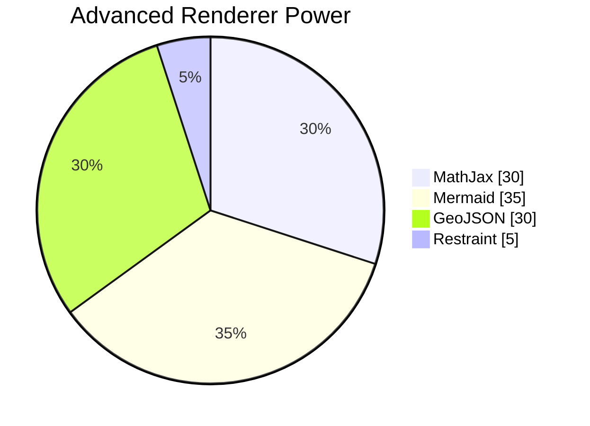
```mermaid
pie showData
    title Advanced Renderer Power
    "MathJax" : 30
    "Mermaid" : 35
    "GeoJSON" : 30
    "Restraint" : 5
```

</details>

<details>
<summary><strong>GitGraph + Mindmap + Timeline</strong></summary>

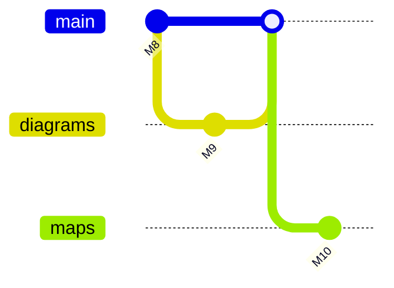
```mermaid
gitGraph
    commit id: "M8"
    branch diagrams
    checkout diagrams
    commit id: "M9"
    checkout main
    merge diagrams
    branch maps
    checkout maps
    commit id: "M10"
```

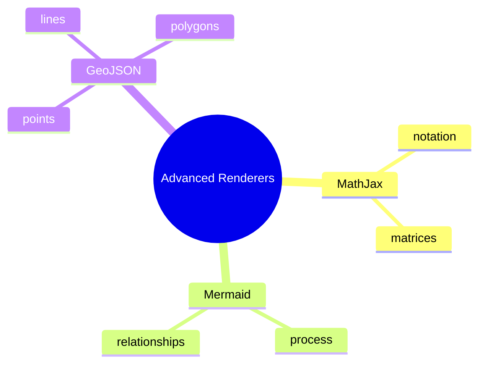
```mermaid
mindmap
  root((Advanced Renderers))
    MathJax
      notation
      matrices
    Mermaid
      process
      relationships
    GeoJSON
      points
      lines
      polygons
```

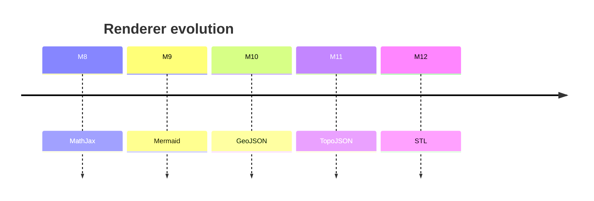
```mermaid
timeline
    title Renderer evolution
    M8 : MathJax
    M9 : Mermaid
    M10 : GeoJSON
    M11 : TopoJSON
    M12 : STL
```

</details>

<details>
<summary><strong>Quadrant + Requirement</strong></summary>

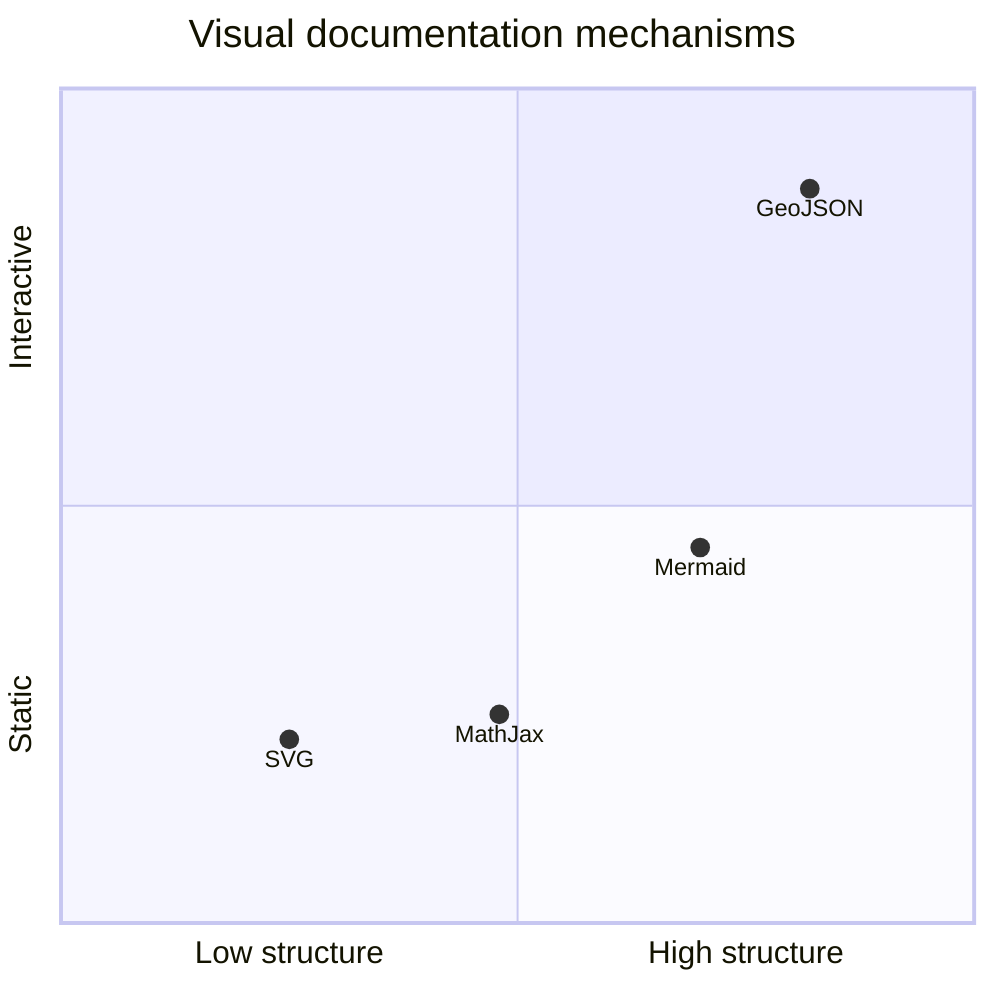
```mermaid
quadrantChart
    title Visual documentation mechanisms
    x-axis Low structure --> High structure
    y-axis Static --> Interactive
    SVG: [0.25, 0.22]
    MathJax: [0.48, 0.25]
    Mermaid: [0.70, 0.45]
    GeoJSON: [0.82, 0.88]
```

```mermaid
requirementDiagram
    requirement source_controlled {
        id: REQ-1
        text: Visual source remains reviewable
        risk: medium
        verifymethod: inspection
    }
    element renderer_block {
        type: documentation
        docref: README.md
    }
    renderer_block - satisfies -> source_controlled
```

</details>

> [!NOTE]
> M9's Architecture v11.1+ compatibility-canary concept remains relevant: upstream Mermaid support and GitHub's bundled Mermaid version are not automatically identical.

---

## LEVEL 19 — INTERACTIVE GEOJSON SHOWCASE

`GitHub` · `GeoJSON` · `Interactive Map` · `Local Asset`

GitHub documents GeoJSON as a native diagram/map syntax in Markdown. Put valid GeoJSON inside a fenced block labeled `geojson`, or commit a `.geojson` file and open it directly in the repository.[^geojson][^geojson-files]

> [!IMPORTANT]
> GeoJSON coordinate order is **`[longitude, latitude]`**. This is the opposite of the conversational “latitude, longitude” order many people are used to saying aloud.

### 19.1 — Renderer anatomy

````markdown
```geojson
{
  "type": "Point",
  "coordinates": [13.405, 52.52]
}
```
````

```text
Markdown fence
    │
    ├── info string: geojson
    │
    └── valid GeoJSON object
            ↓
       GitHub map renderer
            ↓
     interactive Leaflet map
```

A `json` fence would highlight the same characters as source. A `geojson` fence asks GitHub for a map.

---

### 19.2 — Main interactive FeatureCollection

This map combines **three Points, one LineString, and one Polygon**. It is expanded by default because it is M10's primary live demonstration.

<details open>
<summary><strong>Open / collapse the M10 renderer expedition map</strong></summary>

```geojson
{
  "type": "FeatureCollection",
  "features": [
    {
      "type": "Feature",
      "properties": {
        "title": "Renderer Node — London",
        "marker-size": "large",
        "marker-color": "#7c3aed",
        "marker-symbol": "1"
      },
      "geometry": {
        "type": "Point",
        "coordinates": [-0.1276, 51.5072]
      }
    },
    {
      "type": "Feature",
      "properties": {
        "title": "Renderer Node — Paris",
        "marker-size": "medium",
        "marker-color": "#0891b2",
        "marker-symbol": "2"
      },
      "geometry": {
        "type": "Point",
        "coordinates": [2.3522, 48.8566]
      }
    },
    {
      "type": "Feature",
      "properties": {
        "title": "Renderer Node — Berlin",
        "marker-size": "medium",
        "marker-color": "#ea580c",
        "marker-symbol": "3"
      },
      "geometry": {
        "type": "Point",
        "coordinates": [13.405, 52.52]
      }
    },
    {
      "type": "Feature",
      "properties": {
        "title": "Renderer Route",
        "stroke": "#2563eb",
        "stroke-opacity": 0.9,
        "stroke-width": 4
      },
      "geometry": {
        "type": "LineString",
        "coordinates": [
          [-0.1276, 51.5072],
          [2.3522, 48.8566],
          [13.405, 52.52]
        ]
      }
    },
    {
      "type": "Feature",
      "properties": {
        "title": "Demonstration Zone",
        "stroke": "#7c3aed",
        "stroke-opacity": 0.85,
        "stroke-width": 2,
        "fill": "#c4b5fd",
        "fill-opacity": 0.28
      },
      "geometry": {
        "type": "Polygon",
        "coordinates": [
          [
            [4.0, 49.5],
            [10.5, 49.5],
            [10.5, 53.2],
            [4.0, 53.2],
            [4.0, 49.5]
          ]
        ]
      }
    }
  ]
}
```

</details>

The feature properties use GitHub-supported simple-style metadata such as `marker-color`, `marker-size`, `marker-symbol`, `stroke`, `stroke-width`, `fill`, and opacity controls.[^geojson-style]

---

### 19.3 — Point geometry

<details>
<summary><strong>Point — one coordinate position</strong></summary>

```geojson
{
  "type": "Feature",
  "properties": {
    "title": "Single Point",
    "description": "One geographic position",
    "marker-color": "#7c3aed",
    "marker-size": "large",
    "marker-symbol": "p"
  },
  "geometry": {
    "type": "Point",
    "coordinates": [13.405, 52.52]
  }
}
```

</details>

A position is a numeric array. For ordinary 2D geographic GeoJSON on GitHub, think:

```text
[ longitude, latitude ]
```

---

### 19.4 — LineString geometry

<details>
<summary><strong>LineString — an ordered path through positions</strong></summary>

```geojson
{
  "type": "Feature",
  "properties": {
    "title": "Three-node route",
    "stroke": "#0891b2",
    "stroke-opacity": 0.9,
    "stroke-width": 5
  },
  "geometry": {
    "type": "LineString",
    "coordinates": [
      [-0.1276, 51.5072],
      [2.3522, 48.8566],
      [13.405, 52.52]
    ]
  }
}
```

</details>

Line order matters: the geometry connects positions in the order supplied.

---

### 19.5 — Polygon geometry

<details>
<summary><strong>Polygon — a closed linear ring</strong></summary>

```geojson
{
  "type": "Feature",
  "properties": {
    "title": "Closed demonstration zone",
    "stroke": "#7c3aed",
    "stroke-width": 3,
    "fill": "#ddd6fe",
    "fill-opacity": 0.35
  },
  "geometry": {
    "type": "Polygon",
    "coordinates": [
      [
        [4.0, 49.5],
        [10.5, 49.5],
        [10.5, 53.2],
        [4.0, 53.2],
        [4.0, 49.5]
      ]
    ]
  }
}
```

</details>

The first and last position of the ring are the same, explicitly closing the boundary.

---

### 19.6 — MultiPoint

<details>
<summary><strong>MultiPoint — several positions, one geometry</strong></summary>

```geojson
{
  "type": "Feature",
  "properties": {
    "title": "MultiPoint demonstration"
  },
  "geometry": {
    "type": "MultiPoint",
    "coordinates": [
      [-3.1883, 55.9533],
      [12.4964, 41.9028]
    ]
  }
}
```

</details>

---

### 19.7 — MultiLineString

<details>
<summary><strong>MultiLineString — multiple paths, one geometry</strong></summary>

```geojson
{
  "type": "Feature",
  "properties": {
    "title": "Two independent paths",
    "stroke": "#059669",
    "stroke-width": 3
  },
  "geometry": {
    "type": "MultiLineString",
    "coordinates": [
      [[-5.0, 50.0], [-1.0, 52.0], [2.0, 51.0]],
      [[8.0, 47.0], [11.0, 48.5], [14.0, 47.8]]
    ]
  }
}
```

</details>

---

### 19.8 — MultiPolygon

<details>
<summary><strong>MultiPolygon — multiple separate areas</strong></summary>

```geojson
{
  "type": "Feature",
  "properties": {
    "title": "Two separated polygons",
    "stroke": "#dc2626",
    "stroke-width": 2,
    "fill": "#fecaca",
    "fill-opacity": 0.3
  },
  "geometry": {
    "type": "MultiPolygon",
    "coordinates": [
      [[[0.0, 44.0], [2.0, 44.0], [2.0, 45.0], [0.0, 45.0], [0.0, 44.0]]],
      [[[15.0, 54.0], [17.0, 54.0], [17.0, 55.0], [15.0, 55.0], [15.0, 54.0]]]
    ]
  }
}
```

</details>

---

### 19.9 — GeometryCollection

<details>
<summary><strong>GeometryCollection — heterogeneous geometry objects</strong></summary>

```geojson
{
  "type": "Feature",
  "properties": {
    "title": "Mixed geometry collection"
  },
  "geometry": {
    "type": "GeometryCollection",
    "geometries": [
      {
        "type": "Point",
        "coordinates": [7.4474, 46.948]
      },
      {
        "type": "LineString",
        "coordinates": [
          [6.1, 46.2],
          [7.4474, 46.948],
          [8.54, 47.38]
        ]
      }
    ]
  }
}
```

</details>

GitHub's map viewer documentation lists Point, LineString, Polygon, MultiPoint, MultiLineString, MultiPolygon, and GeometryCollection as supported geometry types.[^geojson-files]

---

### 19.10 — Feature vs geometry vs collection

```text
Geometry
└── says WHAT shape exists
    Point / LineString / Polygon / ...

Feature
├── geometry
└── properties
    title / description / style metadata / domain data

FeatureCollection
└── features[]
    ├── Feature
    ├── Feature
    └── Feature
```

A geometry is spatial structure. A Feature attaches properties. A FeatureCollection groups features into one document/map.

---

### 19.11 — Styling metadata laboratory

GitHub's GeoJSON viewer supports simple-style feature properties for markers, lines, and polygons.[^geojson-style]

| Property | Role |
| --- | --- |
| `marker-size` | point marker size |
| `marker-color` | point marker color |
| `marker-symbol` | Maki icon ID or one alphanumeric character |
| `stroke` | line / polygon-edge color |
| `stroke-opacity` | line / edge opacity |
| `stroke-width` | line / edge width |
| `fill` | polygon interior color |
| `fill-opacity` | polygon interior opacity |

<details>
<summary><strong>Open styled-feature source</strong></summary>

```json
{
  "properties": {
    "marker-size": "large",
    "marker-color": "#7c3aed",
    "marker-symbol": "1",
    "stroke": "#2563eb",
    "stroke-width": 4,
    "fill": "#c4b5fd",
    "fill-opacity": 0.28
  }
}
```

</details>

The `json` fence above is intentional: it demonstrates metadata as source rather than spawning another map.

---

### 19.12 — Repository-owned standalone GeoJSON

M10 adds a real file:

**[`assets/geojson-showcase.geojson`](./assets/geojson-showcase.geojson)**

Opening that file directly on GitHub exercises a second rendering path:

```text
README fenced geojson
        ↓
embedded interactive map

.geojson repository file
        ↓
standalone interactive map viewer
```

The standalone dataset contains all seven geometry families and simple-style metadata.

---

### 19.13 — Projection and coordinate-system boundary

GitHub's current non-code-file documentation says its map viewer supports the CRS84 projection. If valid points render somewhere absurd, a projection mismatch—or simply reversed coordinates—is a primary suspect.[^geojson-files]

```text
Correct conceptual order:
[longitude, latitude]

Common human-language order:
latitude, longitude

Do not swap them casually.
```

---

### 19.14 — GeoJSON parser-failure laboratory

Broken examples remain inert inside a longer `text` fence:

````text
```geojson
{
  "type": "Point",
  "coordinates": [13.405, 52.52],
}
```

```geojson
{
  "type": "Polygon",
  "coordinates": [[[4,49], [10,49], [10,53]]]
}
```
````

The first example has invalid JSON because of the trailing comma. The second is structurally inadequate as a proper closed polygon ring.

> [!CAUTION]
> Broken geographic examples should look deliberately broken. Do not place invalid GeoJSON in a live `geojson` fence merely to prove that parsing can fail.

---

### 19.15 — GeoJSON vs JSON highlighting

The same conceptual object can enter two completely different pipelines.

**Highlighted source:**

```json
{
  "type": "Point",
  "coordinates": [13.405, 52.52]
}
```

**Interactive geographic renderer:**

```geojson
{
  "type": "Point",
  "coordinates": [13.405, 52.52]
}
```

```text
json     → Linguist → highlighted JSON source
geojson  → map renderer → interactive geographic view
```

This is M10's central renderer lesson: **identical JSON structure can be treated as source or as an interactive visualization depending on the fence identifier.**

---

### 19.16 — GeoJSON vs Mermaid vs MathJax vs SVG

| Need | Renderer |
| --- | --- |
| Formula / notation | MathJax |
| Process / relationships | Mermaid |
| Geographic geometry | GeoJSON |
| Static illustration / branding | repository-owned SVG |
| Generic source example | Linguist / normal code fence |

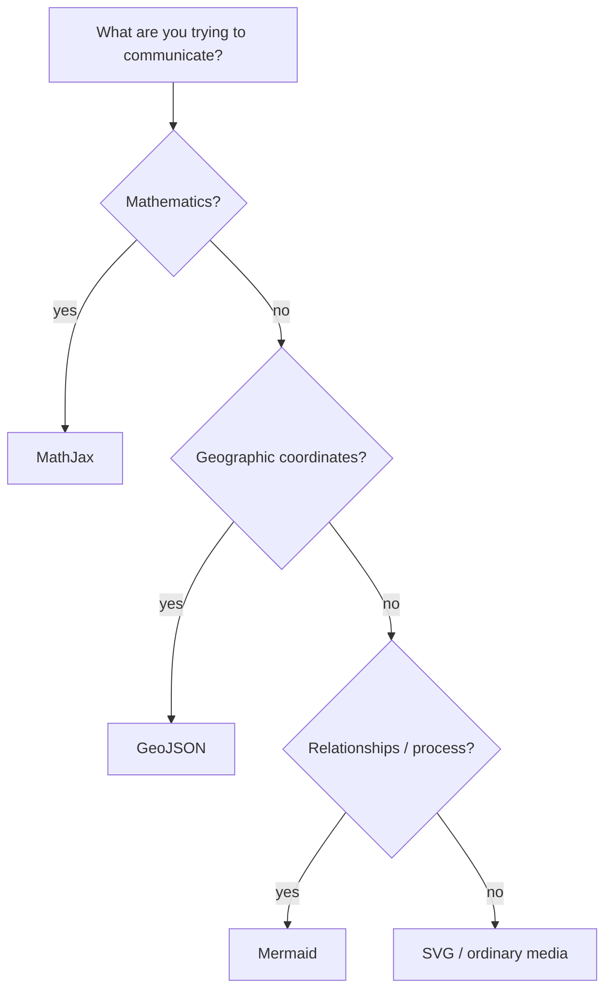
```mermaid
flowchart TD
    NEED[What are you trying to communicate?]
    NEED --> MATH{Mathematics?}
    MATH -- yes --> MJ[MathJax]
    MATH -- no --> GEO{Geographic coordinates?}
    GEO -- yes --> GJ[GeoJSON]
    GEO -- no --> REL{Relationships / process?}
    REL -- yes --> MM[Mermaid]
    REL -- no --> SVG[SVG / ordinary media]
```

---

### 19.17 — Map accessibility and fallback strategy

Interactive maps are visually powerful but should not become the only representation of essential content.

For the main M10 map, the prose already states its semantic structure:

- three named point features
- one route connecting them
- one demonstration polygon
- styling metadata
- a repository-owned equivalent dataset

That means the document still communicates the model if the interactive map cannot be used.

> [!IMPORTANT]
> Treat the map as an enhancement over accessible text and inspectable JSON source, not as the sole carrier of meaning.

---

### 19.18 — Large-map boundary

GitHub's current documentation says very large GeoJSON files (over roughly 10 MB) cannot be rendered in the browser, and maps with roughly more than 750 markers may be clustered at higher zoom levels.[^geojson-files]

```text
Small documentation map
→ embed directly

Large repeated geometry
→ consider TopoJSON (M11)

Huge dataset
→ split files / use a dedicated mapping application
```

This gives M11 a real reason to exist: TopoJSON is not merely “GeoJSON with a different name”; it can encode shared topology more compactly.

---

### 19.19 — GeoJSON Final Form

<details open>
<summary><strong>INTERACTIVE MAP FINAL FORM — expanded by default</strong></summary>

```geojson
{
  "type": "FeatureCollection",
  "features": [
    {
      "type": "Feature",
      "properties": {
        "title": "SOURCE",
        "marker-color": "#7c3aed",
        "marker-symbol": "s"
      },
      "geometry": {
        "type": "Point",
        "coordinates": [2.3522, 48.8566]
      }
    },
    {
      "type": "Feature",
      "properties": {
        "title": "RENDER",
        "marker-color": "#0891b2",
        "marker-symbol": "r"
      },
      "geometry": {
        "type": "Point",
        "coordinates": [13.405, 52.52]
      }
    },
    {
      "type": "Feature",
      "properties": {
        "title": "Source to Render",
        "stroke": "#2563eb",
        "stroke-width": 5
      },
      "geometry": {
        "type": "LineString",
        "coordinates": [
          [2.3522, 48.8566],
          [13.405, 52.52]
        ]
      }
    }
  ]
}
```

```math
\boxed{
\text{coordinates}
+\text{geometry}
+\text{properties}
+\texttt{geojson}
=\text{interactive map}
}
```

</details>

### M10 renderer rule

```text
Need geography?
├── a few features in README → fenced geojson
├── reusable repository dataset → .geojson file
├── shared-topology compression → TopoJSON (M11)
└── full GIS application → use a dedicated map stack
```

---

# ACT VI — PARSER & SOURCE LAB

## LEVEL 20 — ESCAPE HATCH

`Markdown` · `Parser`

\# Not a heading  
\> Not a quote  
\- Not a list  
1\. Not an ordered list  
\*Not emphasis\*

| Literal | Source |
| :---: | :---: |
| `*` | `\*` |
| `_` | `\_` |
| `#` | `\#` |
| `>` | `\>` |
| `|` | `\|` |
| `$` | `\$` where needed around math parsing |
| `\` | `\\` |

---

## LEVEL 21 — BACKTICK & FENCE PARADOX

`Markdown` · `Parser`

``Use a `backtick` inside code``

````markdown
```javascript
console.log("Three backticks live inside four.");
```
````

````markdown
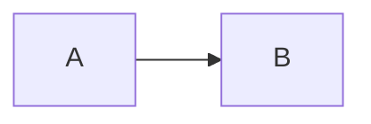
```mermaid
flowchart LR
    A --> B
```
````

````markdown
```geojson
{"type":"Point","coordinates":[13.405,52.52]}
```
````

---

## LEVEL 22 — DELIMITER & RENDERER COLLISION LAB

`Markdown` · `GFM` · `MathJax` · `Mermaid` · `GeoJSON`

````text
$            → possible MathJax delimiter
`            → code delimiter / protected math boundary
```math      → MathJax block routing metadata
```mermaid   → Mermaid diagram routing metadata
```geojson   → interactive map routing metadata
```json      → syntax-highlighted JSON source
````

Fence identifiers are not cosmetic labels. They can switch the entire rendering subsystem.

---

## LEVEL 23 — ENTITY REACTOR

`Markdown` · `HTML`

| Source | Rendered |
| --- | :---: |
| `&copy;` | &copy; |
| `&rarr;` | &rarr; |
| `&times;` | &times; |
| `&ne;` | &ne; |
| `&infin;` | &infin; |
| `&#169;` | &#169; |
| `&#xA9;` | &#xA9; |

&lt;div&gt;not an HTML element&lt;/div&gt;

---

## LEVEL 24 — WHITESPACE & RECURSION CHAMBER

`Markdown` · `Parser`

````markdown
```markdown
**Markdown shown inside Markdown shown inside Markdown.**
```
````

````markdown
```math
\sum_{k=1}^{n}k=\frac{n(n+1)}2
```
````

````markdown
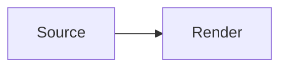
```mermaid
flowchart LR
    Source --> Render
```
````

````markdown
```geojson
{
  "type": "Point",
  "coordinates": [13.405, 52.52]
}
```
````

<!--
Future maintainers:
Nested fences, GeoJSON coordinate order, renderer identifiers, math delimiters,
literal-dollar escapes, reference definitions, relative assets, and details blank lines
are intentional parser demonstrations.
-->

---

# ACT VII — ENDGAME & REFERENCE

## 🏅 ACHIEVEMENTS UNLOCKED

<p align="center">
  
  
  
  
</p>

| Achievement | Requirement | Status |
| --- | --- | :---: |
| **Syntax Curator** | Retain 33 syntax modes | ✅ |
| **MathJax Architect** | Preserve advanced mathematics | ✅ |
| **Mermaid Cartographer** | Preserve multi-family diagram gallery | ✅ |
| **GeoJSON Navigator** | Render interactive geographic source | ✅ |
| **Coordinate Cartographer** | Use correct longitude/latitude order | ✅ |
| **Point Keeper** | Render Point / MultiPoint | ✅ |
| **Route Builder** | Render LineString / MultiLineString | ✅ |
| **Region Builder** | Render Polygon / MultiPolygon | ✅ |
| **Geometry Collector** | Render GeometryCollection | ✅ |
| **FeatureCollection Architect** | Combine heterogeneous Features | ✅ |
| **Simple-Style Operator** | Marker, stroke, fill metadata | ✅ |
| **Dataset Keeper** | Add repository-owned `.geojson` file | ✅ |
| **Renderer Router** | Distinguish JSON, GeoJSON, Mermaid, MathJax, SVG | ✅ |
| **Map Fallback Planner** | Preserve essential meaning outside map UI | ✅ |
| **Parser Tamer** | Keep broken GeoJSON examples inert | ✅ |
| **Master of Restraint** | Stop before building a GIS platform | ❌ |

---

## THE CHAOS INDEX

```text
Clarity           ████████████████████ 100%
Structure         ████████████████████ 100%
Typography        ████████████████████ 100%
Lists / Tables    ████████████████████ 100%
Links             ████████████████████ 100%
Local Media       ████████████████████ 100%
HTML Hybrid       ████████████████████ 100%
Syntax Labels     ████████████████████ 100%
Language Breadth  ████████████████████  33 modes
MathJax           ████████████████████ 100%
Mermaid           ████████████████████ 100%
GeoJSON Geometry  ████████████████████ 100%
GeoJSON Styling   ████████████████████ 100%
Interactive Maps  ████████████████████ 100%
Renderer Routing  ████████████████████ 100%
Parser Tricks     ███████████████████░  95%
Restraint         ██░░░░░░░░░░░░░░░░░░  10%
Raw Power         ████████████████████  M10
```

> [!WARNING]
> An interactive map can make bad geographic data look extremely convincing.
>
> **M10 demonstrates geographic rendering and source structure; it does not turn coordinates into truth merely by placing them on tiles.**

---

## 🧰 THE ACTUALLY USEFUL CHEAT SHEET

``````markdown
# Heading
*italic* **bold** ~~strike~~ `code`

[inline](https://example.com)
[reference][docs]
[relative](./README.md)
[same document](#final-boss)

Inline math: $E=mc^2$
Protected math: $`x_i^2`$

```math
\int_0^1 x^2\,dx=\frac13
```


```mermaid
flowchart LR
    A --> B
```

```geojson
{
  "type": "Feature",
  "properties": {"title": "Point"},
  "geometry": {
    "type": "Point",
    "coordinates": [13.405, 52.52]
  }
}
```

[Standalone GeoJSON](./assets/geojson-showcase.geojson)

```python
print("highlighted code")
```

```text
literal output
```

````markdown
```geojson
{"type":"Point","coordinates":[13.405,52.52]}
```
````

<details>
<summary>Collapsed renderer</summary>

```geojson
{"type":"Point","coordinates":[2.3522,48.8566]}
```

</details>


<kbd>Ctrl</kbd> + <kbd>K</kbd>

- [x] Complete
- [ ] Incomplete

| Left | Center | Right |
| :--- | :---: | ---: |
| alpha \| beta | $x^2$ | 100 |
``````

[docs]: https://example.com/docs

---

## 🧯 COMMON README CRIMES

| Crime | Consequence |
| --- | --- |
| Writing `[latitude, longitude]` in GeoJSON | features land in wrong places |
| Using `json` when expecting a map | source is highlighted, not mapped |
| Using `geojson` for invalid JSON | map renderer fails |
| Leaving a polygon ring open | invalid / malformed polygon geometry |
| Putting essential instructions only in map popups | accessibility and fallback failure |
| Hard-coding absolute repository asset URLs | branch previews become brittle |
| Huge GeoJSON payload in README | slow, noisy documentation |
| Ignoring projection assumptions | valid numbers can map incorrectly |
| Forgetting longer outer fences | renderer-source examples terminate themselves |
| Treating a pretty map as data validation | visual authority hides bad data |
| Using GeoJSON where a table is clearer | interaction without information gain |

---

## 🧪 README QUALITY TEST

- [ ] Main FeatureCollection renders interactively.
- [ ] Point markers appear at expected locations.
- [ ] LineString follows all listed positions.
- [ ] Polygon is visibly closed and filled.
- [ ] MultiPoint renders more than one point.
- [ ] MultiLineString renders independent line parts.
- [ ] MultiPolygon renders separated areas.
- [ ] GeometryCollection renders mixed geometry.
- [ ] Marker color/size/symbol metadata is honored where GitHub supports it.
- [ ] Stroke/fill metadata remains visible.
- [ ] Standalone `assets/geojson-showcase.geojson` renders directly on GitHub.
- [ ] All coordinate pairs remain longitude-first.
- [ ] Broken examples remain inside non-GeoJSON fences.
- [ ] JSON-vs-GeoJSON comparison demonstrates distinct renderers.
- [ ] Essential map meaning remains available as prose/source.
- [ ] MathJax still renders.
- [ ] Mermaid still renders.
- [ ] 33 Linguist modes remain represented.
- [ ] Local SVG hero still switches correctly.
- [ ] Nested fences remain balanced.
- [ ] Mobile map interaction remains usable.
- [ ] README is previewed on GitHub before release.

---

# FINAL BOSS

<picture>
  <source media="(prefers-color-scheme: dark)" srcset="./assets/hero-dark.svg">
  <source media="(prefers-color-scheme: light)" srcset="./assets/hero-light.svg">
  
</picture>

<details open>
<summary><strong>FINAL FORM — MULTI-RENDERER NETWORK</strong></summary>

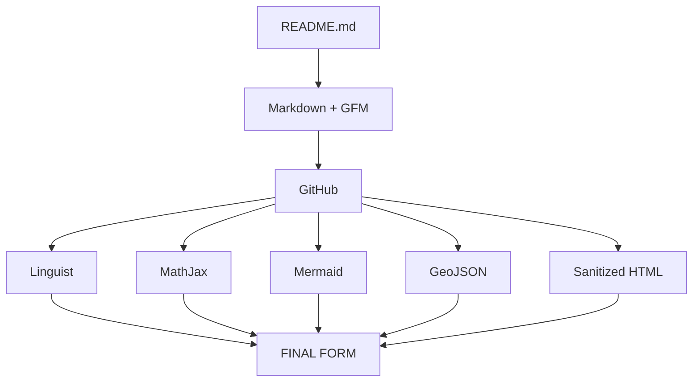
```mermaid
flowchart TB
    README[README.md]
    README --> CORE[Markdown + GFM]
    CORE --> GH[GitHub]

    GH --> CODE[Linguist]
    GH --> MATH[MathJax]
    GH --> DIAGRAM[Mermaid]
    GH --> MAP[GeoJSON]
    GH --> HYBRID[Sanitized HTML]

    CODE --> FINAL[FINAL FORM]
    MATH --> FINAL
    DIAGRAM --> FINAL
    MAP --> FINAL
    HYBRID --> FINAL
```

```math
\boxed{
\text{Markdown}
+\text{Linguist}
+\text{MathJax}
+\text{Mermaid}
+\text{GeoJSON}
+\text{HTML}
=\text{M10}
}
```

<details>
<summary><strong>Inspect the renderer stack as source</strong></summary>

```text
SOURCE
├── ordinary Markdown
├── fenced code → Linguist
├── math delimiters / math fence → MathJax
├── mermaid fence → Mermaid
├── geojson fence / .geojson file → interactive map
├── HTML fragments → sanitizer
├── TopoJSON → M11
└── STL → M12
```

</details>

</details>

<div align="center">

<p>
  Markdown owns the document.<br>
  Fence metadata chooses specialized renderers.<br>
  MathJax typesets notation.<br>
  Mermaid models relationships.<br>
  GeoJSON maps geographic geometry.<br>
  The raw source remains inspectable underneath all of it.
</p>

<a href="https://docs.github.com/en/get-started/writing-on-github/working-with-advanced-formatting/creating-diagrams"></a>
<a href="./assets/geojson-showcase.geojson"></a>
<a href="#"></a>

<h2>Markdown: Final Form.</h2>
<h3>Interactive GeoJSON layer unlocked.</h3>

</div>


---

[markdown-guide]: https://www.markdownguide.org/ "Markdown Guide"
[GitHub Docs]: https://docs.github.com/en/get-started/writing-on-github "GitHub writing and formatting documentation"
[GFM Spec]: https://github.github.com/gfm/ "GitHub Flavored Markdown specification"

[^plain-text]: Markdown remains readable as plain text while adding lightweight structural syntax.
[^relative-links]: Relative repository paths keep files, images, and GeoJSON datasets branch-aware.
[^sanitization]: GitHub sanitizes rendered README HTML, so arbitrary application-style script and styling are not the interface model.
[^linguist]: GitHub Linguist defines languages and aliases used for syntax highlighting in fenced code blocks.
[^mathjax]: GitHub renders supported LaTeX-formatted mathematics in Markdown using MathJax.
[^mermaid]: GitHub documents Mermaid as one of its advanced diagram syntaxes and renders valid source from fenced `mermaid` blocks.
[^geojson]: GitHub documents GeoJSON as a native interactive map syntax in Markdown when valid GeoJSON is placed in a fenced block with the `geojson` identifier.
[^geojson-files]: GitHub's non-code-file documentation says `.geojson` and qualifying `.json` files can render as maps, uses Leaflet, supports the standard GeoJSON geometry families, documents CRS84 support, clustering for large marker sets, and a browser-rendering limit for especially large files.
[^geojson-style]: GitHub's map documentation describes simple-style properties including marker size/color/symbol, stroke color/opacity/width, and polygon fill/opacity.
