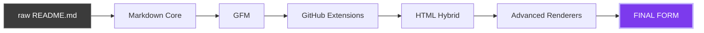
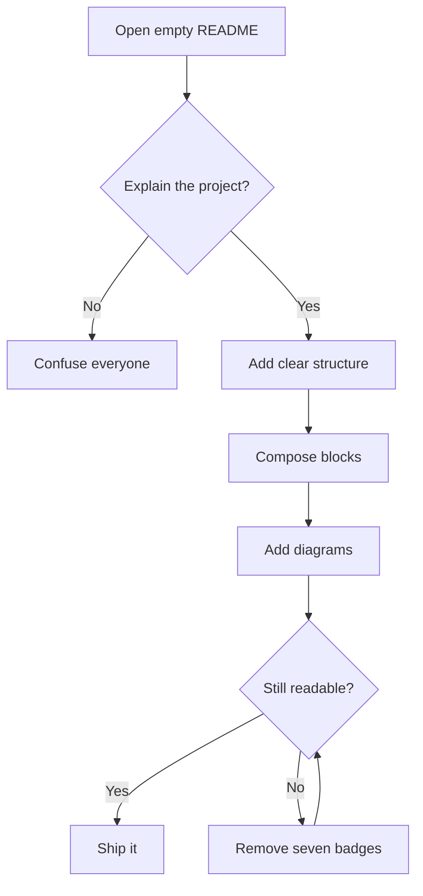
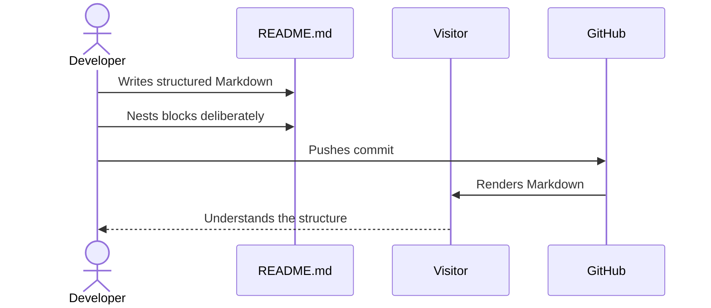
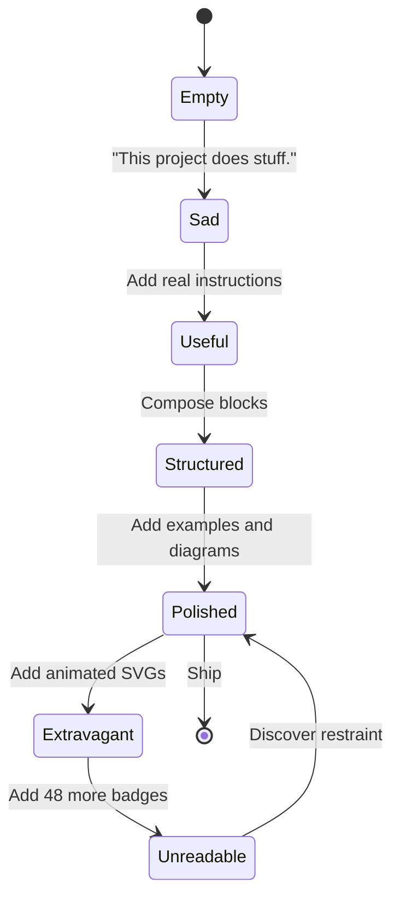

<!--
╔══════════════════════════════════════════════════════════════════════════════╗
║                          LEVEL 00: SOURCE LAYER                              ║
║                                                                              ║
║  Achievements: RAW SOURCE EXPLORER · PARSER TAMER · BLOCK ARCHITECT         ║
║                                                                              ║
║  You inspected README.md before GitHub rendered it.                         ║
║  Rendering stack: Markdown → GFM → GitHub → HTML → Advanced Renderers       ║
╚══════════════════════════════════════════════════════════════════════════════╝

M3 source-only note:
List indentation, blank lines inside list items, escaped table pipes, task nesting,
and quote-prefixed code fences are intentional parser demonstrations.
-->

<div align="center">

<a href="https://www.markdownguide.org/">
  
</a>

<a href="https://readme-typing-svg.demolab.com/demo/">
  
</a>

<br />

<a href="https://www.markdownguide.org/"></a>
<a href="https://github.github.com/gfm/"></a>
<a href="#act-ii--github-flavored-markdown"></a>
<a href="#the-chaos-index"></a>
<a href="#final-boss"></a>

<br />

<h3>🚨 This is not merely a README.</h3>
<h3>This is a <strong>layer-by-layer Markdown rendering laboratory</strong>.</h3>

<sub>Built with Markdown, GitHub Flavored Markdown, GitHub rendering extensions, HTML fragments, external SVGs, and absolutely no JavaScript.</sub>

<br /><br />

<a href="#act-i--markdown-core"><strong>⚡ Enter Markdown Core</strong></a>
&nbsp;•&nbsp;
<a href="#act-ii--github-flavored-markdown"><strong>🧱 Enter Block Systems</strong></a>
&nbsp;•&nbsp;
<a href="#act-vi--parser--source-lab"><strong>⌁ Enter the Parser Lab</strong></a>
&nbsp;•&nbsp;
<a href="#final-boss"><strong>👑 Fight the Final Boss</strong></a>

</div>

---

> [!CAUTION]
> **Plain text has been detected.**  
> Remain calm. Put down the `.docx`. Step away from the formatting toolbar.

> [!IMPORTANT]
> A README should explain a project clearly before it attempts visual domination.  
> This repository deliberately pushes presentation far beyond normal documentation—but every trick is assigned to a rendering layer.

---

## 🧭 README POWER MAP

This document is organized by **rendering layer**, not by random feature order.

| Act | Rendering layer | Current demonstrations | Jump |
| :---: | --- | --- | :---: |
| `00` | [Source Layer](#level-00--source-layer) | Hidden comments, raw-source-only content | `RAW` |
| `I` | [Markdown Core](#act-i--markdown-core) | Typography, headings, whitespace, list grammar, quote composition, links | `#` |
| `II` | [GitHub Flavored Markdown](#act-ii--github-flavored-markdown) | Tables, escaped pipes, task trees, strikethrough | `GFM` |
| `III` | [GitHub Extensions](#act-iii--github-extensions) | Alerts, code highlighting, footnotes | `GH` |
| `IV` | [HTML Hybrid](#act-iv--html-hybrid) | Inline HTML, media control, collapsible interfaces | `<>` |
| `V` | [Advanced Rendering](#act-v--advanced-rendering) | Math, Mermaid diagrams | `∞` |
| `VI` | [Parser & Source Lab](#act-vi--parser--source-lab) | Escapes, entities, backticks, delimiter rules, recursion | `\` |
| `VII` | [Endgame & Reference](#act-vii--endgame--reference) | Achievements, cheat sheet, QA | `✓` |
| `∞` | [Final Boss](#final-boss) | Combined mechanics | `👑` |

### Capability classification

`Markdown` · `GFM` · `GitHub` · `HTML` · `External Asset`

Not everything rendered inside a GitHub README is technically Markdown.

---

## 🧬 THE RENDERING STACK


```mermaid
flowchart LR
    A["raw README.md"] --> B["Markdown Core"]
    B --> C["GFM"]
    C --> D["GitHub Extensions"]
    D --> E["HTML Hybrid"]
    E --> F["Advanced Renderers"]
    F --> G["FINAL FORM"]

    A:::raw
    G:::power

    classDef raw fill:#3b3b3b,color:#ffffff,stroke:#777777
    classDef power fill:#7c3aed,color:#ffffff,stroke:#c4b5fd,stroke-width:3px
```

---

# LEVEL 00 — SOURCE LAYER

`HTML` · `Source-only`

Some README behavior exists only **before** GitHub renders the document.

```html
<!--
This exists in README.md...
but disappears when GitHub renders it.
-->
```

<!--
Architecture invariant:
Future phases extend the correct rendering act instead of appending unrelated sections.

M3 invariant:
Do not normalize list indentation, quote prefixes, table escapes, or variable-length
fences without checking whether they are live demonstrations.
-->

> [!NOTE]
> The source view and the rendered view are intentionally treated as two different surfaces of the same README.

---

# ACT I — MARKDOWN CORE

> The portable foundation: inline syntax, whitespace, and block grammar.

## LEVEL 01 — TYPOGRAPHY & INLINE POWER

`Markdown` · `GFM` · `HTML`

### Delimiter arsenal

| Source | Result | Role |
| --- | --- | --- |
| `*italic*` | *italic* | Emphasis |
| `_italic_` | _italic_ | Alternate emphasis |
| `**bold**` | **bold** | Strong emphasis |
| `__bold__` | __bold__ | Alternate strong emphasis |
| `***bold italic***` | ***bold italic*** | Combined emphasis |
| `___bold italic___` | ___bold italic___ | Alternate combined emphasis |
| `~~deleted~~` | ~~deleted~~ | GFM strikethrough |
| `` `inline code` `` | `inline code` | Literal technical text |
| `<sub>small</sub>` | <sub>small</sub> | HTML subscript |
| `<sup>high</sup>` | <sup>high</sup> | HTML superscript |
| `<ins>inserted</ins>` | <ins>inserted</ins> | HTML insertion |

### Formatting combo attacks

**Bold text containing _italic text containing `inline code`_ while remaining bold.**

~~This sentence was removed for being **insufficiently dramatic**.~~

**Strong outside, _emphasis inside_, and `code at the core`.**

- `foo_bar_baz` → foo_bar_baz
- `foo*bar*baz` → foo*bar*baz

### Keyboard and scale

Press <kbd>Ctrl</kbd> + <kbd>Shift</kbd> + <kbd>V</kbd> to paste without formatting.

Press <kbd>.</kbd> on a GitHub repository to open it in the web editor.

<sub>Tiny text of humility.</sub>  
Normal text of confidence.  
<sup>Superscript of unreasonable superiority.</sup>

---

## LEVEL 02 — STRUCTURE, HEADINGS & WHITESPACE

`Markdown`

### ATX heading ladder

<details>
<summary><strong>🏛️ Open the six-level heading hierarchy</strong></summary>

# Header 1 — The Emperor

## Header 2 — The Chancellor

### Header 3 — The Strategist

#### Header 4 — The Specialist

##### Header 5 — The Intern with Production Access

###### Header 6 — The Fine Print Nobody Read

</details>

### Setext: the other heading syntax

<details>
<summary><strong>📜 Render actual Setext headings</strong></summary>

Setext Level One
================

Setext Level Two
----------------

</details>

Source:

```md
Setext Level One
================

Setext Level Two
----------------
```

### Line-break laboratory

1. A **blank line** starts a new paragraph.
2. Two trailing spaces create an explicit Markdown hard break.  
   This sentence begins after that hard break.
3. `<br />` gives HTML-level control.<br />This sentence begins after an HTML break.

---

## LEVEL 03 — LIST ENGINE & QUOTATION FORTRESS

`Markdown`

M3 turns lists and quotes from isolated syntax examples into **container systems**.

### The three unordered-list markers

All three markers create unordered list items:

- Hyphen marker
- Another hyphen item

* Asterisk marker
* Another asterisk item

+ Plus marker
+ Another plus item

Source:

```md
- hyphen
* asterisk
+ plus
```

> [!NOTE]
> Consistency is usually better in real documentation. This repository uses all three because it is a syntax showcase.

### Deep list archaeology

- Surface layer
  - Nested context
    - Deeper context
      - Suspiciously deep context
        - We have entered the list mines
          - **Send indentation**

### Mixed-species list

1. **Project setup**
   - Create `README.md`
   - Add a title
   - Explain the project
2. **Visual escalation**
   - Add badges
   - Add diagrams
     1. Flowchart
     2. Sequence diagram
   - Add collapsible sections
3. **Final verification**
   - Preview on GitHub
   - Test every link
   - Pretend this was always the plan

### Ordered-list numbering is source metadata

The first number can determine the displayed starting point while later source numbers need not be sequential:

7. Seventh-circle documentation item
1. Source says `1.` again
1. Source says `1.` again

Source:

```md
7. Seventh-circle documentation item
1. Source says `1.` again
1. Source says `1.` again
```

The source is optimized for editing; the renderer owns the displayed sequence.

### Tight versus loose lists

Tight list:

- Alpha
- Beta
- Gamma

Loose list:

- Alpha has its own paragraph.

- Beta has its own paragraph.

- Gamma has its own paragraph.

A blank line changes the block structure even when the text looks similar.

### Blocks inside list items

1. **A list item can contain a paragraph.**

   This paragraph still belongs to item 1 because it is indented to the item's content column.

2. **A list item can contain a blockquote.**

   > The quote is nested inside the ordered list item.
   >
   > - The quote can itself contain a list.
   > - Containers can compose.

3. **A list item can contain fenced code.**

   ```bash
   printf '%s\n' "code inside a list item"
   ```

4. **A list item can contain another ordered list.**
   1. Child step one
   2. Child step two
      - Grandchild bullet
      - Another grandchild bullet

### Quotation depth test

> “Markdown is just plain text,” they whispered.
>
> > “Then why does it have tables?” asked the apprentice.
> >
> > > “And diagrams?” asked the architect.
> > >
> > > > “And mathematical notation?” asked the economist.
> > > >
> > > > > The room became silent.

### Multi-paragraph quote

> A blockquote can contain more than one paragraph.
>
> This is the second paragraph, still inside the same quotation container.

### Quote containing a list

> **Blockquote inventory**
>
> 1. Paragraphs
> 2. Lists
> 3. Formatting
>    - **bold**
>    - _italic_
>    - `code`

### Quote containing fenced code

> A quote can even contain a fenced code block:
>
> ```bash
> echo "quoted shell command"
> printf '%s\n' "every fence line remains inside the quote"
> ```
>
> The quotation resumes after the fence.

### Quote + list + code composition

> **Documentation expedition**
>
> - [x] Enter the quote
> - [x] Start a list inside it
> - [x] Put `inline code` in the task
> - [ ] Escape with dignity
>
> ```text
> blockquote
>   └── list
>       └── task
>           └── inline code
> ```

### Ordinary links

- [Learn Markdown](https://www.markdownguide.org/)
- [Read GitHub’s formatting documentation](https://docs.github.com/en/get-started/writing-on-github)
- [Study the GitHub Flavored Markdown specification](https://github.github.com/gfm/)
- [Return to the top](#)

[Hover over this link before clicking](https://www.markdownguide.org/ "You have discovered tooltip technology.")

> [!NOTE]
> M4 owns reference links, relative repository links, autolinks, and repository-native references.

---

# ACT II — GITHUB FLAVORED MARKDOWN

> GFM adds practical block systems for documentation: tables, task lists, and strikethrough.

## LEVEL 04 — TABLE ENGINE

`GFM`

### Alignment matrix

| Alignment | Syntax idea | Example |
| :--- | :---: | ---: |
| Left | `:---` | `10` |
| Center | `:---:` | `100` |
| Right | `---:` | `1000` |

The alignment row is not decoration: colons control alignment.

### Formatting inside cells

| Source family | Rendered capability | Status |
| --- | --- | :---: |
| `*italic*` | _Italics_ | ✅ |
| `**bold**` | **Bold** | ✅ |
| `***bold italic***` | ***Combined*** | ✅ |
| `` `code` `` | `Monospace` | ✅ |
| `~~text~~` | ~~Strikethrough~~ | ✅ |
| `[link](...)` | [Markdown Guide](https://www.markdownguide.org/) | ✅ |
| HTML inline | H<sub>2</sub>O / x<sup>2</sup> | ✅ |

### Escaped pipe survival test

A literal pipe normally competes with table column delimiters. Escape it when it belongs to cell content:

| Input | Meaning | Result |
| --- | --- | --- |
| `alpha \| beta` | Literal pipe in text | alpha \| beta |
| `` `left\|right` `` | Pipe inside code span in a table cell | `left\|right` |
| `A \| B \| C` | Multiple literal pipes | A \| B \| C |

Source:

```md
| Input | Result |
| --- | --- |
| `alpha \| beta` | alpha \| beta |
```

> [!IMPORTANT]
> Pipes inside table rows are parser-sensitive. An unescaped content pipe can silently create an extra column.

### Numeric table with intentional alignment

| Metric | Current | Target | Delta |
| --- | ---: | ---: | ---: |
| Clarity | 100 | 100 | 0 |
| Parser tricks | 95 | 100 | +5 |
| Block systems | 100 | 100 | 0 |
| Restraint | 10 | 80 | +70 |

### Capability matrix

| System | Inline formatting | Nesting | Block content | Interactive state |
| --- | :---: | :---: | :---: | :---: |
| Lists | ✅ | ✅ | ✅ | — |
| Quotes | ✅ | ✅ | ✅ | — |
| Tables | ✅ | — | Limited to cell content | — |
| Task lists | ✅ | ✅ | List-based | ✅ state display |
| `<details>` | ✅ | ✅ | ✅ | ✅ open/closed |

### Table design warning

> [!WARNING]
> A table can technically hold a lot of information and still be a bad mobile experience. Maximum Markdown power does not justify a 14-column spreadsheet masquerading as documentation.

---

## LEVEL 05 — TASK-LIST SKILL TREE

`GFM`

Task lists are ordinary list items whose content starts with `[ ]`, `[x]`, or `[X]`.

### Core syntax

- [x] Completed
- [X] Also completed
- [ ] Incomplete

Source:

```md
- [x] Completed
- [X] Also completed
- [ ] Incomplete
```

### Markdown mastery tree

- [x] **Markdown Core**
  - [x] Typography
    - [x] Italic / strong delimiters
    - [x] Inline code
  - [x] Structure
    - [x] Headings
    - [x] Lists
      - [x] Hyphen markers
      - [x] Asterisk markers
      - [x] Plus markers
    - [x] Blockquotes
- [x] **GFM Systems**
  - [x] Tables
    - [x] Column alignment
    - [x] Escaped pipes
    - [x] Inline formatting in cells
  - [x] Task lists
    - [x] Nested task hierarchy
    - [x] Formatting inside task text
- [x] **Parser Lab**
  - [x] Escapes
  - [x] Backtick-length tricks
  - [x] Entities
  - [x] Nested fences
- [ ] **Advanced Rendering**
  - [x] Math baseline
  - [x] Mermaid baseline
  - [ ] GeoJSON
  - [ ] TopoJSON
  - [ ] STL / 3D
- [ ] **Final Form**
  - [ ] Repository-owned media
  - [ ] Full rendering QA
  - [ ] Restraint discovered

### Task text can contain inline Markdown

- [x] **Bold objective** completed
- [x] _Italic side quest_ completed
- [x] Execute `README.md`
- [x] Visit the [Markdown Guide](https://www.markdownguide.org/)
- [ ] ~~Pretend tasks cannot contain formatting~~

### Tasks inside another container

> **Quoted mission tracker**
>
> - [x] Enter blockquote
> - [x] Create nested task list
>   - [x] Child task
>   - [ ] Child task still pending
> - [ ] Return from the quote dimension

### State-as-documentation pattern

| Objective | State |
| --- | :---: |
| Typography laboratory | ✅ |
| Parser laboratory | ✅ |
| Block systems | ✅ |
| Link laboratory | ⏳ |
| Media laboratory | ⏳ |
| 3D README object | ⏳ |

Task lists are useful when the state itself belongs to the document. They are not a substitute for every status table.

```diff
+ Added block composition
+ Added escaped table pipes
+ Added nested task trees
+ Added quote-contained blocks
- Removed flat one-feature-only examples
- Removed the assumption that lists contain only text
```

---

# ACT III — GITHUB EXTENSIONS

> GitHub adds behavior beyond baseline GFM: alerts, syntax highlighting, footnotes, rich rendering, and repository-aware presentation.

## LEVEL 06 — ALERT COMMAND CENTER

`GitHub`

> [!NOTE]
> Useful information for readers who skim.

> [!TIP]
> Helpful advice that improves the result.

> [!IMPORTANT]
> Information required for success.

> [!WARNING]
> Something may go wrong.

> [!CAUTION]
> Something has already gone wrong. You edited nested block syntax without previewing it.

---

## LEVEL 07 — CODE-BLOCK ALCHEMY

`Markdown` · `GitHub`

### JavaScript

```javascript
const readme = {
  phase: "M3",
  lists: "composable",
  tables: "aligned",
  tasks: "nested",
  quotes: "fortified",
  chaos: Infinity,
};

console.log(readme);
```

### Python

```python
from dataclasses import dataclass
from math import inf

@dataclass(frozen=True)
class Readme:
    phase: str
    block_composition: bool
    chaos: float

README = Readme(
    phase="M3",
    block_composition=True,
    chaos=inf,
)
```

### Bash

```bash
#!/usr/bin/env bash
set -euo pipefail
printf '%s\n' "Scanning nested blocks..."
printf '%s\n' "Lists, tables, tasks, quotes: online."
```

### JSON

```json
{
  "document": "README.md",
  "phase": "M3",
  "features": [
    "list-composition",
    "table-alignment",
    "escaped-pipes",
    "nested-tasks",
    "quote-containers",
    "parser-lab"
  ]
}
```

### The sacred diff

```diff
- Lists contain text.
+ Lists can contain paragraphs, quotes, code, and other lists.

- Tables are just rows of pipes.
+ Table pipes are parser delimiters with escaping and alignment rules.

- Blockquotes contain quotes.
+ Blockquotes are containers.
```

---

## LEVEL 08 — FOOTNOTES & GITHUB KNOWLEDGE

`GitHub`

Markdown looks simple because the complexity is hiding politely.[^plain-text]

GitHub adds features beyond basic Markdown, including task lists, alerts, diagrams, and mathematical expressions.[^gfm]

Animated banners in this README are externally rendered SVG images—not JavaScript executing inside the document.[^animation]

---

# ACT IV — HTML HYBRID

> GitHub Markdown can safely render selected HTML fragments, enabling layout and interaction patterns that Markdown syntax alone cannot express.

## LEVEL 09 — INLINE HTML & MEDIA CONTROL

`HTML` · `External Asset`

### Clickable image portal

<p align="center">
  <a href="https://www.markdownguide.org/">
    
  </a>
</p>

### Theme-aware imagery

```html
<picture>
  <source media="(prefers-color-scheme: dark)" srcset="assets/banner-dark.svg" />
  <source media="(prefers-color-scheme: light)" srcset="assets/banner-light.svg" />
  
</picture>
```

> [!TIP]
> These paths remain a syntax demonstration. A later media phase will convert them into live repository-owned assets.

---

## LEVEL 10 — COLLAPSIBLE INTERFACE SYSTEM

`HTML` · `Markdown`

<details>
<summary><strong>🧠 Click to reveal forbidden Markdown wisdom</strong></summary>

Markdown inside `<details>` can include:

- lists
- **formatting**
- `code`
- additional paragraphs

```md
<details>
<summary>Visible title</summary>

Hidden Markdown content goes here.

</details>
```

</details>

<details>
<summary><strong>🐉 Open the optional boss encounter</strong></summary>

### The Documentation Dragon

**HP:** `10,000`  
**Weakness:** Clear installation instructions  
**Special attack:** Broken nesting  
**Loot:** Contributor trust

- [x] Add prerequisites
- [x] Add copyable commands
- [x] Explain configuration
- [x] Document common failures
- [ ] Stop adding lore to the README

</details>

---

# ACT V — ADVANCED RENDERING

> The point where a `.md` file stops looking like plain documentation and starts behaving like a rendering surface.

## LEVEL 11 — MATHEMATICAL SUPERIORITY

`GitHub` · `Math`

Inline mathematics:

$`E = mc^2`$

```math
\text{README Quality}
=
\frac{\text{Clarity}\times\text{Structure}\times\text{Accuracy}}
{\text{Unexplained Assumptions}+1}
```

```math
\lim_{\text{documentation}\to 0}\text{user confidence}=0
```

```math
\text{Markdown}+\text{Restraint}^{-1}=\text{This README}
```

> [!NOTE]
> M3 intentionally leaves the math renderer mostly unchanged. M8 owns the major mathematics expansion.

---

## LEVEL 12 — MERMAID SUMMONING CIRCLE

`GitHub` · `Mermaid`

### The README production pipeline


```mermaid
flowchart TD
    A[Open empty README] --> B{Explain the project?}
    B -- No --> C[Confuse everyone]
    B -- Yes --> E[Add clear structure]
    E --> F[Compose blocks]
    F --> G[Add diagrams]
    G --> H{Still readable?}
    H -- Yes --> I[Ship it]
    H -- No --> J[Remove seven badges]
    J --> H
```

### Sequence of enlightenment


```mermaid
sequenceDiagram
    actor Dev as Developer
    participant MD as README.md
    participant User as Visitor
    participant GitHub

    Dev->>MD: Writes structured Markdown
    Dev->>MD: Nests blocks deliberately
    Dev->>GitHub: Pushes commit
    GitHub->>User: Renders Markdown
    User-->>Dev: Understands the structure
```

### Documentation state machine


```mermaid
stateDiagram-v2
    [*] --> Empty
    Empty --> Sad: "This project does stuff."
    Sad --> Useful: Add real instructions
    Useful --> Structured: Compose blocks
    Structured --> Polished: Add examples and diagrams
    Polished --> Extravagant: Add animated SVGs
    Extravagant --> Unreadable: Add 48 more badges
    Unreadable --> Polished: Discover restraint
    Polished --> [*]: Ship
```

### Reserved expansion slots

```text
ACT V — ADVANCED RENDERING
├── Mathematics            ✅ baseline
├── Mermaid                ✅ baseline
├── GeoJSON                ◌ future phase
├── TopoJSON               ◌ future phase
└── STL / interactive 3D   ◌ future phase
```

---

# ACT VI — PARSER & SOURCE LAB

> Markdown is a parser with rules about delimiters, escapes, whitespace, precedence, and container boundaries.

## LEVEL 13 — ESCAPE HATCH

`Markdown` · `Source-aware`

\# Not a heading  
\> Not a blockquote  
\- Not a list item  
1\. Not an ordered-list item  
\*Not emphasis\*  
\[Not a link\](still-not-a-url)

### Escape matrix

| Desired literal | Source | If unescaped, it may start... |
| :---: | :---: | --- |
| `*` | `\*` | emphasis / list syntax |
| `_` | `\_` | emphasis |
| `#` | `\#` | heading syntax |
| `>` | `\>` | blockquote syntax |
| `[` | `\[` | link text |
| `]` | `\]` | link text termination |
| `(` | `\(` | link destination grouping |
| `)` | `\)` | link destination grouping |
| `+` | `\+` | list syntax |
| `-` | `\-` | list / thematic-break syntax |
| `.` | `\.` | ordered-list punctuation |
| `!` | `\!` | image syntax |
| `|` | `\|` | GFM table delimiter |
| `~` | `\~` | strikethrough delimiter |
| `\` | `\\` | escape character |

---

## LEVEL 14 — BACKTICK PARADOX

`Markdown` · `Parser`

Normal code span:

`README.md`

A code span containing literal backticks:

``Use a `backtick` inside code``

Source:

```md
`README.md`
``Use a `backtick` inside code``
```

### Fence escalation

````md
```javascript
console.log("Three backticks can live inside four.");
```
````

---

## LEVEL 15 — DELIMITER COLLISION LAB

`Markdown` · `GFM`

*asterisk emphasis*  
_underscore emphasis_

**asterisk strong**  
__underscore strong__

***asterisk triple***  
___underscore triple___

**Strong containing _emphasis_.**

_Emphasis containing **strong** text._

~~Strikethrough containing **strong** text and `code`.~~

The source `economic_math_student` stays intact as economic_math_student.

---

## LEVEL 16 — ENTITY REACTOR

`Markdown` · `HTML`

| Source | Rendered | Meaning |
| --- | :---: | --- |
| `&copy;` | &copy; | copyright |
| `&reg;` | &reg; | registered |
| `&trade;` | &trade; | trademark |
| `&rarr;` | &rarr; | right arrow |
| `&larr;` | &larr; | left arrow |
| `&times;` | &times; | multiplication |
| `&plusmn;` | &plusmn; | plus/minus |
| `&ne;` | &ne; | not equal |
| `&le;` | &le; | less/equal |
| `&ge;` | &ge; | greater/equal |
| `&infin;` | &infin; | infinity |
| `&pi;` | &pi; | pi |

| Encoding | Source | Result |
| --- | --- | :---: |
| Named | `&copy;` | &copy; |
| Decimal | `&#169;` | &#169; |
| Hexadecimal | `&#xA9;` | &#xA9; |

&lt;div&gt;not an HTML element&lt;/div&gt;

```md
&#42;these stars are characters, not emphasis delimiters&#42;
```

Rendered:

&#42;these stars are characters, not emphasis delimiters&#42;

---

## LEVEL 17 — WHITESPACE & RECURSION CHAMBER

`Markdown` · `Parser`

```md
This is paragraph one.

This is paragraph two because a blank line separates it.
```

```md
First line ends with two spaces.  
Second line begins immediately below it.
```

### Markdown inception

````md
```md
**Markdown shown inside Markdown shown inside Markdown.**
```
````

<!--
Future maintainers:
The nested block examples are intentional.
Do not run an aggressive formatter without checking GitHub rendering.
-->

---

# ACT VII — ENDGAME & REFERENCE

> The laboratory ends here; what follows measures what was unlocked and keeps the README practically useful.

## 🏅 ACHIEVEMENTS UNLOCKED

<p align="center">
  
  
  
  
  
</p>

| Achievement | Requirement | Status |
| --- | --- | :---: |
| **The Emphasizer** | Use alternate and nested emphasis delimiters | ✅ |
| **List Archaeologist** | Reach six nesting levels | ✅ |
| **Block Architect** | Put paragraphs, quotes, code, and lists inside list items | ✅ |
| **Table Architect** | Align columns intentionally | ✅ |
| **Pipe Bender** | Preserve literal pipes inside a GFM table | ✅ |
| **Taskmaster** | Build a multi-level task hierarchy | ✅ |
| **Quote Diver** | Put lists and fenced code inside blockquotes | ✅ |
| **Alert Commander** | Deploy all five GitHub alerts | ✅ |
| **Diagram Summoner** | Render Mermaid successfully | ✅ |
| **Parser Tamer** | Neutralize syntax with escapes | ✅ |
| **Backtick Heretic** | Put backticks inside a backtick-delimited span | ✅ |
| **Entity Alchemist** | Use named, decimal, and hexadecimal entities | ✅ |
| **Recursion Engineer** | Nest fenced-code demonstrations safely | ✅ |
| **Master of Restraint** | Stop before adding too much | ❌ |

---

## THE CHAOS INDEX

```text
Clarity        ████████████████████ 100%
Structure      ████████████████████ 100%
Navigation     ████████████████████ 100%
Typography     ████████████████████ 100%
Lists          ████████████████████ 100%
Tables         ████████████████████ 100%
Tasks          ████████████████████ 100%
Quotes         ████████████████████ 100%
Parser Tricks  ███████████████████░  95%
Entities       ████████████████████ 100%
Animation      ████████████████░░░░  80%
Restraint      ██░░░░░░░░░░░░░░░░░░  10%
Raw Power      ███████████████░░░░░  M3
```

> [!WARNING]
> Powerful Markdown is not the number of syntax features present. It is the number of features that can **compose without becoming ambiguous**.
>
> **M3 makes block composition part of the showcase.**

---

## 🧰 THE ACTUALLY USEFUL CHEAT SHEET

````md
# ATX Heading
Setext Heading
==============

*italic* or _italic_
**bold** or __bold__
***bold italic*** or ___bold italic___
~~strikethrough~~
`inline code`
``code containing a `backtick` ``

\# escaped heading marker
\*literal asterisks\*
1\. escaped ordered-list marker

- hyphen bullet
* asterisk bullet
+ plus bullet

7. ordered list can start at seven
1. later source numbers can remain simple

1. Parent item
   - Nested item
   > Nested quote
   ```text
   fenced block inside list
   ```

> Blockquote
>
> - list inside quote
> - another item
>
> ```text
> code inside quote
> ```

- [x] Complete
  - [x] Nested complete
  - [ ] Nested incomplete
- [ ] Incomplete

| Left | Center | Right |
| :--- | :---: | ---: |
| alpha \| beta | `code` | 100 |

Hard break using two spaces.  
Next line.

HTML break.<br />Next line.

&copy; &rarr; &infin;
&#169; &#xA9;
&lt;literal-tag&gt;

[link text](https://example.com)


> [!IMPORTANT]
> GitHub alert

```language
fenced code block
```

<details>
<summary>Click to expand</summary>

Hidden Markdown content

</details>

Here is a footnote.[^1]

[^1]: Footnote text.
````

> [!NOTE]
> The inner triple-backtick examples are protected by four outer backticks. List indentation and quote prefixes are intentional.

---

## 🧯 COMMON README CRIMES

| Crime | Sentence |
| --- | --- |
| Giant unstructured paragraphs | Nobody reads them |
| Broken list indentation | Child blocks escape their parent item |
| Mixing list markers randomly | Source readability collapses |
| Unescaped content pipes | Table columns split unexpectedly |
| Tables wider than the viewport | Mobile readers suffer |
| Task trees with meaningless depth | State becomes harder to understand |
| Missing `>` prefixes inside quoted fences | Code escapes the quotation |
| “Cleaning up” meaningful escapes | Parser demonstrations silently break |
| Decorative overload | The content disappears |
| Flat feature dumping | The README becomes impossible to extend |

---

## 🧪 README QUALITY TEST

Before pushing, verify:

- [ ] Deep list children remain inside the intended parent.
- [ ] Paragraphs inside list items preserve indentation.
- [ ] Fenced blocks nested in list items render as children.
- [ ] Quote-contained code fences remain inside the quote.
- [ ] Every GFM table has a consistent column count.
- [ ] Literal content pipes are escaped where required.
- [ ] Numeric columns use intentional alignment.
- [ ] Task hierarchy depth communicates real structure.
- [ ] The document works in light and dark mode.
- [ ] The mobile layout remains readable.
- [ ] Escape sequences still render as intended.
- [ ] Nested fence lengths remain intact.
- [ ] Entity demonstrations render as characters rather than unintended syntax.
- [ ] Every advanced feature belongs to the correct rendering layer.
- [ ] The README was previewed on GitHub.

---

# FINAL BOSS

<div align="center">

<a href="https://www.markdownguide.org/">
  
</a>

<h3>The README no longer demonstrates blocks in isolation.</h3>
<h3>It demonstrates blocks <em>composing other blocks</em>.</h3>

</div>

```text
LIST
 ├── PARAGRAPH
 ├── QUOTE
 │    ├── LIST
 │    └── CODE
 └── CODE

GFM
 ├── TABLE
 │    ├── ALIGNMENT
 │    └── ESCAPED PIPES
 └── TASK TREE
      └── NESTED STATE

↓
FINAL FORM
```

<div align="center">

<p>
  Inline syntax is vocabulary.<br />
  Block syntax is grammar.<br />
  Composition is where Markdown becomes a document system.<br />
  Make it <s>unreadable</s> <strong><em>beautifully, strategically ridiculous</em></strong>.
</p>

<br />

<a href="https://www.markdownguide.org/"></a>
<a href="https://docs.github.com/en/get-started/writing-on-github"></a>
<a href="#"></a>

<br />

<h2>🗿 Markdown: Final Form.</h2>
<h3>Block composition unlocked.</h3>


</div>

---

[^plain-text]: Markdown remains readable as plain text while adding lightweight structural syntax.
[^gfm]: GitHub Flavored Markdown extends common Markdown behavior with GitHub-specific rendering features.
[^animation]: External SVG generators may become unavailable, change behavior, or load slowly. A later phase will move critical visual assets into the repository.