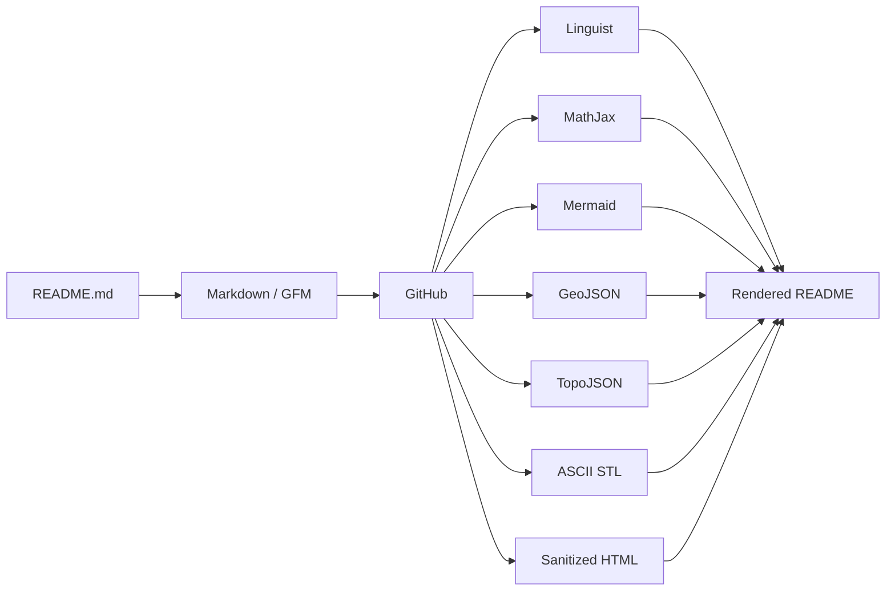
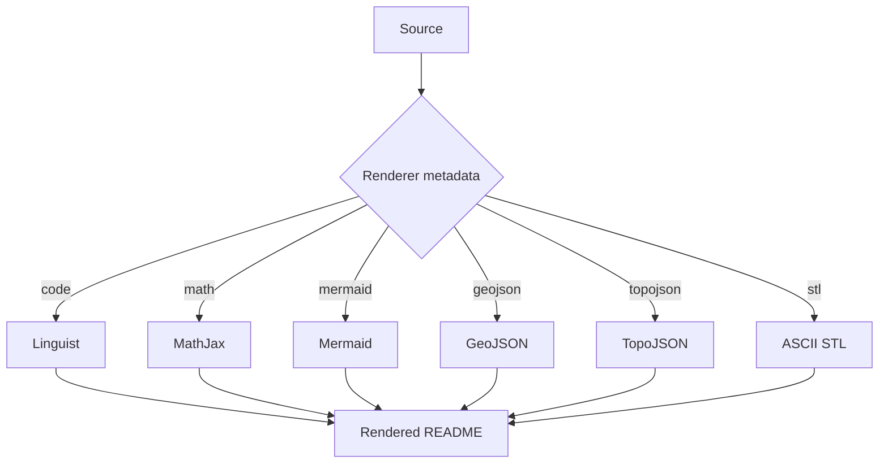
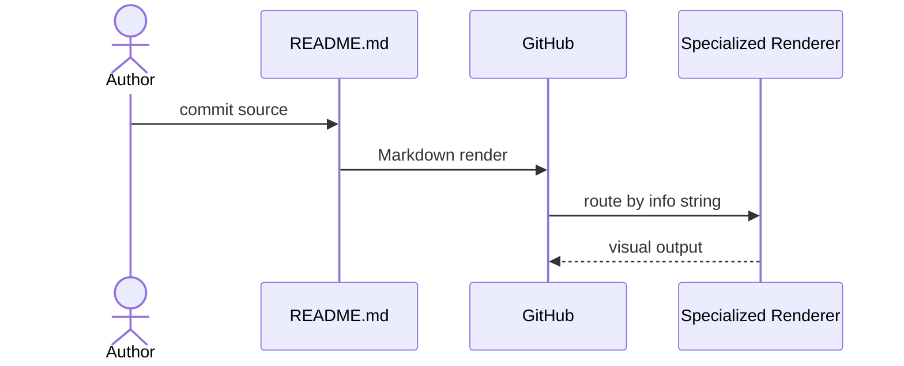
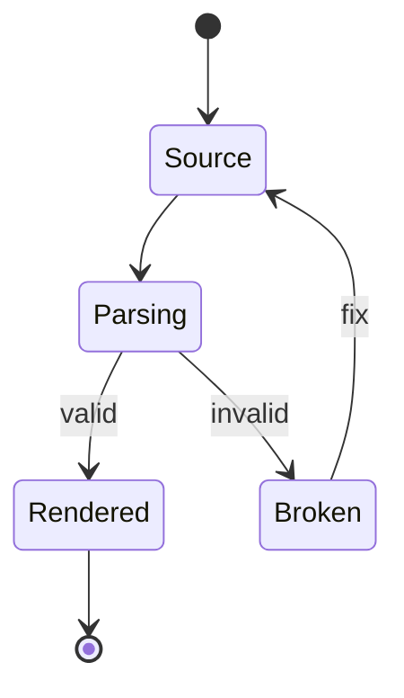
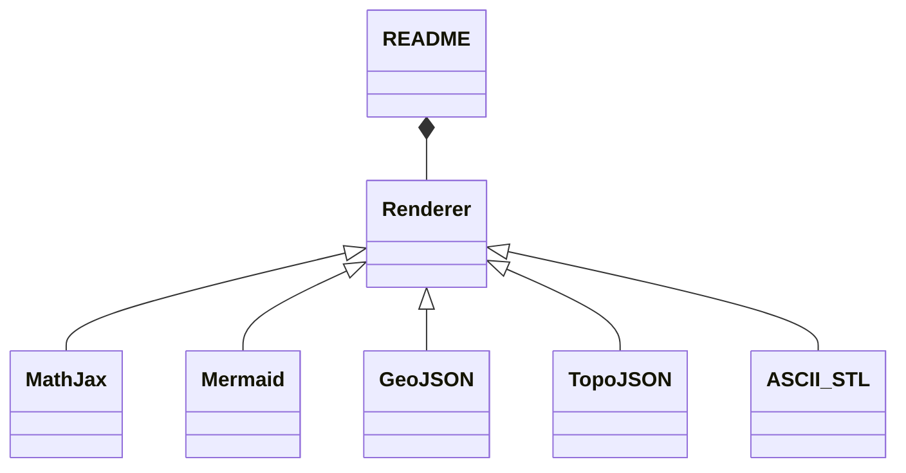
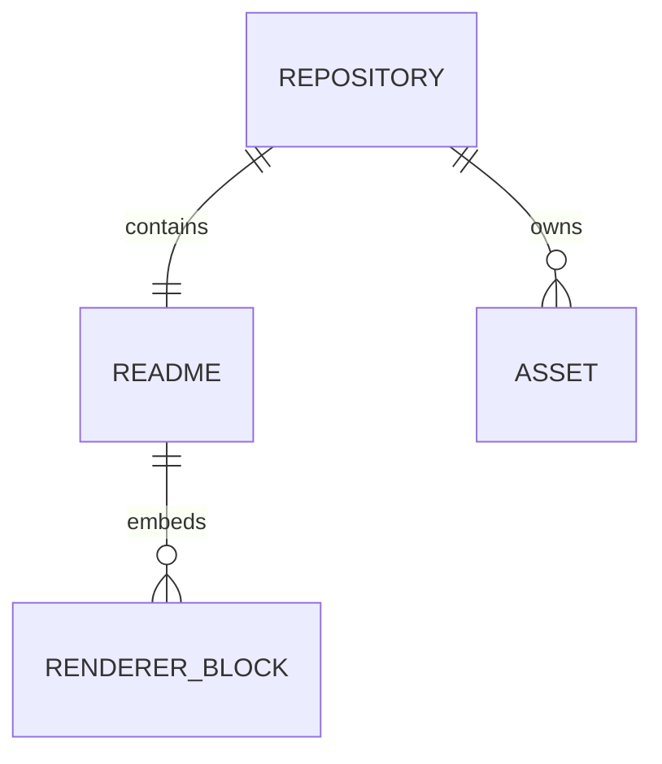
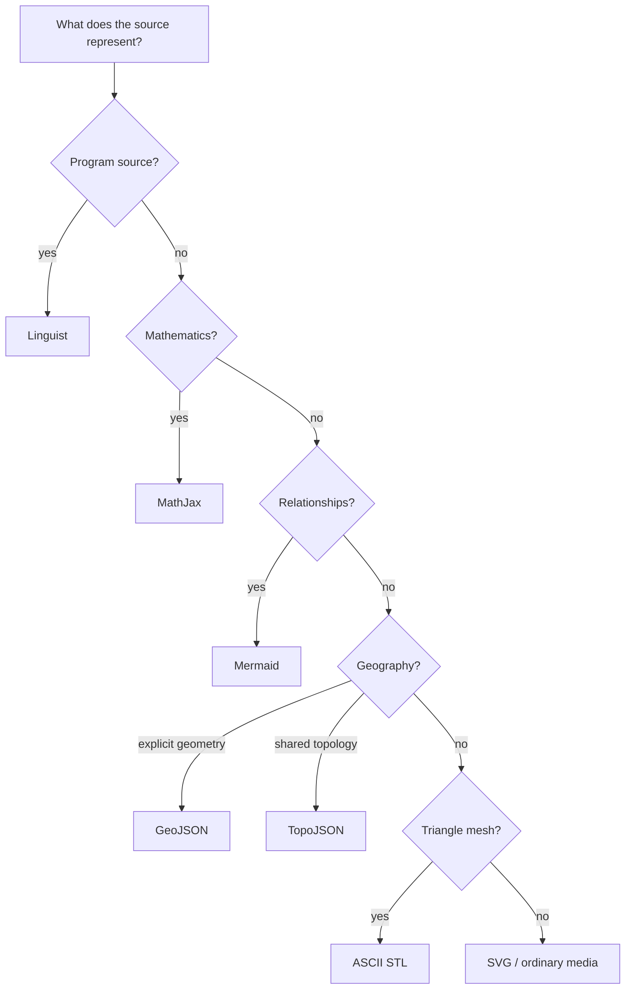
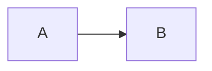
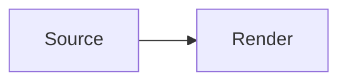
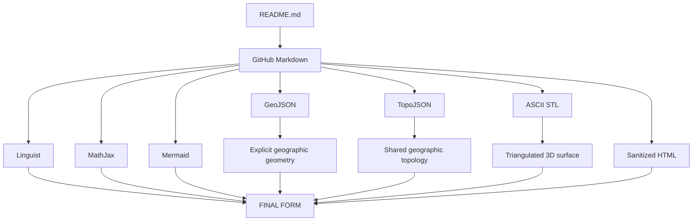

<!--
╔══════════════════════════════════════════════════════════════════════════════╗
║                          LEVEL 00: SOURCE LAYER                              ║
║                                                                              ║
║  PARSER TAMER · BLOCK ARCHITECT · LINK CARTOGRAPHER · MEDIA ENGINEER         ║
║  HYBRID ENGINEER · SYNTAX CURATOR · MATHJAX ARCHITECT · MERMAID CARTOGRAPHER║
║  GEOJSON NAVIGATOR · TOPOLOGY ENGINEER · STL MESHSMITH                      ║
║                                                                              ║
║  M12 invariant: an `stl` fence is executable 3D renderer source on GitHub.   ║
║  Triangle winding, facet normals, and fence lengths are intentional.         ║
╚══════════════════════════════════════════════════════════════════════════════╝
-->

<picture>
  <source media="(prefers-color-scheme: dark)" srcset="./assets/hero-dark.svg">
  <source media="(prefers-color-scheme: light)" srcset="./assets/hero-light.svg">
  
</picture>

<div align="center">

<a href="https://readme-typing-svg.demolab.com/demo/">
  
</a>

<br>

<a href="https://www.markdownguide.org/"></a>
<a href="#level-18--full-mermaid-diagram-gallery"></a>
<a href="#level-19--interactive-geojson-showcase"></a>
<a href="#level-20--interactive-topojson-showcase"></a>
<a href="#m12-stl"></a>

<h3>This is a <strong>layer-by-layer GitHub Markdown rendering laboratory</strong>.</h3>

<sub>Markdown · GFM · Linguist · MathJax · Mermaid · GeoJSON · TopoJSON · ASCII STL · sanitized HTML · local media</sub>

<br><br>

<a href="#act-i--markdown-core"><strong>⚡ Markdown</strong></a>
&nbsp;•&nbsp;
<a href="#level-08--full-syntax-highlighting-laboratory"><strong>⌘ Syntax</strong></a>
&nbsp;•&nbsp;
<a href="#level-17--advanced-mathjax-mathematical-showcase"><strong>∑ Math</strong></a>
&nbsp;•&nbsp;
<a href="#level-18--full-mermaid-diagram-gallery"><strong>◇ Mermaid</strong></a>
&nbsp;•&nbsp;
<a href="#level-19--interactive-geojson-showcase"><strong>⌖ GeoJSON</strong></a>
&nbsp;•&nbsp;
<a href="#level-20--interactive-topojson-showcase"><strong>◎ TopoJSON</strong></a>
&nbsp;•&nbsp;
<a href="#m12-stl"><strong>△ STL / 3D</strong></a>
&nbsp;•&nbsp;
<a href="#final-boss"><strong>👑 Final Boss</strong></a>

</div>

---

> [!IMPORTANT]
> GitHub supports **ASCII STL directly in Markdown**. Put valid ASCII STL source inside a fenced block labeled `stl`, and GitHub routes the text to an interactive 3D renderer instead of ordinary syntax highlighting.[^github-diagrams]

## 🧭 README POWER MAP

| Act | Rendering layer | Current demonstrations | Jump |
| :---: | --- | --- | :---: |
| `00` | [Source Layer](#level-00--source-layer) | Hidden comments, source invariants | `RAW` |
| `I` | [Markdown Core](#act-i--markdown-core) | Typography, structure, blocks, links | `#` |
| `II` | [GFM](#act-ii--github-flavored-markdown) | Tables, tasks, strikethrough | `GFM` |
| `III` | [GitHub Extensions](#act-iii--github-extensions) | Alerts, Linguist, footnotes | `GH` |
| `IV` | [HTML Hybrid](#act-iv--html-hybrid) | Media, details, semantic HTML, sanitizer | `<>` |
| `V` | [Advanced Rendering](#act-v--advanced-rendering) | MathJax, Mermaid, GeoJSON, TopoJSON, **STL** | `∞` |
| `VI` | [Parser & Source Lab](#act-vi--parser--source-lab) | Escapes, fences, renderer routing | `\` |
| `VII` | [Endgame](#act-vii--endgame--reference) | Achievements, QA, cheat sheet | `✓` |
| `∞` | [Final Boss](#final-boss) | Combined renderer network | `👑` |

`Markdown` · `GFM` · `GitHub` · `Linguist` · `MathJax` · `Mermaid` · `GeoJSON` · `TopoJSON` · `ASCII STL` · `HTML` · `Local Asset`

---

## 🧬 THE RENDERING STACK


```mermaid
flowchart LR
    A[README.md] --> B[Markdown / GFM]
    B --> GH[GitHub]
    GH --> L[Linguist]
    GH --> MJ[MathJax]
    GH --> MM[Mermaid]
    GH --> GJ[GeoJSON]
    GH --> TJ[TopoJSON]
    GH --> STL[ASCII STL]
    GH --> H[Sanitized HTML]
    L --> OUT[Rendered README]
    MJ --> OUT
    MM --> OUT
    GJ --> OUT
    TJ --> OUT
    STL --> OUT
    H --> OUT
```

---

# LEVEL 00 — SOURCE LAYER

`HTML` · `Source-only`

```html
<!-- This source exists but disappears in GitHub's rendered README. -->
```

<!--
M12 invariants:
- fenced ASCII STL uses the `stl` info string.
- each live facet has exactly one normal, one outer loop, and three vertices.
- the repository cube uses outward normals and matching right-hand-rule winding.
- malformed STL examples remain inert inside text fences.
- assets/stl-showcase.stl is a repository-owned ASCII STL model.
- M10/M11 geographic assets remain untouched.
- M13 will own the broad parser torture test; M12 only adds STL-specific cases.
-->

> [!NOTE]
> Rendered 3D is only one surface. The triangle mesh remains plain-text source that can be reviewed line by line and diffed like code.

---

# ACT I — MARKDOWN CORE

## LEVEL 01 — TYPOGRAPHY & INLINE POWER

`Markdown` · `GFM` · `HTML`

| Source | Result |
| --- | --- |
| `*italic*` | *italic* |
| `**bold**` | **bold** |
| `***both***` | ***both*** |
| `~~deleted~~` | ~~deleted~~ |
| `` `code` `` | `code` |
| `<sub>2</sub>` | H<sub>2</sub>O |
| `<sup>2</sup>` | x<sup>2</sup> |
| `<ins>new</ins>` | <ins>new</ins> |

**Bold containing _italic containing `code`_.**

---

## LEVEL 02 — STRUCTURE, HEADINGS & WHITESPACE

`Markdown`

<details>
<summary><strong>ATX heading ladder</strong></summary>

# H1
## H2
### H3
#### H4
##### H5
###### H6

</details>

<details>
<summary><strong>Setext headings</strong></summary>

Setext One
==========

Setext Two
----------

</details>

Two trailing spaces create a hard break.  
This is the next visual line.

---

## LEVEL 03 — LIST ENGINE & QUOTATION FORTRESS

`Markdown`

- Surface
  - Nested
    - Deeper
      - Deeper still
        - List mine
          - **Maximum indentation**

1. **Quote inside list**

   > Containers can contain containers.

2. **Code inside list**

   ```bash
   printf '%s\n' "nested code"
   ```

> **Quote containing structure**
>
> - [x] nested list
> - [x] task
> - [x] `inline code`

---

## LEVEL 04 — HYPERLINK ROUTING MATRIX

`Markdown` · `GFM` · `GitHub` · `HTML`

[Markdown Guide](https://www.markdownguide.org/)  
[Markdown Guide][markdown-guide]  
[GitHub Docs][]  
[GFM Spec]

- [This README](./README.md)
- [Repository root](./)
- [GeoJSON dataset](./assets/geojson-showcase.geojson)
- [TopoJSON dataset](./assets/topojson-showcase.topojson)
- [ASCII STL model](./assets/stl-showcase.stl)
- [STL showcase](#m12-stl)
- [Final Boss](#final-boss)

<a name="m12-stl-beacon"></a>

[Jump to the M12 custom anchor](#m12-stl-beacon)

<https://github.com/>  
https://github.com  
www.github.com

```text
@octocat
#123
owner/repository#123
```

---

# ACT II — GITHUB FLAVORED MARKDOWN

## LEVEL 05 — TABLE ENGINE

`GFM`

| Alignment | Syntax | Example |
| :--- | :---: | ---: |
| Left | `:---` | `10` |
| Center | `:---:` | `100` |
| Right | `---:` | `1000` |

| Input | Result |
| --- | --- |
| `alpha \| beta` | alpha \| beta |
| `` `left\|right` `` | `left\|right` |

---

## LEVEL 06 — TASK-LIST SKILL TREE

`GFM`

- [x] **Markdown Core**
  - [x] Typography / structure
  - [x] Lists / quotes
  - [x] Link routing
- [x] **GFM Systems**
  - [x] Tables
  - [x] Task lists
- [x] **Media + HTML**
  - [x] Repository SVGs
  - [x] Theme-aware `<picture>`
  - [x] Nested `<details>`
  - [x] Sanitization boundary
- [x] **Syntax Highlighting**
  - [x] 33 language/mode fences
  - [x] aliases / text / diff / unknown label
- [x] **MathJax**
  - [x] inline / protected inline / display / `math` fence
  - [x] matrices / calculus / probability / Fourier
- [x] **Mermaid**
  - [x] multi-family gallery
  - [x] version-sensitive compatibility strategy
- [x] **GeoJSON**
  - [x] all seven geometry families
  - [x] repository-owned `.geojson`
- [x] **TopoJSON**
  - [x] shared arcs / reversed arcs
  - [x] transform / quantization / delta encoding
  - [x] repository-owned `.topojson`
- [x] **ASCII STL / 3D**
  - [x] facet grammar
  - [x] normals
  - [x] vertex winding
  - [x] open and closed meshes
  - [x] 12-facet cube
  - [x] repository-owned `.stl`
  - [x] viewer controls / limits
- [ ] **Hardening**
  - [ ] M13 parser torture test
  - [ ] M14 progression overhaul
  - [ ] M15 final boss composition
  - [ ] M16 accessibility / mobile / themes
  - [ ] M17 final GitHub regression

---

# ACT III — GITHUB EXTENSIONS

## LEVEL 07 — ALERT COMMAND CENTER

`GitHub`

> [!NOTE]
> ASCII STL is a triangle-mesh format. Each facet describes one triangle plus a surface normal.

> [!TIP]
> For a portable mesh, make the normal point outward **and** order the three vertices consistently with the right-hand rule.[^stl-format]

> [!IMPORTANT]
> The README renderer requires ASCII STL source inside a fence labeled `stl`; a normal code fence does not become an interactive model.[^github-diagrams]

> [!WARNING]
> STL stores geometry but does not encode a universal unit. `1.0` could represent a millimetre, centimetre, metre, or another unit depending on the surrounding workflow.[^stl-format]

> [!CAUTION]
> A syntactically parseable triangle soup is not automatically a watertight or physically meaningful solid.

---

## LEVEL 08 — FULL SYNTAX-HIGHLIGHTING LABORATORY

`Markdown` · `GitHub` · `Linguist`

M7 remains represented with **33 distinct syntax modes**.

```
const unlabeled = true;
```

```text
literal-output = true
```

```javascript
const highlighted = true;
```

```totally-not-a-language
const unknownLabelControl = true;
```

<details>
<summary><strong>Web & UI — 5</strong></summary>

```javascript
console.log("JavaScript");
```
```typescript
const phase: number = 12;
```
```html
<details><summary>HTML</summary></details>
```
```css
.readme { display: block; }
```
```json
{"phase":"M12"}
```

</details>

<details>
<summary><strong>Systems & compiled — 8</strong></summary>

```c
int main(void){return 0;}
```
```cpp
#include <iostream>
int main(){std::cout << "C++";}
```
```rust
fn main(){println!("Rust");}
```
```go
package main
func main(){}
```
```java
class Main { public static void main(String[] a){} }
```
```csharp
Console.WriteLine("C#");
```
```kotlin
fun main() = println("Kotlin")
```
```swift
print("Swift")
```

</details>

<details>
<summary><strong>Scripting — 6</strong></summary>

```python
print("Python")
```
```ruby
puts "Ruby"
```
```php
<?php echo "PHP";
```
```lua
print("Lua")
```
```bash
printf '%s\n' Bash
```
```powershell
Write-Output 'PowerShell'
```

</details>

<details>
<summary><strong>Data / config / infrastructure — 5</strong></summary>

```sql
SELECT 'SQL';
```
```yaml
phase: M12
```
```toml
phase = "M12"
```
```xml
<phase>M12</phase>
```
```dockerfile
FROM alpine:3.22
```

</details>

<details>
<summary><strong>Scientific / functional — 5</strong></summary>

```r
print(pi)
```
```julia
println(pi)
```
```haskell
main = print pi
```
```scala
@main def run() = println(math.Pi)
```
```latex
\int_0^1 x^2\,dx
```

</details>

<details>
<summary><strong>Documentation / literal — 4</strong></summary>

```markdown
# Markdown
```
```diff
- M11 topology
+ M12 triangle mesh
```
```text
plaintext
```
```ini
[readme]
phase=M12
```

</details>

**Inventory:** 5 + 8 + 6 + 5 + 5 + 4 = **33 modes**.

---

## LEVEL 09 — FOOTNOTES & GITHUB-AWARE BEHAVIOR

`GitHub`

GitHub uses Linguist for fenced-code highlighting.[^linguist]  
GitHub renders supported LaTeX math with MathJax.[^mathjax]  
GitHub supports Mermaid, GeoJSON, TopoJSON, and ASCII STL as advanced Markdown diagram/rendering syntaxes.[^github-diagrams]  
Standalone `.geojson`, `.topojson`, and `.stl` files have dedicated repository viewers.[^noncode-files]

---

# ACT IV — HTML HYBRID

## LEVEL 10 — REPOSITORY-OWNED MEDIA SYSTEM

`Markdown` · `HTML` · `Local Asset`

<picture>
  <source media="(prefers-color-scheme: dark)" srcset="./assets/hero-dark.svg">
  <source media="(prefers-color-scheme: light)" srcset="./assets/hero-light.svg">
  
</picture>


[](#m12-stl)

---

## LEVEL 11 — INLINE HTML SEMANTIC TOOLKIT

`HTML` · `Markdown`

Press <kbd>Ctrl</kbd> + <kbd>Shift</kbd> + <kbd>V</kbd>.  
H<sub>2</sub>O · x<sup>2</sup>  
<ins>Inserted</ins> · <del>Deleted</del> · <s>Obsolete</s>

---

## LEVEL 12 — DETAILS INTERFACE SYSTEM

`HTML` · `Markdown` · `GitHub`

<details>
<summary><strong>Collapsed panel</strong></summary>

- Markdown list
- **formatting**
- `inline code`

</details>

<details open>
<summary><strong>Open by default</strong></summary>

The `open` attribute controls initial disclosure state without README-authored JavaScript.

</details>

<details>
<summary><strong>Nested disclosure tree</strong></summary>

<details>
<summary><strong>Tier 2</strong></summary>

<details>
<summary><strong>Tier 3</strong></summary>

**Markdown inside HTML inside Markdown.**

</details>
</details>
</details>

---

## LEVEL 13 — HTML TABLE & LAYOUT LAB

<table>
  <thead><tr><th>Element</th><th>Role</th></tr></thead>
  <tbody>
    <tr><td><code>&lt;details&gt;</code></td><td>Progressive disclosure</td></tr>
    <tr><td><code>&lt;kbd&gt;</code></td><td>Keyboard semantics</td></tr>
    <tr><td><code>&lt;picture&gt;</code></td><td>Theme-aware media</td></tr>
    <tr><td><code>&lt;table&gt;</code></td><td>Explicit HTML structure</td></tr>
  </tbody>
</table>

---

## LEVEL 14 — MARKDOWN / HTML BOUNDARY LAB

```html
<details>
<summary>Summary</summary>

### Markdown heading

- Markdown list
- **Markdown emphasis**

</details>
```

```text
Markdown owns the document by default.
HTML enters for semantics or disclosure.
Specialized fence identifiers route source to advanced renderers.
```

---

## LEVEL 15 — SANITIZATION BOUNDARY

```html
<script>alert('nope')</script>
<div style="position:fixed">not a README application shell</div>
<div class="app" id="root">not a JavaScript mount point</div>
```

| Need | README-safe mechanism |
| --- | --- |
| Disclosure | `<details>` / `<summary>` |
| Theme-aware media | `<picture>` / `<source>` |
| Mathematics | MathJax |
| Relationships | Mermaid |
| Geographic data | GeoJSON / TopoJSON |
| 3D triangle mesh | ASCII STL |
| Real app logic | build an actual app |

---

## LEVEL 16 — HYBRID INTERFACE BOSS

<details open>
<summary><strong>M12 SYSTEM CONSOLE</strong></summary>

<table>
  <tr><th>Subsystem</th><th>Status</th></tr>
  <tr><td>Linguist</td><td><strong>33 MODES</strong></td></tr>
  <tr><td>MathJax</td><td><strong>ONLINE</strong></td></tr>
  <tr><td>Mermaid</td><td><strong>ONLINE</strong></td></tr>
  <tr><td>GeoJSON</td><td><strong>INTERACTIVE MAP</strong></td></tr>
  <tr><td>TopoJSON</td><td><strong>INTERACTIVE TOPOLOGY</strong></td></tr>
  <tr><td>ASCII STL</td><td><strong>INTERACTIVE 3D</strong></td></tr>
  <tr><td>README JavaScript runtime</td><td><del>ABSENT</del> BY DESIGN</td></tr>
</table>

</details>

---

# ACT V — ADVANCED RENDERING

## LEVEL 17 — ADVANCED MATHJAX MATHEMATICAL SHOWCASE

`GitHub` · `MathJax` · `LaTeX`

Inline: $E=mc^2$ · protected inline: $`x_i^2`$.

$$\left(\sum_{k=1}^{n}a_kb_k\right)^2\leq\left(\sum_{k=1}^{n}a_k^2\right)\left(\sum_{k=1}^{n}b_k^2\right)$$

```math
A=\begin{pmatrix}1&2\\3&4\end{pmatrix},
\qquad Av=\lambda v,
\qquad \operatorname{rank}(A)+\operatorname{nullity}(A)=n
```

```math
\nabla f(x)=\begin{pmatrix}
\frac{\partial f}{\partial x_1}\\
\vdots\\
\frac{\partial f}{\partial x_n}
\end{pmatrix},
\qquad
\frac{d}{dx}\int_a^x f(t)\,dt=f(x)
```

```math
P(A\mid B)=\frac{P(B\mid A)P(A)}{P(B)},
\qquad
e^{i\pi}+1=0
```

<details>
<summary><strong>Fourier chamber</strong></summary>

```math
\widehat f(\xi)=\int_{-\infty}^{\infty}f(x)e^{-2\pi i x\xi}\,dx
```

</details>

---

## LEVEL 18 — FULL MERMAID DIAGRAM GALLERY

`GitHub` · `Mermaid`

M9's gallery remains represented across process, interaction, state, object, data, schedule, history, hierarchy, chronology, positioning, requirement, and compatibility diagrams.


```mermaid
flowchart TD
    SRC[Source] --> TYPE{Renderer metadata}
    TYPE -- code --> L[Linguist]
    TYPE -- math --> MJ[MathJax]
    TYPE -- mermaid --> MM[Mermaid]
    TYPE -- geojson --> GJ[GeoJSON]
    TYPE -- topojson --> TJ[TopoJSON]
    TYPE -- stl --> STL[ASCII STL]
    L --> OUT[Rendered README]
    MJ --> OUT
    MM --> OUT
    GJ --> OUT
    TJ --> OUT
    STL --> OUT
```

<details>
<summary><strong>Sequence + state</strong></summary>


```mermaid
sequenceDiagram
    actor Author
    participant MD as README.md
    participant GH as GitHub
    participant R as Specialized Renderer
    Author->>MD: commit source
    MD->>GH: Markdown render
    GH->>R: route by info string
    R-->>GH: visual output
```


```mermaid
stateDiagram-v2
    [*] --> Source
    Source --> Parsing
    Parsing --> Rendered: valid
    Parsing --> Broken: invalid
    Broken --> Source: fix
    Rendered --> [*]
```

</details>

<details>
<summary><strong>Class + ER</strong></summary>


```mermaid
classDiagram
    Renderer <|-- MathJax
    Renderer <|-- Mermaid
    Renderer <|-- GeoJSON
    Renderer <|-- TopoJSON
    Renderer <|-- ASCII_STL
    README *-- Renderer
```


```mermaid
erDiagram
    REPOSITORY ||--|| README : contains
    REPOSITORY ||--o{ ASSET : owns
    README ||--o{ RENDERER_BLOCK : embeds
```

</details>

---

## LEVEL 19 — INTERACTIVE GEOJSON SHOWCASE

`GitHub` · `GeoJSON` · `Interactive Map` · `Local Asset`

M10 remains the coordinate-centric geographic baseline. GeoJSON uses explicit positions and Features.

> [!IMPORTANT]
> GeoJSON positions remain **`[longitude, latitude]`**.

```geojson
{
  "type": "FeatureCollection",
  "features": [
    {
      "type": "Feature",
      "properties": {"title": "London", "marker-color": "#7c3aed"},
      "geometry": {"type": "Point", "coordinates": [-0.1276, 51.5072]}
    },
    {
      "type": "Feature",
      "properties": {"title": "Berlin", "marker-color": "#0891b2"},
      "geometry": {"type": "Point", "coordinates": [13.405, 52.52]}
    },
    {
      "type": "Feature",
      "properties": {"title": "Route", "stroke": "#2563eb", "stroke-width": 4},
      "geometry": {
        "type": "LineString",
        "coordinates": [[-0.1276, 51.5072], [2.3522, 48.8566], [13.405, 52.52]]
      }
    }
  ]
}
```

Repository-owned baseline: **[`assets/geojson-showcase.geojson`](./assets/geojson-showcase.geojson)**.

---

## LEVEL 20 — INTERACTIVE TOPOJSON SHOWCASE

`GitHub` · `TopoJSON` · `Interactive Map` · `Topology` · `Local Asset`

M11 remains the topology-centric geographic layer: shared arcs, reversed references, transforms, quantized coordinates, and delta encoding.

```topojson
{
  "type": "Topology",
  "objects": {
    "regions": {
      "type": "GeometryCollection",
      "geometries": [
        {"type": "Polygon", "id": "west", "arcs": [[0, 1, 2, 3]]},
        {"type": "Polygon", "id": "east", "arcs": [[4, 5, 6, -2]]}
      ]
    }
  },
  "arcs": [
    [[2,48],[6,48]],
    [[6,48],[6,52]],
    [[6,52],[2,52]],
    [[2,52],[2,48]],
    [[6,48],[10,48]],
    [[10,48],[10,52]],
    [[10,52],[6,52]]
  ]
}
```

```text
arc 1  → shared boundary forward
-2     → arc 1 reversed
```

Quantized topology may add:

```json
"transform": {
  "scale": [0.01, 0.01],
  "translate": [0.0, 40.0]
}
```

and then store arcs as delta-encoded integer positions.

Repository-owned topology: **[`assets/topojson-showcase.topojson`](./assets/topojson-showcase.topojson)**.

---

<a name="m12-stl"></a>

## LEVEL 21 — INTERACTIVE ASCII STL / 3D SHOWCASE

`GitHub` · `ASCII STL` · `Interactive 3D` · `Triangle Mesh` · `Local Asset`

GitHub documents **ASCII STL** as the fourth native advanced diagram/rendering syntax available in Markdown. Valid STL placed inside an `stl` fence becomes an interactive 3D model.[^github-diagrams]

### 21.1 — Renderer anatomy

````markdown
```stl
solid triangle
  facet normal 0 0 1
    outer loop
      vertex 0 0 0
      vertex 1 0 0
      vertex 0 1 0
    endloop
  endfacet
endsolid triangle
```
````

```text
Markdown fence
    │
    ├── identifier: stl
    │
    └── ASCII STL mesh
         ├── solid
         ├── facets
         │    ├── normal
         │    └── 3 vertices
         └── endsolid
                ↓
         GitHub 3D renderer
                ↓
        interactive model
```

---

### 21.2 — Minimal live triangle

The smallest useful STL surface demonstration is one triangular facet.

```stl
solid one_triangle
  facet normal 0 0 1
    outer loop
      vertex 0 0 0
      vertex 1 0 0
      vertex 0 1 0
    endloop
  endfacet
endsolid one_triangle
```

This is a valid surface facet, but it is **not a closed solid**. One triangle has no volume.

---

### 21.3 — Facet grammar

Every ASCII facet follows this structure:[^stl-format]

```text
facet normal nx ny nz
  outer loop
    vertex v1x v1y v1z
    vertex v2x v2y v2z
    vertex v3x v3y v3z
  endloop
endfacet
```

| Token | Meaning |
| --- | --- |
| `facet normal` | outward-facing normal vector |
| `outer loop` | starts triangle vertex loop |
| first `vertex` | first corner |
| second `vertex` | second corner |
| third `vertex` | third corner |
| `endloop` | closes vertex list |
| `endfacet` | closes triangle |

A standard facet has **exactly three vertices**.

---

### 21.4 — Normal vectors

For vertices $v_1,v_2,v_3$, a geometric normal can be derived from the cross product:

```math
n=\frac{(v_2-v_1)\times(v_3-v_1)}{\left\|(v_2-v_1)\times(v_3-v_1)\right\|}
```

Example:

```math
v_1=(0,0,0),\quad v_2=(1,0,0),\quad v_3=(0,1,0)
```

```math
(v_2-v_1)\times(v_3-v_1)=(0,0,1)
```

so the facet normal is:

```text
facet normal 0 0 1
```

---

### 21.5 — Vertex winding and the right-hand rule

STL facet orientation is redundantly described by both the stored normal and vertex order. For portable meshes, they should agree.[^stl-format]

```text
viewed from OUTSIDE the surface:

v3
●
|\
| \
|  \
●───●
v1   v2

v1 → v2 → v3 = counter-clockwise
right-hand thumb = outward normal
```

The M12 cube follows this convention on all twelve triangles.

> [!WARNING]
> Some software recomputes or ignores stored normals. Correct winding therefore matters even when a viewer appears willing to display inconsistent facet normals.

---

### 21.6 — Two triangles make one square face

A cube face is a quadrilateral, but STL stores triangles only. One square face therefore needs two facets.

```stl
solid square_face
  facet normal 0 0 1
    outer loop
      vertex 0 0 0
      vertex 1 0 0
      vertex 1 1 0
    endloop
  endfacet
  facet normal 0 0 1
    outer loop
      vertex 0 0 0
      vertex 1 1 0
      vertex 0 1 0
    endloop
  endfacet
endsolid square_face
```

```math
6\;\text{cube faces}\times2\;\text{triangles per face}=12\;\text{facets}
```

---

### 21.7 — Closed cube: twelve facets

The repository-owned M12 model is a unit cube with vertices at every $(x,y,z)\in\{0,1\}^3$.

| Face | Outward normal | Facets |
| --- | :---: | :---: |
| bottom | `(0,0,-1)` | 2 |
| top | `(0,0,1)` | 2 |
| front | `(0,-1,0)` | 2 |
| back | `(0,1,0)` | 2 |
| left | `(-1,0,0)` | 2 |
| right | `(1,0,0)` | 2 |
| **Total** |  | **12** |

<details open>
<summary><strong>LIVE CUBE — 12 consistently oriented STL facets</strong></summary>

```stl
solid markdown_final_form_cube
  facet normal 0 0 -1
    outer loop
      vertex 0 0 0
      vertex 1 1 0
      vertex 1 0 0
    endloop
  endfacet
  facet normal 0 0 -1
    outer loop
      vertex 0 0 0
      vertex 0 1 0
      vertex 1 1 0
    endloop
  endfacet

  facet normal 0 0 1
    outer loop
      vertex 0 0 1
      vertex 1 0 1
      vertex 1 1 1
    endloop
  endfacet
  facet normal 0 0 1
    outer loop
      vertex 0 0 1
      vertex 1 1 1
      vertex 0 1 1
    endloop
  endfacet

  facet normal 0 -1 0
    outer loop
      vertex 0 0 0
      vertex 1 0 0
      vertex 1 0 1
    endloop
  endfacet
  facet normal 0 -1 0
    outer loop
      vertex 0 0 0
      vertex 1 0 1
      vertex 0 0 1
    endloop
  endfacet

  facet normal 0 1 0
    outer loop
      vertex 0 1 0
      vertex 1 1 1
      vertex 1 1 0
    endloop
  endfacet
  facet normal 0 1 0
    outer loop
      vertex 0 1 0
      vertex 0 1 1
      vertex 1 1 1
    endloop
  endfacet

  facet normal -1 0 0
    outer loop
      vertex 0 0 0
      vertex 0 0 1
      vertex 0 1 1
    endloop
  endfacet
  facet normal -1 0 0
    outer loop
      vertex 0 0 0
      vertex 0 1 1
      vertex 0 1 0
    endloop
  endfacet

  facet normal 1 0 0
    outer loop
      vertex 1 0 0
      vertex 1 1 0
      vertex 1 1 1
    endloop
  endfacet
  facet normal 1 0 0
    outer loop
      vertex 1 0 0
      vertex 1 1 1
      vertex 1 0 1
    endloop
  endfacet
endsolid markdown_final_form_cube
```

</details>

The same model exists as a real repository file:

**[`assets/stl-showcase.stl`](./assets/stl-showcase.stl)**

---

### 21.8 — Shared edges and watertight surfaces

A closed mesh should not be merely a pile of triangles that almost meet.

For a clean cube:

```text
triangle A edge: P ───── Q
triangle B edge: Q ───── P

same two endpoint coordinates
opposite traversal on adjacent outward-oriented facets
```

Adjacent facets should share matching vertices along their common edge. The M12 cube uses only the eight exact corner coordinates `0` and `1`, preventing tiny cracks caused by nearly-equal coordinates.[^stl-format]

---

### 21.9 — Open mesh vs closed solid

| Mesh | Facets | Closed? | Volume concept |
| --- | ---: | :---: | --- |
| one triangle | 1 | ❌ | none |
| square plane | 2 | ❌ | none |
| tetrahedron | 4 | ✅ if stitched/oriented | enclosed |
| cube | 12 | ✅ if stitched/oriented | enclosed |

GitHub can visualize surface geometry; it is not a replacement for a full CAD/manifold validator.

---

### 21.10 — Units are external context

Standard STL geometry is effectively unitless: the file stores numbers, not a mandatory physical-unit declaration.[^stl-format]

```text
vertex 1 0 0

could mean
1 mm
1 cm
1 m
1 inch
...
```

For this README, the model is explicitly described as a **unit cube**. The conceptual size is 1 × 1 × 1 arbitrary units.

---

### 21.11 — ASCII STL vs standalone STL

```text
README fenced ASCII STL
        ↓
interactive embedded model

assets/stl-showcase.stl
        ↓
GitHub standalone 3D file viewer
```

GitHub's documentation specifically calls for **ASCII STL** inside Markdown fences. The repository viewer separately supports `.stl` files.[^github-diagrams][^noncode-files]

Our repository asset is intentionally ASCII so both representations remain human-readable.

---

### 21.12 — GitHub standalone 3D viewer controls

When opening the `.stl` file directly on GitHub, the documented viewer supports:[^noncode-files]

- **click + drag** — spin the model;
- **right-click + drag** — translate the view;
- **scroll** — zoom;
- view-mode controls for different model presentations.

GitHub's current documentation/screenshots expose modes including **Wireframe**, **Surface Angle**, and **Solid**.[^noncode-files]

That makes the standalone asset a stronger 3D inspection surface than a static screenshot.

---

### 21.13 — WebGL dependency

GitHub's standalone 3D viewer uses WebGL for hardware-accelerated rendering.[^noncode-files]

```text
valid STL
  + supported browser
  + WebGL available
        ↓
interactive 3D viewer
```

If WebGL hardware support is unavailable, viewer performance/capability can degrade.

---

### 21.14 — File-size boundary

GitHub currently states that STL files **larger than 10 MB are too large for its 3D file viewer to display**.[^noncode-files]

```text
small documentation mesh
→ embed / store directly

large production mesh
→ simplify / decimate / split workflow

very large CAD scene
→ use a dedicated 3D application
```

This README's cube is intentionally tiny.

---

### 21.15 — STL vs syntax highlighting

The same ASCII characters can enter two very different pipelines.

**Literal source:**

```text
solid triangle
  facet normal 0 0 1
    outer loop
      vertex 0 0 0
      vertex 1 0 0
      vertex 0 1 0
    endloop
  endfacet
endsolid triangle
```

**Interactive model:**

```stl
solid triangle
  facet normal 0 0 1
    outer loop
      vertex 0 0 0
      vertex 1 0 0
      vertex 0 1 0
    endloop
  endfacet
endsolid triangle
```

```text
text  → literal source presentation
stl   → GitHub 3D renderer
```

---

### 21.16 — Renderer selection matrix

| Information | Best renderer |
| --- | --- |
| source code | Linguist |
| mathematical notation | MathJax |
| process / relationships | Mermaid |
| explicit geographic features | GeoJSON |
| geographic shared topology | TopoJSON |
| triangulated 3D surface | ASCII STL |
| designed static illustration | repository SVG |


```mermaid
flowchart TD
    NEED[What does the source represent?]
    NEED --> CODE{Program source?}
    CODE -- yes --> L[Linguist]
    CODE -- no --> MATH{Mathematics?}
    MATH -- yes --> MJ[MathJax]
    MATH -- no --> REL{Relationships?}
    REL -- yes --> MM[Mermaid]
    REL -- no --> GEO{Geography?}
    GEO -- explicit geometry --> GJ[GeoJSON]
    GEO -- shared topology --> TJ[TopoJSON]
    GEO -- no --> MESH{Triangle mesh?}
    MESH -- yes --> STL[ASCII STL]
    MESH -- no --> SVG[SVG / ordinary media]
```

---

### 21.17 — Inert malformed-STL laboratory

Broken examples remain inside a longer `text` fence so GitHub does not attempt to render them as valid 3D models.

````text
```stl
solid missing_vertex
  facet normal 0 0 1
    outer loop
      vertex 0 0 0
      vertex 1 0 0
    endloop
  endfacet
endsolid missing_vertex
```

```stl
solid degenerate
  facet normal 0 0 1
    outer loop
      vertex 0 0 0
      vertex 1 0 0
      vertex 2 0 0
    endloop
  endfacet
endsolid degenerate
```
````

The first facet has only two vertices. The second has three collinear vertices, so its triangle area is zero and the stated normal cannot be derived from a nonzero cross product.

> [!CAUTION]
> Parser success and geometric validity are separate questions. A viewer displaying something does not certify a printable or watertight model.

---

### 21.18 — Normal/winding mismatch laboratory

This example is **syntactically plausible but semantically inconsistent**, so it remains source-only:

````text
```stl
solid mismatched_orientation
  facet normal 0 0 -1
    outer loop
      vertex 0 0 0
      vertex 1 0 0
      vertex 0 1 0
    endloop
  endfacet
endsolid mismatched_orientation
```
````

The vertex cross product points toward `+Z`, while the stored normal claims `-Z`.

That distinction matters because different STL readers may trust or recompute normals differently.[^stl-format]

---

### 21.19 — Accessibility and fallback strategy

Interactive 3D should not be the only way to understand essential geometry.

M12 therefore provides the cube in several equivalent representations:

1. prose: **unit cube**;
2. table: six faces, two triangles each;
3. mathematical description: $(x,y,z)\in\{0,1\}^3$;
4. ASCII STL source;
5. embedded interactive model;
6. repository-owned `.stl` file.

If the WebGL viewer cannot be operated, the document still explains the exact structure.

---

### 21.20 — STL Final Form

<details open>
<summary><strong>3D FINAL FORM — tetrahedral renderer core</strong></summary>

A tetrahedron is the smallest closed triangular polyhedron: four vertices, four triangular facets.

```stl
solid final_form_tetrahedron
  facet normal 0 0 -1
    outer loop
      vertex 0 0 0
      vertex 0 1 0
      vertex 1 0 0
    endloop
  endfacet
  facet normal 0 -1 0
    outer loop
      vertex 0 0 0
      vertex 1 0 0
      vertex 0 0 1
    endloop
  endfacet
  facet normal -1 0 0
    outer loop
      vertex 0 0 0
      vertex 0 0 1
      vertex 0 1 0
    endloop
  endfacet
  facet normal 0.577350269 0.577350269 0.577350269
    outer loop
      vertex 1 0 0
      vertex 0 1 0
      vertex 0 0 1
    endloop
  endfacet
endsolid final_form_tetrahedron
```

```math
\boxed{
\text{vertices}
+\text{normals}
+\text{winding}
+\text{facets}
+\texttt{stl}
=\text{interactive 3D surface}
}
```

</details>

### M12 renderer rule

```text
Need 3D in GitHub Markdown?
├── small textual triangle mesh → fenced ASCII STL
├── reusable model asset → repository .stl
├── complex production mesh → simplify before README use
└── rich CAD/material/animation scene → dedicated 3D application
```

---

# ACT VI — PARSER & SOURCE LAB

## LEVEL 22 — ESCAPE HATCH

`Markdown` · `Parser`

\# Not a heading  
\> Not a quote  
\- Not a list  
1\. Not an ordered list  
\*Not emphasis\*

| Literal | Source |
| :---: | :---: |
| `*` | `\*` |
| `_` | `\_` |
| `#` | `\#` |
| `>` | `\>` |
| `|` | `\|` |
| `$` | `\$` where math parsing needs it |
| `\` | `\\` |

---

## LEVEL 23 — BACKTICK & FENCE PARADOX

``Use a `backtick` inside code``

````markdown
```javascript
console.log("three backticks inside four");
```
````

````markdown

```mermaid
flowchart LR
    A --> B
```
````

````markdown
```geojson
{"type":"Point","coordinates":[13.405,52.52]}
```
````

````markdown
```topojson
{"type":"Topology","objects":{},"arcs":[]}
```
````

````markdown
```stl
solid t
endsolid t
```
````

---

## LEVEL 24 — DELIMITER & RENDERER COLLISION LAB

````text
$             → possible MathJax delimiter
`             → code delimiter / protected math boundary
```math       → MathJax block renderer
```mermaid    → Mermaid diagram renderer
```geojson    → GeoJSON map renderer
```topojson   → TopoJSON map renderer
```stl        → ASCII STL 3D renderer
```json       → Linguist-highlighted source
```text       → literal source
````

A fence identifier can switch the entire rendering subsystem.

---

## LEVEL 25 — ENTITY REACTOR

| Source | Rendered |
| --- | :---: |
| `&copy;` | &copy; |
| `&rarr;` | &rarr; |
| `&times;` | &times; |
| `&ne;` | &ne; |
| `&infin;` | &infin; |
| `&#169;` | &#169; |
| `&#xA9;` | &#xA9; |

&lt;div&gt;not an HTML element&lt;/div&gt;

---

## LEVEL 26 — WHITESPACE & RECURSION CHAMBER

````markdown
```markdown
**Markdown shown inside Markdown shown inside Markdown.**
```
````

````markdown
```math
\sum_{k=1}^{n}k=\frac{n(n+1)}2
```
````

````markdown

```mermaid
flowchart LR
    Source --> Render
```
````

````markdown
```geojson
{"type":"Point","coordinates":[13.405,52.52]}
```
````

````markdown
```topojson
{"type":"Topology","objects":{},"arcs":[]}
```
````

````markdown
```stl
solid triangle
  facet normal 0 0 1
    outer loop
      vertex 0 0 0
      vertex 1 0 0
      vertex 0 1 0
    endloop
  endfacet
endsolid triangle
```
````

<!--
Future maintainers:
Nested renderer fences, STL winding/normals, TopoJSON arc semantics,
GeoJSON coordinate order, MathJax delimiters, relative assets, and HTML/details
blank lines are intentional demonstrations. M13 should extend rather than normalize them.
-->

---

# ACT VII — ENDGAME & REFERENCE

## 🏅 ACHIEVEMENTS UNLOCKED

<p align="center">
  
  
  
  
</p>

| Achievement | Requirement | Status |
| --- | --- | :---: |
| **Syntax Curator** | Retain 33 syntax modes | ✅ |
| **MathJax Architect** | Preserve advanced math rendering | ✅ |
| **Mermaid Cartographer** | Preserve diagram rendering | ✅ |
| **GeoJSON Navigator** | Preserve interactive coordinate maps | ✅ |
| **Topology Engineer** | Preserve shared-arc topology | ✅ |
| **STL Meshsmith** | Render live ASCII STL in Markdown | ✅ |
| **Facet Smith** | Use valid normal / loop / 3-vertex facet grammar | ✅ |
| **Normal Keeper** | Match stored normals to geometric surfaces | ✅ |
| **Winding Warden** | Use right-hand-rule vertex order | ✅ |
| **Cube Builder** | Assemble six faces from twelve facets | ✅ |
| **Watertight Thinker** | Explain shared-edge closure requirements | ✅ |
| **Unit Skeptic** | Document STL's external unit convention | ✅ |
| **Viewer Pilot** | Document rotation / translation / zoom / view modes | ✅ |
| **WebGL Witness** | Document browser rendering dependency | ✅ |
| **Asset Keeper** | Add repository-owned `.stl` | ✅ |
| **Renderer Router** | Distinguish code, math, diagrams, maps, topology, 3D | ✅ |
| **Parser Tamer** | Keep malformed STL source inert | ✅ |
| **Master of Restraint** | Stop before shipping a CAD kernel in README | ❌ |

---

## THE CHAOS INDEX

```text
Clarity            ████████████████████ 100%
Structure          ████████████████████ 100%
Typography         ████████████████████ 100%
Links / Tables     ████████████████████ 100%
Local Media        ████████████████████ 100%
HTML Hybrid        ████████████████████ 100%
Language Breadth   ████████████████████  33 modes
MathJax            ████████████████████ 100%
Mermaid            ████████████████████ 100%
GeoJSON            ████████████████████ 100%
TopoJSON           ████████████████████ 100%
ASCII STL          ████████████████████ 100%
Facet Grammar      ████████████████████ 100%
Normal / Winding   ████████████████████ 100%
Interactive 3D     ████████████████████ 100%
Renderer Routing   ████████████████████ 100%
Parser Tricks      ███████████████████░  95%
Restraint          ██░░░░░░░░░░░░░░░░░░  10%
Raw Power          ████████████████████  M12
```

> [!WARNING]
> An interactive 3D viewer can make a bad mesh look convincing. Rendering is not manifold analysis, dimensional validation, printability analysis, or engineering certification.

---

## 🧰 THE ACTUALLY USEFUL CHEAT SHEET

``````markdown
# Heading
*italic* **bold** ~~strike~~ `code`

[relative](./README.md)
[same document](#final-boss)

Inline math: $E=mc^2$

```math
\int_0^1 x^2\,dx=\frac13
```


```mermaid
flowchart LR
    A --> B
```

```geojson
{"type":"Point","coordinates":[13.405,52.52]}
```

```topojson
{
  "type":"Topology",
  "objects":{"line":{"type":"LineString","arcs":[0]}},
  "arcs":[[[2,48],[10,52]]]
}
```

```stl
solid triangle
  facet normal 0 0 1
    outer loop
      vertex 0 0 0
      vertex 1 0 0
      vertex 0 1 0
    endloop
  endfacet
endsolid triangle
```

[GeoJSON file](./assets/geojson-showcase.geojson)
[TopoJSON file](./assets/topojson-showcase.topojson)
[STL file](./assets/stl-showcase.stl)

```python
print("highlighted source")
```

```text
literal output
```

````markdown
```stl
solid nested
endsolid nested
```
````

<details>
<summary>Collapsed renderer</summary>

```stl
solid tiny
  facet normal 0 0 1
    outer loop
      vertex 0 0 0
      vertex 1 0 0
      vertex 0 1 0
    endloop
  endfacet
endsolid tiny
```

</details>


<kbd>Ctrl</kbd> + <kbd>K</kbd>

- [x] Complete
- [ ] Incomplete

| Left | Center | Right |
| :--- | :---: | ---: |
| alpha \| beta | $x^2$ | 100 |
``````

---

## 🧯 COMMON README CRIMES

| Crime | Consequence |
| --- | --- |
| Using `text` when expecting 3D | STL stays literal |
| Using `stl` for malformed facet grammar | renderer may fail |
| Giving a facet two or four vertices | not a standard STL triangle |
| Using three collinear vertices | zero-area degenerate facet |
| Storing normal opposite to vertex winding | inconsistent surface orientation |
| Assuming viewer-generated shading proves normals are correct | visual success hides mesh defects |
| Calling an open plane a watertight solid | topology/volume claim is false |
| Using nearly matching edge coordinates | cracks/non-manifold seams can appear |
| Assuming STL numbers encode millimetres | scale ambiguity |
| Shipping a huge README mesh | enormous source and poor usability |
| Ignoring GitHub's 10 MB standalone STL viewer limit | file cannot display |
| Making 3D the only explanation | accessibility/fallback failure |
| Forgetting longer outer fences | renderer examples terminate themselves |
| Confusing STL with CAD | triangle surfaces do not preserve parametric design intent |

---

## 🧪 README QUALITY TEST

- [ ] Minimal triangle renders as a surface.
- [ ] Two-facet square renders as one planar face.
- [ ] Twelve-facet cube renders as a closed cube.
- [ ] Cube normals match intended six outward directions.
- [ ] Vertex winding agrees with normals.
- [ ] Every live facet has exactly three vertices.
- [ ] Cube uses exact shared edge coordinates.
- [ ] Tetrahedron Final Form renders as a closed triangular polyhedron.
- [ ] Malformed and degenerate examples stay inside non-STL fences.
- [ ] `text` vs `stl` demonstrates separate pipelines.
- [ ] `assets/stl-showcase.stl` opens in GitHub's standalone 3D viewer.
- [ ] Rotation, translation, zoom, and view-mode controls are tested.
- [ ] Model remains usable with browser WebGL enabled.
- [ ] Standalone model remains below GitHub's viewer size limit.
- [ ] 3D meaning is also available through prose/source/table fallback.
- [ ] GeoJSON asset still renders.
- [ ] TopoJSON asset still renders.
- [ ] MathJax still renders.
- [ ] Mermaid still renders.
- [ ] 33 Linguist modes remain represented.
- [ ] Theme-aware local hero still switches correctly.
- [ ] Nested fence lengths remain balanced.
- [ ] Mobile 3D interaction is audited in M16.
- [ ] README is previewed on GitHub before final release in M17.

---

# FINAL BOSS

<picture>
  <source media="(prefers-color-scheme: dark)" srcset="./assets/hero-dark.svg">
  <source media="(prefers-color-scheme: light)" srcset="./assets/hero-light.svg">
  
</picture>

<details open>
<summary><strong>FINAL FORM — COMPLETE GITHUB RENDERER NETWORK</strong></summary>


```mermaid
flowchart TB
    README[README.md] --> GH[GitHub Markdown]
    GH --> CODE[Linguist]
    GH --> MATH[MathJax]
    GH --> DIAGRAM[Mermaid]
    GH --> GEO[GeoJSON]
    GH --> TOPO[TopoJSON]
    GH --> MESH[ASCII STL]
    GH --> HTML[Sanitized HTML]

    GEO --> COORD[Explicit geographic geometry]
    TOPO --> ARC[Shared geographic topology]
    MESH --> TRI[Triangulated 3D surface]

    CODE --> FINAL[FINAL FORM]
    MATH --> FINAL
    DIAGRAM --> FINAL
    COORD --> FINAL
    ARC --> FINAL
    TRI --> FINAL
    HTML --> FINAL
```

```math
\boxed{
\text{Markdown}
+\text{Linguist}
+\text{MathJax}
+\text{Mermaid}
+\text{GeoJSON}
+\text{TopoJSON}
+\text{ASCII STL}
+\text{HTML}
=\text{M12}
}
```

<details>
<summary><strong>Inspect all specialized renderer routes</strong></summary>

```text
SOURCE
├── ordinary Markdown → Markdown / GFM
├── language fence → Linguist
├── math delimiter / math fence → MathJax
├── mermaid fence → Mermaid
├── geojson fence / .geojson → interactive map
├── topojson fence / .topojson → interactive topology map
├── stl fence / .stl → interactive 3D
└── HTML fragments → sanitizer
```

</details>

</details>

<div align="center">

<p>
  Markdown owns the document.<br>
  Fence metadata selects specialized renderers.<br>
  MathJax typesets notation.<br>
  Mermaid models relationships.<br>
  GeoJSON maps coordinates.<br>
  TopoJSON maps shared topology.<br>
  ASCII STL turns triangles into interactive 3D.<br>
  The raw source remains inspectable underneath every layer.
</p>

<a href="./assets/stl-showcase.stl"></a>
<a href="./assets/topojson-showcase.topojson"></a>
<a href="./assets/geojson-showcase.geojson"></a>
<a href="#"></a>

<h2>Markdown: Final Form.</h2>
<h3>All four GitHub-native advanced diagram/rendering syntaxes unlocked.</h3>

</div>


---

[markdown-guide]: https://www.markdownguide.org/ "Markdown Guide"
[GitHub Docs]: https://docs.github.com/en/get-started/writing-on-github "GitHub writing and formatting documentation"
[GFM Spec]: https://github.github.com/gfm/ "GitHub Flavored Markdown specification"

[^linguist]: GitHub Linguist supplies language metadata and grammars for fenced-code syntax highlighting.
[^mathjax]: GitHub renders supported LaTeX-formatted mathematics using MathJax.
[^github-diagrams]: GitHub documentation lists four advanced diagram syntaxes available in Markdown: Mermaid, GeoJSON, TopoJSON, and ASCII STL. ASCII STL is rendered from a fenced block labeled `stl`.
[^noncode-files]: GitHub's non-code-file documentation describes dedicated viewers for geographic files and `.stl` 3D models. The STL viewer supports spin, translation, zoom, multiple view modes, WebGL acceleration, and rejects files larger than 10 MB.
[^stl-format]: The ASCII STL format represents triangular facets with a normal and exactly three vertices. Conventional portable orientation uses an outward normal and right-hand-rule vertex ordering; STL itself does not encode a mandatory physical unit.
