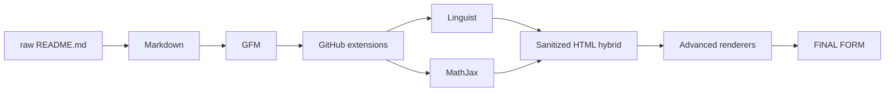
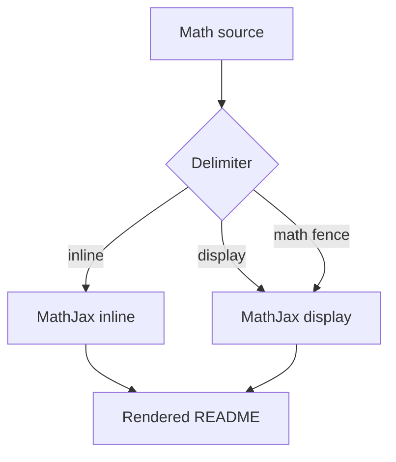
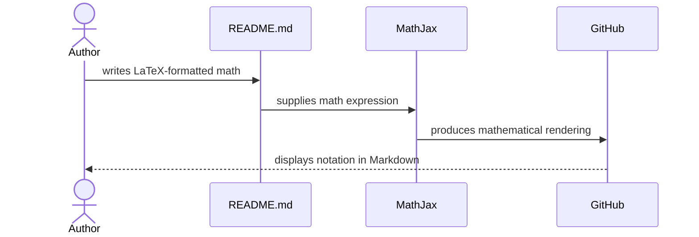

<!--
╔══════════════════════════════════════════════════════════════════════════════╗
║                          LEVEL 00: SOURCE LAYER                              ║
║                                                                              ║
║  RAW SOURCE EXPLORER · PARSER TAMER · BLOCK ARCHITECT · LINK CARTOGRAPHER   ║
║  MEDIA ENGINEER · HYBRID ENGINEER · SYNTAX CURATOR · MATHJAX ARCHITECT      ║
║                                                                              ║
║  M8 invariant: math delimiters, escapes, and fence labels are intentional.   ║
║  Do not normalize dollar signs or math fences without rendering on GitHub.   ║
╚══════════════════════════════════════════════════════════════════════════════╝
-->

<picture>
  <source media="(prefers-color-scheme: dark)" srcset="./assets/hero-dark.svg">
  <source media="(prefers-color-scheme: light)" srcset="./assets/hero-light.svg">
  
</picture>

<div align="center">

<a href="https://readme-typing-svg.demolab.com/demo/">
  
</a>

<br>

<a href="https://www.markdownguide.org/"></a>
<a href="#level-08--full-syntax-highlighting-laboratory"></a>
<a href="#level-17--advanced-mathjax-mathematical-showcase"></a>
<a href="#level-12--details-interface-system"></a>
<a href="#final-boss"></a>

<h3>This is a <strong>layer-by-layer Markdown rendering laboratory</strong>.</h3>

<sub>Markdown · GFM · GitHub Linguist · MathJax · sanitized HTML · local SVG media · advanced renderers</sub>

<br><br>

<a href="#act-i--markdown-core"><strong>⚡ Markdown Core</strong></a>
&nbsp;•&nbsp;
<a href="#level-08--full-syntax-highlighting-laboratory"><strong>⌘ Syntax Lab</strong></a>
&nbsp;•&nbsp;
<a href="#level-17--advanced-mathjax-mathematical-showcase"><strong>∑ MathJax Lab</strong></a>
&nbsp;•&nbsp;
<a href="#level-18--mermaid-summoning-circle"><strong>◇ Mermaid</strong></a>
&nbsp;•&nbsp;
<a href="#final-boss"><strong>👑 Final Boss</strong></a>

</div>

---

> [!IMPORTANT]
> GitHub renders LaTeX-formatted mathematical expressions in Markdown with **MathJax**. M8 demonstrates all four GitHub-documented entry routes: `$...$`, `$`backtick inline math, `$$...$$`, and fenced `math` blocks—then composes them with tables, alerts, and `<details>`.

## 🧭 README POWER MAP

| Act | Rendering layer | Current demonstrations | Jump |
| :---: | --- | --- | :---: |
| `00` | [Source Layer](#level-00--source-layer) | Hidden comments, source-only rules | `RAW` |
| `I` | [Markdown Core](#act-i--markdown-core) | Typography, headings, blocks, links | `#` |
| `II` | [GitHub Flavored Markdown](#act-ii--github-flavored-markdown) | Tables, tasks, strikethrough, autolinks | `GFM` |
| `III` | [GitHub Extensions](#act-iii--github-extensions) | Alerts, 33-mode syntax lab, footnotes | `GH` |
| `IV` | [HTML Hybrid](#act-iv--html-hybrid) | Media, semantics, details UI, sanitization | `<>` |
| `V` | [Advanced Rendering](#act-v--advanced-rendering) | **Advanced MathJax**, Mermaid | `∞` |
| `VI` | [Parser & Source Lab](#act-vi--parser--source-lab) | Escapes, entities, backticks, recursion | `\` |
| `VII` | [Endgame & Reference](#act-vii--endgame--reference) | Achievements, cheat sheet, QA | `✓` |
| `∞` | [Final Boss](#final-boss) | Combined mechanics | `👑` |

`Markdown` · `GFM` · `GitHub` · `Linguist` · `MathJax` · `HTML` · `Local Asset` · `External Asset`

---

## 🧬 THE RENDERING STACK


```mermaid
flowchart LR
    A[raw README.md] --> B[Markdown]
    B --> C[GFM]
    C --> D[GitHub extensions]
    D --> E[Linguist]
    D --> F[MathJax]
    E --> G[Sanitized HTML hybrid]
    F --> G
    G --> H[Advanced renderers]
    H --> I[FINAL FORM]
```

---

# LEVEL 00 — SOURCE LAYER

`HTML` · `Source-only`

```html
<!-- This exists in README.md but disappears when rendered. -->
```

<!--
Architecture invariant:
Future phases extend the correct rendering act instead of appending unrelated sections.

M8 invariant:
Dollar delimiters, $`...`$ delimiters, $$ blocks, and ```math fences are deliberate.
Literal currency dollars near math require special handling.
Do not confuse ```latex syntax highlighting with ```math rendering.
Collapsed galleries remain intentional to control document length.
-->

> [!NOTE]
> Raw source and rendered output remain different surfaces. M8 makes punctuation such as `$`, backticks, backslashes, braces, and underscores part of the rendering contract.

---

# ACT I — MARKDOWN CORE

> Inline syntax, block grammar, and navigation remain the portable foundation.

## LEVEL 01 — TYPOGRAPHY & INLINE POWER

`Markdown` · `GFM` · `HTML`

| Source | Result | Role |
| --- | --- | --- |
| `*italic*` | *italic* | Emphasis |
| `_italic_` | _italic_ | Alternate emphasis |
| `**bold**` | **bold** | Strong |
| `***bold italic***` | ***bold italic*** | Combined |
| `~~deleted~~` | ~~deleted~~ | GFM strike |
| `` `inline code` `` | `inline code` | Literal text |
| `<sub>small</sub>` | <sub>small</sub> | Subscript |
| `<sup>high</sup>` | <sup>high</sup> | Superscript |
| `<ins>inserted</ins>` | <ins>inserted</ins> | Inserted text |

**Bold containing _italic containing `code`_.**

---

## LEVEL 02 — STRUCTURE, HEADINGS & WHITESPACE

`Markdown`

<details>
<summary><strong>Six-level ATX hierarchy</strong></summary>

# Header 1
## Header 2
### Header 3
#### Header 4
##### Header 5
###### Header 6

</details>

<details>
<summary><strong>Setext headings</strong></summary>

Setext Level One
================

Setext Level Two
----------------

</details>

Two trailing spaces create a hard break.  
This line follows it.

---

## LEVEL 03 — LIST ENGINE & QUOTATION FORTRESS

`Markdown`

- Surface
  - Nested
    - Deeper
      - Deeper still
        - List mines
          - **Send indentation**

1. **List item containing a quote**

   > Quotes can live inside list items.

2. **List item containing code**

   ```bash
   printf '%s\n' "nested code"
   ```

> **Quote containing structure**
>
> - [x] list
> - [x] task
> - [x] `code`

---

## LEVEL 04 — HYPERLINK ROUTING MATRIX

`Markdown` · `GFM` · `GitHub` · `HTML`

[Markdown Guide](https://www.markdownguide.org/)  
[Markdown Guide][markdown-guide]  
[GitHub Docs][]  
[GFM Spec]

- [This README](./README.md)
- [Repository root](./)
- [Syntax Lab](#level-08--full-syntax-highlighting-laboratory)
- [MathJax Lab](#level-17--advanced-mathjax-mathematical-showcase)
- [Final Boss](#final-boss)

<a name="m8-math-beacon"></a>

[Jump to the custom M8 anchor](#m8-math-beacon)

<https://github.com/>  
https://github.com  
www.github.com

```text
@octocat
#123
owner/repository#123
```

---

# ACT II — GITHUB FLAVORED MARKDOWN

## LEVEL 05 — TABLE ENGINE

`GFM`

| Alignment | Syntax | Example |
| :--- | :---: | ---: |
| Left | `:---` | `10` |
| Center | `:---:` | `100` |
| Right | `---:` | `1000` |

| Input | Result |
| --- | --- |
| `alpha \| beta` | alpha \| beta |
| `` `left\|right` `` | `left\|right` |

---

## LEVEL 06 — TASK-LIST SKILL TREE

`GFM`

- [x] **Markdown Core**
  - [x] Typography
  - [x] Lists and quotes
  - [x] Link routing
- [x] **GFM Systems**
  - [x] Tables
  - [x] Task lists
- [x] **Media System**
  - [x] Repository-owned SVGs
  - [x] Theme-aware `<picture>`
- [x] **HTML Hybrid**
  - [x] Semantic tags
  - [x] Nested `<details>`
  - [x] Sanitization boundary
- [x] **Syntax Highlighting**
  - [x] 33 distinct modes
  - [x] Names and aliases
  - [x] Labeled / unlabeled / unknown fences
  - [x] `diff` and `text`
  - [x] Variable-length nested fences
- [x] **MathJax**
  - [x] Standard inline `$...$`
  - [x] Backtick-protected inline math
  - [x] `$$...$$` display math
  - [x] fenced `math` blocks
  - [x] fractions, roots, symbols, sets, logic
  - [x] aligned derivations
  - [x] matrices and determinants
  - [x] piecewise functions
  - [x] calculus and multivariable calculus
  - [x] sums, products, and series
  - [x] probability and statistics
  - [x] linear algebra
  - [x] complex numbers and Fourier analysis
  - [x] optimization
  - [x] literal-dollar handling
  - [x] math inside tables, alerts, and details
  - [x] LaTeX-source vs rendered-math distinction
- [x] **Parser Lab**
  - [x] Escapes
  - [x] Entities
  - [x] Variable-length fences
- [ ] **Advanced Rendering**
  - [x] MathJax — advanced showcase
  - [x] Mermaid — baseline
  - [ ] GeoJSON
  - [ ] TopoJSON
  - [ ] STL / 3D
- [ ] **Final Form**
  - [ ] Full rendering QA
  - [ ] Restraint discovered

---

# ACT III — GITHUB EXTENSIONS

> GitHub adds specialized renderers on top of Markdown. M7 explored language grammars; M8 explores mathematical notation.

## LEVEL 07 — ALERT COMMAND CENTER

`GitHub`

> [!NOTE]
> Inline mathematics such as $e^{i\pi}+1=0$ can live inside normal prose and alerts.

> [!TIP]
> Use fenced `math` blocks for large expressions when that makes the Markdown source clearer.

> [!IMPORTANT]
> A `latex` code fence highlights LaTeX source. A `math` fence renders mathematics. Those are different pipelines.

> [!WARNING]
> Literal dollar signs on the same line as math can collide with math delimiters if they are not handled deliberately.

> [!CAUTION]
> MathJax renders notation; it does not verify the proof, solve the equation, or certify that the mathematics is correct.

---

## LEVEL 08 — FULL SYNTAX-HIGHLIGHTING LABORATORY

`Markdown` · `GitHub` · `Linguist`

GitHub uses Linguist language definitions and grammars to determine fenced-code highlighting.[^linguist]

### Fence controls

````md
```python
message = "language specifier selects highlighting grammar"
```
````

```
const answer = 6 * 7;
```

```text
const answer = 6 * 7;
```

```javascript
const answer = 6 * 7;
```

```totally-not-a-language
const answer = 6 * 7;
```

### Alias examples

```javascript
const canonical = "javascript";
```

```js
const alias = "js";
```

```yaml
phase: M8
mathjax: advanced
```

```yml
phase: M8
mathjax: advanced
```

---

### Gallery A — Web, UI & interchange

<details>
<summary><strong>Open 5-language gallery — JavaScript, TypeScript, HTML, CSS, JSON</strong></summary>

#### JavaScript
```javascript
const systems = ["Markdown", "GFM", "GitHub"];
console.table(systems.map((name, level) => ({ name, level })));
```

#### TypeScript
```typescript
type Renderer = "linguist" | "mathjax";
const renderer: Renderer = "mathjax";
```

#### HTML
```html
<details open><summary>Renderer</summary><p>MathJax lives beside HTML.</p></details>
```

#### CSS
```css
.math-lab { display: grid; gap: 1rem; }
```

> [!NOTE]
> This CSS is only a highlighting example; it is not a README stylesheet.

#### JSON
```json
{"phase":"M8","renderer":"MathJax","executable":false}
```

</details>

### Gallery B — Systems & compiled

<details>
<summary><strong>Open 8-language gallery — C, C++, Rust, Go, Java, C#, Kotlin, Swift</strong></summary>

#### C
```c
#include <stdio.h>
int main(void) { puts("M8"); return 0; }
```

#### C++
```cpp
#include <iostream>
int main() { std::cout << "M8\n"; }
```

#### Rust
```rust
fn main() { println!("MathJax layer online"); }
```

#### Go
```go
package main
import "fmt"
func main() { fmt.Println("M8") }
```

#### Java
```java
class Main { public static void main(String[] a) { System.out.println("M8"); } }
```

#### C#
```csharp
Console.WriteLine("M8");
```

#### Kotlin
```kotlin
fun main() = println("M8")
```

#### Swift
```swift
print("M8")
```

</details>

### Gallery C — Scripting

<details>
<summary><strong>Open 6-language gallery — Python, Ruby, PHP, Lua, Bash, PowerShell</strong></summary>

#### Python
```python
from math import pi
print(pi)
```

#### Ruby
```ruby
puts Math::PI
```

#### PHP
```php
<?php echo M_PI;
```

#### Lua
```lua
print(math.pi)
```

#### Bash
```bash
printf '%s\n' 'MathJax is rendering, not executing'
```

#### PowerShell
```powershell
Write-Output 'M8'
```

</details>

### Gallery D — Data, config & infrastructure

<details>
<summary><strong>Open 5-language gallery — SQL, YAML, TOML, XML, Dockerfile</strong></summary>

#### SQL
```sql
SELECT 'M8' AS phase, 'MathJax' AS renderer;
```

#### YAML
```yaml
phase: M8
renderer: MathJax
```

#### TOML
```toml
phase = "M8"
renderer = "MathJax"
```

#### XML
```xml
<readme phase="M8" renderer="MathJax" />
```

#### Dockerfile
```dockerfile
FROM alpine:3.22
CMD ["echo", "M8"]
```

</details>

### Gallery E — Scientific & functional

<details>
<summary><strong>Open 5-language gallery — R, Julia, Haskell, Scala, LaTeX</strong></summary>

#### R
```r
print(pi)
```

#### Julia
```julia
println(pi)
```

#### Haskell
```haskell
main = print pi
```

#### Scala
```scala
@main def run() = println(math.Pi)
```

#### LaTeX source
```latex
\[
\int_{-\infty}^{\infty} e^{-x^2}\,dx = \sqrt{\pi}
\]
```

> [!IMPORTANT]
> The block above is **highlighted LaTeX source**. It is intentionally not the MathJax-rendered version.

</details>

### Gallery F — Documentation & literal modes

<details>
<summary><strong>Open 4-mode gallery — Markdown, diff, plaintext, INI</strong></summary>

#### Markdown
```markdown
# M8
Inline math: $E=mc^2$
```

#### Diff
```diff
- Math baseline
+ Advanced MathJax mathematical showcase
```

#### Text
```text
mathjax ............... ONLINE
delimiter-modes ....... 4
rendering ............. GitHub
execution ............. NONE
```

#### INI
```ini
[math]
phase=M8
renderer=MathJax
```

</details>

### M7 inventory retained

| Gallery | Modes | Count |
| --- | --- | ---: |
| Web & UI | JavaScript, TypeScript, HTML, CSS, JSON | 5 |
| Systems & compiled | C, C++, Rust, Go, Java, C#, Kotlin, Swift | 8 |
| Scripting | Python, Ruby, PHP, Lua, Bash, PowerShell | 6 |
| Data/config/infra | SQL, YAML, TOML, XML, Dockerfile | 5 |
| Scientific/functional | R, Julia, Haskell, Scala, LaTeX | 5 |
| Docs/meta | Markdown, diff, plaintext, INI | 4 |
| **Total** |  | **33** |

### Fence recursion

````markdown
```typescript
const nested: string = "three backticks inside four";
```
````

---

## LEVEL 09 — FOOTNOTES & GITHUB-AWARE BEHAVIOR

`GitHub`

Markdown remains readable as plain text while adding structure.[^plain-text]

Relative paths keep local media branch-aware.[^relative-links]

GitHub sanitizes the HTML hybrid layer.[^sanitization]

Collapsed sections use `<details>` and `<summary>`.[^details]

Linguist supplies syntax grammars for fenced code.[^linguist]

GitHub uses MathJax to render LaTeX-formatted mathematical expressions in Markdown files.[^mathjax]

---

# ACT IV — HTML HYBRID

> M6 established the HTML boundary; M8 demonstrates that MathJax can coexist with progressive disclosure and other Markdown structures.

## LEVEL 10 — REPOSITORY-OWNED MEDIA SYSTEM

`Markdown` · `HTML` · `Local Asset`

<picture>
  <source media="(prefers-color-scheme: dark)" srcset="./assets/hero-dark.svg">
  <source media="(prefers-color-scheme: light)" srcset="./assets/hero-light.svg">
  
</picture>


[](#level-17--advanced-mathjax-mathematical-showcase)

---

## LEVEL 11 — INLINE HTML SEMANTIC TOOLKIT

`HTML` · `Markdown`

Press <kbd>Ctrl</kbd> + <kbd>Shift</kbd> + <kbd>V</kbd>.  
H<sub>2</sub>O · x<sup>2</sup>  
<ins>Inserted</ins> · <del>Deleted</del> · <s>Obsolete</s>  
<strong>Strong HTML</strong> · <em>emphasized HTML</em> · <code>inline HTML code</code>

---

## LEVEL 12 — DETAILS INTERFACE SYSTEM

`HTML` · `Markdown` · `GitHub`

<details>
<summary><strong>Basic collapsed panel</strong></summary>

- Markdown list
- **formatting**
- `inline code`

</details>

<details open>
<summary><strong>Open by default</strong></summary>

The `open` attribute changes initial disclosure state without JavaScript.

</details>

<details>
<summary><strong>Nested disclosure tree</strong></summary>

<details>
<summary><strong>Tier 2</strong></summary>

<details>
<summary><strong>Tier 3</strong></summary>

**Markdown inside HTML inside Markdown.**

</details>

</details>

</details>

---

## LEVEL 13 — HTML TABLE & LAYOUT LAB

`HTML`

<table>
  <thead><tr><th>Element</th><th>Role</th></tr></thead>
  <tbody>
    <tr><td><code>&lt;details&gt;</code></td><td>Progressive disclosure</td></tr>
    <tr><td><code>&lt;kbd&gt;</code></td><td>Keyboard semantics</td></tr>
    <tr><td><code>&lt;picture&gt;</code></td><td>Theme-aware media</td></tr>
    <tr><td><code>&lt;table&gt;</code></td><td>Explicit table structure</td></tr>
  </tbody>
</table>

---

## LEVEL 14 — MARKDOWN / HTML BOUNDARY LAB

`Markdown` · `HTML` · `Parser`

```html
<details>
<summary>Summary</summary>

### Markdown heading

- Markdown list
- **Markdown emphasis**

</details>
```

```text
Markdown owns document structure by default.
HTML enters where it adds missing semantics or interaction.
```

---

## LEVEL 15 — SANITIZATION BOUNDARY

`GitHub` · `HTML` · `Security`

```html
<script>alert('nope')</script>
<div style="position:fixed">not a README UI framework</div>
<div class="app" id="root">not an application mount</div>
```

| Goal | README-safe direction |
| --- | --- |
| Interaction | `<details>` / `<summary>` |
| Theme-aware media | `<picture>` / `<source>` |
| Keyboard notation | `<kbd>` |
| Mathematics | GitHub MathJax syntax |
| Styling | GitHub renderer + designed assets |
| Application behavior | Build an actual webpage/app |

---

## LEVEL 16 — HYBRID INTERFACE BOSS

`Markdown` · `GFM` · `GitHub` · `HTML` · `Local Asset` · `MathJax`

<details open>
<summary><strong>M8 SYSTEM CONSOLE</strong></summary>

<table>
  <tr><th>System</th><th>Status</th></tr>
  <tr><td>Markdown</td><td><strong>ONLINE</strong></td></tr>
  <tr><td>HTML disclosure</td><td><strong>ONLINE</strong></td></tr>
  <tr><td>Linguist syntax routing</td><td><strong>33 MODES</strong></td></tr>
  <tr><td>MathJax rendering</td><td><strong>ADVANCED</strong></td></tr>
  <tr><td>JavaScript authored by README</td><td><del>ABSENT</del></td></tr>
</table>

Inline system equation: $\text{Markdown}+\text{MathJax}=\text{M8}$.

</details>

---

# ACT V — ADVANCED RENDERING

> GitHub's advanced renderers turn selected fenced or delimited source into specialized visual output rather than ordinary code.

## LEVEL 17 — ADVANCED MATHJAX MATHEMATICAL SHOWCASE

`GitHub` · `MathJax` · `LaTeX`

GitHub supports LaTeX-formatted math in Markdown and renders it with MathJax.[^mathjax]

### 17.1 — Four entry routes

#### Standard inline delimiters

Einstein's mass-energy relation is $E=mc^2$, and the Pythagorean identity is $\sin^2\theta+\cos^2\theta=1$.

Source:

```markdown
$E=mc^2$
```

#### Backtick-protected inline math

When math source overlaps visually with Markdown punctuation, GitHub also supports the `$`backtick form:

$`\left\{x_i\right\}_{i=1}^{n},\quad x_i\in\mathbb{R}`$

Source:

````markdown
$`\left\{x_i\right\}_{i=1}^{n}`$
````

#### Double-dollar display math

**Cauchy-Schwarz inequality**\
$$\left(\sum_{k=1}^{n}a_kb_k\right)^2\leq\left(\sum_{k=1}^{n}a_k^2\right)\left(\sum_{k=1}^{n}b_k^2\right)$$

#### Fenced `math` block

```math
\frac{-b\pm\sqrt{b^2-4ac}}{2a}
```

> [!TIP]
> Both block forms are valid. Fenced `math` blocks are especially convenient when a long equation should remain visually isolated in raw Markdown source.

---

### 17.2 — Symbol, relation & structure arsenal

| Family | Live inline example |
| --- | --- |
| Fractions | $\frac{a+b}{c+d}$ |
| Roots | $\sqrt{x}$, $\sqrt[n]{x}$ |
| Powers / indices | $x_i^2$, $a_{mn}$ |
| Greek | $\alpha,\beta,\gamma,\Delta,\Omega$ |
| Relations | $x\le y$, $a\ne b$, $u\approx v$ |
| Sets | $x\in A$, $A\subseteq B$, $A\cup B$ |
| Logic | $P\land Q$, $P\lor Q$, $P\Rightarrow Q$ |
| Quantifiers | $\forall x\in X,\;\exists y\in Y$ |
| Vectors | $\mathbf{x}$, $\vec v$ |
| Accents | $\hat\theta$, $\bar x$, $\tilde f$ |
| Norms | $\lVert x\rVert_2$ |
| Inner product | $\langle u,v\rangle$ |

```math
\underbrace{\frac{1}{n}\sum_{i=1}^{n}x_i}_{\text{sample mean}}
\quad\text{and}\quad
\overbrace{a+b+c}^{\text{three terms}}
```

---

### 17.3 — Algebra & aligned derivations

```math
\begin{aligned}
(a+b)^3
&=(a+b)(a+b)^2\\
&=(a+b)(a^2+2ab+b^2)\\
&=a^3+3a^2b+3ab^2+b^3.
\end{aligned}
```

```math
\begin{aligned}
x^2-6x+5
&=(x^2-6x+9)-4\\
&=(x-3)^2-4.
\end{aligned}
```

### Piecewise functions

```math
f(x)=
\begin{cases}
-x, & x<0,\\
0, & x=0,\\
x^2, & x>0.
\end{cases}
```

---

### 17.4 — Matrices, determinants & systems

```math
A=\begin{pmatrix}
1 & 2 & 3\\
0 & 4 & 5\\
0 & 0 & 6
\end{pmatrix},
\qquad
A^{\mathsf T}=\begin{pmatrix}
1 & 0 & 0\\
2 & 4 & 0\\
3 & 5 & 6
\end{pmatrix}
```

```math
\det\begin{pmatrix}
a & b\\
c & d
\end{pmatrix}=ad-bc
```

```math
\begin{pmatrix}
2 & 1\\
1 & -1
\end{pmatrix}
\begin{pmatrix}x\\y\end{pmatrix}
=
\begin{pmatrix}7\\1\end{pmatrix}
```

### Linear algebra identities

```math
Av=\lambda v,
\qquad
\operatorname{rank}(A)+\operatorname{nullity}(A)=n
```

```math
A=Q\Lambda Q^{\mathsf T}
\qquad\text{and}\qquad
A=U\Sigma V^{\mathsf T}
```

```math
\operatorname{proj}_{u}(v)
=\frac{\langle v,u\rangle}{\langle u,u\rangle}u
```

---

### 17.5 — Single-variable calculus

#### Limits

```math
\lim_{x\to0}\frac{\sin x}{x}=1
```

```math
\lim_{n\to\infty}\left(1+\frac{1}{n}\right)^n=e
```

#### Derivatives

```math
\frac{d}{dx}\left(x^n\right)=nx^{n-1},
\qquad
\frac{d}{dx}e^x=e^x
```

```math
\frac{d}{dx}f(g(x))=f'(g(x))g'(x)
```

#### Integrals

```math
\int_a^b f(x)\,dx
```

```math
\int x e^x\,dx=xe^x-e^x+C
```

#### Fundamental theorem of calculus

```math
\frac{d}{dx}\int_a^x f(t)\,dt=f(x)
```

---

### 17.6 — Multivariable calculus

```math
\nabla f(x_1,\dots,x_n)
=
\begin{pmatrix}
\frac{\partial f}{\partial x_1}\\
\vdots\\
\frac{\partial f}{\partial x_n}
\end{pmatrix}
```

```math
H_f(x)=
\begin{pmatrix}
\frac{\partial^2 f}{\partial x_1^2} & \cdots & \frac{\partial^2 f}{\partial x_1\partial x_n}\\
\vdots & \ddots & \vdots\\
\frac{\partial^2 f}{\partial x_n\partial x_1} & \cdots & \frac{\partial^2 f}{\partial x_n^2}
\end{pmatrix}
```

```math
\iint_D f(x,y)\,dA,
\qquad
\iiint_V \rho(x,y,z)\,dV
```

```math
\nabla\cdot\mathbf{F}
=\frac{\partial F_1}{\partial x_1}+\cdots+\frac{\partial F_n}{\partial x_n}
```

---

### 17.7 — Sums, products & infinite series

```math
\sum_{k=0}^{n}r^k=\frac{1-r^{n+1}}{1-r},\qquad r\ne1
```

```math
\sum_{n=0}^{\infty}\frac{x^n}{n!}=e^x
```

```math
\sin x=\sum_{n=0}^{\infty}(-1)^n\frac{x^{2n+1}}{(2n+1)!}
```

```math
n!=\prod_{k=1}^{n}k
```

```math
\zeta(s)=\sum_{n=1}^{\infty}\frac{1}{n^s},\qquad \operatorname{Re}(s)>1
```

---

### 17.8 — Probability & statistics

```math
P(A\mid B)=\frac{P(B\mid A)P(A)}{P(B)}
```

```math
\mathbb{E}[X]=\sum_x x\,P(X=x),
\qquad
\operatorname{Var}(X)=\mathbb{E}[X^2]-\mathbb{E}[X]^2
```

```math
f_X(x)=\frac{1}{\sigma\sqrt{2\pi}}
\exp\left(-\frac{(x-\mu)^2}{2\sigma^2}\right)
```

```math
\operatorname{Cov}(X,Y)
=\mathbb{E}\!\left[(X-\mathbb{E}X)(Y-\mathbb{E}Y)\right]
```

```math
\bar X\xrightarrow[n\to\infty]{\text{a.s.}}\mu
```

---

### 17.9 — Complex numbers & Fourier analysis

#### Euler's identity

```math
e^{i\pi}+1=0
```

```math
e^{i\theta}=\cos\theta+i\sin\theta
```

#### Fourier transform

```math
\widehat f(\xi)=\int_{-\infty}^{\infty}
f(x)e^{-2\pi i x\xi}\,dx
```

#### Fourier series

```math
f(x)\sim\frac{a_0}{2}
+\sum_{n=1}^{\infty}\left(a_n\cos nx+b_n\sin nx\right)
```

#### Gaussian integral

```math
\int_{-\infty}^{\infty}e^{-x^2}\,dx=\sqrt{\pi}
```

---

### 17.10 — Optimization & constrained systems

```math
\nabla f(x^\star)=0
```

```math
\mathcal{L}(x,\lambda)=f(x)+\lambda g(x)
```

```math
\begin{aligned}
\nabla_x\mathcal{L}(x,\lambda)&=0,\\
g(x)&=0.
\end{aligned}
```

```math
x^\star=\operatorname*{arg\,min}_{x\in\mathcal X}f(x)
```

---

### 17.11 — Sets, logic & abstract notation

```math
A\triangle B=(A\setminus B)\cup(B\setminus A)
```

```math
\forall\varepsilon>0\;\exists\delta>0:\quad
|x-a|<\delta\Rightarrow|f(x)-f(a)|<\varepsilon
```

```math
f:X\to Y,
\qquad
x\mapsto f(x)
```

```math
\mathbb{N}\subset\mathbb{Z}\subset\mathbb{Q}\subset\mathbb{R}\subset\mathbb{C}
```

---

### 17.12 — Math inside tables

| Concept | Rendered expression | Meaning |
| --- | --- | --- |
| Euclidean norm | $\lVert x\rVert_2$ | vector magnitude |
| Dot product | $x^{\mathsf T}y$ | inner product in $\mathbb R^n$ |
| Expected value | $\mathbb E[X]$ | probability average |
| Gradient | $\nabla f(x)$ | first derivatives |
| Determinant | $\det(A)$ | scalar matrix invariant |
| Fourier transform | $\widehat f(\xi)$ | frequency representation |

---

### 17.13 — Math inside alerts

> [!NOTE]
> The identity $\sin^2\theta+\cos^2\theta=1$ renders inside a GitHub alert.

> [!TIP]
> For a normalized vector $u$, the projection simplifies to $\operatorname{proj}_u(v)=\langle v,u\rangle u$.

> [!WARNING]
> A rendered implication $P\Rightarrow Q$ is still only as valid as the argument establishing it.

---

### 17.14 — Math inside `<details>`

<details>
<summary><strong>Open the matrix chamber</strong></summary>

```math
R_\theta=
\begin{pmatrix}
\cos\theta & -\sin\theta\\
\sin\theta & \cos\theta
\end{pmatrix}
```

```math
R_\theta^{\mathsf T}R_\theta=I,
\qquad
\det(R_\theta)=1
```

</details>

<details>
<summary><strong>Open the calculus chamber</strong></summary>

```math
\int_0^1 x^p\,dx=\frac{1}{p+1},\qquad p>-1
```

```math
\frac{d}{dx}\log x=\frac1x
```

</details>

<details>
<summary><strong>Open the probability chamber</strong></summary>

```math
P(A\cap B)=P(A\mid B)P(B)
```

```math
\mathbb{E}[aX+b]=a\mathbb{E}[X]+b
```

</details>

---

### 17.15 — Literal dollar-sign survival lab

A dollar sign can be data rather than a delimiter.

Inside a math expression, escape the literal currency symbol:

$`\sqrt{\$4}=2`$

Source:

````markdown
$`\sqrt{\$4}=2`$
````

Outside math but on the same line, GitHub documents using a span around the literal dollar sign. To split <span>$</span>100 in half, calculate $100/2=50$.

Source:

```html
To split <span>$</span>100 in half, calculate $100/2=50$.
```

> [!IMPORTANT]
> This section is deliberately parser-sensitive. Do not remove the backslash or `<span>` merely because the source appears visually redundant.

---

### 17.16 — Highlighted LaTeX source vs rendered MathJax

**Highlighted source:**

```latex
\int_{-\infty}^{\infty} e^{-x^2}\,dx = \sqrt{\pi}
```

**Rendered expression:**

```math
\int_{-\infty}^{\infty} e^{-x^2}\,dx = \sqrt{\pi}
```

```text
```latex  → Linguist syntax highlighting → source remains source
```math   → GitHub MathJax renderer       → source becomes mathematics
```

---

### 17.17 — Mathematical boss composition

<details open>
<summary><strong>MATHEMATICAL FINAL FORM — expanded by default</strong></summary>

```math
\begin{aligned}
\mathcal{R}
&=\text{Markdown}
\oplus\text{GFM}
\oplus\text{HTML}
\oplus\text{Linguist}
\oplus\text{MathJax},\\[4pt]
\nabla\mathcal{R}&\ne0,\\[4pt]
\det(I)&=1,\\[4pt]
\int_{-\infty}^{\infty}e^{-x^2}\,dx&=\sqrt{\pi},\\[4pt]
e^{i\pi}+1&=0.
\end{aligned}
```

```math
\boxed{
\text{Readable source}
+\text{correct notation}
+\text{renderer awareness}
=\text{useful mathematical documentation}
}
```

</details>

### M8 renderer rule

```text
Need mathematics in prose?
├── short/simple → $...$
├── Markdown-sensitive inline source → $`...`$
└── display expression
    ├── concise → $$...$$
    └── complex / multiline → fenced math block
```

---

## LEVEL 18 — MERMAID SUMMONING CIRCLE

`GitHub` · `Mermaid`


```mermaid
flowchart TD
    A[Math source] --> B{Delimiter}
    B -- inline --> C[MathJax inline]
    B -- display --> D[MathJax display]
    B -- math fence --> D
    C --> E[Rendered README]
    D --> E
```


```mermaid
sequenceDiagram
    actor Author
    participant MD as README.md
    participant MJ as MathJax
    participant GH as GitHub
    Author->>MD: writes LaTeX-formatted math
    MD->>MJ: supplies math expression
    MJ->>GH: produces mathematical rendering
    GH-->>Author: displays notation in Markdown
```

> [!NOTE]
> M9 will expand Mermaid itself. M8 only updates the baseline diagrams so they reflect the new MathJax rendering layer.

---

# ACT VI — PARSER & SOURCE LAB

## LEVEL 19 — ESCAPE HATCH

`Markdown` · `Parser`

\# Not a heading  
\> Not a quote  
\- Not a list  
1\. Not an ordered list  
\*Not emphasis\*

| Literal | Source |
| :---: | :---: |
| `*` | `\*` |
| `_` | `\_` |
| `#` | `\#` |
| `>` | `\>` |
| `|` | `\|` |
| `$` | `\$` when a literal dollar must survive math parsing |
| `\` | `\\` |

---

## LEVEL 20 — BACKTICK PARADOX

`Markdown` · `Parser`

`README.md`

``Use a `backtick` inside code``

````markdown
```javascript
console.log("Three backticks live inside four.");
```
````

M8 adds another backtick-sensitive inline construct: $`x_i^2`$.

---

## LEVEL 21 — DELIMITER COLLISION LAB

`Markdown` · `GFM` · `MathJax`

*asterisk emphasis*  
_underscore emphasis_  
**strong**  
~~strike containing **bold** and `code`~~

Math also introduces delimiter semantics: `$...$`, `$`backtick math, `$$...$$`, and fenced `math` blocks.

```text
Same punctuation, different parser roles:
$     → possible math delimiter
`     → code delimiter or protected-inline-math boundary
\     → LaTeX command / Markdown escape depending on context
_     → Markdown emphasis or mathematical subscript depending on context
*     → Markdown emphasis or literal math token depending on context
```

---

## LEVEL 22 — ENTITY REACTOR

`Markdown` · `HTML`

| Source | Rendered |
| --- | :---: |
| `&copy;` | &copy; |
| `&rarr;` | &rarr; |
| `&times;` | &times; |
| `&ne;` | &ne; |
| `&infin;` | &infin; |
| `&#169;` | &#169; |
| `&#xA9;` | &#xA9; |

&lt;div&gt;not an HTML element&lt;/div&gt;

---

## LEVEL 23 — WHITESPACE & RECURSION CHAMBER

`Markdown` · `Parser`

````markdown
```markdown
**Markdown shown inside Markdown shown inside Markdown.**
```
````

````markdown
```math
\sum_{k=1}^{n}k=\frac{n(n+1)}2
```
````

<!--
Future maintainers:
Nested fences, math delimiters, literal-dollar escapes, code labels, reference definitions,
relative media paths, and details blank lines are intentional parser demonstrations.
-->

---

# ACT VII — ENDGAME & REFERENCE

## 🏅 ACHIEVEMENTS UNLOCKED

<p align="center">
  
  
  
  
</p>

| Achievement | Requirement | Status |
| --- | --- | :---: |
| **Block Architect** | Compose nested Markdown blocks | ✅ |
| **Link Cartographer** | Multiple link grammars | ✅ |
| **Media Engineer** | Repository-owned media | ✅ |
| **Hybrid Engineer** | Markdown + sanitized HTML | ✅ |
| **Syntax Curator** | Retain 33 distinct syntax modes | ✅ |
| **Fence Architect** | Variable-length nested fences | ✅ |
| **MathJax Architect** | Use all four GitHub math entry routes | ✅ |
| **Delimiter Diplomat** | Distinguish inline, protected inline, display, and math fence syntax | ✅ |
| **Matrix Monarch** | Render matrices, determinants, systems, eigennotation | ✅ |
| **Calculus Engine** | Render limits, derivatives, gradients, Hessians, integrals | ✅ |
| **Probability Sage** | Render Bayes, expectation, variance, density, covariance | ✅ |
| **Fourier Summoner** | Render complex exponential and Fourier notation | ✅ |
| **Dollar Escape Artist** | Preserve literal currency signs beside math | ✅ |
| **Math Interface Composer** | Put math inside tables, alerts, and details | ✅ |
| **Source/Render Separatist** | Distinguish `latex` highlighting from `math` rendering | ✅ |
| **Master of Restraint** | Stop before inventing new branches of mathematics | ❌ |

---

## THE CHAOS INDEX

```text
Clarity          ████████████████████ 100%
Structure        ████████████████████ 100%
Typography       ████████████████████ 100%
Lists            ████████████████████ 100%
Tables           ████████████████████ 100%
Links            ████████████████████ 100%
Local Media      ████████████████████ 100%
HTML Hybrid      ████████████████████ 100%
Syntax Labels    ████████████████████ 100%
Language Breadth ████████████████████  33 modes
Math Delimiters  ████████████████████ 100%
Math Structures  ████████████████████ 100%
Calculus         ████████████████████ 100%
Linear Algebra   ████████████████████ 100%
Probability      ████████████████████ 100%
Fourier / Complex████████████████████ 100%
Parser Tricks    ███████████████████░  95%
Restraint        ██░░░░░░░░░░░░░░░░░░  10%
Raw Power        ████████████████████  M8
```

> [!WARNING]
> Mathematical typesetting can make a false equation look extremely authoritative.
>
> **M8 demonstrates notation breadth, renderer behavior, and composition—not mathematical truth by typography.**

---

## 🧰 THE ACTUALLY USEFUL CHEAT SHEET

``````markdown
# Heading
*italic* **bold** ~~strike~~ `code`

[inline](https://example.com)
[reference][docs]
[relative](./README.md)
[same document](#final-boss)

Inline math: $E=mc^2$
Protected inline math: $`x_i^2`$

Display math:
$$\sum_{k=1}^{n}k=\frac{n(n+1)}2$$

```math
A=\begin{pmatrix}a&b\\c&d\end{pmatrix}
```

Literal currency inside math: $`\sqrt{\$4}=2`$
Currency beside math: <span>$</span>100 and $100/2=50$

```python
print("highlighted code")
```

```latex
\int_0^1 x^2\,dx
```

```text
literal output
```

```diff
- baseline math
+ advanced MathJax
```

````markdown
```math
\int_{-\infty}^{\infty}e^{-x^2}\,dx=\sqrt{\pi}
```
````

<details>
<summary>Collapsed math</summary>

```math
e^{i\pi}+1=0
```

</details>


<kbd>Ctrl</kbd> + <kbd>K</kbd>

- [x] Complete
- [ ] Incomplete

| Concept | Math |
| --- | --- |
| norm | $\lVert x\rVert_2$ |
``````

[docs]: https://example.com/docs

---

## 🧯 COMMON README CRIMES

| Crime | Consequence |
| --- | --- |
| Treating `latex` fence as rendered math | Highlighted source mistaken for MathJax output |
| Treating `math` fence as ordinary syntax highlighting | Renderer model becomes wrong |
| Unescaped currency `$` beside math | Delimiter collisions |
| Giant equation without structure | Source and render both become difficult to inspect |
| Using display math for every tiny symbol | Document becomes vertically bloated |
| Using inline math for giant matrices | Prose becomes unreadable |
| Assuming typesetting proves correctness | Beautifully rendered nonsense |
| Hiding every equation inside `<details>` | Mathematical flow disappears |
| Forgetting longer outer fences | Source demonstrations terminate themselves |
| Replacing readable notation with gratuitous macros | Maintenance cost rises |
| Deleting local assets | Media layer breaks |

---

## 🧪 README QUALITY TEST

- [ ] Standard `$...$` inline expressions render.
- [ ] `$`backtick inline expressions render without leaking Markdown syntax.
- [ ] `$$...$$` display expressions render.
- [ ] Fenced `math` blocks render as mathematics rather than highlighted source.
- [ ] Fenced `latex` blocks remain highlighted source rather than rendered mathematics.
- [ ] Matrices and cases keep row boundaries.
- [ ] `aligned` derivations keep alignment points.
- [ ] Limits, sums, products, derivatives, partial derivatives, and integrals render.
- [ ] `\mathbb`, `\mathbf`, `\operatorname`, norms, and inner products render.
- [ ] Math in GFM table cells remains legible.
- [ ] Math inside GitHub alerts remains inline and readable.
- [ ] Math fences inside `<details>` render after expansion.
- [ ] Literal `\$` survives inside math.
- [ ] Literal outside-math currency uses the documented `<span>$</span>` pattern when sharing a line with math.
- [ ] Nested math-fence source examples remain bounded by longer fences.
- [ ] All six M7 syntax galleries remain present.
- [ ] M7 inventory still totals 33 modes.
- [ ] Theme-aware local hero still switches correctly.
- [ ] Relative media paths resolve on the branch.
- [ ] Mobile layout remains usable.
- [ ] README is previewed on GitHub.

---

# FINAL BOSS

<picture>
  <source media="(prefers-color-scheme: dark)" srcset="./assets/hero-dark.svg">
  <source media="(prefers-color-scheme: light)" srcset="./assets/hero-light.svg">
  
</picture>

<details open>
<summary><strong>FINAL FORM — MATHEMATICAL RENDERING SYSTEM</strong></summary>

```text
README
 ├── MARKDOWN CORE
 ├── GFM
 ├── LINKS
 ├── LOCAL MEDIA
 ├── HTML HYBRID
 ├── LINGUIST
 │    └── 33 SYNTAX MODES
 ├── MATHJAX
 │    ├── INLINE $
 │    ├── PROTECTED INLINE $`...`$
 │    ├── DISPLAY $$
 │    ├── MATH FENCE
 │    ├── ALGEBRA
 │    ├── MATRICES
 │    ├── CALCULUS
 │    ├── LINEAR ALGEBRA
 │    ├── PROBABILITY
 │    ├── FOURIER / COMPLEX
 │    ├── TABLE / ALERT / DETAILS COMPOSITION
 │    └── DOLLAR-SIGN ESCAPES
 ├── MERMAID
 └── PARSER LAB

↓
FINAL FORM
```

```math
\begin{aligned}
\text{Final Form}
&=\text{structure}
+\text{semantics}
+\text{renderers},\\
\text{M8}
&=\text{MathJax breadth}
+\text{parser awareness}
+\text{readability}.
\end{aligned}
```

<details>
<summary><strong>Open the final mathematical subsystem</strong></summary>

```math
\boxed{e^{i\pi}+1=0}
\qquad
\boxed{\int_{-\infty}^{\infty}e^{-x^2}\,dx=\sqrt{\pi}}
```

</details>

</details>

<div align="center">

<p>
  Markdown creates the document.<br>
  Linguist highlights source.<br>
  MathJax renders notation.<br>
  HTML controls disclosure.<br>
  Parser awareness keeps the layers from eating each other.
</p>

<a href="https://docs.github.com/en/get-started/writing-on-github/working-with-advanced-formatting/writing-mathematical-expressions"></a>
<a href="#level-17--advanced-mathjax-mathematical-showcase"></a>
<a href="#"></a>

<h2>Markdown: Final Form.</h2>
<h3>Advanced mathematical rendering unlocked.</h3>

</div>


---

[markdown-guide]: https://www.markdownguide.org/ "Markdown Guide"
[GitHub Docs]: https://docs.github.com/en/get-started/writing-on-github "GitHub writing and formatting documentation"
[GFM Spec]: https://github.github.com/gfm/ "GitHub Flavored Markdown specification"

[^plain-text]: Markdown remains readable as plain text while adding lightweight structural syntax.
[^relative-links]: Relative repository paths keep files and media branch-aware.
[^details]: GitHub documents `<details>`, `<summary>`, nested Markdown content, and the `open` attribute for initially expanded sections.
[^sanitization]: GitHub sanitizes rendered README HTML, so arbitrary application-style script and styling are not the interface model.
[^linguist]: GitHub Linguist defines known languages and aliases used for fenced-code syntax highlighting.
[^mathjax]: GitHub documents LaTeX-formatted mathematical expressions in Markdown files, rendered with MathJax, using inline dollar delimiters, protected `$`backtick inline syntax, double-dollar display blocks, or fenced `math` blocks.