<!--
╔══════════════════════════════════════════════════════════════════════════════╗
║                          LEVEL 00: SOURCE LAYER                              ║
║                                                                              ║
║  RAW SOURCE EXPLORER · PARSER TAMER · BLOCK ARCHITECT · LINK CARTOGRAPHER   ║
║  MEDIA ENGINEER · HYBRID ENGINEER · SYNTAX CURATOR · MATHJAX ARCHITECT      ║
║  MERMAID CARTOGRAPHER                                                        ║
║                                                                              ║
║  M9 invariant: Mermaid fences are executable diagram source.                 ║
║  Do not rewrite diagram keywords or fence labels as decorative prose.        ║
╚══════════════════════════════════════════════════════════════════════════════╝
-->

<picture>
  <source media="(prefers-color-scheme: dark)" srcset="./assets/hero-dark.svg">
  <source media="(prefers-color-scheme: light)" srcset="./assets/hero-light.svg">
  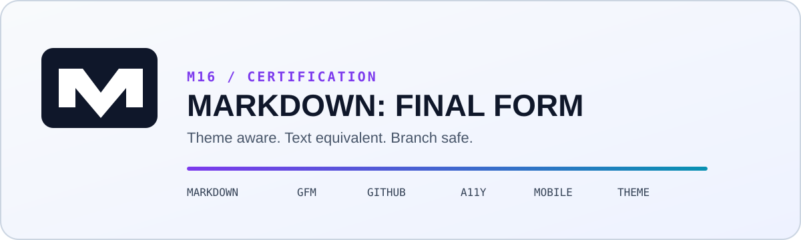
</picture>

<div align="center">

<a href="https://readme-typing-svg.demolab.com/demo/">
  
</a>

<br>

<a href="https://www.markdownguide.org/"></a>
<a href="#level-08--full-syntax-highlighting-laboratory"></a>
<a href="#level-17--advanced-mathjax-mathematical-showcase"></a>
<a href="#level-18--full-mermaid-diagram-gallery"></a>
<a href="#final-boss"></a>

<h3>This is a <strong>layer-by-layer Markdown rendering laboratory</strong>.</h3>

<sub>Markdown · GFM · GitHub Linguist · MathJax · Mermaid · sanitized HTML · local SVG media</sub>

<br><br>

<a href="#act-i--markdown-core"><strong>⚡ Markdown Core</strong></a>
&nbsp;•&nbsp;
<a href="#level-08--full-syntax-highlighting-laboratory"><strong>⌘ Syntax Lab</strong></a>
&nbsp;•&nbsp;
<a href="#level-17--advanced-mathjax-mathematical-showcase"><strong>∑ MathJax</strong></a>
&nbsp;•&nbsp;
<a href="#level-18--full-mermaid-diagram-gallery"><strong>◇ Mermaid Gallery</strong></a>
&nbsp;•&nbsp;
<a href="#final-boss"><strong>👑 Final Boss</strong></a>

</div>

---

> [!IMPORTANT]
> GitHub renders Mermaid when valid Mermaid source appears inside a fenced block labeled `mermaid`. M9 treats diagrams as another source-driven renderer: the raw text remains versionable and reviewable, while GitHub turns it into a visual model.

## 🧭 README POWER MAP

| Act | Rendering layer | Current demonstrations | Jump |
| :---: | --- | --- | :---: |
| `00` | [Source Layer](#level-00--source-layer) | Hidden comments, source-only rules | `RAW` |
| `I` | [Markdown Core](#act-i--markdown-core) | Typography, headings, blocks, links | `#` |
| `II` | [GitHub Flavored Markdown](#act-ii--github-flavored-markdown) | Tables, tasks, strikethrough, autolinks | `GFM` |
| `III` | [GitHub Extensions](#act-iii--github-extensions) | Alerts, 33-mode syntax lab, footnotes | `GH` |
| `IV` | [HTML Hybrid](#act-iv--html-hybrid) | Media, semantics, details UI, sanitization | `<>` |
| `V` | [Advanced Rendering](#act-v--advanced-rendering) | **MathJax + full Mermaid gallery** | `∞` |
| `VI` | [Parser & Source Lab](#act-vi--parser--source-lab) | Escapes, entities, backticks, recursion | `\` |
| `VII` | [Endgame & Reference](#act-vii--endgame--reference) | Achievements, cheat sheet, QA | `✓` |
| `∞` | [Final Boss](#final-boss) | Combined mechanics | `👑` |

`Markdown` · `GFM` · `GitHub` · `Linguist` · `MathJax` · `Mermaid` · `HTML` · `Local Asset`

---

## 🧬 THE RENDERING STACK

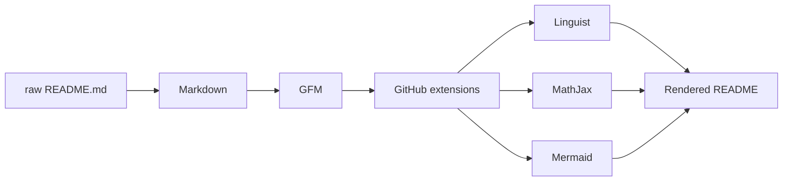
```mermaid
flowchart LR
    A[raw README.md] --> B[Markdown]
    B --> C[GFM]
    C --> D[GitHub extensions]
    D --> E[Linguist]
    D --> F[MathJax]
    D --> G[Mermaid]
    E --> H[Rendered README]
    F --> H
    G --> H
```

---

# LEVEL 00 — SOURCE LAYER

`HTML` · `Source-only`

```html
<!-- This exists in README.md but disappears when rendered. -->
```

<!--
M9 invariants:
- mermaid fences are live diagrams, not highlighted source code.
- text fences showing Mermaid source must use longer outer fences when needed.
- default Mermaid theme is preferred over fixed color styling for GitHub light/dark resilience.
- architecture-beta is a compatibility canary because Mermaid documents it as v11.1+.
- newer Mermaid families may exist upstream without being guaranteed by GitHub's bundled version.
-->

> [!NOTE]
> Source view matters especially for diagrams: every rendered edge, node, relationship, task, and state still has a diffable textual representation.

---

# ACT I — MARKDOWN CORE

## LEVEL 01 — TYPOGRAPHY & INLINE POWER

`Markdown` · `GFM` · `HTML`

| Source | Result |
| --- | --- |
| `*italic*` | *italic* |
| `**bold**` | **bold** |
| `***both***` | ***both*** |
| `~~deleted~~` | ~~deleted~~ |
| `` `code` `` | `code` |
| `<sub>2</sub>` | H<sub>2</sub>O |
| `<sup>2</sup>` | x<sup>2</sup> |
| `<ins>new</ins>` | <ins>new</ins> |

**Bold containing _italic containing `code`_.**

---

## LEVEL 02 — STRUCTURE, HEADINGS & WHITESPACE

`Markdown`

<details>
<summary><strong>Six-level ATX hierarchy</strong></summary>

# Header 1
## Header 2
### Header 3
#### Header 4
##### Header 5
###### Header 6

</details>

<details>
<summary><strong>Setext headings</strong></summary>

Setext Level One
================

Setext Level Two
----------------

</details>

Two trailing spaces create a hard break.  
This line follows it.

---

## LEVEL 03 — LIST ENGINE & QUOTATION FORTRESS

`Markdown`

- Surface
  - Nested
    - Deeper
      - List mines
        - Deeper still
          - **Maximum indentation**

1. **Quote inside list**

   > Containers can contain containers.

2. **Code inside list**

   ```bash
   printf '%s\n' "nested code"
   ```

> **Quote containing structure**
>
> - [x] list
> - [x] task
> - [x] `code`

---

## LEVEL 04 — HYPERLINK ROUTING MATRIX

`Markdown` · `GFM` · `GitHub` · `HTML`

[Markdown Guide](https://www.markdownguide.org/)  
[Markdown Guide][markdown-guide]  
[GitHub Docs][]  
[GFM Spec]

- [This README](./README.md)
- [Repository root](./)
- [MathJax showcase](#level-17--advanced-mathjax-mathematical-showcase)
- [Mermaid gallery](#level-18--full-mermaid-diagram-gallery)
- [Final Boss](#final-boss)

<a name="m9-mermaid-beacon"></a>

[Jump to the custom M9 anchor](#m9-mermaid-beacon)

<https://github.com/>  
https://github.com  
www.github.com

```text
@octocat
#123
owner/repository#123
```

---

# ACT II — GITHUB FLAVORED MARKDOWN

## LEVEL 05 — TABLE ENGINE

`GFM`

| Alignment | Syntax | Example |
| :--- | :---: | ---: |
| Left | `:---` | `10` |
| Center | `:---:` | `100` |
| Right | `---:` | `1000` |

| Input | Result |
| --- | --- |
| `alpha \| beta` | alpha \| beta |
| `` `left\|right` `` | `left\|right` |

---

## LEVEL 06 — TASK-LIST SKILL TREE

`GFM`

- [x] **Markdown Core**
  - [x] Typography
  - [x] Lists / quotes
  - [x] Link routing
- [x] **GFM Systems**
  - [x] Tables
  - [x] Task lists
- [x] **Media System**
  - [x] Repository-owned SVGs
  - [x] Theme-aware `<picture>`
- [x] **HTML Hybrid**
  - [x] Semantic tags
  - [x] Nested `<details>`
  - [x] Sanitization boundary
- [x] **Syntax Highlighting**
  - [x] 33 language/mode fences
  - [x] Aliases
  - [x] Unlabeled/text/diff controls
  - [x] Nested fences
- [x] **MathJax**
  - [x] Inline / protected inline
  - [x] Display / fenced math
  - [x] Matrices / calculus / probability / Fourier
  - [x] Literal-dollar parser cases
- [x] **Mermaid**
  - [x] Flowchart
  - [x] Sequence
  - [x] State
  - [x] Class
  - [x] Entity relationship
  - [x] User journey
  - [x] Gantt
  - [x] Pie
  - [x] GitGraph
  - [x] Mindmap
  - [x] Timeline
  - [x] Quadrant chart
  - [x] Requirement diagram
  - [x] Architecture compatibility canary
- [ ] **Next renderers**
  - [ ] GeoJSON
  - [ ] TopoJSON
  - [ ] STL / 3D
- [ ] **Final Form**
  - [ ] Full rendering QA
  - [ ] Restraint discovered

---

# ACT III — GITHUB EXTENSIONS

## LEVEL 07 — ALERT COMMAND CENTER

`GitHub`

> [!NOTE]
> Mermaid diagrams are source-controlled visualizations: edit the text, review the diff, render the model.

> [!TIP]
> Keep labels concise. Extremely wide nodes and long timelines become mobile-unfriendly quickly.

> [!IMPORTANT]
> The opening fence must be labeled `mermaid`; a `text` or unlabeled fence only shows source.

> [!WARNING]
> Valid Mermaid upstream does not automatically prove compatibility with the Mermaid version currently bundled by GitHub.

> [!CAUTION]
> A single parser error can turn a diagram into an error state instead of a visualization.

---

## LEVEL 08 — FULL SYNTAX-HIGHLIGHTING LABORATORY

`Markdown` · `GitHub` · `Linguist`

M7 remains intact as a compact six-gallery museum with **33 syntax modes**.

### Fence controls

```
const unlabeled = true;
```

```text
literal-output = true
```

```javascript
const highlighted = true;
```

```totally-not-a-language
const unknownLabelControl = true;
```

### Alias controls

```javascript
const canonical = "javascript";
```

```js
const alias = "js";
```

<details>
<summary><strong>Gallery A — Web & UI (5)</strong></summary>

```javascript
console.log("JavaScript");
```
```typescript
const phase: number = 9;
```
```html
<details><summary>HTML</summary></details>
```
```css
.readme { display: block; }
```
```json
{"phase":"M9"}
```

</details>

<details>
<summary><strong>Gallery B — Systems & compiled (8)</strong></summary>

```c
int main(void){return 0;}
```
```cpp
#include <iostream>
int main(){std::cout << "C++";}
```
```rust
fn main(){println!("Rust");}
```
```go
package main
func main(){}
```
```java
class Main { public static void main(String[] a){} }
```
```csharp
Console.WriteLine("C#");
```
```kotlin
fun main() = println("Kotlin")
```
```swift
print("Swift")
```

</details>

<details>
<summary><strong>Gallery C — Scripting (6)</strong></summary>

```python
print("Python")
```
```ruby
puts "Ruby"
```
```php
<?php echo "PHP";
```
```lua
print("Lua")
```
```bash
printf '%s\n' Bash
```
```powershell
Write-Output 'PowerShell'
```

</details>

<details>
<summary><strong>Gallery D — Data / config / infrastructure (5)</strong></summary>

```sql
SELECT 'SQL';
```
```yaml
phase: M9
```
```toml
phase = "M9"
```
```xml
<phase>M9</phase>
```
```dockerfile
FROM alpine:3.22
```

</details>

<details>
<summary><strong>Gallery E — Scientific / functional (5)</strong></summary>

```r
print(pi)
```
```julia
println(pi)
```
```haskell
main = print pi
```
```scala
@main def run() = println(math.Pi)
```
```latex
\int_0^1 x^2\,dx
```

</details>

<details>
<summary><strong>Gallery F — Documentation / literal (4)</strong></summary>

```markdown
# Markdown
```
```diff
- old
+ new
```
```text
plaintext
```
```ini
[readme]
phase=M9
```

</details>

| Gallery | Count |
| --- | ---: |
| Web & UI | 5 |
| Systems & compiled | 8 |
| Scripting | 6 |
| Data/config/infra | 5 |
| Scientific/functional | 5 |
| Documentation/meta | 4 |
| **Total** | **33** |

### Fence recursion retained

````markdown
```typescript
const nested: string = "three backticks inside four";
```
````

---

## LEVEL 09 — FOOTNOTES & GITHUB-AWARE BEHAVIOR

`GitHub`

Markdown remains readable as plain text while adding structure.[^plain-text]

Relative paths keep local media branch-aware.[^relative-links]

GitHub sanitizes the HTML hybrid layer.[^sanitization]

Linguist supplies syntax grammars for fenced code.[^linguist]

GitHub renders LaTeX-formatted mathematics with MathJax.[^mathjax]

GitHub renders Mermaid source placed inside a fenced block labeled `mermaid`.[^mermaid]

---

# ACT IV — HTML HYBRID

## LEVEL 10 — REPOSITORY-OWNED MEDIA SYSTEM

`Markdown` · `HTML` · `Local Asset`

<picture>
  <source media="(prefers-color-scheme: dark)" srcset="./assets/hero-dark.svg">
  <source media="(prefers-color-scheme: light)" srcset="./assets/hero-light.svg">
  
</picture>

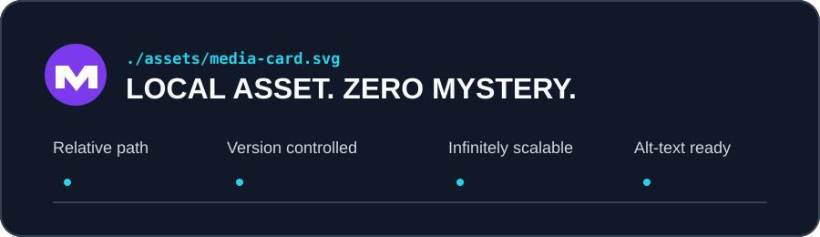

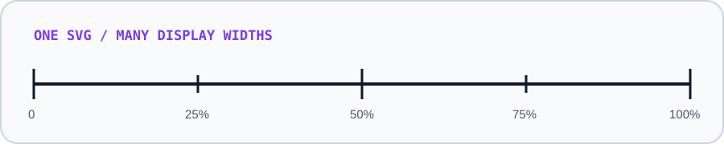

[](#level-18--full-mermaid-diagram-gallery)

---

## LEVEL 11 — INLINE HTML SEMANTIC TOOLKIT

`HTML` · `Markdown`

Press <kbd>Ctrl</kbd> + <kbd>Shift</kbd> + <kbd>V</kbd>.  
H<sub>2</sub>O · x<sup>2</sup>  
<ins>Inserted</ins> · <del>Deleted</del> · <s>Obsolete</s>  
<strong>Strong HTML</strong> · <em>emphasized HTML</em> · <code>inline HTML code</code>

---

## LEVEL 12 — DETAILS INTERFACE SYSTEM

`HTML` · `Markdown` · `GitHub`

<details>
<summary><strong>Basic collapsed panel</strong></summary>

- Markdown list
- **formatting**
- `inline code`

</details>

<details open>
<summary><strong>Open by default</strong></summary>

The `open` attribute changes initial disclosure state without JavaScript.

</details>

<details>
<summary><strong>Nested disclosure tree</strong></summary>

<details>
<summary><strong>Tier 2</strong></summary>

<details>
<summary><strong>Tier 3</strong></summary>

**Markdown inside HTML inside Markdown.**

</details>

</details>

</details>

> [!TIP]
> M9 uses `<details>` heavily: large diagrams are opt-in visual payloads instead of permanent scrolling cost.

---

## LEVEL 13 — HTML TABLE & LAYOUT LAB

`HTML`

<table>
  <thead><tr><th>Element</th><th>Role</th></tr></thead>
  <tbody>
    <tr><td><code>&lt;details&gt;</code></td><td>Progressive disclosure</td></tr>
    <tr><td><code>&lt;kbd&gt;</code></td><td>Keyboard semantics</td></tr>
    <tr><td><code>&lt;picture&gt;</code></td><td>Theme-aware media</td></tr>
    <tr><td><code>&lt;table&gt;</code></td><td>Explicit table structure</td></tr>
  </tbody>
</table>

---

## LEVEL 14 — MARKDOWN / HTML BOUNDARY LAB

`Markdown` · `HTML` · `Parser`

```html
<details>
<summary>Summary</summary>

### Markdown heading

- Markdown list
- **Markdown emphasis**

</details>
```

```text
Markdown owns structure by default.
HTML enters where it adds missing semantics or disclosure.
Advanced renderers enter through explicit fences or delimiters.
```

---

## LEVEL 15 — SANITIZATION BOUNDARY

`GitHub` · `HTML` · `Security`

```html
<script>alert('nope')</script>
<div style="position:fixed">not a README UI framework</div>
<div class="app" id="root">not an application mount</div>
```

| Goal | README-safe direction |
| --- | --- |
| Interaction | `<details>` / `<summary>` |
| Theme-aware media | `<picture>` / `<source>` |
| Mathematics | MathJax delimiters / `math` fence |
| Diagrams | `mermaid` fence |
| Styling | GitHub renderer + designed assets |
| Application behavior | Build an actual webpage/app |

---

## LEVEL 16 — HYBRID INTERFACE BOSS

`Markdown` · `GFM` · `GitHub` · `HTML` · `MathJax` · `Mermaid`

<details open>
<summary><strong>M9 SYSTEM CONSOLE</strong></summary>

<table>
  <tr><th>System</th><th>Status</th></tr>
  <tr><td>Markdown</td><td><strong>ONLINE</strong></td></tr>
  <tr><td>HTML disclosure</td><td><strong>ONLINE</strong></td></tr>
  <tr><td>Linguist syntax routing</td><td><strong>33 MODES</strong></td></tr>
  <tr><td>MathJax rendering</td><td><strong>ADVANCED</strong></td></tr>
  <tr><td>Mermaid rendering</td><td><strong>FULL GALLERY</strong></td></tr>
  <tr><td>README-authored JavaScript</td><td><del>ABSENT</del></td></tr>
</table>

Inline equation: $\text{source}+\text{renderer}=\text{visual documentation}$.

</details>

---

# ACT V — ADVANCED RENDERING

> Advanced renderers convert selected source into mathematical notation, diagrams, maps, and eventually 3D models.

## LEVEL 17 — ADVANCED MATHJAX MATHEMATICAL SHOWCASE

`GitHub` · `MathJax` · `LaTeX`

M8 remains live, with all four GitHub math entry routes.

Inline: $E=mc^2$ and $\sin^2\theta+\cos^2\theta=1$.

Protected inline: $`\left\{x_i\right\}_{i=1}^{n}`$.

$$\left(\sum_{k=1}^{n}a_kb_k\right)^2\leq\left(\sum_{k=1}^{n}a_k^2\right)\left(\sum_{k=1}^{n}b_k^2\right)$$

### Matrices & linear algebra

```math
A=\begin{pmatrix}
1&2\\
3&4
\end{pmatrix},
\qquad
Av=\lambda v,
\qquad
\operatorname{rank}(A)+\operatorname{nullity}(A)=n
```

### Calculus

```math
\nabla f(x)=
\begin{pmatrix}
\frac{\partial f}{\partial x_1}\\
\vdots\\
\frac{\partial f}{\partial x_n}
\end{pmatrix},
\qquad
\frac{d}{dx}\int_a^x f(t)\,dt=f(x)
```

### Probability

```math
P(A\mid B)=\frac{P(B\mid A)P(A)}{P(B)},
\qquad
\operatorname{Var}(X)=\mathbb E[X^2]-\mathbb E[X]^2
```

### Complex / Fourier

```math
e^{i\pi}+1=0,
\qquad
\widehat f(\xi)=\int_{-\infty}^{\infty}f(x)e^{-2\pi i x\xi}\,dx
```

### Math composition

| Concept | Expression |
| --- | --- |
| Norm | $\lVert x\rVert_2$ |
| Determinant | $\det A$ |
| Gradient | $\nabla f(x)$ |
| Expectation | $\mathbb E[X]$ |

> [!NOTE]
> Math remains valid inside alerts: $e^{i\pi}+1=0$.

<details>
<summary><strong>Open a MathJax chamber</strong></summary>

```math
R_\theta=\begin{pmatrix}
\cos\theta&-\sin\theta\\
\sin\theta&\cos\theta
\end{pmatrix},
\qquad
R_\theta^{\mathsf T}R_\theta=I
```

</details>

### Literal-dollar parser case

$`\sqrt{\$4}=2`$ and <span>$</span>100 can coexist with $100/2=50$ on the same line.

### LaTeX source vs rendered math

```latex
\int_{-\infty}^{\infty}e^{-x^2}\,dx=\sqrt{\pi}
```

```math
\int_{-\infty}^{\infty}e^{-x^2}\,dx=\sqrt{\pi}
```

---

## LEVEL 18 — FULL MERMAID DIAGRAM GALLERY

`GitHub` · `Mermaid` · `Diagram Renderer`

GitHub can render Mermaid diagrams directly in Markdown files when the source is placed in a fenced code block with the `mermaid` identifier.[^mermaid]

### 18.1 — Renderer anatomy

````markdown
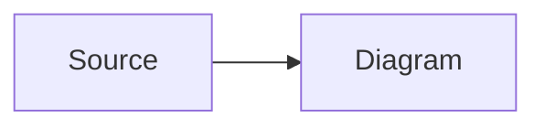
```mermaid
flowchart LR
    A[Source] --> B[Diagram]
```
````

```text
Markdown fence
    │
    ├── info string: mermaid
    │
    └── diagram-specific source
            ↓
       Mermaid parser
            ↓
        rendered SVG
```

The same text under a `text` fence is only source. Under a `mermaid` fence it becomes a specialized render surface.

### Gallery index

| # | Family | Purpose | M9 status |
| :---: | --- | --- | :---: |
| `1` | Flowchart | process / architecture / routing | ✅ live |
| `2` | Sequence | interactions over time | ✅ live |
| `3` | State | state machines | ✅ live |
| `4` | Class | object/type relationships | ✅ live |
| `5` | ER | data relationships | ✅ live |
| `6` | User Journey | scored user experience stages | ✅ live |
| `7` | Gantt | schedule / project timeline | ✅ live |
| `8` | Pie | proportional composition | ✅ live |
| `9` | GitGraph | branch / merge history | ✅ live |
| `10` | Mindmap | hierarchical ideation | ✅ live |
| `11` | Timeline | chronological narrative | ✅ live |
| `12` | Quadrant | two-axis positioning | ✅ live |
| `13` | Requirement | requirement traceability | ✅ live |
| `14` | Architecture | service/resource topology | ⚠️ v11.1+ canary |

---

### 18.2 — Flowchart laboratory

<details open>
<summary><strong>Flowchart — directions, shapes, labels, edge styles, subgraphs</strong></summary>

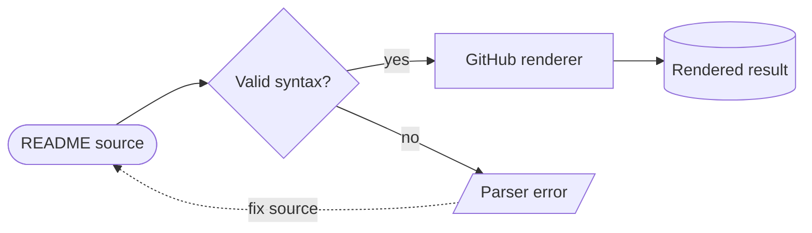
```mermaid
flowchart LR
    SRC([README source]) --> PARSE{Valid syntax?}
    PARSE -- yes --> GH[GitHub renderer]
    PARSE -- no --> ERR[/Parser error/]
    GH --> OUT[(Rendered result)]
    ERR -. fix source .-> SRC
```

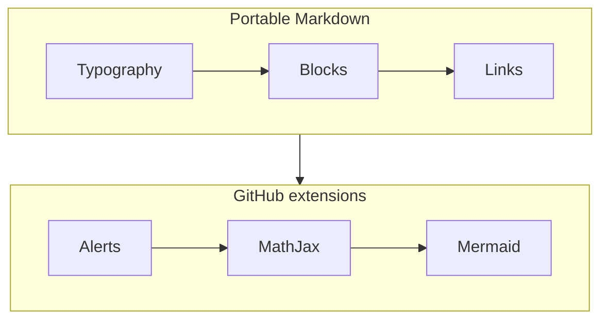
```mermaid
flowchart TB
    subgraph Core[Portable Markdown]
        A[Typography] --> B[Blocks]
        B --> C[Links]
    end
    subgraph Extensions[GitHub extensions]
        D[Alerts] --> E[MathJax]
        E --> F[Mermaid]
    end
    Core --> Extensions
```

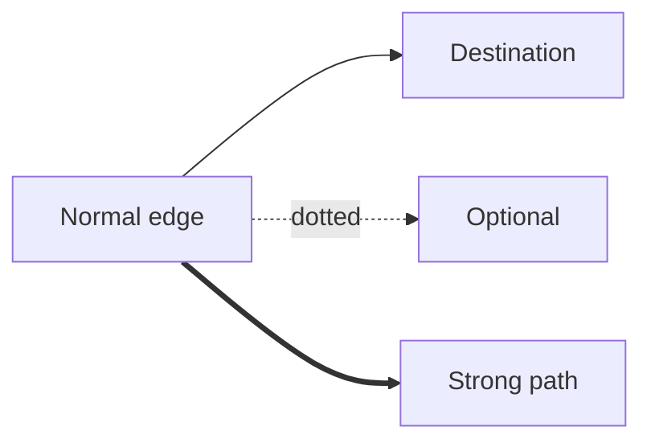
```mermaid
flowchart LR
    A[Normal edge] --> B[Destination]
    A -. dotted .-> C[Optional]
    A ==> D[Strong path]
```

> [!TIP]
> The gallery intentionally relies on Mermaid's default theme instead of hard-coded fill colors so GitHub can adapt diagrams more safely across light and dark themes.

</details>

---

### 18.3 — Sequence diagram

<details>
<summary><strong>Sequence — actors, participants, activation, loops, alternatives, notes</strong></summary>

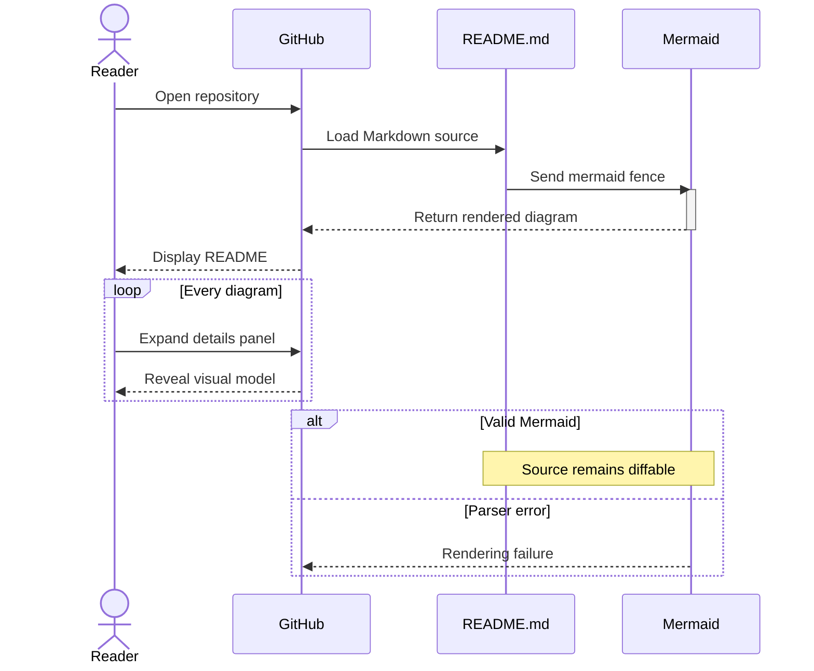
```mermaid
sequenceDiagram
    actor Reader
    participant GH as GitHub
    participant MD as README.md
    participant M as Mermaid

    Reader->>GH: Open repository
    GH->>MD: Load Markdown source
    MD->>M: Send mermaid fence
    activate M
    M-->>GH: Return rendered diagram
    deactivate M
    GH-->>Reader: Display README

    loop Every diagram
        Reader->>GH: Expand details panel
        GH-->>Reader: Reveal visual model
    end

    alt Valid Mermaid
        Note over MD,M: Source remains diffable
    else Parser error
        M-->>GH: Rendering failure
    end
```

</details>

---

### 18.4 — State diagram

<details>
<summary><strong>State — lifecycle and composite state</strong></summary>

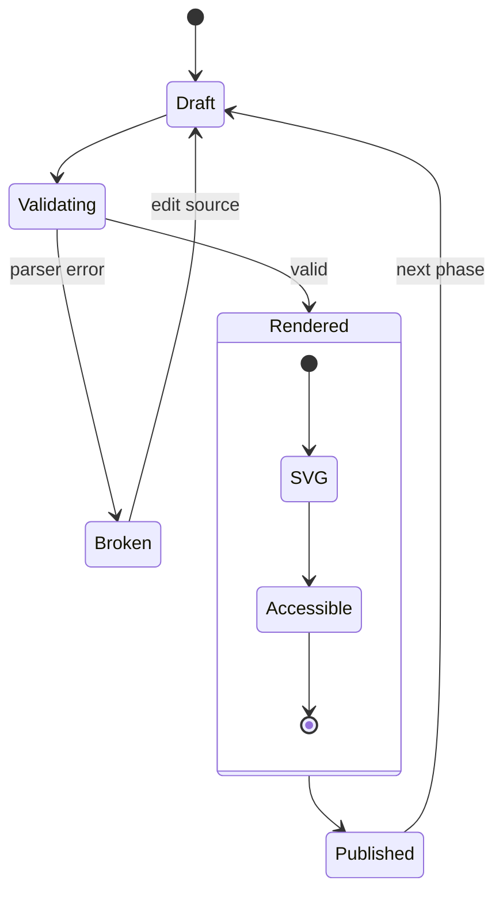
```mermaid
stateDiagram-v2
    [*] --> Draft
    Draft --> Validating
    Validating --> Broken: parser error
    Broken --> Draft: edit source
    Validating --> Rendered: valid
    Rendered --> Published
    Published --> Draft: next phase

    state Rendered {
        [*] --> SVG
        SVG --> Accessible
        Accessible --> [*]
    }
```

</details>

---

### 18.5 — Class diagram

<details>
<summary><strong>Class — fields, methods, inheritance, composition</strong></summary>

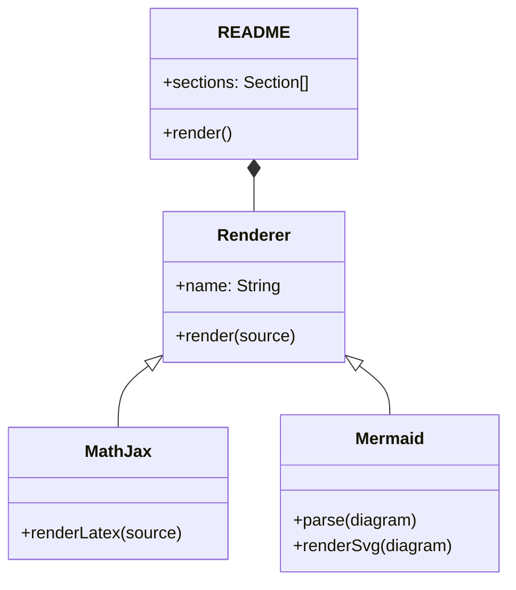
```mermaid
classDiagram
    class Renderer {
        +name: String
        +render(source)
    }
    class MathJax {
        +renderLatex(source)
    }
    class Mermaid {
        +parse(diagram)
        +renderSvg(diagram)
    }
    class README {
        +sections: Section[]
        +render()
    }

    Renderer <|-- MathJax
    Renderer <|-- Mermaid
    README *-- Renderer
```

</details>

---

### 18.6 — Entity relationship diagram

<details>
<summary><strong>ER — repository documentation model</strong></summary>

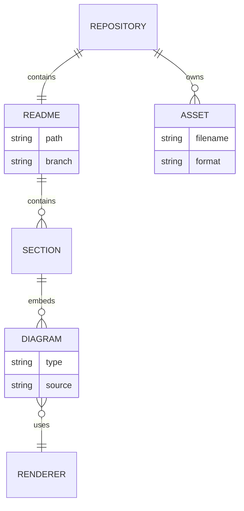
```mermaid
erDiagram
    REPOSITORY ||--|| README : contains
    REPOSITORY ||--o{ ASSET : owns
    README ||--o{ SECTION : contains
    SECTION ||--o{ DIAGRAM : embeds
    DIAGRAM }o--|| RENDERER : uses

    README {
        string path
        string branch
    }
    DIAGRAM {
        string type
        string source
    }
    ASSET {
        string filename
        string format
    }
```

</details>

---

### 18.7 — User journey

<details>
<summary><strong>User Journey — reading a maximally overengineered README</strong></summary>

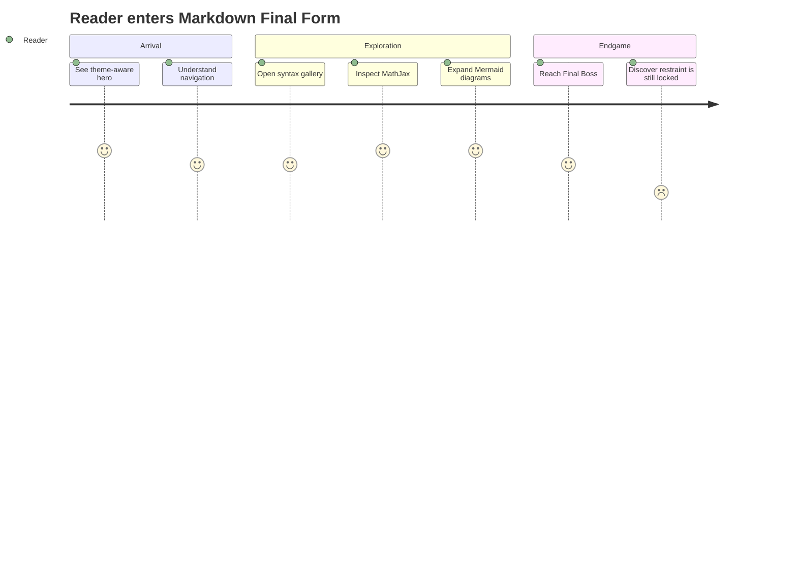
```mermaid
journey
    title Reader enters Markdown Final Form
    section Arrival
      See theme-aware hero: 5: Reader
      Understand navigation: 4: Reader
    section Exploration
      Open syntax gallery: 4: Reader
      Inspect MathJax: 5: Reader
      Expand Mermaid diagrams: 5: Reader
    section Endgame
      Reach Final Boss: 4: Reader
      Discover restraint is still locked: 2: Reader
```

</details>

---

### 18.8 — Gantt chart

<details>
<summary><strong>Gantt — phase progression</strong></summary>

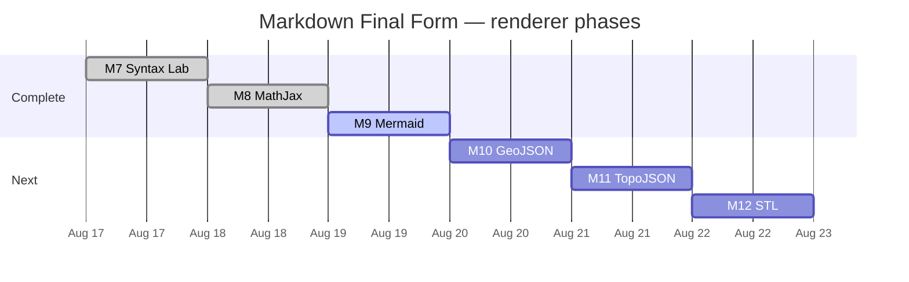
```mermaid
gantt
    title Markdown Final Form — renderer phases
    dateFormat  YYYY-MM-DD
    axisFormat  %b %d

    section Complete
    M7 Syntax Lab      :done, m7, 2026-08-17, 1d
    M8 MathJax         :done, m8, after m7, 1d
    M9 Mermaid         :active, m9, after m8, 1d

    section Next
    M10 GeoJSON        :m10, after m9, 1d
    M11 TopoJSON       :m11, after m10, 1d
    M12 STL            :m12, after m11, 1d
```

</details>

---

### 18.9 — Pie chart

<details>
<summary><strong>Pie — completely scientific README composition</strong></summary>

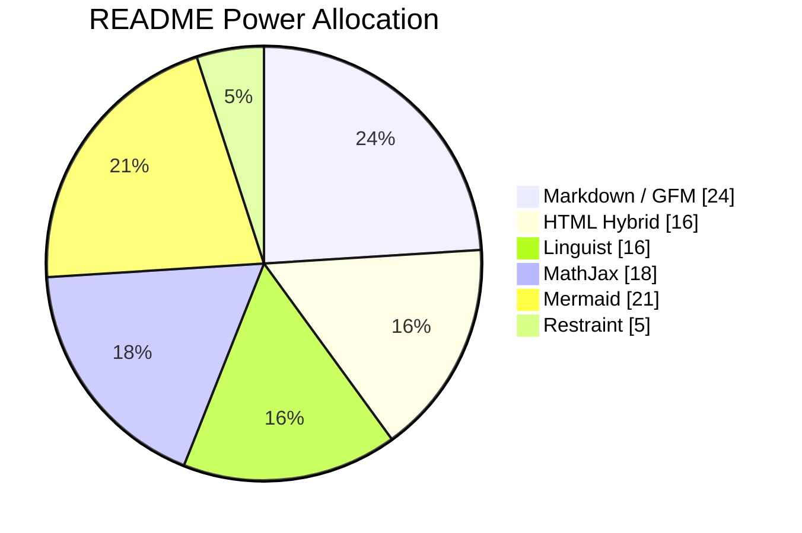
```mermaid
pie showData
    title README Power Allocation
    "Markdown / GFM" : 24
    "HTML Hybrid" : 16
    "Linguist" : 16
    "MathJax" : 18
    "Mermaid" : 21
    "Restraint" : 5
```

</details>

---

### 18.10 — GitGraph

<details>
<summary><strong>GitGraph — phase branch lineage</strong></summary>

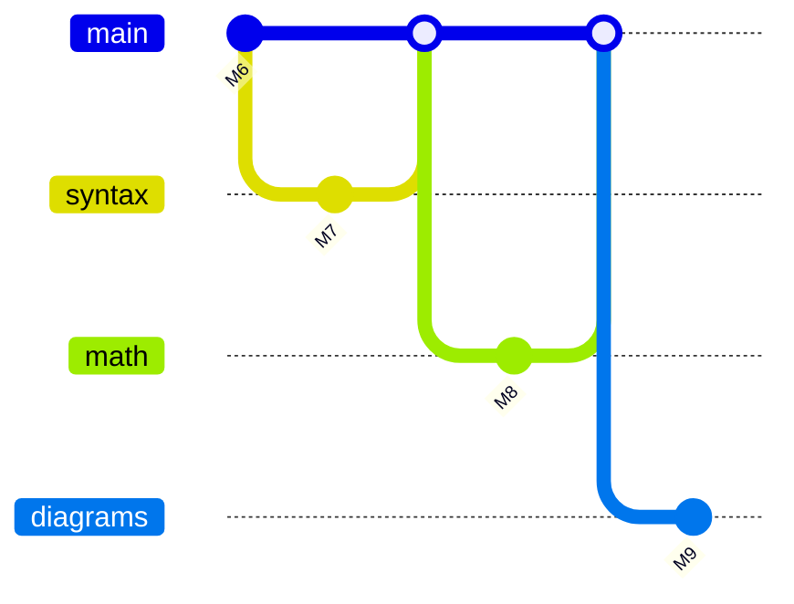
```mermaid
gitGraph
    commit id: "M6"
    branch syntax
    checkout syntax
    commit id: "M7"
    checkout main
    merge syntax
    branch math
    checkout math
    commit id: "M8"
    checkout main
    merge math
    branch diagrams
    checkout diagrams
    commit id: "M9"
```

> [!NOTE]
> This is a conceptual phase graph, not a literal reconstruction of every repository commit SHA.

</details>

---

### 18.11 — Mindmap

<details>
<summary><strong>Mindmap — README capability tree</strong></summary>

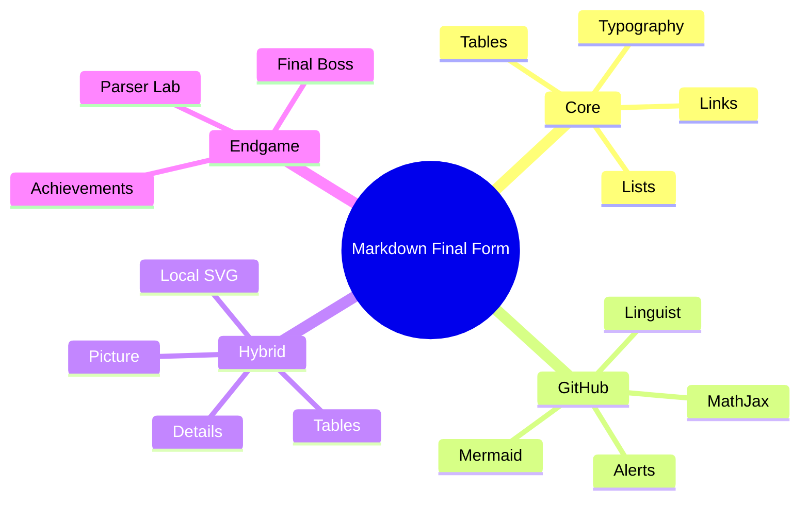
```mermaid
mindmap
  root((Markdown Final Form))
    Core
      Typography
      Lists
      Links
      Tables
    GitHub
      Alerts
      Linguist
      MathJax
      Mermaid
    Hybrid
      Details
      Picture
      Tables
      Local SVG
    Endgame
      Parser Lab
      Achievements
      Final Boss
```

</details>

---

### 18.12 — Timeline

<details>
<summary><strong>Timeline — renderer evolution</strong></summary>

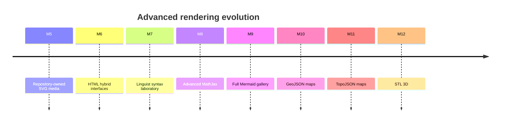
```mermaid
timeline
    title Advanced rendering evolution
    M5 : Repository-owned SVG media
    M6 : HTML hybrid interfaces
    M7 : Linguist syntax laboratory
    M8 : Advanced MathJax
    M9 : Full Mermaid gallery
    M10 : GeoJSON maps
    M11 : TopoJSON maps
    M12 : STL 3D
```

</details>

---

### 18.13 — Quadrant chart

<details>
<summary><strong>Quadrant — documentation choices by complexity and visual payoff</strong></summary>

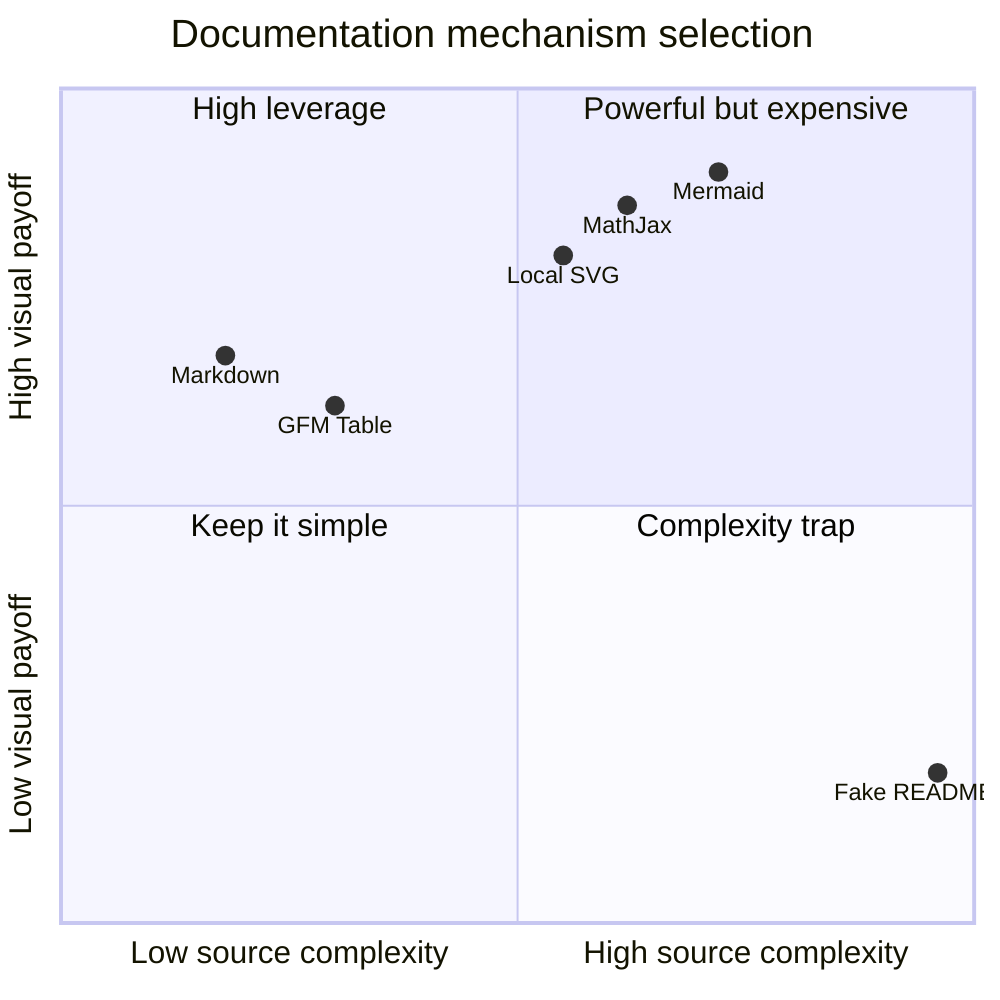
```mermaid
quadrantChart
    title Documentation mechanism selection
    x-axis Low source complexity --> High source complexity
    y-axis Low visual payoff --> High visual payoff
    quadrant-1 Powerful but expensive
    quadrant-2 High leverage
    quadrant-3 Keep it simple
    quadrant-4 Complexity trap
    Markdown: [0.18, 0.68]
    GFM Table: [0.30, 0.62]
    Local SVG: [0.55, 0.80]
    MathJax: [0.62, 0.86]
    Mermaid: [0.72, 0.90]
    Fake README App: [0.96, 0.18]
```

</details>

---

### 18.14 — Requirement diagram

<details>
<summary><strong>Requirement — traceability from source to rendered result</strong></summary>

```mermaid
requirementDiagram
    requirement readable_source {
        id: REQ-1
        text: README source stays understandable
        risk: medium
        verifymethod: inspection
    }

    requirement github_render {
        id: REQ-2
        text: Diagram renders on GitHub
        risk: high
        verifymethod: test
    }

    element mermaid_block {
        type: documentation
        docref: README.md
    }

    mermaid_block - satisfies -> readable_source
    mermaid_block - verifies -> github_render
```

</details>

---

### 18.15 — Architecture v11.1+ compatibility canary

<details>
<summary><strong>Architecture — modern Mermaid compatibility canary</strong></summary>

Mermaid documents Architecture diagrams as a **v11.1+** family. GitHub documents Mermaid rendering but does not promise a specific bundled Mermaid version, so this panel is deliberately treated as a compatibility canary rather than critical navigation.

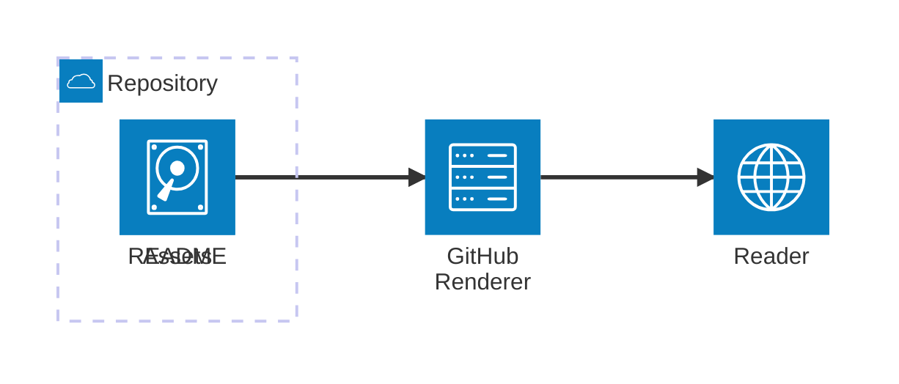
```mermaid
architecture-beta
    group repo(cloud)[Repository]

    service readme(server)[README] in repo
    service assets(disk)[Assets] in repo
    service github(server)[GitHub Renderer]
    service reader(internet)[Reader]

    readme:R --> L:github
    assets:R --> L:github
    github:R --> L:reader
```

If GitHub's Mermaid bundle does not support `architecture-beta`, the rest of the README remains functional and this single panel identifies the compatibility gap.

</details>

---

### 18.16 — Modern Mermaid capability shelf

Current Mermaid documentation contains additional families beyond the conservative M9 live set, including newer chart types such as Sankey, XY, Block, Packet, Kanban, Radar, Treemap, Venn, and others.

| Family | Upstream Mermaid status | README strategy |
| --- | --- | --- |
| Architecture | v11.1+ | live compatibility canary |
| Sankey | modern | source-only candidate until GitHub version is confirmed |
| XY Chart | modern | source-only candidate |
| Block Diagram | modern | source-only candidate |
| Packet | modern | source-only candidate |
| Kanban | modern | source-only candidate |
| Radar | modern | source-only candidate |
| Treemap | modern | source-only candidate |
| Venn | modern | source-only candidate |

> [!IMPORTANT]
> “Mermaid supports it” and “GitHub's current Mermaid bundle supports it” are not identical claims. M9 does not make version-sensitive upstream syntax part of critical README infrastructure.

---

### 18.17 — Label and parser laboratory

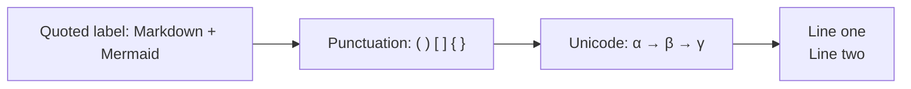
```mermaid
flowchart LR
    A["Quoted label: Markdown + Mermaid"] --> B["Punctuation: ( ) [ ] { }"]
    B --> C["Unicode: α → β → γ"]
    C --> D["Line one<br/>Line two"]
```

Source-only failure examples stay inert:

````text
```mermaid
flowchart LR
    A[Unclosed label --> B
```

```mermaid
sequenceDiagram
    Alice->>Bob this relationship is malformed
```
````

> [!CAUTION]
> Parser-failure demonstrations belong in `text` fences. A deliberately broken live Mermaid block would make the README look accidentally broken rather than educational.

---

### 18.18 — Mermaid inside `<details>`

Every major diagram in this gallery is itself proof that Mermaid can coexist with the M6 disclosure system. The HTML container controls visibility; the fenced `mermaid` block still owns the diagram source.

```text
<details>
  ↓
Markdown parser
  ↓
mermaid fence
  ↓
Mermaid renderer
  ↓
SVG diagram revealed on demand
```

---

### 18.19 — Mermaid vs code highlighting

````text
```mermaid  → specialized Mermaid renderer → diagram
```text     → literal source presentation   → characters
```yaml     → Linguist grammar              → highlighted source
```math     → MathJax renderer              → mathematics
````

This is the central advanced-rendering distinction of the project: identical fenced-block mechanics can route source into fundamentally different renderers depending on the info string.

---

### 18.20 — Mermaid Final Form

<details open>
<summary><strong>DIAGRAM FINAL FORM — renderer map</strong></summary>

```mermaid
flowchart TB
    SRC[README.md source]

    SRC --> MD[Markdown]
    MD --> GFM[GFM]
    GFM --> GH[GitHub]

    GH --> L[Linguist]
    GH --> MJ[MathJax]
    GH --> MM[Mermaid]
    GH --> HTML[Sanitized HTML]

    L --> OUT[Rendered document]
    MJ --> OUT
    MM --> OUT
    HTML --> OUT

    MM --> F[Flowcharts]
    MM --> S[Sequences]
    MM --> ST[States]
    MM --> C[Classes]
    MM --> ER[ER models]
    MM --> T[Timelines / Gantt]
    MM --> G[GitGraph]
    MM --> R[Requirements]
```

```mermaid
sequenceDiagram
    actor Author
    participant Source as README.md
    participant GitHub
    participant Mermaid
    participant Reader

    Author->>Source: Commit diagram text
    Source->>GitHub: Markdown render
    GitHub->>Mermaid: Parse mermaid fence
    Mermaid-->>GitHub: SVG
    GitHub-->>Reader: Rendered visual
    Reader->>Source: Inspect raw source
    Source-->>Reader: Diffable model
```

</details>

### M9 renderer rule

```text
Need a visual model?
├── mathematical notation → MathJax
├── relationship / process / timeline → Mermaid
├── geographic geometry → GeoJSON / TopoJSON (M10–M11)
├── 3D geometry → STL (M12)
└── static art / brand graphic → repository-owned SVG
```

---

# ACT VI — PARSER & SOURCE LAB

## LEVEL 19 — ESCAPE HATCH

`Markdown` · `Parser`

\# Not a heading  
\> Not a quote  
\- Not a list  
1\. Not an ordered list  
\*Not emphasis\*

| Literal | Source |
| :---: | :---: |
| `*` | `\*` |
| `_` | `\_` |
| `#` | `\#` |
| `>` | `\>` |
| `|` | `\|` |
| `$` | `\$` where needed around math parsing |
| `\` | `\\` |

---

## LEVEL 20 — BACKTICK PARADOX

`Markdown` · `Parser`

``Use a `backtick` inside code``

````markdown
```javascript
console.log("Three backticks live inside four.");
```
````

````markdown
```mermaid
flowchart LR
    A --> B
```
````

---

## LEVEL 21 — DELIMITER COLLISION LAB

`Markdown` · `GFM` · `MathJax` · `Mermaid`

```text
$          → possible MathJax delimiter
`          → code delimiter / protected math boundary
```mermaid → specialized diagram routing metadata
```math    → specialized mathematics routing metadata
_          → Markdown emphasis or math subscript by context
*          → Markdown emphasis or literal token by context
```

The string `` ```mermaid `` is meaningful only when it appears as an actual opening fence. Inside inline code or a longer outer fence, it is merely characters.

---

## LEVEL 22 — ENTITY REACTOR

`Markdown` · `HTML`

| Source | Rendered |
| --- | :---: |
| `&copy;` | &copy; |
| `&rarr;` | &rarr; |
| `&times;` | &times; |
| `&ne;` | &ne; |
| `&infin;` | &infin; |
| `&#169;` | &#169; |
| `&#xA9;` | &#xA9; |

&lt;div&gt;not an HTML element&lt;/div&gt;

---

## LEVEL 23 — WHITESPACE & RECURSION CHAMBER

`Markdown` · `Parser`

````markdown
```markdown
**Markdown shown inside Markdown shown inside Markdown.**
```
````

````markdown
```math
\sum_{k=1}^{n}k=\frac{n(n+1)}2
```
````

````markdown
```mermaid
flowchart LR
    Source --> Render
```
````

<!--
Future maintainers:
Nested fences, Mermaid identifiers, math delimiters, literal-dollar escapes,
reference definitions, relative media paths, and details blank lines are intentional.
-->

---

# ACT VII — ENDGAME & REFERENCE

## 🏅 ACHIEVEMENTS UNLOCKED

<p align="center">
  
  
  
  
</p>

| Achievement | Requirement | Status |
| --- | --- | :---: |
| **Syntax Curator** | Retain 33 syntax modes | ✅ |
| **MathJax Architect** | Preserve advanced mathematics | ✅ |
| **Mermaid Cartographer** | Build multi-family Mermaid gallery | ✅ |
| **Flow Commander** | Directions, shapes, subgraphs, edge variants | ✅ |
| **Sequence Oracle** | Actors, loops, alternatives, notes | ✅ |
| **State Keeper** | State lifecycle + composite state | ✅ |
| **Class Architect** | Inheritance + composition | ✅ |
| **Schema Weaver** | ER relationships and attributes | ✅ |
| **Timeline Keeper** | Gantt + timeline + journey | ✅ |
| **Graph Necromancer** | GitGraph branch/merge visualization | ✅ |
| **Requirement Tracekeeper** | Requirement diagram traceability | ✅ |
| **Compatibility Canary** | Isolate version-sensitive architecture diagram | ✅ |
| **Diagram Router** | Distinguish Mermaid, Linguist, MathJax, SVG | ✅ |
| **Parser Tamer** | Keep broken Mermaid examples inert | ✅ |
| **Master of Restraint** | Stop before every experimental Mermaid type | ❌ |

---

## THE CHAOS INDEX

```text
Clarity          ████████████████████ 100%
Structure        ████████████████████ 100%
Typography       ████████████████████ 100%
Lists / Tables   ████████████████████ 100%
Links            ████████████████████ 100%
Local Media      ████████████████████ 100%
HTML Hybrid      ████████████████████ 100%
Syntax Labels    ████████████████████ 100%
Language Breadth ████████████████████  33 modes
MathJax          ████████████████████ 100%
Mermaid Core     ████████████████████ 100%
Diagram Families ████████████████████  14 shown
Renderer Routing ████████████████████ 100%
Parser Tricks    ███████████████████░  95%
Restraint        ██░░░░░░░░░░░░░░░░░░  10%
Raw Power        ████████████████████  M9
```

> [!WARNING]
> Diagrams can make bad system models look very official.
>
> **M9 demonstrates renderer breadth and source structure; visual polish does not guarantee that the modeled architecture is correct.**

---

## 🧰 THE ACTUALLY USEFUL CHEAT SHEET

``````markdown
# Heading
*italic* **bold** ~~strike~~ `code`

[inline](https://example.com)
[reference][docs]
[relative](./README.md)
[same document](#final-boss)

Inline math: $E=mc^2$
Protected math: $`x_i^2`$

```math
\int_0^1 x^2\,dx=\frac13
```

```mermaid
flowchart LR
    A[Source] --> B[Rendered diagram]
```

```mermaid
sequenceDiagram
    Alice->>Bob: Message
```

```mermaid
stateDiagram-v2
    [*] --> Ready
    Ready --> [*]
```

```python
print("highlighted code")
```

```text
literal output
```

````markdown
```mermaid
flowchart LR
    A --> B
```
````

<details>
<summary>Collapsed renderer</summary>

```mermaid
flowchart LR
    Source --> Render
```

</details>


<kbd>Ctrl</kbd> + <kbd>K</kbd>

- [x] Complete
- [ ] Incomplete

| Left | Center | Right |
| :--- | :---: | ---: |
| alpha \| beta | $x^2$ | 100 |
``````

[docs]: https://example.com/docs

---

## 🧯 COMMON README CRIMES

| Crime | Consequence |
| --- | --- |
| Using `text` when you expected a diagram | Mermaid source stays literal |
| Misspelling `mermaid` info string | specialized renderer never starts |
| Deliberately broken live Mermaid | README looks accidentally broken |
| Extremely long labels | diagrams become mobile-hostile |
| Hard-coded diagram colors everywhere | poor light/dark resilience |
| Assuming upstream latest Mermaid == GitHub bundle | version-sensitive diagrams can fail |
| Treating architecture canary as critical navigation | one version gap breaks core UX |
| Using diagrams where a two-row table is clearer | visual complexity without information gain |
| Forgetting longer outer fences | source demonstrations terminate themselves |
| Confusing `latex` with `math` | highlighting is mistaken for rendering |

---

## 🧪 README QUALITY TEST

- [ ] Flowchart renders with multiple edge styles and subgraphs.
- [ ] Sequence diagram renders loops, alt branches, and notes.
- [ ] State diagram renders its composite state.
- [ ] Class inheritance/composition arrows render correctly.
- [ ] ER cardinalities and attributes remain readable.
- [ ] Journey scores display coherently.
- [ ] Gantt dates/tasks remain legible.
- [ ] Pie labels remain readable in light and dark themes.
- [ ] GitGraph branch/merge sequence renders.
- [ ] Mindmap does not overflow badly on mobile.
- [ ] Timeline remains horizontally usable.
- [ ] Quadrant points and axis labels render.
- [ ] Requirement relationships render.
- [ ] Architecture canary is checked against GitHub's current Mermaid bundle.
- [ ] Broken Mermaid examples remain inside non-Mermaid source fences.
- [ ] All Mermaid galleries open and close independently.
- [ ] MathJax examples still render.
- [ ] 33 Linguist modes remain represented.
- [ ] Theme-aware local hero still switches correctly.
- [ ] Nested fences remain balanced.
- [ ] README is previewed on GitHub before release.

---

# FINAL BOSS

<picture>
  <source media="(prefers-color-scheme: dark)" srcset="./assets/hero-dark.svg">
  <source media="(prefers-color-scheme: light)" srcset="./assets/hero-light.svg">
  
</picture>

<details open>
<summary><strong>FINAL FORM — ADVANCED RENDERER NETWORK</strong></summary>

```mermaid
flowchart TB
    README[README.md]

    README --> CORE[Markdown + GFM]
    CORE --> LINKS[Links / Tables / Tasks]
    CORE --> GH[GitHub extensions]

    GH --> CODE[Linguist]
    GH --> MATH[MathJax]
    GH --> DIAGRAM[Mermaid]
    GH --> HYBRID[Sanitized HTML]

    DIAGRAM --> FLOW[Flowchart]
    DIAGRAM --> SEQ[Sequence]
    DIAGRAM --> MODEL[State / Class / ER]
    DIAGRAM --> TIME[Gantt / Timeline / Journey]
    DIAGRAM --> GRAPH[GitGraph / Mindmap]
    DIAGRAM --> SPEC[Quadrant / Requirements]

    CODE --> FINAL[FINAL FORM]
    MATH --> FINAL
    DIAGRAM --> FINAL
    HYBRID --> FINAL
```

```math
\boxed{
\text{Markdown}
+\text{GFM}
+\text{Linguist}
+\text{MathJax}
+\text{Mermaid}
+\text{HTML}
=\text{M9}
}
```

<details>
<summary><strong>Inspect the renderer stack as source</strong></summary>

```text
SOURCE
├── ordinary Markdown
├── fenced code → Linguist
├── math delimiters / math fence → MathJax
├── mermaid fence → Mermaid
├── HTML fragments → sanitizer
├── GeoJSON → M10
├── TopoJSON → M11
└── STL → M12
```

</details>

</details>

<div align="center">

<p>
  Markdown owns the document.<br>
  Renderer metadata chooses the visual system.<br>
  MathJax typesets notation.<br>
  Mermaid turns relationships into diagrams.<br>
  The raw source remains reviewable underneath all of it.
</p>

<a href="https://docs.github.com/en/get-started/writing-on-github/working-with-advanced-formatting/creating-diagrams"></a>
<a href="https://mermaid.js.org/"></a>
<a href="#"></a>

<h2>Markdown: Final Form.</h2>
<h3>Mermaid diagram layer unlocked.</h3>

</div>

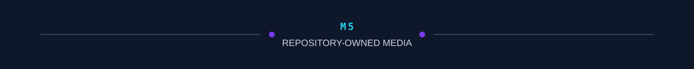

---

[markdown-guide]: https://www.markdownguide.org/ "Markdown Guide"
[GitHub Docs]: https://docs.github.com/en/get-started/writing-on-github "GitHub writing and formatting documentation"
[GFM Spec]: https://github.github.com/gfm/ "GitHub Flavored Markdown specification"

[^plain-text]: Markdown remains readable as plain text while adding lightweight structural syntax.
[^relative-links]: Relative repository paths keep files and media branch-aware.
[^sanitization]: GitHub sanitizes rendered README HTML, so arbitrary application-style script and styling are not the interface model.
[^linguist]: GitHub Linguist defines languages and aliases used for syntax highlighting in fenced code blocks.
[^mathjax]: GitHub renders supported LaTeX-formatted mathematics in Markdown using MathJax.
[^mermaid]: GitHub documents Mermaid as one of its advanced diagram syntaxes and renders Mermaid source from fenced `mermaid` blocks in Markdown files.