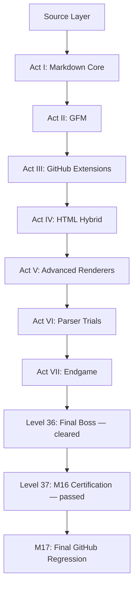
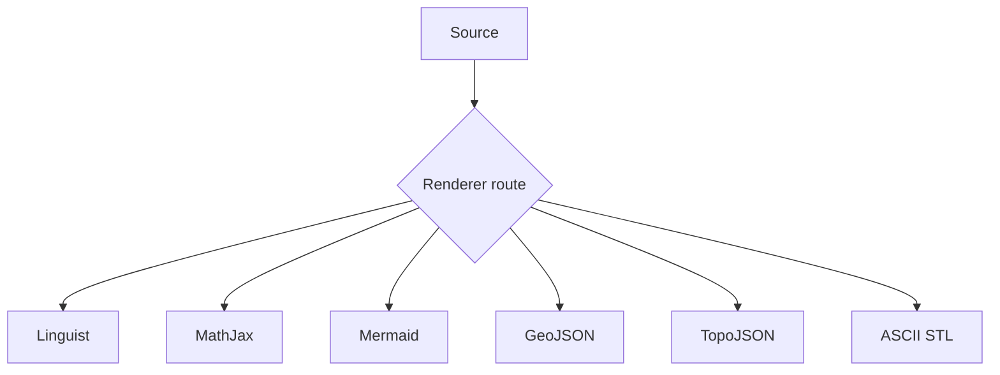
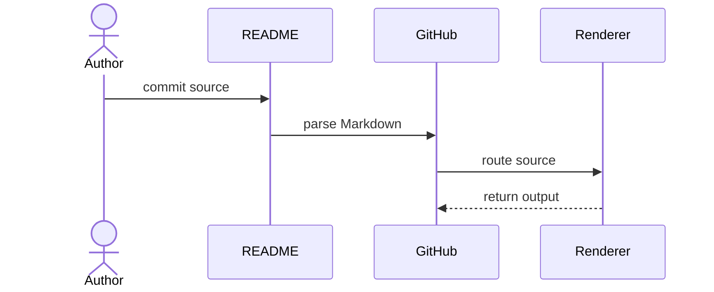
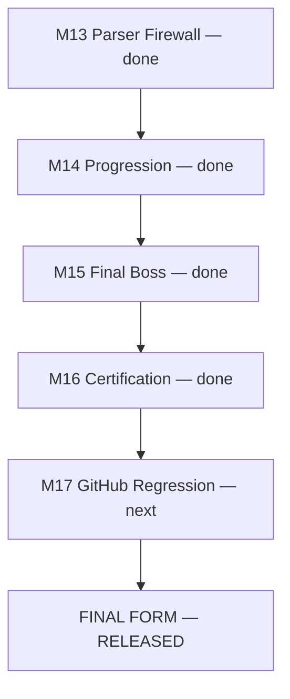
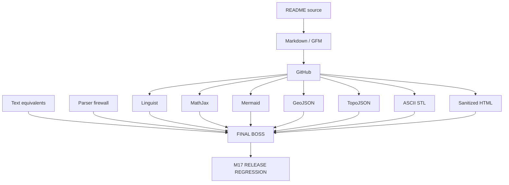

<!--
╔══════════════════════════════════════════════════════════════════════════════╗
║                      LEVEL 00: SOURCE LAYER — M16                           ║
║                                                                              ║
║  RAW SOURCE EXPLORER · PARSER TAMER · BLOCK ARCHITECT · LINK CARTOGRAPHER   ║
║  MEDIA ENGINEER · HYBRID ENGINEER · SYNTAX CURATOR · MATHJAX ARCHITECT      ║
║  MERMAID CARTOGRAPHER · GEOJSON NAVIGATOR · TOPOLOGY ENGINEER               ║
║  STL MESHSMITH · GRAMMAR BREAKER · PROGRESSION ARCHITECT · FINAL COMPOSER   ║
║  ACCESSIBILITY WARDEN                                                       ║
║                                                                              ║
║  M16 invariant: visual rendering is never the only path to information.      ║
║  Theme, motion, width, and interaction failures must have readable fallback. ║
╚══════════════════════════════════════════════════════════════════════════════╝
-->

<!--
SECRET ACHIEVEMENTS — SOURCE VIEW ONLY

[S1] RAW SOURCE EXPLORER
     Condition: inspect README source instead of only rendered output.
     Status: unlocked.

[S2] COMMENT ARCHAEOLOGIST
     Condition: find a phase invariant inside an HTML comment.
     Status: unlocked.

[S3] THE SOURCE IS THE UI
     Condition: understand that renderer routing is encoded in Markdown source.
     Status: unlocked.

[S4] NO NEW MECHANICS
     Condition: reach M15 without introducing another renderer family.
     Status: unlocked.

[S5] MOTION TAMER
     Condition: remove autoplaying decorative animation from the critical path.
     Status: unlocked in M16.

[S6] MASTER OF RESTRAINT
     Condition: stop adding unnecessary systems.
     Status: still locked while M17 remains.
-->

<picture>
  <source media="(prefers-color-scheme: dark)" srcset="./assets/hero-dark.svg">
  <source media="(prefers-color-scheme: light)" srcset="./assets/hero-light.svg">
  
</picture>

<div align="center">

<a href="#campaign-status"></a>
<a href="#m16-certification"></a>
<a href="#release-gates"></a>

</div>

# MARKDOWN: FINAL FORM

**One README · seven Acts · thirty-eight numbered levels · six specialized renderer routes · one canonical Final Boss · one release gate remaining.**

[Campaign](#campaign-status) · [Core](#act-i--markdown-core) · [Renderers](#act-v--advanced-rendering) · [Parser Trials](#act-vi--parser-trials) · [Achievements](#achievement-codex) · [Final Boss](#final-boss) · [M16 Certification](#m16-certification)

> [!IMPORTANT]
> **M16 adds no renderer or syntax family.** It certifies the existing M15 composition at the document level for light/dark presentation, motion sensitivity, narrow screens, semantic structure, text alternatives, and failure-tolerant interaction. Final live GitHub rendering regression remains explicitly owned by M17.

<a name="campaign-status"></a>

## CAMPAIGN STATUS

| Metric | Current state | Meaning |
| --- | :---: | --- |
| Campaign | **17 / 18** | M0 through M16 complete |
| Showcase mastery | **100 / 100** | planned capability breadth exists |
| Specialized routes | **6 / 6** | Linguist, MathJax, Mermaid, GeoJSON, TopoJSON, ASCII STL |
| Final Boss | **cleared** | M15 composition complete |
| M16 certification | **passed** | document-level theme/mobile/accessibility hardening complete |
| M17 release regression | **pending** | final live GitHub verification and release polish |

```text
M0 ─ M1 ─ M2 ─ M3 ─ M4 ─ M5 ─ M6 ─ M7 ─ M8 ─ M9 ─ M10 ─ M11 ─ M12 ─ M13 ─ M14 ─ M15 ─ M16 ─ M17
✓    ✓    ✓    ✓    ✓    ✓    ✓    ✓    ✓    ✓     ✓     ✓     ✓     ✓     ✓     ✓     ✓     NEXT
```

### Scoreboards

```text
SHOWCASE MASTERY
████████████████████ 100 / 100

RELEASE CONFIDENCE
██████████████████░░  91 / 100
```

The M16 score remains auditable:

```text
25% Capability Index  (100)
45% Robustness Index   (93)
30% Endgame completion (80)

0.25×100 + 0.45×93 + 0.30×80 = 90.85 → 91
```

The remaining nine points belong to the final live GitHub regression rather than another feature pass.

---

## THE CAMPAIGN MAP

**Text equivalent:** Source Layer → Markdown Core → GFM → GitHub Extensions → HTML Hybrid → Advanced Renderers → Parser Trials → Endgame → Final Boss → M16 Certification → M17 Release.


```mermaid
flowchart TB
    S[Source Layer] --> A1[Act I: Markdown Core]
    A1 --> A2[Act II: GFM]
    A2 --> A3[Act III: GitHub Extensions]
    A3 --> A4[Act IV: HTML Hybrid]
    A4 --> A5[Act V: Advanced Renderers]
    A5 --> A6[Act VI: Parser Trials]
    A6 --> A7[Act VII: Endgame]
    A7 --> B[Level 36: Final Boss — cleared]
    B --> C[Level 37: M16 Certification — passed]
    C --> R[M17: Final GitHub Regression]
```

| Stage | Boss / gate | Status |
| --- | --- | :---: |
| Source | Source Gate | ✅ |
| Act I | Core Grammar | ✅ |
| Act II | Pipe & Task Engine | ✅ |
| Act III | Extension Router | ✅ |
| Act IV | Sanitizer Survivor | ✅ |
| Act V | Renderer Gauntlet | ✅ |
| Act VI | Parser Firewall | ✅ |
| Act VII | Progression Architect | ✅ |
| Final composition | Canonical Final Boss | ✅ |
| M16 | Accessibility / Mobile / Theme | ✅ |
| M17 | Release Gate | **NEXT** |

---

## LEVEL 00 — SOURCE LAYER

`HTML comment` · `source-only` · `secret progression`

```html
<!-- Rendered output cannot show everything the source knows. -->
```

The source layer owns invariants, hidden achievements, exact parser fixtures, and comments that intentionally disappear from rendered view.

Raw parser corpus: [`assets/parser-torture-corpus.txt`](./assets/parser-torture-corpus.txt)

> [!NOTE]
> Source-only rewards are optional. No essential instruction or status exists only inside a hidden comment.

---

<a name="act-i--markdown-core"></a>

## ACT I — MARKDOWN CORE

### LEVEL 01 — TYPOGRAPHY

| Source | Rendered |
| --- | --- |
| `*italic*` | *italic* |
| `_italic_` | _italic_ |
| `**strong**` | **strong** |
| `__strong__` | __strong__ |
| `***both***` | ***both*** |
| `~~deleted~~` | ~~deleted~~ |
| `` `code` `` | `code` |
| `<sub>2</sub>` | H<sub>2</sub>O |
| `<sup>2</sup>` | x<sup>2</sup> |
| `<ins>new</ins>` | <ins>new</ins> |

**Strong containing _emphasis containing `code`_.**

Intraword control: `foo*bar*baz` versus `foo_bar_baz`.

### LEVEL 02 — HEADINGS / BREAKS

M16 keeps the document itself on a single-H1 hierarchy. The full heading syntax remains demonstrable without inserting extra top-level headings into the accessibility tree:

```markdown
# H1
## H2
### H3
#### H4
##### H5
###### H6

Setext One
==========

Setext Two
----------
```

Two trailing spaces create a hard break.  
This line follows.

A backslash also creates one.\
This line follows.

### LEVEL 03 — CONTAINERS

1. Ordered list
   - nested bullet
     - [x] nested task

> Blockquote
>
> - list inside quote
> - `code`

```text
ordinary fenced block
```

### LEVEL 04 — LINKS / REFERENCES

[Inline example](https://example.com) · [Markdown Guide][markdown-guide] · [GitHub writing documentation][GitHub Docs] · [GFM specification][GFM Spec]

[Open this README](./README.md) · [Open parser corpus](./assets/parser-torture-corpus.txt) · [Go to Final Boss](#final-boss)

<https://github.com/>  
https://github.com  
www.github.com

#### ACT I BOSS — CORE GRAMMAR

**Victory condition:** headings, inline formatting, lists, quotes, code, links, references, and breaks coexist while the document keeps one primary H1.

---

## ACT II — GITHUB FLAVORED MARKDOWN

### LEVEL 05 — TABLE ENGINE

| Left | Center | Right |
| :--- | :---: | ---: |
| alpha | beta | 100 |
| alpha \| beta | `left\|right` | 200 |
| **formatting** | $x^2$ | 300 |

> [!TIP]
> M16 keeps critical tables narrow. Large cross-product matrices belong in collapsed source/code or vertical lists rather than forcing a wide mobile viewport.

### LEVEL 06 — TASK TREE

- [x] Markdown Core
- [x] GFM
- [x] GitHub Extensions
- [x] HTML Hybrid
- [x] 33-mode Linguist museum
- [x] MathJax
- [x] Mermaid
- [x] GeoJSON
- [x] TopoJSON
- [x] ASCII STL
- [x] Parser torture
- [x] M14 progression overhaul
- [x] M15 canonical Final Boss
- [x] **M16 light/dark/mobile/accessibility certification**
- [ ] M17 final GitHub release regression

#### ACT II BOSS — PIPE & TASK ENGINE

**Victory condition:** tables preserve escaped pipes, tasks remain readable without color, and critical status is always written in text.

---

<a name="act-iii--github-extensions"></a>

## ACT III — GITHUB EXTENSIONS

### LEVEL 07 — ALERT COMMAND CENTER

> [!NOTE]
> Capability completion and release certification are separate states.

> [!TIP]
> Source-first renderers are easiest to debug when their raw input remains inspectable.

> [!IMPORTANT]
> M16 is complete. M17 is the final release gate.

> [!WARNING]
> A renderer displaying something is not proof that the source is semantically correct.

> [!CAUTION]
> Intentionally malformed examples stay inside ordinary source fences.

### LEVEL 08 — LINGUIST SYNTAX MUSEUM

The 33-mode inventory stays collapsed by category so mobile readers do not scroll through an unavoidable code wall.

<details>
<summary><strong>Web / data / markup — 9 languages</strong></summary>

```javascript
console.log("JavaScript");
```
```typescript
const phase: number = 16;
```
```html
<details><summary>HTML</summary></details>
```
```css
.readme { display: block; }
```
```json
{"phase":"M16"}
```
```yaml
phase: M16
```
```toml
phase = "M16"
```
```xml
<phase>M16</phase>
```
```sql
SELECT 'M16';
```

</details>

<details>
<summary><strong>Compiled / systems — 8 languages</strong></summary>

```c
int main(void){return 0;}
```
```cpp
#include <iostream>
int main(){std::cout << "C++";}
```
```rust
fn main(){println!("Rust");}
```
```go
package main
func main(){}
```
```java
class Main { public static void main(String[] a){} }
```
```csharp
Console.WriteLine("C#");
```
```kotlin
fun main() = println("Kotlin")
```
```swift
print("Swift")
```

</details>

<details>
<summary><strong>Scripting / scientific / functional — 11 languages</strong></summary>

```python
print("Python")
```
```ruby
puts "Ruby"
```
```php
<?php echo "PHP";
```
```lua
print("Lua")
```
```bash
printf '%s\n' Bash
```
```powershell
Write-Output 'PowerShell'
```
```r
print(pi)
```
```julia
println(pi)
```
```haskell
main = print pi
```
```scala
@main def run() = println(math.Pi)
```
```latex
\int_0^1 x^2\,dx
```

</details>

<details>
<summary><strong>Infrastructure / documentation / literal — 5 modes</strong></summary>

```dockerfile
FROM alpine:3.22
```
```markdown
# Markdown
```
```diff
- animation in the critical hero
+ static accessible certification hero
```
```text
plaintext
```
```ini
[readme]
phase=M16
```

</details>

**Inventory:** 9 + 8 + 11 + 5 = **33 modes**.

### LEVEL 09 — FOOTNOTES

GitHub uses Linguist for fenced syntax.[^linguist] GitHub renders mathematics with MathJax.[^mathjax] GitHub supports Mermaid, GeoJSON, TopoJSON, and ASCII STL specialized routes.[^github-diagrams]

Repeated reference one.[^repeat] Repeated reference two.[^repeat]

#### ACT III BOSS — EXTENSION ROUTER

**Victory condition:** alerts, syntax routing, footnotes, and autolinks remain understandable without badge color or animation.

---

## ACT IV — HTML HYBRID

### LEVEL 10 — REPOSITORY MEDIA

GitHub documents `<picture>` plus `prefers-color-scheme` for responsive light/dark README imagery, including a default `` fallback and alt text.[^theme-picture]

<picture>
  <source media="(prefers-color-scheme: dark)" srcset="./assets/hero-dark.svg">
  <source media="(prefers-color-scheme: light)" srcset="./assets/hero-light.svg">
  
</picture>


<a href="#final-boss"></a>

> [!NOTE]
> The autoplaying external typing SVG previously embedded in the hero is no longer loaded. Its animation could not be controlled by this README with a reduced-motion preference, and it carried no unique information.

### LEVEL 11 — INLINE HTML SEMANTICS

Press <kbd>Ctrl</kbd> + <kbd>K</kbd>.  
H<sub>2</sub>O · x<sup>2</sup> · <ins>inserted</ins> · <del>deleted</del> · <s>obsolete</s>

### LEVEL 12 — DETAILS INTERFACE

Critical status is never hidden only inside a disclosure. `<details>` is used for optional depth.

<details>
<summary><strong>Open optional Markdown-inside-details demonstration</strong></summary>

#### Heading inside optional details

- list
- **emphasis**
- `code`

</details>

<details open>
<summary><strong>Default-open disclosure demonstration</strong></summary>

The `open` attribute changes initial state without README-authored JavaScript.

</details>

### LEVEL 13 — HTML TABLE

<table>
  <thead><tr><th>Mechanism</th><th>Role</th></tr></thead>
  <tbody>
    <tr><td><code>&lt;details&gt;</code></td><td>optional disclosure</td></tr>
    <tr><td><code>&lt;picture&gt;</code></td><td>theme-aware media</td></tr>
    <tr><td><code>&lt;kbd&gt;</code></td><td>keyboard semantics</td></tr>
    <tr><td><code>&lt;table&gt;</code></td><td>explicit table structure</td></tr>
  </tbody>
</table>

### LEVEL 14 — MARKDOWN / HTML OWNERSHIP

````html
<details>
<summary>Descriptive summary</summary>

#### Markdown heading

- Markdown list

```text
fence inside details
```

</details>
````

### LEVEL 15 — SANITIZATION BOUNDARY

```html
<script>alert('not a README runtime')</script>
<div style="position:fixed">not an app shell</div>
<div class="app" id="root">not a JavaScript mount point</div>
```

### LEVEL 16 — HYBRID BOSS

| Subsystem | Status |
| --- | --- |
| Local SVG | ONLINE |
| Theme-aware picture | ONLINE |
| Details UI | ONLINE |
| Semantic HTML | ONLINE |
| README JavaScript runtime | ABSENT BY DESIGN |

#### ACT IV BOSS — SANITIZER SURVIVOR

**Victory condition:** useful HTML semantics remain additive rather than becoming a hidden application layer.

---

<a name="act-v--advanced-rendering"></a>

## ACT V — ADVANCED RENDERING

<a name="renderer-mastery"></a>

### LEVEL 17 — MATHJAX

Inline: $E=mc^2$. Protected inline: $`x_i^2`$.

```math
A=\begin{pmatrix}1&2\\3&4\end{pmatrix},
\qquad Av=\lambda v
```

A second block keeps wide notation from becoming one extremely long mobile line:

```math
\begin{aligned}
e^{i\pi}+1&=0,\\
\widehat f(\xi)&=\int_{-\infty}^{\infty}f(x)e^{-2\pi i x\xi}\,dx.
\end{aligned}
```

### LEVEL 18 — MERMAID

**Text equivalent:** Source is routed to one of six specialized systems: Linguist, MathJax, Mermaid, GeoJSON, TopoJSON, or ASCII STL.


```mermaid
flowchart TB
    SOURCE[Source] --> ROUTE{Renderer route}
    ROUTE --> L[Linguist]
    ROUTE --> MJ[MathJax]
    ROUTE --> MM[Mermaid]
    ROUTE --> GJ[GeoJSON]
    ROUTE --> TJ[TopoJSON]
    ROUTE --> STL[ASCII STL]
```

<details>
<summary><strong>Open optional sequence diagram</strong></summary>

**Text equivalent:** Author commits source → GitHub parses Markdown → specialized renderer produces output.


```mermaid
sequenceDiagram
    actor Author
    participant MD as README
    participant GH as GitHub
    participant R as Renderer
    Author->>MD: commit source
    MD->>GH: parse Markdown
    GH->>R: route source
    R-->>GH: return output
```

</details>

> [!IMPORTANT]
> Mermaid is supplementary visualization here. Its relationships are repeated in text because diagram accessibility can vary by diagram type and renderer context.

### LEVEL 19 — GEOJSON

**Text equivalent:** two named points are shown: Berlin at longitude 13.405, latitude 52.52 and Paris at longitude 2.3522, latitude 48.8566.

```geojson
{
  "type": "FeatureCollection",
  "features": [
    {
      "type": "Feature",
      "properties": {"title": "Berlin", "marker-color": "#7c3aed"},
      "geometry": {"type": "Point", "coordinates": [13.405, 52.52]}
    },
    {
      "type": "Feature",
      "properties": {"title": "Paris", "marker-color": "#0891b2"},
      "geometry": {"type": "Point", "coordinates": [2.3522, 48.8566]}
    }
  ]
}
```

Standalone source and map file: [`assets/geojson-showcase.geojson`](./assets/geojson-showcase.geojson)

### LEVEL 20 — TOPOJSON

**Text equivalent:** two adjacent polygon regions share arc `1`; the east region refers to the same physical boundary in reverse as `-2`.

```topojson
{
  "type": "Topology",
  "objects": {
    "regions": {
      "type": "GeometryCollection",
      "geometries": [
        {"type": "Polygon", "id": "west", "arcs": [[0,1,2,3]]},
        {"type": "Polygon", "id": "east", "arcs": [[4,5,6,-2]]}
      ]
    }
  },
  "arcs": [
    [[2,48],[6,48]],
    [[6,48],[6,52]],
    [[6,52],[2,52]],
    [[2,52],[2,48]],
    [[6,48],[10,48]],
    [[10,48],[10,52]],
    [[10,52],[6,52]]
  ]
}
```

Standalone source and map file: [`assets/topojson-showcase.topojson`](./assets/topojson-showcase.topojson)

### LEVEL 21 — ASCII STL / 3D

**Text equivalent:** the live model is a tetrahedron with four triangular faces and vertices at `(0,0,0)`, `(1,0,0)`, `(0,1,0)`, and `(0,0,1)`. A separate repository-owned STL contains the validated twelve-facet unit cube.

```stl
solid tetrahedron
  facet normal 0 0 -1
    outer loop
      vertex 0 0 0
      vertex 0 1 0
      vertex 1 0 0
    endloop
  endfacet
  facet normal 0 -1 0
    outer loop
      vertex 0 0 0
      vertex 1 0 0
      vertex 0 0 1
    endloop
  endfacet
  facet normal -1 0 0
    outer loop
      vertex 0 0 0
      vertex 0 0 1
      vertex 0 1 0
    endloop
  endfacet
  facet normal 0.577350269 0.577350269 0.577350269
    outer loop
      vertex 1 0 0
      vertex 0 1 0
      vertex 0 0 1
    endloop
  endfacet
endsolid tetrahedron
```

Standalone cube: [`assets/stl-showcase.stl`](./assets/stl-showcase.stl)

GitHub's standalone STL viewer uses WebGL and may be unavailable or degraded when WebGL support is missing; GitHub also documents a 10 MB viewer limit.[^stl-viewer] The text description and ASCII source therefore remain first-class fallbacks.

### RENDERER MASTERY

The old seven-column matrix is replaced with a narrow mobile-safe ledger:

| Renderer | Mastery | Durable evidence |
| --- | :---: | --- |
| Linguist | V | 33-mode source museum |
| MathJax | V | inline + block equations |
| Mermaid | V | diagram + text equivalent |
| GeoJSON | V | live block + `.geojson` asset |
| TopoJSON | V | live block + `.topojson` asset |
| ASCII STL | V | live block + `.stl` asset |

**Mastery V** means source syntax, live rendering, composition, malformed-input containment, and durable evidence are all retained.

#### ACT V BOSS — RENDERER GAUNTLET

**Victory condition:** every visual/interative renderer has an adjacent text/source route that communicates the same essential meaning.

---

<a name="act-vi--parser-trials"></a>

## ACT VI — PARSER TRIALS

M13's exact raw fixture remains: [`assets/parser-torture-corpus.txt`](./assets/parser-torture-corpus.txt).

### LEVEL 22 — ESCAPES

\# not a heading  
\> not a quote  
\- not a list  
1\. not an ordered list  
\*not emphasis\*

### LEVEL 23 — CODE-SPAN LENGTH

`plain code`

``Use a `backtick` inside code``

Triple delimiter example: ```Use ``two`` backticks inside three```

### LEVEL 24 — DELIMITER PRECEDENCE

***strong emphasis***  
**strong *nested emphasis***  
*emphasis **nested strong***  
foo*bar*baz  
foo_bar_baz

### LEVEL 25 — FENCE ARCHITECTURE

````markdown
```javascript
console.log("three inside four");
```
````

`````markdown
````markdown
```javascript
console.log("three inside four inside five");
```
````
`````

~~~text
Tilde fence: literal `backticks` are ordinary content here.
~~~

### LEVEL 26 — CONTAINER OWNERSHIP

> 1. quoted ordered item
>    - [x] quoted task
>
>      ```text
>      fenced block inside quote/list structure
>      ```

### LEVEL 27 — LINKS / PIPES / ANCHORS

| Case | Payload |
| --- | --- |
| escaped pipe | alpha \| beta |
| code-span pipe | `left\|right` |
| balanced URL | [Markdown article](https://en.wikipedia.org/wiki/Markdown_(markup_language)) |

[Reference full][parser-docs] · [Reference collapsed][] · [Reference shortcut]

#### Collision Target

First duplicate-heading test.

#### Collision Target

Second duplicate-heading test. No critical navigation depends on its generated collision suffix.

### LEVEL 28 — HTML / MATH BOUNDARIES

<details>
<summary><strong>Open Markdown and math boundary example</strong></summary>

#### Heading inside details

- **Markdown**
- $x^2+y^2=z^2$

</details>

Literal dollar inside protected math: $`\sqrt{\$4}=2`$.

Inline-code control: `$not-math$`.

### LEVEL 29 — MALFORMED RENDERER FIREWALL

Broken specialized source remains inside one longer **text** fence:

`````text
```mermaid
flowchart LR
    A[unclosed --> B
```

```geojson
{"type":"Point","coordinates":[13.405,52.52],}
```

```topojson
{"type":"Topology","objects":{"bad":{"type":"LineString","arcs":[99]}},"arcs":[]}
```

```stl
solid missing_vertex
  facet normal 0 0 1
    outer loop
      vertex 0 0 0
      vertex 1 0 0
    endloop
  endfacet
endsolid missing_vertex
```
`````

### LEVEL 30 — RECURSION

``````markdown
`````markdown
````markdown
```markdown
**Markdown shown inside Markdown shown inside Markdown shown inside Markdown.**
```
````
`````
``````

#### ACT VI BOSS — PARSER FIREWALL

**Victory condition:** dangerous syntax is either parsed intentionally or contained intentionally; M16 does not simplify the fence lengths that make those tests safe.

---

## ACT VII — ENDGAME

<a name="achievement-codex"></a>

### LEVEL 31 — ACHIEVEMENT CODEX

<details>
<summary><strong>Open achievement ledger</strong></summary>

| Achievement | Rarity | Evidence / unlock |
| --- | :---: | --- |
| Core Scribe | COMMON | M1–M2 · typography / structure |
| Block Architect | UNCOMMON | M3 · block composition |
| Link Cartographer | RARE | M4 · links / anchors |
| Media Engineer | RARE | M5 · local/theme media |
| Hybrid Engineer | RARE | M6 · semantic HTML |
| Syntax Curator | EPIC | M7 · 33 modes |
| MathJax Architect | EPIC | M8 · mathematical rendering |
| Mermaid Cartographer | EPIC | M9 · diagram gallery |
| GeoJSON Navigator | LEGENDARY | M10 · interactive maps |
| Topology Engineer | LEGENDARY | M11 · shared topology |
| STL Meshsmith | LEGENDARY | M12 · interactive 3D |
| Grammar Breaker | MYTHIC | M13 · parser firewall |
| Progression Architect | MYTHIC | M14 · campaign system |
| Final Form Composer | MYTHIC | M15 · canonical composition |
| **Accessibility Warden** | **MYTHIC** | **M16 · theme/mobile/a11y certification** |
| Release Keeper | MYTHIC | 🔒 M17 · final regression |
| Master of Restraint | UNKNOWN | still locked |

</details>

Achievement rule: **evidence beats decoration**. Badge color is never the only signal of completion.

### LEVEL 32 — PHASE HISTORY

| Phase range | Milestone | State |
| --- | --- | :---: |
| M0–M4 | audit → core → blocks → links | ✅ |
| M5–M7 | local media → HTML → syntax museum | ✅ |
| M8–M12 | MathJax → Mermaid → GeoJSON → TopoJSON → STL | ✅ |
| M13 | parser torture / containment | ✅ |
| M14 | progression / Chaos Index | ✅ |
| M15 | canonical Final Boss | ✅ |
| **M16** | **light/dark/mobile/accessibility certification** | **✅** |
| M17 | final GitHub regression / release polish | **NEXT** |

### LEVEL 33 — CHAOS INDEX 2.2

#### Capability Index

```text
Markdown / GFM      ████████████████████ 100
GitHub / HTML       ████████████████████ 100
Linguist            ████████████████████ 100
MathJax / Mermaid   ████████████████████ 100
Geo / Topology / 3D ████████████████████ 100
---------------------------------------------
CAPABILITY INDEX                            100
```

#### Robustness Index

```text
Parser Hardening    ███████████████████░  95
Failure Containment ████████████████████ 100
Local Asset Safety  ███████████████████░  95
Theme Resilience    ████████████████████ 100  ← M16
Composition         ████████████████████ 100
Accessibility       ████████████████████ 100  ← M16
Mobile Layout       ███████████████████░  95  ← M16
GitHub Regression   ████████████░░░░░░░░  60  ← M17
---------------------------------------------
ROBUSTNESS INDEX                             93
```

#### Release Index

```text
SHOWCASE MASTERY     ████████████████████ 100
ENDGAME COMPLETION   ████████████████░░░░  80  (4 / 5)
RELEASE CONFIDENCE   ██████████████████░░  91
RESTRAINT            ████░░░░░░░░░░░░░░░░  20
RAW POWER            ████████████████████ M16
```

### LEVEL 34 — UNLOCK TREE

**Text equivalent:** M13 parser hardening enabled M14 progression; M14 enabled M15 composition; M15 enabled M16 certification; M16 now unlocks M17 release regression.


```mermaid
flowchart TB
    M13[M13 Parser Firewall — done] --> M14[M14 Progression — done]
    M14 --> M15[M15 Final Boss — done]
    M15 --> M16[M16 Certification — done]
    M16 --> M17[M17 GitHub Regression — next]
    M17 --> REL[FINAL FORM — RELEASED]
```

<a name="release-gates"></a>

| Gate | Current state |
| --- | :---: |
| M15 Final Boss | ✅ CLEARED |
| M16 certification | ✅ CLEARED |
| M17 final GitHub regression | **UNLOCKED NEXT** |
| Release | 🔒 waits for M17 |

### LEVEL 35 — SOURCE-ONLY SECRETS

```text
SECRET ACHIEVEMENTS
├── ???
├── ???
├── ???
├── ???
├── ???
└── Master of Restraint [not yet]
```

> [!TIP]
> Hidden achievements enrich source view, but essential content is never hidden exclusively there.

---

<a name="final-boss"></a>

### LEVEL 36 — CANONICAL FINAL BOSS

`M0–M16 composition` · `no new mechanics`

<!--
FINAL BOSS SECRET:
Achievement unlocked: NO NEW MECHANICS.
M16 adds certification, not another renderer.
-->

> [!IMPORTANT]
> **Final Boss rule:** all mechanics below were demonstrated earlier. M16 only strengthens their accessible/mobile fallbacks.

<picture>
  <source media="(prefers-color-scheme: dark)" srcset="./assets/hero-dark.svg">
  <source media="(prefers-color-scheme: light)" srcset="./assets/hero-light.svg">
  
</picture>

#### Boss status

| Layer | Mechanic | State |
| --- | --- | :---: |
| Core | Markdown / GFM | ONLINE |
| GitHub | alerts / footnotes / Linguist | ONLINE |
| Hybrid | picture / details / semantic HTML | ONLINE |
| Advanced | MathJax / Mermaid | ONLINE |
| Interactive | GeoJSON / TopoJSON / STL | ONLINE |
| Defense | parser firewall | ARMED |
| Certification | M16 accessibility/mobile/theme | PASSED |

- [x] local/theme-aware media
- [x] Markdown + GFM + HTML
- [x] Linguist + MathJax + Mermaid
- [x] GeoJSON + TopoJSON + ASCII STL
- [x] parser containment
- [x] source-only secrets are optional
- [x] every visual renderer has text/source fallback
- [x] motion removed from critical path
- [x] M16 document certification passed
- [ ] M17 live GitHub regression

#### Boss manifest

```yaml
boss: MARKDOWN_FINAL_FORM
phase: M16
rule: certify_do_not_expand
specialized_routes: 6
parser_firewall: armed
text_fallbacks: required
motion_in_critical_path: false
m16_gate: cleared
m17_gate: unlocked
```

#### Renderer network

**Text equivalent:** Markdown/GFM is parsed by GitHub; specialized source is routed to code, math, diagram, map, topology, or 3D rendering; sanitizer/parser protections and text fallbacks feed the same Final Boss output.


```mermaid
flowchart TB
    SRC[README source] --> MD[Markdown / GFM]
    MD --> GH[GitHub]
    GH --> CODE[Linguist]
    GH --> MATH[MathJax]
    GH --> MM[Mermaid]
    GH --> GEO[GeoJSON]
    GH --> TOPO[TopoJSON]
    GH --> STL[ASCII STL]
    GH --> HTML[Sanitized HTML]
    FALLBACK[Text equivalents] --> BOSS[FINAL BOSS]
    FIRE[Parser firewall] --> BOSS
    CODE --> BOSS
    MATH --> BOSS
    MM --> BOSS
    GEO --> BOSS
    TOPO --> BOSS
    STL --> BOSS
    HTML --> BOSS
    BOSS --> M17[M17 RELEASE REGRESSION]
```

#### Mathematical victory condition

```math
\begin{aligned}
\text{Final Form} &= \text{Capability}+\text{Composition}+\text{Parser Safety},\\
\text{M16} &= \text{Theme}+\text{Mobile}+\text{Accessibility}+\text{Fallbacks},\\
\text{New renderer families in M16} &= 0.
\end{aligned}
```

#### Interactive chambers

<details>
<summary><strong>Open GeoJSON chamber — Paris to Berlin route</strong></summary>

**Text fallback:** start at Paris `(2.3522, 48.8566)`, finish at Berlin `(13.405, 52.52)`, connected by one line segment.

```geojson
{
  "type": "FeatureCollection",
  "features": [
    {"type":"Feature","properties":{"title":"Paris"},"geometry":{"type":"Point","coordinates":[2.3522,48.8566]}},
    {"type":"Feature","properties":{"title":"Berlin"},"geometry":{"type":"Point","coordinates":[13.405,52.52]}},
    {"type":"Feature","properties":{"title":"Route"},"geometry":{"type":"LineString","coordinates":[[2.3522,48.8566],[13.405,52.52]]}}
  ]
}
```

[Open repository GeoJSON source/map](./assets/geojson-showcase.geojson)

</details>

<details>
<summary><strong>Open TopoJSON chamber — shared boundary</strong></summary>

**Text fallback:** west and east polygons share arc `1`; east reuses that boundary in reverse with `-2`.

```topojson
{
  "type": "Topology",
  "objects": {
    "west": {"type":"Polygon","arcs":[[0,1,2,3]]},
    "east": {"type":"Polygon","arcs":[[4,5,6,-2]]}
  },
  "arcs": [
    [[2,48],[6,48]], [[6,48],[6,52]], [[6,52],[2,52]], [[2,52],[2,48]],
    [[6,48],[10,48]], [[10,48],[10,52]], [[10,52],[6,52]]
  ]
}
```

[Open repository TopoJSON source/map](./assets/topojson-showcase.topojson)

</details>

<details>
<summary><strong>Open ASCII STL chamber — tetrahedron</strong></summary>

**Text fallback:** four vertices and four triangular faces form a closed tetrahedron. The repository asset is a separate validated unit cube made from twelve facets.

```stl
solid final_form_tetrahedron
  facet normal 0 0 -1
    outer loop
      vertex 0 0 0
      vertex 0 1 0
      vertex 1 0 0
    endloop
  endfacet
  facet normal 0 -1 0
    outer loop
      vertex 0 0 0
      vertex 1 0 0
      vertex 0 0 1
    endloop
  endfacet
  facet normal -1 0 0
    outer loop
      vertex 0 0 0
      vertex 0 0 1
      vertex 0 1 0
    endloop
  endfacet
  facet normal 0.577350269 0.577350269 0.577350269
    outer loop
      vertex 1 0 0
      vertex 0 1 0
      vertex 0 0 1
    endloop
  endfacet
endsolid final_form_tetrahedron
```

[Open repository STL cube](./assets/stl-showcase.stl)

</details>

#### Parser shield

`````text
```mermaid
flowchart LR
    BROKEN[unclosed --> B
```

```geojson
{"type":"Point","coordinates":[13.405,52.52],}
```

```topojson
{"type":"Topology","objects":{"bad":{"type":"LineString","arcs":[99]}},"arcs":[]}
```

```stl
solid missing_vertex
  facet normal 0 0 1
    outer loop
      vertex 0 0 0
      vertex 1 0 0
    endloop
  endfacet
endsolid missing_vertex
```
`````

The broken examples are intentionally literal source, not live renderers.

---

<a name="m16-certification"></a>

### LEVEL 37 — LIGHT/DARK, MOBILE & ACCESSIBILITY CERTIFICATION

`M16` · `document certification` · `release candidate hardening`

> [!IMPORTANT]
> **Certification scope:** M16 certifies the README's source/design behavior and documented fallbacks. M17 still owns the final live GitHub regression across the rendered branch, links, anchors, specialized renderers, and release state.

#### Theme certification — PASS

- [x] `<picture>` provides dark source, light source, and default image fallback.[^theme-picture]
- [x] both hero SVGs contain internal `<title>` and `<desc>` metadata.
- [x] outer README `` elements also carry meaningful alt text.
- [x] fixed-theme local SVG cards draw their own background and do not depend on GitHub page color.
- [x] completion state is written in words/symbols, never encoded by color alone.
- [x] sampled hero text contrast remains above 4.5:1 at both gradient endpoints: minimum **5.10:1 light**, **6.52:1 dark**.
- [x] GitHub users can independently choose light, dark, high-contrast, and colorblind themes at the platform level.[^github-themes]

#### Motion certification — PASS

- [x] autoplaying external typing SVG removed from the hero.
- [x] no critical information depends on animation.
- [x] no README-authored JavaScript or timed transitions exist.
- [x] static badges repeat status in ordinary text.

#### Image / media semantics — PASS

| Media role | M16 rule |
| --- | --- |
| informative hero | descriptive alt text |
| repository media card | descriptive alt text |
| clickable portal | destination/action described in alt text |
| decorative divider | empty `alt=""` |
| visual renderer | adjacent text/source equivalent |

GitHub explicitly describes alt text as the short text equivalent of image information.[^github-images]

#### Structural semantics — PASS

- [x] one primary H1: `MARKDOWN: FINAL FORM`.
- [x] Acts use H2; numbered Levels use H3; local sections descend from there.
- [x] the old live H1–H6 ladder is preserved as source rather than polluting the document outline.
- [x] important links have descriptive text instead of “click here.”
- [x] critical status remains outside collapsed `<details>` sections.
- [x] disclosure summaries describe what will open.

#### Mobile-width certification — PASS WITH FINAL RUNTIME CHECK IN M17

- [x] hero and large local SVGs use `width="100%"`.
- [x] top navigation is ordinary wrapping text rather than a rigid desktop toolbar.
- [x] syntax galleries are collapsed by category.
- [x] wide renderer-mastery matrix replaced by a three-column table.
- [x] achievement ledger is collapsed and narrowed.
- [x] Mermaid flowcharts use top-to-bottom orientation where practical.
- [x] long mathematical content is split into multiple display blocks / aligned lines.
- [x] code remains in GitHub-managed fenced blocks rather than fixed-width HTML containers.
- [x] interactive maps and 3D are optional enhancements; prose/source remains usable if touch interaction is poor.

> [!NOTE]
> GitHub owns the actual runtime controls and responsive shells for Mermaid, geographic maps, and STL. M16 removes document-level dependence on those controls; M17 will perform the final live-render regression.

#### Interactive-renderer accessibility — PASS BY EQUIVALENT CONTENT

| Renderer | Nonvisual / noninteractive equivalent |
| --- | --- |
| Mermaid | relationship summary in text |
| GeoJSON | named coordinates + raw source + standalone asset |
| TopoJSON | shared-arc explanation + raw source + standalone asset |
| ASCII STL | vertex/facet description + ASCII source + standalone asset |

GitHub's standalone STL viewer requires WebGL for full hardware-accelerated behavior and can reject invalid or oversized models, reinforcing why 3D cannot be the only information path.[^stl-viewer]

#### Keyboard / disclosure certification — PASS AT DOCUMENT LEVEL

- [x] no custom JavaScript widgets exist.
- [x] optional disclosure uses semantic `<details>` / `<summary>`.
- [x] summaries are textual and descriptive.
- [x] no essential destination requires clicking an image; equivalent text links exist.
- [x] no hover-only instruction is required.

#### External dependency certification — PASS

- [x] critical hero identity is repository-owned.
- [x] GeoJSON, TopoJSON, STL, and parser corpus are repository-owned.
- [x] Shields badges are decorative/status supplements, not unique information sources.
- [x] autoplay external typing image removed.

#### M16 certification verdict

```text
THEME                PASS
MOTION               PASS
IMAGE ALTERNATIVES   PASS
HEADING STRUCTURE    PASS
DISCLOSURE SEMANTICS PASS
MOBILE LAYOUT        PASS*
MERMAID FALLBACK     PASS
MAP FALLBACK         PASS
3D FALLBACK          PASS
EXTERNAL DEPENDENCY  PASS

* final live GitHub/device regression remains M17
```

**Achievement unlocked:** `ACCESSIBILITY WARDEN`.

---

## RELEASE GATES

```text
M15 FINAL BOSS          ████████████████████ CLEARED
M16 CERTIFICATION       ████████████████████ CLEARED
M17 RELEASE REGRESSION  ░░░░░░░░░░░░░░░░░░░░ NEXT
```

> [!IMPORTANT]
> M16 certifies the document design. **M17 is now the only remaining phase** and must verify the actual GitHub-rendered branch: anchors, relative assets, light/dark output, mobile layout, every specialized renderer, standalone map/3D assets, and final release wording.

<div align="center">

<a href="#m16-certification"></a>
<a href="#final-boss"></a>
<a href="./assets/parser-torture-corpus.txt"></a>

</div>

**M16 complete. Next: M17 — Final GitHub Rendering Regression & Release Polish.**


---

[markdown-guide]: https://www.markdownguide.org/ "Markdown Guide"
[GitHub Docs]: https://docs.github.com/en/get-started/writing-on-github "GitHub writing and formatting documentation"
[GFM Spec]: https://github.github.com/gfm/ "GitHub Flavored Markdown specification"
[parser-docs]: https://github.github.com/gfm/ "GFM parser specification"
[Reference collapsed]: https://docs.github.com/en/get-started/writing-on-github "Collapsed reference target"
[Reference shortcut]: https://github.github.com/gfm/ "Shortcut reference target"

[^linguist]: GitHub Linguist supplies language metadata and grammars for syntax-highlighted fenced code blocks.
[^mathjax]: GitHub renders supported LaTeX-formatted mathematics with MathJax.
[^github-diagrams]: GitHub documents Mermaid, GeoJSON, TopoJSON, and ASCII STL as advanced diagram/rendering syntaxes in Markdown.
[^repeat]: This definition is intentionally referenced more than once.
[^theme-picture]: GitHub's writing quickstart documents using `<picture>` with `prefers-color-scheme`, light/dark sources, a default fallback image, and alt text for responsive README imagery: https://docs.github.com/en/get-started/writing-on-github/getting-started-with-writing-and-formatting-on-github/quickstart-for-writing-on-github
[^github-themes]: GitHub's theme settings include light/dark modes and accessibility-oriented high-contrast and colorblind themes: https://docs.github.com/en/get-started/accessibility/managing-your-theme-settings
[^github-images]: GitHub's basic writing documentation describes image alt text as a short text equivalent of image information: https://docs.github.com/en/get-started/writing-on-github/getting-started-with-writing-and-formatting-on-github/basic-writing-and-formatting-syntax
[^stl-viewer]: GitHub's non-code-file documentation describes STL viewer controls, WebGL dependency, invalid-model handling, and the 10 MB viewer limit: https://docs.github.com/en/repositories/working-with-files/using-files/working-with-non-code-files
