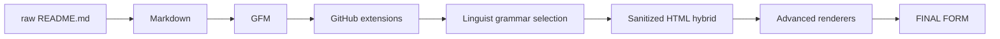
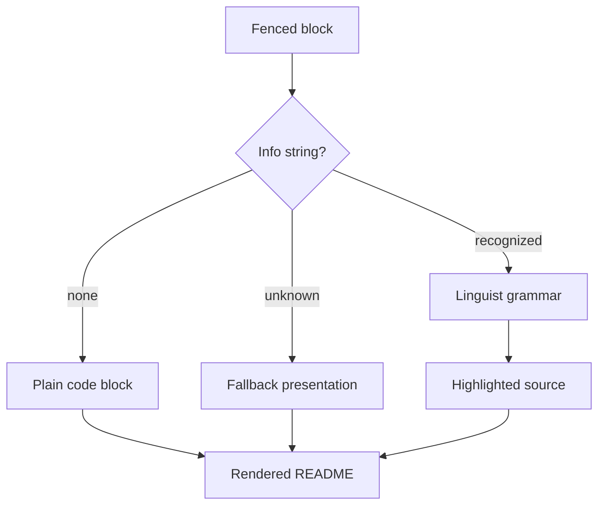
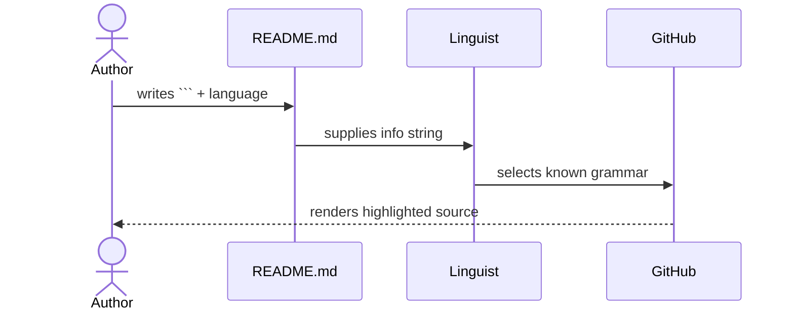

<!--
╔══════════════════════════════════════════════════════════════════════════════╗
║                          LEVEL 00: SOURCE LAYER                              ║
║                                                                              ║
║  RAW SOURCE EXPLORER · PARSER TAMER · BLOCK ARCHITECT · LINK CARTOGRAPHER   ║
║  MEDIA ENGINEER · HYBRID ENGINEER · SYNTAX CURATOR                          ║
║                                                                              ║
║  M7 invariant: fence labels are executable documentation metadata.           ║
║  Do not normalize or remove them without checking GitHub highlighting.       ║
╚══════════════════════════════════════════════════════════════════════════════╝
-->

<picture>
  <source media="(prefers-color-scheme: dark)" srcset="./assets/hero-dark.svg">
  <source media="(prefers-color-scheme: light)" srcset="./assets/hero-light.svg">
  
</picture>

<div align="center">

<a href="https://readme-typing-svg.demolab.com/demo/">
  
</a>

<br>

<a href="https://www.markdownguide.org/"></a>
<a href="https://github.github.com/gfm/"></a>
<a href="#level-08--full-syntax-highlighting-laboratory"></a>
<a href="#level-12--details-interface-system"></a>
<a href="#final-boss"></a>

<h3>This is a <strong>layer-by-layer Markdown rendering laboratory</strong>.</h3>

<sub>Markdown · GFM · GitHub Linguist · sanitized HTML · local SVG media · advanced renderers</sub>

<br><br>

<a href="#act-i--markdown-core"><strong>⚡ Markdown Core</strong></a>
&nbsp;•&nbsp;
<a href="#level-08--full-syntax-highlighting-laboratory"><strong>⌘ Syntax Lab</strong></a>
&nbsp;•&nbsp;
<a href="#act-iv--html-hybrid"><strong>▸ HTML Hybrid</strong></a>
&nbsp;•&nbsp;
<a href="#act-v--advanced-rendering"><strong>∞ Advanced Rendering</strong></a>
&nbsp;•&nbsp;
<a href="#final-boss"><strong>👑 Final Boss</strong></a>

</div>

---

> [!IMPORTANT]
> GitHub syntax highlighting is not produced by Markdown itself. The language specifier after an opening fence selects a grammar recognized by GitHub's Linguist ecosystem. M7 treats that tiny piece of metadata as its own rendering layer.

## 🧭 README POWER MAP

| Act | Rendering layer | Current demonstrations | Jump |
| :---: | --- | --- | :---: |
| `00` | [Source Layer](#level-00--source-layer) | Hidden comments, source-only rules | `RAW` |
| `I` | [Markdown Core](#act-i--markdown-core) | Typography, headings, blocks, links | `#` |
| `II` | [GitHub Flavored Markdown](#act-ii--github-flavored-markdown) | Tables, tasks, strikethrough, autolinks | `GFM` |
| `III` | [GitHub Extensions](#act-iii--github-extensions) | Alerts, **33-language syntax lab**, footnotes | `GH` |
| `IV` | [HTML Hybrid](#act-iv--html-hybrid) | Media, semantics, details UI, sanitization | `<>` |
| `V` | [Advanced Rendering](#act-v--advanced-rendering) | Math, Mermaid | `∞` |
| `VI` | [Parser & Source Lab](#act-vi--parser--source-lab) | Escapes, entities, backticks, recursion | `\` |
| `VII` | [Endgame & Reference](#act-vii--endgame--reference) | Achievements, cheat sheet, QA | `✓` |
| `∞` | [Final Boss](#final-boss) | Combined mechanics | `👑` |

`Markdown` · `GFM` · `GitHub` · `Linguist` · `HTML` · `Local Asset` · `External Asset`

---

## 🧬 THE RENDERING STACK


```mermaid
flowchart LR
    A[raw README.md] --> B[Markdown]
    B --> C[GFM]
    C --> D[GitHub extensions]
    D --> E[Linguist grammar selection]
    E --> F[Sanitized HTML hybrid]
    F --> G[Advanced renderers]
    G --> H[FINAL FORM]
```

---

# LEVEL 00 — SOURCE LAYER

`HTML` · `Source-only`

```html
<!-- This exists in README.md but disappears when rendered. -->
```

<!--
Architecture invariant:
Future phases extend the correct rendering act instead of appending unrelated sections.

M7 invariant:
Fence info strings are intentional.
Unknown-language and unlabeled fences are intentional control cases.
Collapsed galleries prevent maximum language breadth from destroying document navigation.
Do not re-label languages based only on aesthetics; labels communicate source semantics.
-->

> [!NOTE]
> Raw source and rendered output remain different surfaces. In M7, even the characters immediately after ``` are meaningful source metadata.

---

# ACT I — MARKDOWN CORE

> Inline syntax, block grammar, and navigation remain the portable foundation.

## LEVEL 01 — TYPOGRAPHY & INLINE POWER

`Markdown` · `GFM` · `HTML`

| Source | Result | Role |
| --- | --- | --- |
| `*italic*` | *italic* | Emphasis |
| `_italic_` | _italic_ | Alternate emphasis |
| `**bold**` | **bold** | Strong |
| `***bold italic***` | ***bold italic*** | Combined |
| `~~deleted~~` | ~~deleted~~ | GFM strike |
| `` `inline code` `` | `inline code` | Literal text |
| `<sub>small</sub>` | <sub>small</sub> | Subscript |
| `<sup>high</sup>` | <sup>high</sup> | Superscript |
| `<ins>inserted</ins>` | <ins>inserted</ins> | Inserted text |

**Bold containing _italic containing `code`_.**

---

## LEVEL 02 — STRUCTURE, HEADINGS & WHITESPACE

`Markdown`

<details>
<summary><strong>Six-level ATX hierarchy</strong></summary>

# Header 1
## Header 2
### Header 3
#### Header 4
##### Header 5
###### Header 6

</details>

<details>
<summary><strong>Setext headings</strong></summary>

Setext Level One
================

Setext Level Two
----------------

</details>

Two trailing spaces create a hard break.  
This line follows it.

---

## LEVEL 03 — LIST ENGINE & QUOTATION FORTRESS

`Markdown`

- Surface
  - Nested
    - Deeper
      - Deeper still
        - List mines
          - **Send indentation**

1. **List item containing a quote**

   > Quotes can live inside list items.

2. **List item containing code**

   ```bash
   printf '%s\n' "nested code"
   ```

> **Quote containing structure**
>
> - [x] list
> - [x] task
> - [x] `code`

---

## LEVEL 04 — HYPERLINK ROUTING MATRIX

`Markdown` · `GFM` · `GitHub` · `HTML`

[Markdown Guide](https://www.markdownguide.org/)  
[Markdown Guide][markdown-guide]  
[GitHub Docs][]  
[GFM Spec]

- [This README](./README.md)
- [Repository root](./)
- [Syntax Lab](#level-08--full-syntax-highlighting-laboratory)
- [HTML Hybrid](#act-iv--html-hybrid)
- [Final Boss](#final-boss)

<a name="m7-syntax-beacon"></a>

[Jump to the custom M7 anchor](#m7-syntax-beacon)

<https://github.com/>  
https://github.com  
www.github.com

```text
@octocat
#123
owner/repository#123
```

---

# ACT II — GITHUB FLAVORED MARKDOWN

## LEVEL 05 — TABLE ENGINE

`GFM`

| Alignment | Syntax | Example |
| :--- | :---: | ---: |
| Left | `:---` | `10` |
| Center | `:---:` | `100` |
| Right | `---:` | `1000` |

| Input | Result |
| --- | --- |
| `alpha \| beta` | alpha \| beta |
| `` `left\|right` `` | `left\|right` |

---

## LEVEL 06 — TASK-LIST SKILL TREE

`GFM`

- [x] **Markdown Core**
  - [x] Typography
  - [x] Lists and quotes
  - [x] Link routing
- [x] **GFM Systems**
  - [x] Tables
  - [x] Task lists
- [x] **Media System**
  - [x] Repository-owned SVGs
  - [x] Theme-aware `<picture>`
- [x] **HTML Hybrid**
  - [x] Semantic tags
  - [x] Nested `<details>`
  - [x] Sanitization boundary
- [x] **Syntax Highlighting**
  - [x] Fence anatomy
  - [x] Labeled vs unlabeled fences
  - [x] Known alias examples
  - [x] Unknown-label fallback case
  - [x] Web languages
  - [x] Systems languages
  - [x] Scripting languages
  - [x] Data/config/infra languages
  - [x] Scientific/functional languages
  - [x] Documentation/meta languages
  - [x] `diff`
  - [x] `text` / plaintext
  - [x] Nested-fence source demonstration
- [x] **Parser Lab**
  - [x] Escapes
  - [x] Entities
  - [x] Variable-length fences
- [ ] **Advanced Rendering**
  - [x] Math baseline
  - [x] Mermaid baseline
  - [ ] GeoJSON
  - [ ] TopoJSON
  - [ ] STL / 3D
- [ ] **Final Form**
  - [ ] Full rendering QA
  - [ ] Restraint discovered

---

# ACT III — GITHUB EXTENSIONS

> GitHub's code renderer is where plain fenced blocks become a language-aware visual surface.

## LEVEL 07 — ALERT COMMAND CENTER

`GitHub`

> [!NOTE]
> A fence without a language still creates a code block.

> [!TIP]
> Prefer a recognizable Linguist language name or alias when highlighting is useful.

> [!IMPORTANT]
> The language label is metadata. It should describe the code, not merely produce attractive colors.

> [!WARNING]
> A wrong language label can highlight valid code misleadingly.

> [!CAUTION]
> Copying a syntax label from another renderer does not guarantee GitHub recognizes it.

---

## LEVEL 08 — FULL SYNTAX-HIGHLIGHTING LABORATORY

`Markdown` · `GitHub` · `Linguist`

GitHub uses Linguist language definitions and grammars to determine code highlighting. A fenced code block's **info string** is therefore a tiny routing instruction from Markdown source to a syntax grammar.[^linguist]

### Fence anatomy

````md
```python
message = "The word after the fence selects the grammar."
```
````

```text
opening fence   language specifier
      │                │
      ▼                ▼
      ```            python
       │
       └── fenced code content
```

### Control group: same idea, different fence metadata

**No language label:** code block, no explicit grammar request.

```
const answer = 6 * 7;
console.log(answer);
```

**Explicit plaintext:** deliberately literal presentation.

```text
const answer = 6 * 7;
console.log(answer);
```

**Correct JavaScript label:** grammar-aware highlighting.

```javascript
const answer = 6 * 7;
console.log(answer);
```

**Intentionally unknown label:** a parser/render fallback test, not a recommended language name.

```totally-not-a-language
const answer = 6 * 7;
console.log(answer);
```

> [!IMPORTANT]
> Highlighting does not validate code. A beautifully colored snippet can still be syntactically wrong, insecure, or semantically nonsense.

### Alias laboratory

Linguist defines aliases in addition to language names. Its language data also permits recognizable interpreter/file-extension specifiers for fenced blocks where supported.[^linguist]

| Language | Stable label used in museum | Common alternate specifier shown here |
| --- | --- | --- |
| JavaScript | `javascript` | `js` |
| TypeScript | `typescript` | `ts` |
| Python | `python` | `py` |
| Shell | `bash` | `sh` |
| PowerShell | `powershell` | `ps1` |
| YAML | `yaml` | `yml` |
| Markdown | `markdown` | `md` |
| C++ | `cpp` | `c++` |
| C# | `csharp` | `cs` |
| Rust | `rust` | `rs` |
| Kotlin | `kotlin` | `kt` |
| LaTeX | `latex` | `tex` |

Same JavaScript under two accepted-style specifiers:

```javascript
const canonical = "javascript";
```

```js
const alias = "js";
```

Same YAML family under two short forms:

```yaml
phase: M7
highlighting: true
```

```yml
phase: M7
highlighting: true
```

> [!TIP]
> For long-lived documentation, prefer a familiar language name or widely used alias. Exotic aliases can be technically valid while still confusing readers.

---

### Gallery A — Web, UI & interchange

<details>
<summary><strong>Open 5-language web gallery — JavaScript, TypeScript, HTML, CSS, JSON</strong></summary>

#### JavaScript

```javascript
const systems = ["Markdown", "GFM", "GitHub"];
const finalForm = systems.map((name, level) => ({ name, level }));
console.table(finalForm);
```

#### TypeScript

```typescript
type Layer = "markdown" | "gfm" | "github";
interface Capability { layer: Layer; unlocked: boolean }
const syntaxLab: Capability = { layer: "github", unlocked: true };
```

#### HTML

```html
<details open>
  <summary>Syntax museum</summary>
  <p>HTML can frame Markdown-adjacent interfaces.</p>
</details>
```

#### CSS

```css
.syntax-lab {
  display: grid;
  gap: 1rem;
  font-family: ui-monospace, monospace;
}
```

> [!NOTE]
> This CSS is a syntax-highlighting example. README HTML does not gain a free arbitrary stylesheet runtime.

#### JSON

```json
{
  "phase": "M7",
  "languages": 33,
  "collapsedGalleries": true,
  "javascriptRuntime": false
}
```

</details>

---

### Gallery B — Systems, compiled & application languages

<details>
<summary><strong>Open 8-language systems gallery — C, C++, Rust, Go, Java, C#, Kotlin, Swift</strong></summary>

#### C

```c
#include <stdio.h>

int main(void) {
    puts("Markdown: Final Form");
    return 0;
}
```

#### C++

```cpp
#include <iostream>
#include <string_view>

int main() {
    constexpr std::string_view phase = "M7";
    std::cout << phase << '\n';
}
```

#### Rust

```rust
#[derive(Debug)]
struct Layer<'a> { name: &'a str, power: u8 }

fn main() {
    println!("{:?}", Layer { name: "syntax", power: 7 });
}
```

#### Go

```go
package main

import "fmt"

func main() {
    fmt.Println("Linguist routing online")
}
```

#### Java

```java
record Layer(String name, boolean unlocked) {}

class Main {
    public static void main(String[] args) {
        System.out.println(new Layer("syntax", true));
    }
}
```

#### C#

```csharp
record Layer(string Name, bool Unlocked);

var syntax = new Layer("Syntax Highlighting", true);
Console.WriteLine(syntax);
```

#### Kotlin

```kotlin
data class Layer(val name: String, val unlocked: Boolean)

fun main() {
    println(Layer("Syntax Highlighting", true))
}
```

#### Swift

```swift
struct Layer {
    let name: String
    let unlocked: Bool
}

print(Layer(name: "Syntax Highlighting", unlocked: true))
```

</details>

---

### Gallery C — Scripting & runtime languages

<details>
<summary><strong>Open 6-language scripting gallery — Python, Ruby, PHP, Lua, Bash, PowerShell</strong></summary>

#### Python

```python
from dataclasses import dataclass

@dataclass(frozen=True)
class Layer:
    name: str
    unlocked: bool = True

print(Layer("syntax"))
```

#### Ruby

```ruby
Layer = Data.define(:name, :unlocked)
syntax = Layer.new("syntax", true)
puts syntax.inspect
```

#### PHP

```php
<?php
$layer = ["name" => "syntax", "unlocked" => true];
echo json_encode($layer, JSON_PRETTY_PRINT);
```

#### Lua

```lua
local layer = { name = "syntax", unlocked = true }
for key, value in pairs(layer) do
  print(key, value)
end
```

#### Bash

```bash
#!/usr/bin/env bash
set -euo pipefail
phase="M7"
printf 'phase=%s\n' "$phase"
```

#### PowerShell

```powershell
$Layer = [pscustomobject]@{
    Name = 'Syntax Highlighting'
    Unlocked = $true
}
$Layer | Format-List
```

</details>

---

### Gallery D — Data, configuration & infrastructure

<details>
<summary><strong>Open 5-language data/config gallery — SQL, YAML, TOML, XML, Dockerfile</strong></summary>

#### SQL

```sql
SELECT layer, COUNT(*) AS demonstrations
FROM readme_features
WHERE phase <= 7
GROUP BY layer
ORDER BY demonstrations DESC;
```

#### YAML

```yaml
phase: M7
syntax:
  engine: linguist
  galleries: 6
  languages: 33
```

#### TOML

```toml
phase = "M7"

[syntax]
engine = "linguist"
languages = 33
```

#### XML

```xml
<readme phase="M7">
  <syntax engine="linguist" languages="33" />
</readme>
```

#### Dockerfile

```dockerfile
FROM alpine:3.22
WORKDIR /docs
COPY README.md ./README.md
CMD ["sh", "-c", "wc -l README.md"]
```

</details>

---

### Gallery E — Scientific & functional languages

<details>
<summary><strong>Open 5-language scientific/functional gallery — R, Julia, Haskell, Scala, LaTeX</strong></summary>

#### R

```r
layers <- data.frame(
  phase = 1:7,
  power = c(20, 35, 50, 65, 75, 85, 92)
)
print(layers)
```

#### Julia

```julia
struct Layer
    name::String
    unlocked::Bool
end

println(Layer("syntax", true))
```

#### Haskell

```haskell
data Layer = Layer { name :: String, unlocked :: Bool }
  deriving (Show)

main :: IO ()
main = print (Layer "syntax" True)
```

#### Scala

```scala
case class Layer(name: String, unlocked: Boolean)

@main def syntaxLab(): Unit =
  println(Layer("syntax", true))
```

#### LaTeX

```latex
\documentclass{article}
\begin{document}
\textbf{Markdown: Final Form}\\
Phase $M_7$: syntax highlighting.
\end{document}
```

> [!NOTE]
> `latex` here means source-code highlighting. GitHub MathJax rendering is a separate capability and remains the focus of M8.

</details>

---

### Gallery F — Documentation, metadata & literal output

<details>
<summary><strong>Open 4-language/meta gallery — Markdown, diff, plaintext, INI</strong></summary>

#### Markdown source

```markdown
# Heading

- **Markdown** can describe Markdown.
- `code` stays code.

> [!NOTE]
> GitHub can highlight the source of its own document format.
```

#### Diff

```diff
- CODE-BLOCK ALCHEMY
+ FULL SYNTAX-HIGHLIGHTING LABORATORY
+ 33 language families demonstrated
+ collapsed galleries preserve readability
- one-size-fits-all code examples
```

#### Plaintext / terminal-style output

```text
syntax-lab .............. ONLINE
languages ............... 33
collapsed-galleries ..... 6
wrong-label-control ..... PRESENT
javascript-runtime ...... ABSENT
```

#### INI

```ini
[readme]
phase=M7
engine=Linguist
languages=33
collapsed=true
```

</details>

---

### Language museum inventory

| Gallery | Languages / modes | Count |
| --- | --- | ---: |
| Web & UI | JavaScript, TypeScript, HTML, CSS, JSON | 5 |
| Systems & compiled | C, C++, Rust, Go, Java, C#, Kotlin, Swift | 8 |
| Scripting | Python, Ruby, PHP, Lua, Bash, PowerShell | 6 |
| Data/config/infra | SQL, YAML, TOML, XML, Dockerfile | 5 |
| Scientific/functional | R, Julia, Haskell, Scala, LaTeX | 5 |
| Docs/meta | Markdown, diff, plaintext, INI | 4 |
| **Total distinct showcased modes** |  | **33** |

### Same source, different claimed grammar

The following examples are intentionally identical source text. Only the fence label changes.

```javascript
const payload = { phase: "M7", active: true };
```

```json
const payload = { phase: "M7", active: true };
```

The second block is **not valid JSON**, even if a renderer colors parts of it. Highlighting communicates a claimed language; it does not certify correctness.

### Fence aliases are metadata, not file conversion

```python
print("This is highlighted as Python")
```

```ruby
print("The same-looking call can belong to another language")
```

The renderer does not execute either snippet. It chooses tokenization/highlighting based on the info string.

### Fence recursion: showing fenced Markdown inside fenced Markdown

Use a longer outer fence when the example itself contains triple backticks:

````markdown
```typescript
const nested: string = "three backticks live inside four";
```
````

### Syntax-label decision rule

```text
Is this actually code in a known language?
├── yes → use its recognizable Linguist name/alias
└── no
    ├── literal output/log/config-like prose → text / plaintext
    └── demonstration of an unlabeled fence → omit the info string intentionally
```

> [!WARNING]
> Do not label output as `bash` just because it came from a terminal. Commands, shell source, and terminal output are different things.

---

## LEVEL 09 — FOOTNOTES & GITHUB-AWARE BEHAVIOR

`GitHub`

Markdown remains readable as plain text while adding structure.[^plain-text]

Relative repository paths keep local media branch-aware.[^relative-links]

GitHub's HTML layer is sanitized before rendering.[^sanitization]

Collapsed sections use `<details>` and `<summary>`.[^details]

GitHub's Linguist language definitions include names and aliases used by fenced code blocks; supported grammars drive highlighting.[^linguist]

---

# ACT IV — HTML HYBRID

> M6 established the HTML boundary. M7 now uses `<details>` as the scalability mechanism for a very large syntax museum.

## LEVEL 10 — REPOSITORY-OWNED MEDIA SYSTEM

`Markdown` · `HTML` · `Local Asset`

<picture>
  <source media="(prefers-color-scheme: dark)" srcset="./assets/hero-dark.svg">
  <source media="(prefers-color-scheme: light)" srcset="./assets/hero-light.svg">
  
</picture>


[](#level-08--full-syntax-highlighting-laboratory)

---

## LEVEL 11 — INLINE HTML SEMANTIC TOOLKIT

`HTML` · `Markdown`

Press <kbd>Ctrl</kbd> + <kbd>Shift</kbd> + <kbd>V</kbd>.  
H<sub>2</sub>O · x<sup>2</sup>  
<ins>Inserted</ins> · <del>Deleted</del> · <s>Obsolete</s>  
<strong>Strong HTML</strong> · <em>emphasized HTML</em> · <code>inline HTML code</code>

---

## LEVEL 12 — DETAILS INTERFACE SYSTEM

`HTML` · `Markdown` · `GitHub`

<details>
<summary><strong>Basic collapsed panel</strong></summary>

- Markdown list
- **formatting**
- `inline code`

</details>

<details open>
<summary><strong>Open by default</strong></summary>

The `open` attribute changes initial disclosure state without JavaScript.

</details>

<details>
<summary><strong>Nested disclosure tree</strong></summary>

<details>
<summary><strong>Tier 2</strong></summary>

<details>
<summary><strong>Tier 3</strong></summary>

**Markdown inside HTML inside Markdown.**

</details>

</details>

</details>

> [!TIP]
> M7 demonstrates the practical reason M6 mattered: thirty-three syntax modes can exist in one README without permanently occupying the entire viewport.

---

## LEVEL 13 — HTML TABLE & LAYOUT LAB

`HTML`

<table>
  <thead>
    <tr><th>Element</th><th>Role</th></tr>
  </thead>
  <tbody>
    <tr><td><code>&lt;details&gt;</code></td><td>Progressive disclosure</td></tr>
    <tr><td><code>&lt;kbd&gt;</code></td><td>Keyboard semantics</td></tr>
    <tr><td><code>&lt;picture&gt;</code></td><td>Theme-aware media</td></tr>
    <tr><td><code>&lt;table&gt;</code></td><td>Explicit table structure</td></tr>
  </tbody>
</table>

---

## LEVEL 14 — MARKDOWN / HTML BOUNDARY LAB

`Markdown` · `HTML` · `Parser`

```html
<details>
<summary>Summary</summary>

### Markdown heading

- Markdown list
- **Markdown emphasis**

</details>
```

```text
Markdown owns document structure by default.
HTML enters where it adds missing semantics or interaction.
Blank lines around nested Markdown are deliberate.
```

---

## LEVEL 15 — SANITIZATION BOUNDARY

`GitHub` · `HTML` · `Security`

These remain examples, not infrastructure:

```html
<script>alert('nope')</script>
<div style="position:fixed">not a README UI framework</div>
<div class="app" id="root">not an application mount</div>
```

| Goal | README-safe direction |
| --- | --- |
| Interaction | `<details>` / `<summary>` |
| Theme-aware media | `<picture>` / `<source>` |
| Keyboard notation | `<kbd>` |
| Styling | GitHub renderer + designed assets |
| Application behavior | Build an actual webpage/app |

---

## LEVEL 16 — HYBRID INTERFACE BOSS

`Markdown` · `GFM` · `GitHub` · `HTML` · `Local Asset`

<details open>
<summary><strong>M7 SYSTEM CONSOLE</strong></summary>

<table>
  <tr><th>System</th><th>Status</th></tr>
  <tr><td>Markdown</td><td><strong>ONLINE</strong></td></tr>
  <tr><td>HTML disclosure</td><td><strong>ONLINE</strong></td></tr>
  <tr><td>Local media</td><td><strong>ONLINE</strong></td></tr>
  <tr><td>Linguist syntax routing</td><td><strong>33 MODES</strong></td></tr>
  <tr><td>JavaScript runtime</td><td><del>ABSENT</del> BY DESIGN</td></tr>
</table>

<details>
<summary><strong>Inspect code subsystem</strong></summary>

```rust
struct Readme {
    syntax_modes: usize,
    executable_js: bool,
}

let final_form = Readme { syntax_modes: 33, executable_js: false };
```

</details>

</details>

---

# ACT V — ADVANCED RENDERING

## LEVEL 17 — MATHEMATICAL SUPERIORITY

`GitHub` · `Math`

Inline: $`E = mc^2`$

```math
\text{README Quality}
=
\frac{\text{Clarity}\times\text{Structure}\times\text{Accuracy}}
{\text{Unexplained Assumptions}+1}
```

```math
\lim_{\text{documentation}\to 0}\text{user confidence}=0
```

> [!NOTE]
> `latex` fenced code in M7 is syntax-highlighted source. This `math` block is rendered mathematics. M8 will exhaust that distinction.

---

## LEVEL 18 — MERMAID SUMMONING CIRCLE

`GitHub` · `Mermaid`


```mermaid
flowchart TD
    A[Fenced block] --> B{Info string?}
    B -- none --> C[Plain code block]
    B -- recognized --> D[Linguist grammar]
    B -- unknown --> E[Fallback presentation]
    D --> F[Highlighted source]
    C --> G[Rendered README]
    E --> G
    F --> G
```


```mermaid
sequenceDiagram
    actor Author
    participant MD as README.md
    participant L as Linguist
    participant GH as GitHub
    Author->>MD: writes ``` + language
    MD->>L: supplies info string
    L->>GH: selects known grammar
    GH-->>Author: renders highlighted source
```

---

# ACT VI — PARSER & SOURCE LAB

## LEVEL 19 — ESCAPE HATCH

`Markdown` · `Parser`

\# Not a heading  
\> Not a quote  
\- Not a list  
1\. Not an ordered list  
\*Not emphasis\*

| Literal | Source |
| :---: | :---: |
| `*` | `\*` |
| `_` | `\_` |
| `#` | `\#` |
| `>` | `\>` |
| `|` | `\|` |
| `\` | `\\` |

---

## LEVEL 20 — BACKTICK PARADOX

`Markdown` · `Parser`

`README.md`

``Use a `backtick` inside code``

````markdown
```javascript
console.log("Three backticks live inside four.");
```
````

---

## LEVEL 21 — DELIMITER COLLISION LAB

`Markdown` · `GFM`

*asterisk emphasis*  
_underscore emphasis_  
**strong**  
__alternate strong__  
~~strike containing **bold** and `code`~~

`economic_math_student` remains parser-safe.

---

## LEVEL 22 — ENTITY REACTOR

`Markdown` · `HTML`

| Source | Rendered |
| --- | :---: |
| `&copy;` | &copy; |
| `&rarr;` | &rarr; |
| `&times;` | &times; |
| `&ne;` | &ne; |
| `&infin;` | &infin; |
| `&#169;` | &#169; |
| `&#xA9;` | &#xA9; |

&lt;div&gt;not an HTML element&lt;/div&gt;

---

## LEVEL 23 — WHITESPACE & RECURSION CHAMBER

`Markdown` · `Parser`

````markdown
```markdown
**Markdown shown inside Markdown shown inside Markdown.**
```
````

<!--
Future maintainers:
Nested fences, code labels, wrong-label controls, reference definitions,
relative media paths, and details blank lines are intentional.
-->

---

# ACT VII — ENDGAME & REFERENCE

## 🏅 ACHIEVEMENTS UNLOCKED

<p align="center">
  
  
  
  
</p>

| Achievement | Requirement | Status |
| --- | --- | :---: |
| **Block Architect** | Compose nested Markdown blocks | ✅ |
| **Link Cartographer** | Multiple link grammars | ✅ |
| **Media Engineer** | Repository-owned media | ✅ |
| **Hybrid Engineer** | Markdown + sanitized HTML | ✅ |
| **Syntax Curator** | Demonstrate 33 distinct language/mode fences | ✅ |
| **Grammar Router** | Compare labeled, unlabeled, text, and unknown fences | ✅ |
| **Alias Handler** | Demonstrate alternate Linguist specifiers | ✅ |
| **Gallery Architect** | Keep six language galleries collapsible | ✅ |
| **Fence Architect** | Nest triple fences inside longer fences | ✅ |
| **Diff Operator** | Use `diff` as a documentation mode | ✅ |
| **Literalist** | Distinguish source code from plaintext output | ✅ |
| **Parser Tamer** | Escapes + variable-length fences | ✅ |
| **Master of Restraint** | Stop before adding more languages | ❌ |

---

## THE CHAOS INDEX

```text
Clarity          ████████████████████ 100%
Structure        ████████████████████ 100%
Typography       ████████████████████ 100%
Lists            ████████████████████ 100%
Tables           ████████████████████ 100%
Links            ████████████████████ 100%
Local Media      ████████████████████ 100%
HTML Hybrid      ████████████████████ 100%
Syntax Labels    ████████████████████ 100%
Language Breadth ████████████████████  33 modes
Fence Control    ████████████████████ 100%
Parser Tricks    ███████████████████░  95%
Animation        ████████████████░░░░  80%
Restraint        ██░░░░░░░░░░░░░░░░░░  10%
Raw Power        ███████████████████░  M7
```

> [!WARNING]
> Syntax highlighting is presentation metadata, not a compiler, linter, validator, security scanner, or proof that the snippet belongs to the language named on its fence.
>
> **M7 makes grammar selection itself part of the showcase.**

---

## 🧰 THE ACTUALLY USEFUL CHEAT SHEET

````markdown
# Heading
*italic* **bold** ~~strike~~ `code`

[inline](https://example.com)
[reference][docs]
[relative](./README.md)
[same document](#final-boss)

```python
print("highlighted code")
```

```text
literal output
```

```
unlabeled fenced code
```

```diff
- old
+ new
```

````markdown
```typescript
const nested: string = "fence inside fence";
```
````

<details>
<summary>Collapsed code gallery</summary>

```rust
fn main() { println!("inside details"); }
```

</details>


<kbd>Ctrl</kbd> + <kbd>K</kbd>
H<sub>2</sub>O

- [x] Complete
- [ ] Incomplete

| Left | Center | Right |
| :--- | :---: | ---: |
| alpha \| beta | `code` | 100 |
````

[docs]: https://example.com/docs

---

## 🧯 COMMON README CRIMES

| Crime | Consequence |
| --- | --- |
| Leaving every fence unlabeled | Useful syntax structure disappears |
| Labeling terminal output as `bash` | Output is presented as shell source |
| Choosing a language because its colors look better | Metadata becomes false |
| Assuming highlighting validates syntax | Broken code still looks authoritative |
| Using obscure aliases everywhere | Raw source becomes harder to understand |
| Giant uncollapsed language museum | README becomes a scrolling benchmark |
| Forgetting longer outer fences | Demonstrations terminate themselves |
| Treating `latex` highlighting as MathJax | Source highlighting and math rendering get confused |
| Treating README HTML like a web app | Sanitizer wins |
| Deleting local assets | Media breaks |

---

## 🧪 README QUALITY TEST

- [ ] Every intended source-code block has the correct language label.
- [ ] Plain terminal/output examples use `text` or remain intentionally unlabeled.
- [ ] Unknown-label test remains clearly labeled as intentional.
- [ ] Alias examples still resolve to the intended grammar.
- [ ] JavaScript and JSON comparison remains intentionally invalid JSON in the second block.
- [ ] All six galleries open and close independently.
- [ ] Every gallery has the advertised number of language modes.
- [ ] Total inventory still equals 33 distinct showcased modes.
- [ ] `diff` additions/removals remain visually distinct.
- [ ] Nested four-backtick demonstrations remain balanced.
- [ ] Markdown code fences still work inside `<details>`.
- [ ] Theme-aware local hero still switches correctly.
- [ ] Relative media paths resolve on the branch.
- [ ] HTML sanitizer examples remain inert source examples.
- [ ] Mobile layout remains usable with galleries collapsed.
- [ ] README is previewed on GitHub.

---

# FINAL BOSS

<picture>
  <source media="(prefers-color-scheme: dark)" srcset="./assets/hero-dark.svg">
  <source media="(prefers-color-scheme: light)" srcset="./assets/hero-light.svg">
  
</picture>

<details open>
<summary><strong>FINAL FORM — SYNTAX ROUTING SYSTEM</strong></summary>

```text
README
 ├── MARKDOWN CORE
 ├── GFM
 ├── LINKS
 ├── LOCAL MEDIA
 ├── HTML HYBRID
 ├── GITHUB CODE RENDERING
 │    ├── FENCED BLOCK
 │    ├── INFO STRING
 │    ├── LINGUIST NAME / ALIAS
 │    ├── GRAMMAR
 │    ├── 33 SHOWCASED MODES
 │    ├── UNLABELED CONTROL
 │    ├── UNKNOWN-LABEL CONTROL
 │    ├── DIFF / TEXT MODES
 │    └── NESTED FENCES
 ├── MATH
 ├── MERMAID
 └── PARSER LAB

↓
FINAL FORM
```

<details>
<summary><strong>Compile absolutely nothing</strong></summary>

```typescript
interface FinalForm {
  markdown: true;
  gfm: true;
  htmlHybrid: true;
  syntaxModes: 33;
  executableReadmeJavaScript: false;
}

const readme: FinalForm = {
  markdown: true,
  gfm: true,
  htmlHybrid: true,
  syntaxModes: 33,
  executableReadmeJavaScript: false,
};
```

</details>

</details>

<div align="center">

<p>
  Markdown creates the fence.<br>
  The info string names the language.<br>
  Linguist maps that name to a grammar.<br>
  GitHub renders source without executing it.<br>
  Details keep thirty-three demonstrations navigable.
</p>

<a href="https://docs.github.com/en/get-started/writing-on-github/working-with-advanced-formatting/creating-and-highlighting-code-blocks"></a>
<a href="https://github.com/github-linguist/linguist"></a>
<a href="#"></a>

<h2>Markdown: Final Form.</h2>
<h3>Syntax-highlighting layer unlocked.</h3>

</div>


---

[markdown-guide]: https://www.markdownguide.org/ "Markdown Guide"
[GitHub Docs]: https://docs.github.com/en/get-started/writing-on-github "GitHub writing and formatting documentation"
[GFM Spec]: https://github.github.com/gfm/ "GitHub Flavored Markdown specification"

[^plain-text]: Markdown remains readable as plain text while adding lightweight structural syntax.
[^relative-links]: Relative repository paths keep files and media branch-aware.
[^details]: GitHub documents `<details>`, `<summary>`, nested Markdown content, and the `open` attribute for initially expanded sections.
[^sanitization]: GitHub sanitizes rendered README HTML, so arbitrary application-style script and styling are not the interface model.
[^linguist]: GitHub Linguist defines known languages and aliases. Its language data notes that aliases are used in fenced code blocks; supported languages with highlighting grammars can be rendered with syntax highlighting.