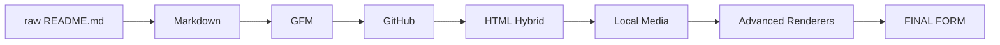
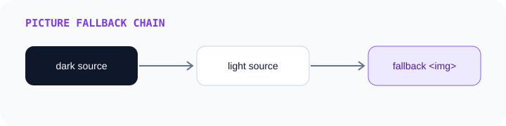
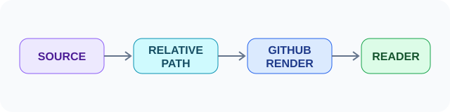
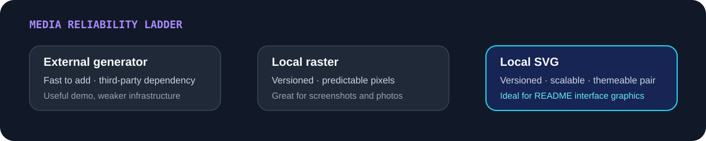
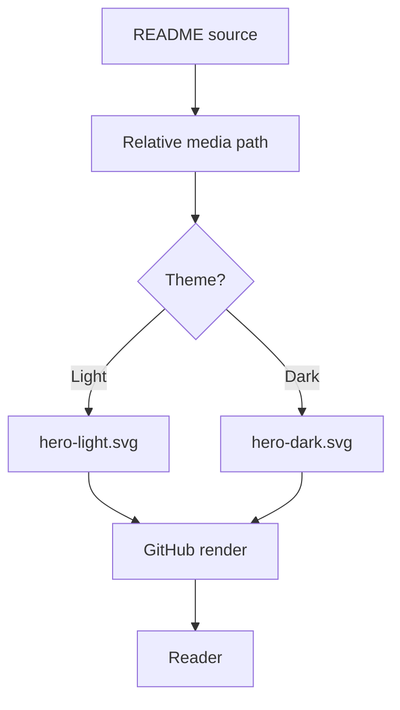
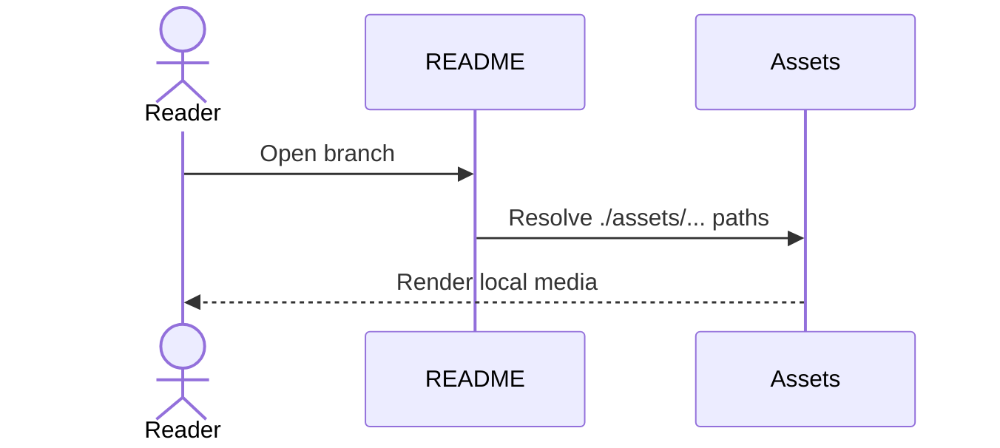

<!--
╔══════════════════════════════════════════════════════════════════════════════╗
║                          LEVEL 00: SOURCE LAYER                              ║
║                                                                              ║
║  Achievements: RAW SOURCE EXPLORER · PARSER TAMER · BLOCK ARCHITECT         ║
║                LINK CARTOGRAPHER · MEDIA ENGINEER                            ║
║                                                                              ║
║  M5 invariant: the local assets/ directory is part of the README system.     ║
║  Do not replace repository-owned media with remote generators casually.      ║
╚══════════════════════════════════════════════════════════════════════════════╝
-->

<picture>
  <source media="(prefers-color-scheme: dark)" srcset="./assets/hero-dark.svg">
  <source media="(prefers-color-scheme: light)" srcset="./assets/hero-light.svg">
  
</picture>

<div align="center">

<a href="https://readme-typing-svg.demolab.com/demo/">
  
</a>

<br />

<a href="https://www.markdownguide.org/"></a>
<a href="https://github.github.com/gfm/"></a>
<a href="#level-10--repository-owned-media-system"></a>
<a href="#the-chaos-index"></a>
<a href="#final-boss"></a>

<h3>This is a <strong>layer-by-layer Markdown rendering laboratory</strong>.</h3>

<sub>Markdown · GFM · GitHub rendering · HTML fragments · local SVG media · zero JavaScript</sub>

<br /><br />

<a href="#act-i--markdown-core"><strong>⚡ Markdown Core</strong></a>
&nbsp;•&nbsp;
<a href="#level-04--hyperlink-routing-matrix"><strong>🧭 Link Routing</strong></a>
&nbsp;•&nbsp;
<a href="#level-10--repository-owned-media-system"><strong>🖼️ Media System</strong></a>
&nbsp;•&nbsp;
<a href="#final-boss"><strong>👑 Final Boss</strong></a>

</div>

---

> [!IMPORTANT]
> M5 changes the reliability model: the README's primary visual identity now lives **inside the repository**. Remote generators remain demonstrations, not critical dependencies.

## 🧭 README POWER MAP

| Act | Rendering layer | Current demonstrations | Jump |
| :---: | --- | --- | :---: |
| `00` | [Source Layer](#level-00--source-layer) | Hidden comments, source-only rules | `RAW` |
| `I` | [Markdown Core](#act-i--markdown-core) | Typography, headings, blocks, links, anchors | `#` |
| `II` | [GitHub Flavored Markdown](#act-ii--github-flavored-markdown) | Tables, task trees, strikethrough, autolinks | `GFM` |
| `III` | [GitHub Extensions](#act-iii--github-extensions) | Alerts, highlighting, footnotes, GitHub context | `GH` |
| `IV` | [HTML Hybrid](#act-iv--html-hybrid) | Local images, SVGs, theme media, details | `<>` |
| `V` | [Advanced Rendering](#act-v--advanced-rendering) | Math, Mermaid | `∞` |
| `VI` | [Parser & Source Lab](#act-vi--parser--source-lab) | Escapes, entities, backticks, recursion | `\` |
| `VII` | [Endgame & Reference](#act-vii--endgame--reference) | Achievements, cheat sheet, QA | `✓` |
| `∞` | [Final Boss](#final-boss) | Combined mechanics | `👑` |

`Markdown` · `GFM` · `GitHub` · `HTML` · `Local Asset` · `External Asset`

---

## 🧬 THE RENDERING STACK


```mermaid
flowchart LR
    A[raw README.md] --> B[Markdown]
    B --> C[GFM]
    C --> D[GitHub]
    D --> E[HTML Hybrid]
    E --> F[Local Media]
    F --> G[Advanced Renderers]
    G --> H[FINAL FORM]
```

---

# LEVEL 00 — SOURCE LAYER

`HTML` · `Source-only`

```html
<!-- This exists in README.md but disappears when rendered. -->
```

<!--
Architecture invariant:
Future phases extend the correct rendering act instead of appending unrelated sections.

M5 invariant:
assets/hero-light.svg and assets/hero-dark.svg are primary visual infrastructure.
Relative media paths are deliberate so branch previews remain self-contained.
Decorative images should use empty alt text when they convey no information.
-->

> [!NOTE]
> Raw source and rendered output remain two different surfaces of the same document.

---

# ACT I — MARKDOWN CORE

> Inline syntax, block grammar, and navigation.

## LEVEL 01 — TYPOGRAPHY & INLINE POWER

`Markdown` · `GFM` · `HTML`

| Source | Result | Role |
| --- | --- | --- |
| `*italic*` | *italic* | Emphasis |
| `_italic_` | _italic_ | Alternate emphasis |
| `**bold**` | **bold** | Strong |
| `__bold__` | __bold__ | Alternate strong |
| `***bold italic***` | ***bold italic*** | Combined |
| `~~deleted~~` | ~~deleted~~ | GFM strike |
| `` `inline code` `` | `inline code` | Literal text |
| `<sub>small</sub>` | <sub>small</sub> | Subscript |
| `<sup>high</sup>` | <sup>high</sup> | Superscript |
| `<ins>inserted</ins>` | <ins>inserted</ins> | Inserted text |

**Bold containing _italic containing `code`_.**  
~~Strikethrough containing **strong** text.~~

---

## LEVEL 02 — STRUCTURE, HEADINGS & WHITESPACE

`Markdown`

<details>
<summary><strong>🏛️ Six-level ATX heading hierarchy</strong></summary>

# Header 1 — The Emperor
## Header 2 — The Chancellor
### Header 3 — The Strategist
#### Header 4 — The Specialist
##### Header 5 — The Intern with Production Access
###### Header 6 — The Fine Print Nobody Read

</details>

<details>
<summary><strong>📜 Setext headings</strong></summary>

Setext Level One
================

Setext Level Two
----------------

</details>

1. A blank line starts a new paragraph.
2. Two trailing spaces create a hard break.  
   This line follows one.
3. `<br>` creates an HTML break.<br>This line follows one.

---

## LEVEL 03 — LIST ENGINE & QUOTATION FORTRESS

`Markdown`

- Hyphen
* Asterisk
+ Plus

### Deep nesting

- Surface
  - Context
    - Deeper
      - List mines
        - Deeper still
          - **Send indentation**

### Blocks inside list items

1. **Paragraph container**

   This paragraph belongs to item 1.

2. **Quote container**

   > Quote nested inside a list.
   >
   > - Quoted child list

3. **Code container**

   ```bash
   printf '%s\n' "code inside a list item"
   ```

### Quote fortress

> First level.
>
> > Second level.
> >
> > > Third level.

> **Quote containing structure**
>
> - [x] List
> - [x] Task
> - [x] `inline code`
>
> ```text
> quote
>   └── list
>       └── task
> ```

---

## LEVEL 04 — HYPERLINK ROUTING MATRIX

`Markdown` · `GFM` · `GitHub` · `HTML`

### Inline and reference links

[Markdown Guide](https://www.markdownguide.org/)  
[Hover title](https://www.markdownguide.org/ "Tooltip unlocked")  
[Markdown Guide][markdown-guide]  
[GitHub Docs][]  
[GFM Spec]

### Relative repository links

- [This README](./README.md)
- [Repository root](./)
- [Media system](./README.md#level-10--repository-owned-media-system)
- [Local media card asset](./assets/media-card.svg)

### Section and custom anchors

- [Markdown Core](#act-i--markdown-core)
- [Advanced Rendering](#act-v--advanced-rendering)
- [Final Boss](#final-boss)

<a name="m5-media-beacon"></a>

[Jump to this custom anchor](#m5-media-beacon)

### Autolinks

<https://github.com/>  
<documentation@example.com>  
https://github.com  
www.github.com

### GitHub-context examples kept inert

```text
@octocat
#123
owner/repository#123
0123456789abcdef0123456789abcdef01234567
```

> [!IMPORTANT]
> Repository Markdown files and GitHub conversation surfaces do not have identical automatic-reference behavior. Explicit links remain the safe choice when guaranteed README navigation matters.

---

# ACT II — GITHUB FLAVORED MARKDOWN

## LEVEL 05 — TABLE ENGINE

`GFM`

| Alignment | Syntax | Example |
| :--- | :---: | ---: |
| Left | `:---` | `10` |
| Center | `:---:` | `100` |
| Right | `---:` | `1000` |

| Family | Render | Status |
| --- | --- | :---: |
| emphasis | _italic_ / **bold** | ✅ |
| code | `README.md` | ✅ |
| strike | ~~deleted~~ | ✅ |
| link | [Markdown Guide](https://www.markdownguide.org/) | ✅ |
| HTML | H<sub>2</sub>O / x<sup>2</sup> | ✅ |

| Input | Result |
| --- | --- |
| `alpha \| beta` | alpha \| beta |
| `` `left\|right` `` | `left\|right` |

---

## LEVEL 06 — TASK-LIST SKILL TREE

`GFM`

- [x] **Markdown Core**
  - [x] Typography
  - [x] Lists and quotes
  - [x] Link routing
- [x] **GFM Systems**
  - [x] Tables
  - [x] Task lists
- [x] **Media System**
  - [x] Repository-owned SVGs
  - [x] Relative image paths
  - [x] Theme-aware `<picture>`
  - [x] HTML sizing
  - [x] Clickable local media
  - [x] Informative/decorative alt strategy
  - [x] Fallback chain
- [x] **Parser Lab**
  - [x] Escapes
  - [x] Entities
  - [x] Nested fences
- [ ] **Advanced Rendering**
  - [x] Math baseline
  - [x] Mermaid baseline
  - [ ] GeoJSON
  - [ ] TopoJSON
  - [ ] STL / 3D
- [ ] **Final Form**
  - [ ] Full rendering QA
  - [ ] Restraint discovered

---

# ACT III — GITHUB EXTENSIONS

## LEVEL 07 — ALERT COMMAND CENTER

`GitHub`

> [!NOTE]
> Useful context.

> [!TIP]
> Helpful optimization.

> [!IMPORTANT]
> Required information.

> [!WARNING]
> Something may go wrong.

> [!CAUTION]
> You deleted a local media asset that the README still references.

---

## LEVEL 08 — CODE-BLOCK ALCHEMY

`Markdown` · `GitHub`

```javascript
const readme = {
  phase: "M5",
  media: "repository-owned",
  themeAware: true,
  externalDependency: "optional",
};
```

```python
from dataclasses import dataclass

@dataclass(frozen=True)
class Asset:
    path: str
    local: bool = True
    scalable: bool = True

hero = Asset("./assets/hero-dark.svg")
```

```diff
- Critical hero depends on a third-party image generator.
+ Critical hero lives in ./assets/ and travels with the branch.

- Theme support exists only in a code sample.
+ Theme support is a live <picture> element.
```

---

## LEVEL 09 — FOOTNOTES & GITHUB-AWARE BEHAVIOR

`GitHub`

Markdown remains readable as plain text while adding structure.[^plain-text]

Relative repository links and image paths stay branch-aware.[^relative-links]

Repository files and GitHub conversations are different rendering contexts.[^github-context]

M5 keeps external generators only as optional demonstrations.[^external-media]

---

# ACT IV — HTML HYBRID

> HTML fragments become especially useful when Markdown image syntax needs theme, size, or fallback control.

## LEVEL 10 — REPOSITORY-OWNED MEDIA SYSTEM

`Markdown` · `HTML` · `Local Asset` · `External Asset`

### Asset architecture

```text
assets/
├── hero-light.svg
├── hero-dark.svg
├── media-card.svg
├── scaling-ruler.svg
├── media-divider.svg
├── reliability-ladder.svg
├── informative-diagram.svg
├── decorative-divider.svg
├── clickable-portal.svg
├── picture-fallback.svg
└── media-status.svg
```

The critical visuals are now version controlled with the README.

### Live theme-aware hero

The banner at the top of this README is a real `<picture>` implementation:

```html
<picture>
  <source media="(prefers-color-scheme: dark)" srcset="./assets/hero-dark.svg">
  <source media="(prefers-color-scheme: light)" srcset="./assets/hero-light.svg">
  
</picture>
```

The final `` is the fallback when no `<source>` matches or the element is interpreted without source selection.



### Plain Markdown image syntax

The simplest live local image uses ordinary Markdown:


Source:

```md

```

### One SVG, multiple display sizes


Same source, reduced display width:


Source:

```html


```

The vector source does not need a second exported file just because the display size changes.

### Clickable local image

[](#level-10--repository-owned-media-system)

Source:

```md
[](#level-10--repository-owned-media-system)
```

The image is simultaneously media **and** link label.

### Informative versus decorative images

Informative image — descriptive `alt` text carries the essential meaning:



Decorative image — intentionally empty `alt` because it adds no information:


```html


```

> [!TIP]
> Good alt text describes the image's **purpose**, not every pixel. Pure decoration should not force screen-reader users through meaningless narration.

### Local versus external reliability



| Media source | Version controlled | Branch-local | Third-party dependency | Best use |
| --- | :---: | :---: | :---: | --- |
| Remote generator | ❌ | ❌ | ✅ | Optional badges/novelty |
| Local raster | ✅ | ✅ | ❌ | Photos, screenshots |
| Local SVG | ✅ | ✅ | ❌ | Diagrams, banners, interface graphics |

### External media remains a live demonstration

The animated typing SVG near the top still comes from an external generator **on purpose**. Its failure would no longer remove the README's identity or navigation.

### Media status


---

## LEVEL 11 — COLLAPSIBLE INTERFACE SYSTEM

`HTML` · `Markdown`

<details>
<summary><strong>🧠 Open a Markdown container</strong></summary>

Inside `<details>`:

- lists
- **formatting**
- `code`
- [links](#level-04--hyperlink-routing-matrix)
- local media


</details>

<details>
<summary><strong>🐉 Documentation Dragon</strong></summary>

**HP:** `10,000`  
**Weakness:** relative paths  
**Special attack:** deleted assets

- [x] Version media
- [x] Add fallback image
- [x] Verify alt text
- [ ] Stop adding lore

</details>

---

# ACT V — ADVANCED RENDERING

## LEVEL 12 — MATHEMATICAL SUPERIORITY

`GitHub` · `Math`

Inline: $`E = mc^2`$

```math
\text{README Quality}
=
\frac{\text{Clarity}\times\text{Structure}\times\text{Accuracy}}
{\text{Unexplained Assumptions}+1}
```

```math
\lim_{\text{documentation}\to 0}\text{user confidence}=0
```

> [!NOTE]
> M8 owns the full mathematics expansion.

---

## LEVEL 13 — MERMAID SUMMONING CIRCLE

`GitHub` · `Mermaid`


```mermaid
flowchart TD
    A[README source] --> B[Relative media path]
    B --> C{Theme?}
    C -- Light --> D[hero-light.svg]
    C -- Dark --> E[hero-dark.svg]
    D --> F[GitHub render]
    E --> F
    F --> G[Reader]
```


```mermaid
sequenceDiagram
    actor Reader
    participant README
    participant Assets
    Reader->>README: Open branch
    README->>Assets: Resolve ./assets/... paths
    Assets-->>Reader: Render local media
```

---

# ACT VI — PARSER & SOURCE LAB

## LEVEL 14 — ESCAPE HATCH

`Markdown` · `Source-aware`

\# Not a heading  
\> Not a quote  
\- Not a list  
1\. Not an ordered list  
\*Not emphasis\*

| Literal | Source |
| :---: | :---: |
| `*` | `\*` |
| `_` | `\_` |
| `#` | `\#` |
| `>` | `\>` |
| `[` | `\[` |
| `|` | `\|` |
| `\` | `\\` |

---

## LEVEL 15 — BACKTICK PARADOX

`Markdown` · `Parser`

`README.md`

``Use a `backtick` inside code``

````md
```javascript
console.log("Three backticks can live inside four.");
```
````

---

## LEVEL 16 — DELIMITER COLLISION LAB

`Markdown` · `GFM`

*asterisk emphasis*  
_underscore emphasis_  
**strong**  
__alternate strong__  
~~strike containing **bold** and `code`~~

`economic_math_student` remains parser-safe.

---

## LEVEL 17 — ENTITY REACTOR

`Markdown` · `HTML`

| Source | Rendered |
| --- | :---: |
| `&copy;` | &copy; |
| `&rarr;` | &rarr; |
| `&times;` | &times; |
| `&ne;` | &ne; |
| `&infin;` | &infin; |
| `&#169;` | &#169; |
| `&#xA9;` | &#xA9; |

&lt;div&gt;not an HTML element&lt;/div&gt;

---

## LEVEL 18 — WHITESPACE & RECURSION CHAMBER

`Markdown` · `Parser`

````md
```md
**Markdown shown inside Markdown shown inside Markdown.**
```
````

<!--
Future maintainers:
Nested fences, reference definitions, relative media paths, and theme source order are intentional.
-->

---

# ACT VII — ENDGAME & REFERENCE

## 🏅 ACHIEVEMENTS UNLOCKED

<p align="center">
  
  
  
  
</p>

| Achievement | Requirement | Status |
| --- | --- | :---: |
| **The Emphasizer** | Nested emphasis | ✅ |
| **Block Architect** | Compose nested blocks | ✅ |
| **Table Architect** | Alignment + escaped pipes | ✅ |
| **Taskmaster** | Multi-level task hierarchy | ✅ |
| **Parser Tamer** | Escapes + variable fences | ✅ |
| **Link Cartographer** | Multiple link grammars | ✅ |
| **Branch Navigator** | Relative repository paths | ✅ |
| **Media Engineer** | Repository-owned media architecture | ✅ |
| **Theme Shifter** | Live light/dark `<picture>` sources | ✅ |
| **Scale Smith** | One SVG at multiple display widths | ✅ |
| **Portal Builder** | Clickable local image | ✅ |
| **Alt Text Adult** | Informative vs decorative semantics | ✅ |
| **Fallback Planner** | `<picture>` fallback image | ✅ |
| **Master of Restraint** | Stop before adding too much | ❌ |

---

## THE CHAOS INDEX

```text
Clarity        ████████████████████ 100%
Structure      ████████████████████ 100%
Typography     ████████████████████ 100%
Lists          ████████████████████ 100%
Tables         ████████████████████ 100%
Tasks          ████████████████████ 100%
Quotes         ████████████████████ 100%
Links          ████████████████████ 100%
Local Media    ████████████████████ 100%
Theme Media    ████████████████████ 100%
Alt Strategy   ████████████████████ 100%
Parser Tricks  ███████████████████░  95%
Animation      ████████████████░░░░  80%
Restraint      ██░░░░░░░░░░░░░░░░░░  10%
Raw Power      █████████████████░░░  M5
```

> [!WARNING]
> A README with beautiful images but brittle third-party dependencies is still fragile documentation.
>
> **M5 makes media part of the repository, not decoration rented from the internet.**

---

## 🧰 THE ACTUALLY USEFUL CHEAT SHEET

````md
# Heading
*italic* **bold** ~~strike~~ `code`

[inline](https://example.com)
[full reference][docs]
[relative](./README.md)
[same document](#final-boss)


[](#target)

<picture>
  <source media="(prefers-color-scheme: dark)" srcset="./assets/dark.svg">
  <source media="(prefers-color-scheme: light)" srcset="./assets/light.svg">
  
</picture>


- [x] Complete
- [ ] Incomplete

| Left | Center | Right |
| :--- | :---: | ---: |
| alpha \| beta | `code` | 100 |

> Blockquote
>
> ```text
> code inside quote
> ```

``code containing a `backtick` ``
````

[docs]: https://example.com/docs

---

## 🧯 COMMON README CRIMES

| Crime | Consequence |
| --- | --- |
| Critical visual hosted only by a remote generator | Third-party outage removes identity |
| Absolute repository image URL | Branch previews become brittle |
| Missing fallback `` in `<picture>` | Fragile media selection |
| Width baked into multiple exported SVG copies | Needless duplication |
| Describing decorative pixels to screen readers | Accessibility noise |
| Empty alt text on informative diagrams | Information disappears for nonvisual readers |
| Deleting `assets/` files without searching references | Broken README media |
| Giant fixed-width graphics | Mobile readability suffers |
| Missing reference definitions | Links silently degrade |
| Aggressive formatter rewrites | Parser demonstrations break |

---

## 🧪 README QUALITY TEST

- [ ] `hero-light.svg` renders in a light theme.
- [ ] `hero-dark.svg` renders in a dark theme.
- [ ] Fallback `` remains valid.
- [ ] Every local media path resolves on the current branch.
- [ ] Informative media has meaningful alt text.
- [ ] Decorative media uses empty alt text.
- [ ] The same SVG remains legible at 100% and 50% width.
- [ ] Clickable media lands on the intended destination.
- [ ] External generators are noncritical.
- [ ] Internal fragments still land correctly.
- [ ] Reference definitions still resolve.
- [ ] Tables keep consistent columns.
- [ ] Nested fences remain intact.
- [ ] Mobile layout remains readable.
- [ ] README is previewed on GitHub.

---

# FINAL BOSS

<picture>
  <source media="(prefers-color-scheme: dark)" srcset="./assets/hero-dark.svg">
  <source media="(prefers-color-scheme: light)" srcset="./assets/hero-light.svg">
  
</picture>

```text
README
 ├── MARKDOWN
 ├── GFM
 ├── LINKS
 ├── LOCAL MEDIA
 │    ├── RELATIVE PATHS
 │    ├── SVG
 │    ├── THEME PAIRS
 │    ├── DISPLAY SIZING
 │    ├── CLICKABLE IMAGES
 │    ├── ALT SEMANTICS
 │    └── FALLBACKS
 ├── HTML HYBRID
 ├── MATH
 ├── MERMAID
 └── PARSER LAB

↓
FINAL FORM
```

<div align="center">

<p>
  The source owns the structure.<br>
  The repository owns the media.<br>
  The renderer chooses the presentation.<br>
  External services are now optional extras.
</p>

<a href="https://www.markdownguide.org/"></a>
<a href="https://docs.github.com/en/get-started/writing-on-github"></a>
<a href="#"></a>

<h2>Markdown: Final Form.</h2>
<h3>Media layer unlocked.</h3>

</div>


---

[markdown-guide]: https://www.markdownguide.org/ "Markdown Guide"
[GitHub Docs]: https://docs.github.com/en/get-started/writing-on-github "GitHub writing and formatting documentation"
[GFM Spec]: https://github.github.com/gfm/ "GitHub Flavored Markdown specification"

[^plain-text]: Markdown remains readable as plain text while adding lightweight structural syntax.
[^relative-links]: Relative repository paths keep files and media branch-aware.
[^github-context]: GitHub conversations and repository Markdown files have different automatic-reference behavior.
[^external-media]: External image generators can be useful demonstrations, but repository-owned critical media is more reliable.