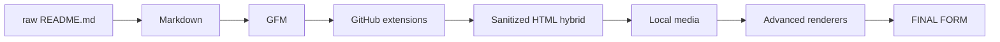
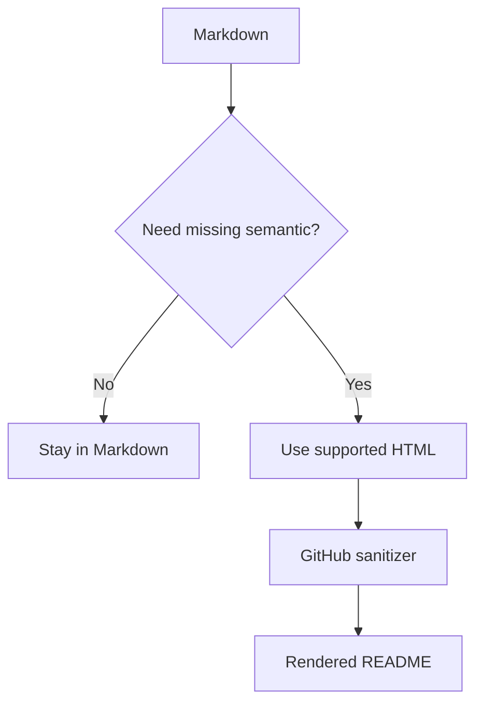

<!--
╔══════════════════════════════════════════════════════════════════════════════╗
║                          LEVEL 00: SOURCE LAYER                              ║
║                                                                              ║
║  Achievements: RAW SOURCE EXPLORER · PARSER TAMER · BLOCK ARCHITECT         ║
║                LINK CARTOGRAPHER · MEDIA ENGINEER · HYBRID ENGINEER          ║
║                                                                              ║
║  M6 invariant: HTML is a controlled extension layer, not a hidden website.  ║
║  GitHub sanitization is part of the rendering model.                         ║
╚══════════════════════════════════════════════════════════════════════════════╝
-->

<picture>
  <source media="(prefers-color-scheme: dark)" srcset="./assets/hero-dark.svg">
  <source media="(prefers-color-scheme: light)" srcset="./assets/hero-light.svg">
  
</picture>

<div align="center">

<a href="https://readme-typing-svg.demolab.com/demo/">
  
</a>

<br>

<a href="https://www.markdownguide.org/"></a>
<a href="https://github.github.com/gfm/"></a>
<a href="#level-11--inline-html-semantic-toolkit"></a>
<a href="#level-12--details-interface-system"></a>
<a href="#final-boss"></a>

<h3>This is a <strong>layer-by-layer Markdown rendering laboratory</strong>.</h3>

<sub>Markdown · GFM · GitHub rendering · sanitized HTML · local SVG media · zero JavaScript</sub>

<br><br>

<a href="#act-i--markdown-core"><strong>⚡ Markdown Core</strong></a>
&nbsp;•&nbsp;
<a href="#level-10--repository-owned-media-system"><strong>🖼️ Media</strong></a>
&nbsp;•&nbsp;
<a href="#level-12--details-interface-system"><strong>▸ Details UI</strong></a>
&nbsp;•&nbsp;
<a href="#level-15--sanitization-boundary"><strong>🛡️ Sanitizer</strong></a>
&nbsp;•&nbsp;
<a href="#final-boss"><strong>👑 Final Boss</strong></a>

</div>

---

> [!IMPORTANT]
> M6 treats HTML as a **sanitized composition layer**. It extends Markdown where useful—disclosure controls, semantic inline elements, media selection, and explicit tables—without relying on JavaScript, CSS classes, or arbitrary styling.

## 🧭 README POWER MAP

| Act | Rendering layer | Current demonstrations | Jump |
| :---: | --- | --- | :---: |
| `00` | [Source Layer](#level-00--source-layer) | Hidden comments, source-only rules | `RAW` |
| `I` | [Markdown Core](#act-i--markdown-core) | Typography, headings, blocks, links, anchors | `#` |
| `II` | [GitHub Flavored Markdown](#act-ii--github-flavored-markdown) | Tables, task trees, strikethrough, autolinks | `GFM` |
| `III` | [GitHub Extensions](#act-iii--github-extensions) | Alerts, highlighting, footnotes, GitHub context | `GH` |
| `IV` | [HTML Hybrid](#act-iv--html-hybrid) | Media, semantic HTML, details UI, HTML tables, sanitization | `<>` |
| `V` | [Advanced Rendering](#act-v--advanced-rendering) | Math, Mermaid | `∞` |
| `VI` | [Parser & Source Lab](#act-vi--parser--source-lab) | Escapes, entities, backticks, recursion | `\` |
| `VII` | [Endgame & Reference](#act-vii--endgame--reference) | Achievements, cheat sheet, QA | `✓` |
| `∞` | [Final Boss](#final-boss) | Combined mechanics | `👑` |

`Markdown` · `GFM` · `GitHub` · `HTML` · `Local Asset` · `External Asset`

---

## 🧬 THE RENDERING STACK


```mermaid
flowchart LR
    A[raw README.md] --> B[Markdown]
    B --> C[GFM]
    C --> D[GitHub extensions]
    D --> E[Sanitized HTML hybrid]
    E --> F[Local media]
    F --> G[Advanced renderers]
    G --> H[FINAL FORM]
```

---

# LEVEL 00 — SOURCE LAYER

`HTML` · `Source-only`

```html
<!-- This exists in README.md but disappears when rendered. -->
```

<!--
Architecture invariant:
Future phases extend the correct rendering act instead of appending unrelated sections.

M6 invariant:
Do not introduce script/style-based README UI. GitHub sanitization is intentional.
Keep blank lines around Markdown nested inside <details> blocks.
Keep local media paths relative so branch previews remain self-contained.
-->

> [!NOTE]
> Raw source and rendered output remain two different surfaces of the same document.

---

# ACT I — MARKDOWN CORE

> Inline syntax, block grammar, and navigation.

## LEVEL 01 — TYPOGRAPHY & INLINE POWER

`Markdown` · `GFM` · `HTML`

| Source | Result | Role |
| --- | --- | --- |
| `*italic*` | *italic* | Emphasis |
| `_italic_` | _italic_ | Alternate emphasis |
| `**bold**` | **bold** | Strong |
| `__bold__` | __bold__ | Alternate strong |
| `***bold italic***` | ***bold italic*** | Combined |
| `~~deleted~~` | ~~deleted~~ | GFM strike |
| `` `inline code` `` | `inline code` | Literal text |
| `<sub>small</sub>` | <sub>small</sub> | Subscript |
| `<sup>high</sup>` | <sup>high</sup> | Superscript |
| `<ins>inserted</ins>` | <ins>inserted</ins> | Inserted text |

**Bold containing _italic containing `code`_.**  
~~Strikethrough containing **strong** text.~~

---

## LEVEL 02 — STRUCTURE, HEADINGS & WHITESPACE

`Markdown`

<details>
<summary><strong>🏛️ Six-level ATX heading hierarchy</strong></summary>

# Header 1 — The Emperor
## Header 2 — The Chancellor
### Header 3 — The Strategist
#### Header 4 — The Specialist
##### Header 5 — The Intern with Production Access
###### Header 6 — The Fine Print Nobody Read

</details>

<details>
<summary><strong>📜 Setext headings</strong></summary>

Setext Level One
================

Setext Level Two
----------------

</details>

1. A blank line starts a new paragraph.
2. Two trailing spaces create a hard break.  
   This line follows one.
3. `<br>` creates an HTML break.<br>This line follows one.

---

## LEVEL 03 — LIST ENGINE & QUOTATION FORTRESS

`Markdown`

- Hyphen
* Asterisk
+ Plus

### Deep nesting

- Surface
  - Context
    - Deeper
      - List mines
        - Deeper still
          - **Send indentation**

### Blocks inside list items

1. **Paragraph container**

   This paragraph belongs to item 1.

2. **Quote container**

   > Quote nested inside a list.
   >
   > - Quoted child list

3. **Code container**

   ```bash
   printf '%s\n' "code inside a list item"
   ```

### Quote fortress

> First level.
>
> > Second level.
> >
> > > Third level.

> **Quote containing structure**
>
> - [x] List
> - [x] Task
> - [x] `inline code`

---

## LEVEL 04 — HYPERLINK ROUTING MATRIX

`Markdown` · `GFM` · `GitHub` · `HTML`

[Markdown Guide](https://www.markdownguide.org/)  
[Markdown Guide][markdown-guide]  
[GitHub Docs][]  
[GFM Spec]

### Relative repository links

- [This README](./README.md)
- [Repository root](./)
- [Media system](./README.md#level-10--repository-owned-media-system)
- [Local media card](./assets/media-card.svg)

### Section and custom anchors

- [HTML Hybrid](#act-iv--html-hybrid)
- [Details Interface](#level-12--details-interface-system)
- [Sanitization Boundary](#level-15--sanitization-boundary)
- [Final Boss](#final-boss)

<a name="m6-hybrid-beacon"></a>

[Jump to this custom anchor](#m6-hybrid-beacon)

### Autolinks

<https://github.com/>  
<documentation@example.com>  
https://github.com  
www.github.com

### GitHub-context examples kept inert

```text
@octocat
#123
owner/repository#123
0123456789abcdef0123456789abcdef01234567
```

---

# ACT II — GITHUB FLAVORED MARKDOWN

## LEVEL 05 — TABLE ENGINE

`GFM`

| Alignment | Syntax | Example |
| :--- | :---: | ---: |
| Left | `:---` | `10` |
| Center | `:---:` | `100` |
| Right | `---:` | `1000` |

| Family | Render | Status |
| --- | --- | :---: |
| emphasis | _italic_ / **bold** | ✅ |
| code | `README.md` | ✅ |
| strike | ~~deleted~~ | ✅ |
| link | [Markdown Guide](https://www.markdownguide.org/) | ✅ |
| HTML | H<sub>2</sub>O / x<sup>2</sup> | ✅ |

| Input | Result |
| --- | --- |
| `alpha \| beta` | alpha \| beta |
| `` `left\|right` `` | `left\|right` |

---

## LEVEL 06 — TASK-LIST SKILL TREE

`GFM`

- [x] **Markdown Core**
  - [x] Typography
  - [x] Lists and quotes
  - [x] Link routing
- [x] **GFM Systems**
  - [x] Tables
  - [x] Task lists
- [x] **Media System**
  - [x] Repository-owned SVGs
  - [x] Theme-aware `<picture>`
  - [x] Relative images and fallbacks
- [x] **HTML Hybrid**
  - [x] Semantic inline elements
  - [x] `<details>` / `<summary>`
  - [x] Default-open disclosure
  - [x] Nested disclosure
  - [x] Markdown inside details
  - [x] HTML tables
  - [x] Markdown/HTML boundary rules
  - [x] Sanitization boundary
- [x] **Parser Lab**
  - [x] Escapes
  - [x] Entities
  - [x] Nested fences
- [ ] **Advanced Rendering**
  - [x] Math baseline
  - [x] Mermaid baseline
  - [ ] GeoJSON
  - [ ] TopoJSON
  - [ ] STL / 3D
- [ ] **Final Form**
  - [ ] Full rendering QA
  - [ ] Restraint discovered

---

# ACT III — GITHUB EXTENSIONS

## LEVEL 07 — ALERT COMMAND CENTER

`GitHub`

> [!NOTE]
> Useful context.

> [!TIP]
> Helpful optimization.

> [!IMPORTANT]
> Required information.

> [!WARNING]
> Something may go wrong.

> [!CAUTION]
> You tried to turn a README into a JavaScript application.

---

## LEVEL 08 — CODE-BLOCK ALCHEMY

`Markdown` · `GitHub`

```javascript
const readme = {
  phase: "M6",
  htmlHybrid: true,
  detailsInterfaces: true,
  javascriptRuntime: false,
  sanitizationAware: true,
};
```

```python
from dataclasses import dataclass

@dataclass(frozen=True)
class Disclosure:
    summary: str
    open_by_default: bool = False

panel = Disclosure("Advanced controls", open_by_default=True)
```

```diff
- Treat raw HTML as unrestricted webpage code.
+ Treat raw HTML as a sanitized Markdown extension layer.

- Hide advanced content by deleting it from the flow.
+ Use <details> when progressive disclosure improves readability.
```

---

## LEVEL 09 — FOOTNOTES & GITHUB-AWARE BEHAVIOR

`GitHub`

Markdown remains readable as plain text while adding structure.[^plain-text]

Relative repository paths keep media branch-aware.[^relative-links]

GitHub renders additional HTML tags in Markdown, but sanitizes the resulting HTML before display.[^sanitization]

Collapsed sections use `<details>` and `<summary>`, and may be opened by default with the `open` attribute.[^details]

---

# ACT IV — HTML HYBRID

> HTML is most valuable here when it supplies semantics or interaction that Markdown syntax itself does not have.

## LEVEL 10 — REPOSITORY-OWNED MEDIA SYSTEM

`Markdown` · `HTML` · `Local Asset` · `External Asset`

### Live theme-aware hero

```html
<picture>
  <source media="(prefers-color-scheme: dark)" srcset="./assets/hero-dark.svg">
  <source media="(prefers-color-scheme: light)" srcset="./assets/hero-light.svg">
  
</picture>
```


[](#level-10--repository-owned-media-system)


> [!TIP]
> M5 established the media layer. M6 reuses it as content inside richer HTML interfaces rather than creating duplicate assets.

---

## LEVEL 11 — INLINE HTML SEMANTIC TOOLKIT

`HTML` · `Markdown`

HTML can add useful inline semantics that Markdown does not expose directly.

### Keyboard input

Press <kbd>Ctrl</kbd> + <kbd>Shift</kbd> + <kbd>V</kbd>.  
Press <kbd>.</kbd> on a GitHub repository to open the web editor.

```html
Press <kbd>Ctrl</kbd> + <kbd>Shift</kbd> + <kbd>V</kbd>
```

### Subscript and superscript

H<sub>2</sub>O  
x<sup>2</sup> + y<sup>2</sup> = r<sup>2</sup>

### Insertions and deletions

<ins>Inserted content</ins>  
<del>Deleted content</del>  
<s>Stylistically no longer accurate</s>

### Strong, emphasis, and code in HTML form

<strong>Strong HTML</strong> · <em>emphasized HTML</em> · <code>inline HTML code</code>

### Explicit line and thematic breaks

Line one<br>
Line two

<hr>

The point is not to replace Markdown equivalents. The point is to expose semantics Markdown does not provide or to compose them inside HTML structures.

---

## LEVEL 12 — DETAILS INTERFACE SYSTEM

`HTML` · `Markdown` · `GitHub`

GitHub's `<details>` support turns a README into a document with **progressive disclosure**.

### Basic collapsed panel

<details>
<summary><strong>Open the basic disclosure panel</strong></summary>

This content is hidden until requested.

- Markdown list
- **Markdown formatting**
- `inline code`
- [internal navigation](#level-04--hyperlink-routing-matrix)

</details>

Source:

```html
<details>
<summary>Open panel</summary>

Markdown content here.

</details>
```

### Open by default

<details open>
<summary><strong>This panel begins expanded</strong></summary>

The `open` attribute changes the initial disclosure state without JavaScript.

```html
<details open>
```

</details>

### Rich panel: heading + task list + code + local media

<details>
<summary><strong>Open the rich-content panel</strong></summary>

### Deployment checklist

- [x] Heading
- [x] Task list
- [x] Code fence
- [x] Repository-owned image

```bash
printf '%s\n' "Markdown is alive inside details"
```


</details>

### Nested disclosure tree

<details>
<summary><strong>Tier 1 — Interface root</strong></summary>

Root-level explanation.

<details>
<summary><strong>Tier 2 — Advanced controls</strong></summary>

- nested Markdown
- `nested code`

<details>
<summary><strong>Tier 3 — Forbidden knowledge</strong></summary>

The final panel contains **Markdown inside HTML inside Markdown**.

</details>

</details>

</details>

### Choose-your-path documentation

<details>
<summary><strong>Beginner path</strong></summary>

Use headings, lists, links, images, and code blocks first.

</details>

<details>
<summary><strong>Intermediate path</strong></summary>

Add tables, task lists, alerts, reference links, and local media.

</details>

<details>
<summary><strong>Advanced path</strong></summary>

Add MathJax, Mermaid, parser-aware syntax, and carefully chosen HTML.

</details>

<details>
<summary><strong>Forbidden path</strong></summary>

Attempt to add JavaScript. GitHub's sanitizer enters the chat.

</details>

> [!IMPORTANT]
> `<details>` is useful because it reduces visual load. If every section is collapsed, navigation becomes slower rather than clearer.

---

## LEVEL 13 — HTML TABLE & LAYOUT LAB

`HTML` · `Markdown`

GFM tables are concise. Raw HTML tables expose explicit document structure.

<table>
  <thead>
    <tr>
      <th>Layer</th>
      <th>Native syntax</th>
      <th>Best role</th>
    </tr>
  </thead>
  <tbody>
    <tr>
      <td>Markdown</td>
      <td><code>| table |</code></td>
      <td>Fast data tables</td>
    </tr>
    <tr>
      <td>HTML</td>
      <td><code>&lt;table&gt;</code></td>
      <td>Explicit table structure</td>
    </tr>
    <tr>
      <td>Details</td>
      <td><code>&lt;details&gt;</code></td>
      <td>Progressive disclosure</td>
    </tr>
  </tbody>
</table>

### Cell composition

<table>
  <tr>
    <th>Semantic element</th>
    <th>Rendered example</th>
  </tr>
  <tr>
    <td><code>&lt;kbd&gt;</code></td>
    <td><kbd>Ctrl</kbd> + <kbd>K</kbd></td>
  </tr>
  <tr>
    <td><code>&lt;sub&gt;</code> / <code>&lt;sup&gt;</code></td>
    <td>H<sub>2</sub>O · x<sup>2</sup></td>
  </tr>
  <tr>
    <td><code>&lt;ins&gt;</code> / <code>&lt;del&gt;</code></td>
    <td><ins>new</ins> · <del>old</del></td>
  </tr>
</table>

> [!NOTE]
> HTML tables are not automatically "better" than GFM tables. They cost more source characters. Use them when explicit HTML structure itself is the point.

---

## LEVEL 14 — MARKDOWN / HTML BOUNDARY LAB

`Markdown` · `HTML` · `Parser`

The hybrid layer becomes interesting where the two parsers meet.

### Reliable pattern: blank lines inside details

```html
<details>
<summary>Summary</summary>

### Markdown heading

- Markdown list
- **Markdown emphasis**

</details>
```

GitHub explicitly supports Markdown content inside `<details>` blocks.

### HTML owns HTML table interiors

Inside a raw HTML `<table>`, write actual HTML cells rather than assuming arbitrary Markdown block syntax will be reparsed exactly as if it were outside the HTML block.

```html
<table>
  <tr>
    <td><strong>HTML-owned cell</strong></td>
  </tr>
</table>
```

### Inline composition is simpler

Markdown can surround inline HTML:

**Markdown strong around H<sub>2</sub>O and <kbd>keys</kbd>.**

HTML can also provide inline semantics next to Markdown-native syntax without becoming a layout framework.

### Boundary rule

```text
Markdown owns document structure by default.
HTML enters only where it adds a missing semantic or interaction.
When an HTML block owns a region, make that ownership explicit.
```

---

## LEVEL 15 — SANITIZATION BOUNDARY

`GitHub` · `HTML` · `Security`

GitHub does not treat README HTML as unrestricted webpage HTML. The rendered HTML passes through sanitization.

### Code that should not be treated as README infrastructure

```html
<script>alert('nope')</script>

<div style="position:fixed;inset:0">
  Inline styles are not a dependable README UI system.
</div>

<div class="my-app" id="root">
  CSS/JS application hooks are not the README model.
</div>
```

GitHub's markup pipeline documents aggressive sanitization, including removal of dangerous tags such as `<script>`, inline styles, and `class` / `id` attributes.

### What to use instead

| Goal | README-safe direction |
| --- | --- |
| Interaction | `<details>` / `<summary>` |
| Theme-aware image | `<picture>` / `<source>` |
| Keyboard notation | `<kbd>` |
| Sub/superscript | `<sub>` / `<sup>` |
| Insert/delete semantics | `<ins>` / `<del>` / `<s>` |
| Layout data | Markdown table or HTML `<table>` |
| Stable custom destination | named `<a>` anchor |
| Styling | GitHub's renderer + carefully designed assets |
| Application behavior | Build an actual webpage/app instead |

> [!CAUTION]
> The sanitizer is not a limitation to work around. It is a security boundary. A README should not become an executable application surface.

---

## LEVEL 16 — HYBRID INTERFACE BOSS

`Markdown` · `GFM` · `GitHub` · `HTML` · `Local Asset`

<details open>
<summary><strong>M6 SYSTEM CONSOLE — expanded by default</strong></summary>

### Interface status

<table>
  <tr>
    <th>System</th>
    <th>Status</th>
  </tr>
  <tr>
    <td>Semantic inline HTML</td>
    <td><strong>ONLINE</strong></td>
  </tr>
  <tr>
    <td>Disclosure controls</td>
    <td><strong>ONLINE</strong></td>
  </tr>
  <tr>
    <td>Local media</td>
    <td><strong>ONLINE</strong></td>
  </tr>
  <tr>
    <td>JavaScript runtime</td>
    <td><del>ABSENT</del> BY DESIGN</td>
  </tr>
</table>

Press <kbd>Enter</kbd> metaphorically. There is no JavaScript here.

<details>
<summary><strong>Inspect nested subsystem</strong></summary>

- [x] Markdown inside details
- [x] HTML table inside details
- [x] Semantic inline tags
- [x] Repository-owned media


</details>

</details>

---

# ACT V — ADVANCED RENDERING

## LEVEL 17 — MATHEMATICAL SUPERIORITY

`GitHub` · `Math`

Inline: $`E = mc^2`$

```math
\text{README Quality}
=
\frac{\text{Clarity}\times\text{Structure}\times\text{Accuracy}}
{\text{Unexplained Assumptions}+1}
```

```math
\lim_{\text{documentation}\to 0}\text{user confidence}=0
```

> [!NOTE]
> M8 owns the full mathematics expansion.

---

## LEVEL 18 — MERMAID SUMMONING CIRCLE

`GitHub` · `Mermaid`


```mermaid
flowchart TD
    A[Markdown] --> B{Need missing semantic?}
    B -- No --> C[Stay in Markdown]
    B -- Yes --> D[Use supported HTML]
    D --> E[GitHub sanitizer]
    E --> F[Rendered README]
```

```mermaid
sequenceDiagram
    actor Reader
    participant README
    participant Details
    Reader->>README: Open document
    README->>Details: Render collapsed content
    Reader->>Details: Expand when needed
    Details-->>Reader: Reveal Markdown + HTML content
```

---

# ACT VI — PARSER & SOURCE LAB

## LEVEL 19 — ESCAPE HATCH

`Markdown` · `Source-aware`

\# Not a heading  
\> Not a quote  
\- Not a list  
1\. Not an ordered list  
\*Not emphasis\*

| Literal | Source |
| :---: | :---: |
| `*` | `\*` |
| `_` | `\_` |
| `#` | `\#` |
| `>` | `\>` |
| `[` | `\[` |
| `|` | `\|` |
| `\` | `\\` |

---

## LEVEL 20 — BACKTICK PARADOX

`Markdown` · `Parser`

`README.md`

``Use a `backtick` inside code``

````md
```javascript
console.log("Three backticks can live inside four.");
```
````

---

## LEVEL 21 — DELIMITER COLLISION LAB

`Markdown` · `GFM`

*asterisk emphasis*  
_underscore emphasis_  
**strong**  
__alternate strong__  
~~strike containing **bold** and `code`~~

`economic_math_student` remains parser-safe.

---

## LEVEL 22 — ENTITY REACTOR

`Markdown` · `HTML`

| Source | Rendered |
| --- | :---: |
| `&copy;` | &copy; |
| `&rarr;` | &rarr; |
| `&times;` | &times; |
| `&ne;` | &ne; |
| `&infin;` | &infin; |
| `&#169;` | &#169; |
| `&#xA9;` | &#xA9; |

&lt;div&gt;not an HTML element&lt;/div&gt;

---

## LEVEL 23 — WHITESPACE & RECURSION CHAMBER

`Markdown` · `Parser`

````md
```md
**Markdown shown inside Markdown shown inside Markdown.**
```
````

<!--
Future maintainers:
Nested fences, reference definitions, relative media paths, details blank lines,
and HTML sanitizer demonstrations are intentional.
-->

---

# ACT VII — ENDGAME & REFERENCE

## 🏅 ACHIEVEMENTS UNLOCKED

<p align="center">
  
  
  
  
</p>

| Achievement | Requirement | Status |
| --- | --- | :---: |
| **The Emphasizer** | Nested emphasis | ✅ |
| **Block Architect** | Compose nested blocks | ✅ |
| **Table Architect** | GFM alignment + escaped pipes | ✅ |
| **Taskmaster** | Multi-level task hierarchy | ✅ |
| **Parser Tamer** | Escapes + variable fences | ✅ |
| **Link Cartographer** | Multiple link grammars | ✅ |
| **Media Engineer** | Repository-owned media | ✅ |
| **Hybrid Engineer** | Compose Markdown and supported HTML intentionally | ✅ |
| **Disclosure Architect** | Basic, open, rich, and nested details panels | ✅ |
| **Semantic Mechanic** | Use kbd/sub/sup/ins/del/s meaningfully | ✅ |
| **HTML Table Smith** | Render explicit HTML table structure | ✅ |
| **Boundary Mapper** | Document Markdown/HTML parser ownership | ✅ |
| **Sanitizer Survivor** | Respect GitHub's HTML security boundary | ✅ |
| **Master of Restraint** | Stop before adding too much | ❌ |

---

## THE CHAOS INDEX

```text
Clarity        ████████████████████ 100%
Structure      ████████████████████ 100%
Typography     ████████████████████ 100%
Lists          ████████████████████ 100%
Tables         ████████████████████ 100%
Tasks          ████████████████████ 100%
Links          ████████████████████ 100%
Local Media    ████████████████████ 100%
HTML Semantics ████████████████████ 100%
Details UI     ████████████████████ 100%
HTML Tables    ████████████████████ 100%
Sanitization   ████████████████████ 100%
Parser Tricks  ███████████████████░  95%
Animation      ████████████████░░░░  80%
Restraint      ██░░░░░░░░░░░░░░░░░░  10%
Raw Power      ██████████████████░░  M6
```

> [!WARNING]
> HTML power in a README comes from **semantics and composition**, not from trying to smuggle a web application through the sanitizer.
>
> **M6 makes the HTML boundary itself part of the showcase.**

---

## 🧰 THE ACTUALLY USEFUL CHEAT SHEET

````md
# Heading
*italic* **bold** ~~strike~~ `code`

[inline](https://example.com)
[reference][docs]
[relative](./README.md)
[same document](#final-boss)


<kbd>Ctrl</kbd> + <kbd>K</kbd>
H<sub>2</sub>O
x<sup>2</sup>
<ins>inserted</ins>
<del>deleted</del>

<picture>
  <source media="(prefers-color-scheme: dark)" srcset="./assets/dark.svg">
  <source media="(prefers-color-scheme: light)" srcset="./assets/light.svg">
  
</picture>

<details>
<summary>Collapsed panel</summary>

### Markdown works here

- list
- **formatting**

</details>

<details open>
<summary>Open by default</summary>

Visible initially.

</details>

<table>
  <tr>
    <th>HTML</th>
    <th>Table</th>
  </tr>
  <tr>
    <td><kbd>Ctrl</kbd></td>
    <td>H<sub>2</sub>O</td>
  </tr>
</table>

- [x] Complete
- [ ] Incomplete

| Left | Center | Right |
| :--- | :---: | ---: |
| alpha \| beta | `code` | 100 |

``code containing a `backtick` ``
````

[docs]: https://example.com/docs

---

## 🧯 COMMON README CRIMES

| Crime | Consequence |
| --- | --- |
| Treating README HTML like unrestricted webpage HTML | Sanitizer removes the fantasy |
| Depending on `<script>` | No executable README application |
| Depending on inline CSS/class/id hooks | Styling assumptions break |
| Collapsing every section | Readers click more than they read |
| Vague `<summary>` labels | Hidden content becomes hard to discover |
| Missing blank lines in hybrid blocks | Markdown parsing becomes fragile |
| Replacing simple Markdown with verbose HTML | Source readability degrades |
| Huge HTML tables | Mobile readability suffers |
| Deleted local asset | Media references break |
| Aggressive formatter rewrites | Parser demonstrations break |

---

## 🧪 README QUALITY TEST

- [ ] Basic `<details>` opens and closes.
- [ ] `<details open>` begins expanded.
- [ ] Nested details remain independently usable.
- [ ] Markdown headings/lists/code render inside details.
- [ ] Local media renders inside details.
- [ ] HTML tables retain row/cell structure.
- [ ] `<kbd>`, `<sub>`, `<sup>`, `<ins>`, `<del>`, and `<s>` render meaningfully.
- [ ] Theme-aware `<picture>` still switches correctly.
- [ ] Relative media paths resolve on the branch.
- [ ] No critical behavior depends on script/style/class/id hooks.
- [ ] Sanitization examples remain code examples, not infrastructure.
- [ ] Internal fragments still land correctly.
- [ ] Reference definitions still resolve.
- [ ] Nested fences remain intact.
- [ ] Mobile layout remains readable.
- [ ] README is previewed on GitHub.

---

# FINAL BOSS

<picture>
  <source media="(prefers-color-scheme: dark)" srcset="./assets/hero-dark.svg">
  <source media="(prefers-color-scheme: light)" srcset="./assets/hero-light.svg">
  
</picture>

<details open>
<summary><strong>FINAL FORM — HYBRID SYSTEM MAP</strong></summary>

```text
README
 ├── MARKDOWN
 ├── GFM
 ├── LINKS
 ├── LOCAL MEDIA
 ├── HTML HYBRID
 │    ├── SEMANTIC INLINE TAGS
 │    ├── PICTURE / SOURCE / IMG
 │    ├── DETAILS / SUMMARY
 │    ├── NESTED DISCLOSURE
 │    ├── HTML TABLES
 │    ├── PARSER BOUNDARIES
 │    └── SANITIZATION
 ├── MATH
 ├── MERMAID
 └── PARSER LAB

↓
FINAL FORM
```

<details>
<summary><strong>Open the nested final-boss subsystem</strong></summary>

<table>
  <tr><th>Capability</th><th>Status</th></tr>
  <tr><td>Markdown structure</td><td><strong>ONLINE</strong></td></tr>
  <tr><td>HTML semantics</td><td><strong>ONLINE</strong></td></tr>
  <tr><td>Progressive disclosure</td><td><strong>ONLINE</strong></td></tr>
  <tr><td>Local media</td><td><strong>ONLINE</strong></td></tr>
  <tr><td>Arbitrary JavaScript</td><td><del>REJECTED</del></td></tr>
</table>

Press <kbd>Esc</kbd> to escape nothing. This is still a README.

</details>

</details>

<div align="center">

<p>
  Markdown owns the document.<br>
  HTML fills deliberate gaps.<br>
  The sanitizer defines the boundary.<br>
  Progressive disclosure keeps maximum power navigable.
</p>

<a href="https://www.markdownguide.org/"></a>
<a href="https://docs.github.com/en/get-started/writing-on-github/working-with-advanced-formatting/organizing-information-with-collapsed-sections"></a>
<a href="#"></a>

<h2>Markdown: Final Form.</h2>
<h3>HTML hybrid layer unlocked.</h3>

</div>


---

[markdown-guide]: https://www.markdownguide.org/ "Markdown Guide"
[GitHub Docs]: https://docs.github.com/en/get-started/writing-on-github "GitHub writing and formatting documentation"
[GFM Spec]: https://github.github.com/gfm/ "GitHub Flavored Markdown specification"

[^plain-text]: Markdown remains readable as plain text while adding lightweight structural syntax.
[^relative-links]: Relative repository paths keep files and media branch-aware.
[^details]: GitHub documents `<details>`, `<summary>`, Markdown content inside details, and the optional `open` attribute for initially expanded sections.
[^sanitization]: GitHub's markup pipeline sanitizes rendered HTML and documents removal of dangerous tags such as scripts, inline styles, and class/id attributes.