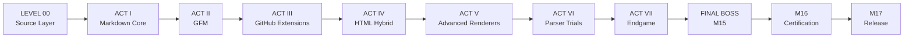
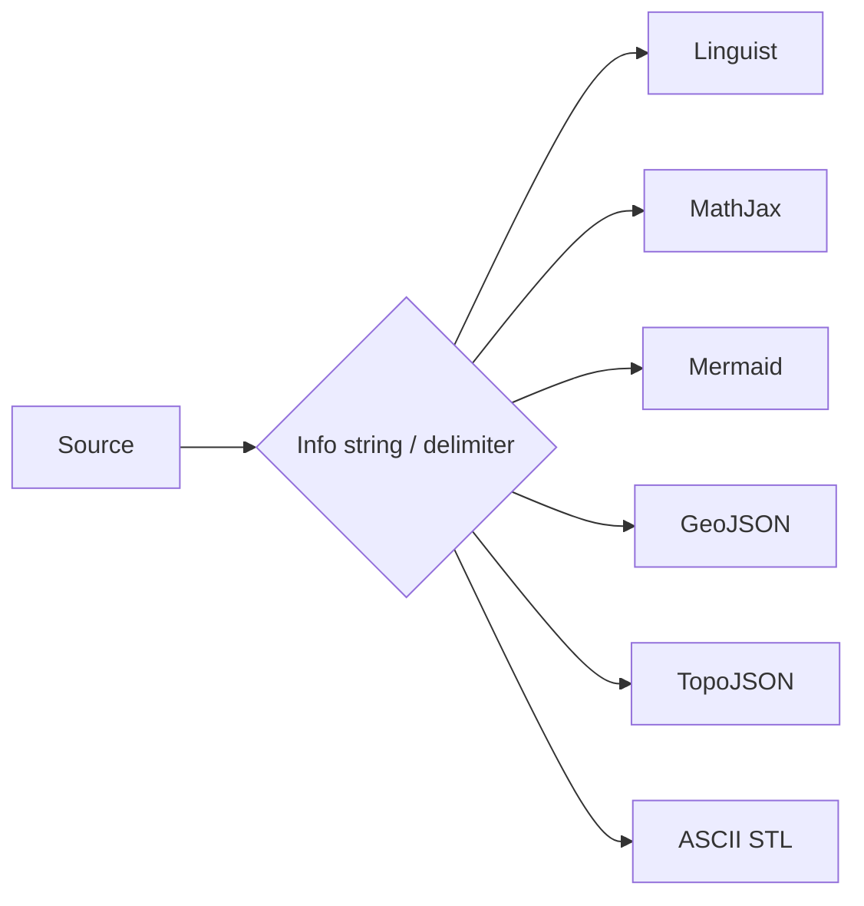
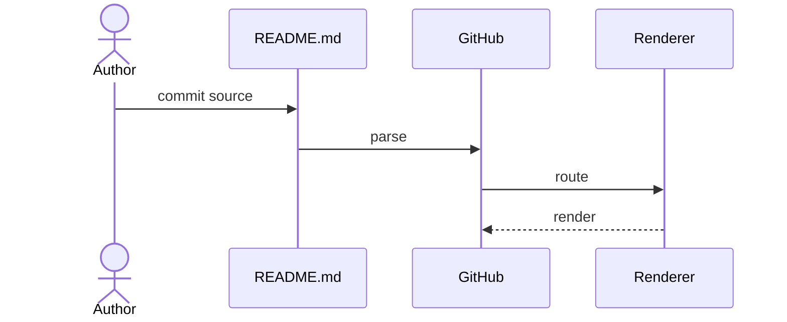
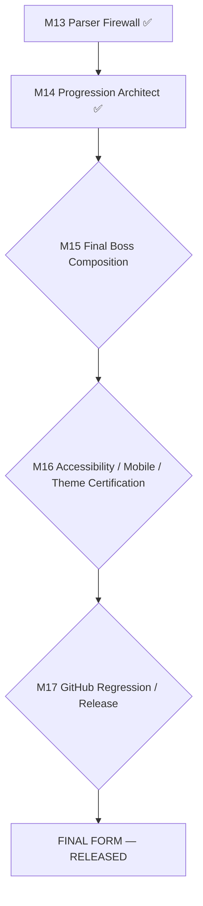
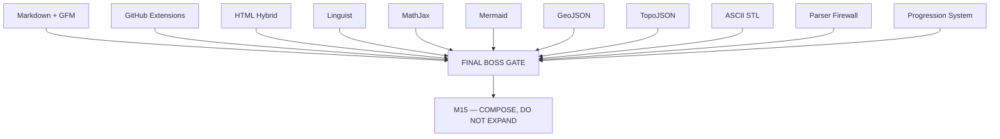

<!--
╔══════════════════════════════════════════════════════════════════════════════╗
║                      LEVEL 00: SOURCE LAYER — M14                           ║
║                                                                              ║
║  RAW SOURCE EXPLORER · PARSER TAMER · BLOCK ARCHITECT · LINK CARTOGRAPHER   ║
║  MEDIA ENGINEER · HYBRID ENGINEER · SYNTAX CURATOR · MATHJAX ARCHITECT      ║
║  MERMAID CARTOGRAPHER · GEOJSON NAVIGATOR · TOPOLOGY ENGINEER               ║
║  STL MESHSMITH · GRAMMAR BREAKER · PROGRESSION ARCHITECT                    ║
║                                                                              ║
║  M14 invariant: capability, mastery, and release confidence are different.  ║
║  Do not mark M15–M17 complete until their explicit gates are actually passed.║
╚══════════════════════════════════════════════════════════════════════════════╝
-->

<!--
SECRET ACHIEVEMENTS — SOURCE VIEW ONLY

[S1] RAW SOURCE EXPLORER
     Condition: inspect README source instead of only rendered output.
     Status: unlocked by reading this comment.

[S2] COMMENT ARCHAEOLOGIST
     Condition: find a phase invariant inside an HTML comment.
     Status: unlocked.

[S3] THE SOURCE IS THE UI
     Condition: understand that several GitHub renderers are selected by source metadata.
     Status: unlocked.

[S4] MASTER OF RESTRAINT
     Condition: stop adding unnecessary systems.
     Status: still locked.
-->

<picture>
  <source media="(prefers-color-scheme: dark)" srcset="./assets/hero-dark.svg">
  <source media="(prefers-color-scheme: light)" srcset="./assets/hero-light.svg">
  
</picture>

<div align="center">

<a href="https://readme-typing-svg.demolab.com/demo/">
  
</a>

<br>

<a href="#campaign-status"></a>
<a href="#renderer-mastery"></a>
<a href="#achievement-codex"></a>
<a href="#final-boss"></a>

<h2>MARKDOWN: FINAL FORM</h2>
<sub>One README · seven Acts · thirty-one capability levels · five renderer families · one increasingly unnecessary campaign</sub>

<br><br>

<a href="#campaign-status"><strong>◈ Campaign</strong></a>
&nbsp;•&nbsp;
<a href="#act-i--markdown-core"><strong>⚡ Core</strong></a>
&nbsp;•&nbsp;
<a href="#act-v--advanced-rendering"><strong>∞ Renderers</strong></a>
&nbsp;•&nbsp;
<a href="#act-vi--parser-trials"><strong>⚠ Parser Trials</strong></a>
&nbsp;•&nbsp;
<a href="#achievement-codex"><strong>🏅 Achievements</strong></a>
&nbsp;•&nbsp;
<a href="#final-boss"><strong>👑 Final Boss Gate</strong></a>

</div>

---

> [!IMPORTANT]
> **M14 adds no new Markdown renderer.** It rebuilds the meta-system around everything already acquired. A capability can be complete while final release certification remains incomplete. The README therefore tracks **showcase mastery**, **hardening status**, and **release confidence** separately.

<a name="campaign-status"></a>

# CAMPAIGN STATUS

| Metric | Current state | Meaning |
| --- | :---: | --- |
| Campaign phases | **15 / 18** | M0 through M14 complete |
| Capability acquisition | **100%** | planned Markdown/GFM/GitHub/HTML/native-renderer breadth acquired |
| Native advanced renderer acquisition | **4 / 4** | Mermaid, GeoJSON, TopoJSON, ASCII STL |
| Parser hardening | **95% source confidence** | M13 complete; final GitHub regression still pending |
| Endgame phases | **2 / 5** | M13 parser hardening + M14 progression complete |
| Accessibility/mobile certification | **pending** | owned by M16 |
| Final GitHub release regression | **pending** | owned by M17 |
| Final Boss composition | **locked** | owned by M15 |

```text
M0 ─ M1 ─ M2 ─ M3 ─ M4 ─ M5 ─ M6 ─ M7 ─ M8 ─ M9 ─ M10 ─ M11 ─ M12 ─ M13 ─ M14 ─ M15 ─ M16 ─ M17
✓    ✓    ✓    ✓    ✓    ✓    ✓    ✓    ✓    ✓     ✓     ✓     ✓     ✓     ✓     LOCK  LOCK  LOCK
```

### Two scoreboards

```text
SHOWCASE MASTERY
████████████████████ 100 / 100

RELEASE CONFIDENCE
███████████████░░░░░  76 / 100
```

**Showcase Mastery** answers: “Can the README demonstrate the planned capability?”  
**Release Confidence** answers: “Has the whole experience passed parser, composition, accessibility, mobile, theme, and final GitHub rendering certification?”

That second score is intentionally not 100 before M16–M17.

---

# THE CAMPAIGN MAP


```mermaid
flowchart LR
    S[LEVEL 00<br/>Source Layer] --> A1[ACT I<br/>Markdown Core]
    A1 --> A2[ACT II<br/>GFM]
    A2 --> A3[ACT III<br/>GitHub Extensions]
    A3 --> A4[ACT IV<br/>HTML Hybrid]
    A4 --> A5[ACT V<br/>Advanced Renderers]
    A5 --> A6[ACT VI<br/>Parser Trials]
    A6 --> A7[ACT VII<br/>Endgame]
    A7 --> B[FINAL BOSS<br/>M15]
    B --> C[M16<br/>Certification]
    C --> R[M17<br/>Release]
```

## Act completion ledger

| Act | Scope | Boss | Status |
| :---: | --- | --- | :---: |
| `00` | Source layer / hidden state | Source Gate | ✅ |
| `I` | Markdown Core | Core Grammar Boss | ✅ |
| `II` | GFM | Pipe & Task Boss | ✅ |
| `III` | GitHub Extensions | Extension Boss | ✅ |
| `IV` | HTML Hybrid | Sanitizer Boss | ✅ |
| `V` | Advanced Rendering | Renderer Gauntlet | ✅ |
| `VI` | Parser Trials | Parser Firewall | ✅ |
| `VII` | Endgame systems | Progression Architect | ✅ M14 |
| `∞` | Final composition | Final Boss | 🔒 M15 |
| `RC` | accessibility/mobile/theme | Certification Gate | 🔒 M16 |
| `REL` | GitHub regression/release | Release Gate | 🔒 M17 |

---

# LEVEL 00 — SOURCE LAYER

`HTML comment` · `source-only` · `secret progression`

```html
<!-- Rendered output cannot show everything the source knows. -->
```

The source layer owns:

- phase invariants;
- secret achievements;
- raw parser fixtures;
- comments that intentionally disappear from rendered view.

Raw parser fixture corpus: [`assets/parser-torture-corpus.txt`](./assets/parser-torture-corpus.txt)

> [!NOTE]
> Some M14 rewards exist only in source view. The rendered README confirms that secrets exist; it does not reveal every condition.

---

# ACT I — MARKDOWN CORE

## LEVEL 01 — TYPOGRAPHY

| Source | Rendered |
| --- | --- |
| `*italic*` | *italic* |
| `_italic_` | _italic_ |
| `**strong**` | **strong** |
| `__strong__` | __strong__ |
| `***both***` | ***both*** |
| `~~deleted~~` | ~~deleted~~ |
| `` `code` `` | `code` |
| `<sub>2</sub>` | H<sub>2</sub>O |
| `<sup>2</sup>` | x<sup>2</sup> |
| `<ins>new</ins>` | <ins>new</ins> |

**Strong containing _emphasis containing `code`_.**

Intraword control: `foo*bar*baz` versus `foo_bar_baz`.

## LEVEL 02 — HEADINGS / BREAKS

<details>
<summary><strong>ATX ladder</strong></summary>

# H1
## H2
### H3
#### H4
##### H5
###### H6

</details>

Setext One
==========

Setext Two
----------

Two trailing spaces create a hard break.  
This line follows.

A backslash also creates one.\
This line follows.

## LEVEL 03 — CONTAINERS

1. Ordered list
   - nested bullet
     - [x] nested task

> Blockquote
>
> - list inside quote
> - `code`

```text
ordinary fenced block
```

## LEVEL 04 — LINKS / REFERENCES

[Inline](https://example.com) · [Markdown Guide][markdown-guide] · [GitHub Docs][] · [GFM Spec]

[README](./README.md) · [Parser corpus](./assets/parser-torture-corpus.txt) · [Final Boss gate](#final-boss)

<https://github.com/>  
https://github.com  
www.github.com

### ACT I BOSS — CORE GRAMMAR

<details>
<summary><strong>Boss cleared</strong></summary>

**Victory condition:** headings, inline formatting, lists, quotes, code, links, references, and breaks coexist without losing source readability.

**Reward:** `CORE SCRIBE` achievement.

</details>

---

# ACT II — GITHUB FLAVORED MARKDOWN

## LEVEL 05 — TABLE ENGINE

| Left | Center | Right |
| :--- | :---: | ---: |
| alpha | beta | 100 |
| alpha \| beta | `left\|right` | 200 |
| **formatting** | $x^2$ | 300 |

## LEVEL 06 — TASK TREE

- [x] Markdown Core
- [x] GFM
- [x] GitHub Extensions
- [x] HTML Hybrid
- [x] Linguist syntax museum
- [x] MathJax
- [x] Mermaid
- [x] GeoJSON
- [x] TopoJSON
- [x] ASCII STL
- [x] Parser torture
- [x] M14 progression overhaul
- [ ] M15 Final Boss composition
- [ ] M16 accessibility/mobile/theme certification
- [ ] M17 final GitHub release regression

### ACT II BOSS — PIPE & TASK ENGINE

<details>
<summary><strong>Boss cleared</strong></summary>

**Victory condition:** tables preserve escaped pipes, task syntax remains structured, and inline Markdown survives inside GFM containers.

**Reward:** `PIPE BENDER` achievement.

</details>

---

# ACT III — GITHUB EXTENSIONS

## LEVEL 07 — ALERT COMMAND CENTER

> [!NOTE]
> Capability completion and release certification are separate states.

> [!TIP]
> Source-first renderers are easiest to debug when their raw input remains visible.

> [!IMPORTANT]
> M15–M17 remain locked even though feature acquisition is complete.

> [!WARNING]
> A renderer displaying something is not proof that the source is semantically correct.

> [!CAUTION]
> Never turn intentionally malformed examples into live specialized renderer blocks.

## LEVEL 08 — LINGUIST SYNTAX MUSEUM

M7's **33-mode inventory** remains represented.

<details>
<summary><strong>Web / data / markup</strong></summary>

```javascript
console.log("JavaScript");
```
```typescript
const phase: number = 14;
```
```html
<details><summary>HTML</summary></details>
```
```css
.readme { display: block; }
```
```json
{"phase":"M14"}
```
```yaml
phase: M14
```
```toml
phase = "M14"
```
```xml
<phase>M14</phase>
```
```sql
SELECT 'M14';
```

</details>

<details>
<summary><strong>Compiled / systems</strong></summary>

```c
int main(void){return 0;}
```
```cpp
#include <iostream>
int main(){std::cout << "C++";}
```
```rust
fn main(){println!("Rust");}
```
```go
package main
func main(){}
```
```java
class Main { public static void main(String[] a){} }
```
```csharp
Console.WriteLine("C#");
```
```kotlin
fun main() = println("Kotlin")
```
```swift
print("Swift")
```

</details>

<details>
<summary><strong>Scripting / scientific / functional</strong></summary>

```python
print("Python")
```
```ruby
puts "Ruby"
```
```php
<?php echo "PHP";
```
```lua
print("Lua")
```
```bash
printf '%s\n' Bash
```
```powershell
Write-Output 'PowerShell'
```
```r
print(pi)
```
```julia
println(pi)
```
```haskell
main = print pi
```
```scala
@main def run() = println(math.Pi)
```
```latex
\int_0^1 x^2\,dx
```

</details>

<details>
<summary><strong>Infrastructure / documentation / literal</strong></summary>

```dockerfile
FROM alpine:3.22
```
```markdown
# Markdown
```
```diff
- disconnected achievements
+ coherent campaign progression
```
```text
plaintext
```
```ini
[readme]
phase=M14
```

</details>

**Inventory: 9 + 8 + 11 + 5 = 33 modes.**

## LEVEL 09 — FOOTNOTES

GitHub uses Linguist for fenced syntax.[^linguist] GitHub renders mathematics with MathJax.[^mathjax] GitHub supports Mermaid, GeoJSON, TopoJSON, and ASCII STL specialized renderer routes.[^github-diagrams]

Repeated reference one.[^repeat] Repeated reference two.[^repeat]

### ACT III BOSS — EXTENSION ROUTER

<details>
<summary><strong>Boss cleared</strong></summary>

**Victory condition:** alerts, syntax routing, footnotes, autolinks, and GitHub-aware behavior remain legible and source-controlled.

**Reward:** `GITHUB OPERATOR` achievement.

</details>

---

# ACT IV — HTML HYBRID

## LEVEL 10 — REPOSITORY MEDIA

<picture>
  <source media="(prefers-color-scheme: dark)" srcset="./assets/hero-dark.svg">
  <source media="(prefers-color-scheme: light)" srcset="./assets/hero-light.svg">
  
</picture>


[](#achievement-codex)

## LEVEL 11 — INLINE HTML SEMANTICS

Press <kbd>Ctrl</kbd> + <kbd>K</kbd>.  
H<sub>2</sub>O · x<sup>2</sup> · <ins>inserted</ins> · <del>deleted</del> · <s>obsolete</s>

## LEVEL 12 — DETAILS INTERFACE

<details>
<summary><strong>Collapsed content</strong></summary>

### Markdown inside details

- list
- **emphasis**
- `code`

</details>

<details open>
<summary><strong>Default-open content</strong></summary>

`open` changes the initial disclosure state without README-authored JavaScript.

</details>

## LEVEL 13 — HTML TABLE

<table>
  <thead><tr><th>Mechanism</th><th>Role</th></tr></thead>
  <tbody>
    <tr><td><code>&lt;details&gt;</code></td><td>disclosure</td></tr>
    <tr><td><code>&lt;picture&gt;</code></td><td>theme-aware media</td></tr>
    <tr><td><code>&lt;kbd&gt;</code></td><td>keyboard semantics</td></tr>
    <tr><td><code>&lt;table&gt;</code></td><td>explicit table structure</td></tr>
  </tbody>
</table>

## LEVEL 14 — MARKDOWN / HTML OWNERSHIP

````html
<details>
<summary>Summary</summary>

### Markdown heading

- Markdown list

```text
fence inside details
```

</details>
````

## LEVEL 15 — SANITIZATION BOUNDARY

```html
<script>alert('not a README runtime')</script>
<div style="position:fixed">not an app shell</div>
<div class="app" id="root">not a JavaScript mount point</div>
```

## LEVEL 16 — HYBRID BOSS

<details open>
<summary><strong>HYBRID SYSTEM CONSOLE</strong></summary>

<table>
  <tr><th>Subsystem</th><th>Status</th></tr>
  <tr><td>Local SVG</td><td><strong>ONLINE</strong></td></tr>
  <tr><td>Theme-aware picture</td><td><strong>ONLINE</strong></td></tr>
  <tr><td>Details UI</td><td><strong>ONLINE</strong></td></tr>
  <tr><td>Semantic HTML</td><td><strong>ONLINE</strong></td></tr>
  <tr><td>README JavaScript runtime</td><td><del>ABSENT</del> BY DESIGN</td></tr>
</table>

</details>

### ACT IV BOSS — SANITIZER SURVIVOR

**Reward:** `HYBRID ENGINEER`.

---

# ACT V — ADVANCED RENDERING

<a name="renderer-mastery"></a>

## LEVEL 17 — MATHJAX

Inline: $E=mc^2$. Protected inline: $`x_i^2`$.

```math
A=\begin{pmatrix}1&2\\3&4\end{pmatrix},
\qquad Av=\lambda v,
\qquad e^{i\pi}+1=0
```

```math
\widehat f(\xi)=\int_{-\infty}^{\infty}f(x)e^{-2\pi i x\xi}\,dx
```

## LEVEL 18 — MERMAID


```mermaid
flowchart LR
    SOURCE[Source] --> ROUTE{Info string / delimiter}
    ROUTE --> L[Linguist]
    ROUTE --> MJ[MathJax]
    ROUTE --> MM[Mermaid]
    ROUTE --> GJ[GeoJSON]
    ROUTE --> TJ[TopoJSON]
    ROUTE --> STL[ASCII STL]
```

<details>
<summary><strong>Sequence example</strong></summary>


```mermaid
sequenceDiagram
    actor Author
    participant MD as README.md
    participant GH as GitHub
    participant R as Renderer
    Author->>MD: commit source
    MD->>GH: parse
    GH->>R: route
    R-->>GH: render
```

</details>

## LEVEL 19 — GEOJSON

```geojson
{
  "type": "FeatureCollection",
  "features": [
    {
      "type": "Feature",
      "properties": {"title": "Berlin", "marker-color": "#7c3aed"},
      "geometry": {"type": "Point", "coordinates": [13.405, 52.52]}
    },
    {
      "type": "Feature",
      "properties": {"title": "Paris", "marker-color": "#0891b2"},
      "geometry": {"type": "Point", "coordinates": [2.3522, 48.8566]}
    }
  ]
}
```

Standalone: [`assets/geojson-showcase.geojson`](./assets/geojson-showcase.geojson)

## LEVEL 20 — TOPOJSON

```topojson
{
  "type": "Topology",
  "objects": {
    "regions": {
      "type": "GeometryCollection",
      "geometries": [
        {"type": "Polygon", "id": "west", "arcs": [[0,1,2,3]]},
        {"type": "Polygon", "id": "east", "arcs": [[4,5,6,-2]]}
      ]
    }
  },
  "arcs": [
    [[2,48],[6,48]],
    [[6,48],[6,52]],
    [[6,52],[2,52]],
    [[2,52],[2,48]],
    [[6,48],[10,48]],
    [[10,48],[10,52]],
    [[10,52],[6,52]]
  ]
}
```

Standalone: [`assets/topojson-showcase.topojson`](./assets/topojson-showcase.topojson)

## LEVEL 21 — ASCII STL / 3D

```stl
solid tetrahedron
  facet normal 0 0 -1
    outer loop
      vertex 0 0 0
      vertex 0 1 0
      vertex 1 0 0
    endloop
  endfacet
  facet normal 0 -1 0
    outer loop
      vertex 0 0 0
      vertex 1 0 0
      vertex 0 0 1
    endloop
  endfacet
  facet normal -1 0 0
    outer loop
      vertex 0 0 0
      vertex 0 0 1
      vertex 0 1 0
    endloop
  endfacet
  facet normal 0.577350269 0.577350269 0.577350269
    outer loop
      vertex 1 0 0
      vertex 0 1 0
      vertex 0 0 1
    endloop
  endfacet
endsolid tetrahedron
```

Standalone cube: [`assets/stl-showcase.stl`](./assets/stl-showcase.stl)

## RENDERER MASTERY

M14 uses five mastery criteria instead of a simple “exists / does not exist” flag:

| Renderer | Source syntax | Live render | Composition | Failure containment | Reference/asset evidence | Mastery |
| --- | :---: | :---: | :---: | :---: | :---: | :---: |
| Linguist | ✅ | ✅ | ✅ | ✅ | ✅ | **V** |
| MathJax | ✅ | ✅ | ✅ | ✅ | ✅ | **V** |
| Mermaid | ✅ | ✅ | ✅ | ✅ | ✅ | **V** |
| GeoJSON | ✅ | ✅ | ✅ | ✅ | ✅ | **V** |
| TopoJSON | ✅ | ✅ | ✅ | ✅ | ✅ | **V** |
| ASCII STL | ✅ | ✅ | ✅ | ✅ | ✅ | **V** |

```text
MASTERY I   source syntax understood
MASTERY II  live renderer demonstrated
MASTERY III composed with another README mechanism
MASTERY IV  malformed-input containment demonstrated
MASTERY V   durable reference / asset / cross-render evidence retained
```

### ACT V BOSS — RENDERER GAUNTLET

<details>
<summary><strong>Boss cleared</strong></summary>

**Victory condition:** all planned GitHub-native advanced renderers are represented and source-driven.

**Rewards:** `MATHJAX ARCHITECT`, `MERMAID CARTOGRAPHER`, `GEOJSON NAVIGATOR`, `TOPOLOGY ENGINEER`, `STL MESHSMITH`.

</details>

---

# ACT VI — PARSER TRIALS

M13's raw corpus remains the exact fixture source: [`assets/parser-torture-corpus.txt`](./assets/parser-torture-corpus.txt).

## LEVEL 22 — ESCAPES

\# not a heading  
\> not a quote  
\- not a list  
1\. not an ordered list  
\*not emphasis\*

## LEVEL 23 — CODE-SPAN LENGTH

`plain code`

``Use a `backtick` inside code``

Triple delimiter example: ```Use ``two`` backticks inside three```

## LEVEL 24 — DELIMITER PRECEDENCE

***strong emphasis***  
**strong *nested emphasis***  
*emphasis **nested strong***  
foo*bar*baz  
foo_bar_baz

## LEVEL 25 — FENCE ARCHITECTURE

````markdown
```javascript
console.log("three inside four");
```
````

`````markdown
````markdown
```javascript
console.log("three inside four inside five");
```
````
`````

~~~text
Tilde fence: literal `backticks` are ordinary content here.
~~~

## LEVEL 26 — CONTAINER OWNERSHIP

> 1. quoted ordered item
>    - [x] quoted task
>
>      ```text
>      fenced block inside quote/list structure
>      ```

## LEVEL 27 — LINKS / PIPES / ANCHORS

| Case | Payload |
| --- | --- |
| escaped pipe | alpha \| beta |
| code-span pipe | `left\|right` |
| balanced URL | [Markdown](https://en.wikipedia.org/wiki/Markdown_(markup_language)) |

[Reference full][parser-docs] · [Reference collapsed][] · [Reference shortcut]

### Collision Target

First duplicate.

### Collision Target

Second duplicate.

## LEVEL 28 — HTML / MATH BOUNDARIES

<details>
<summary><strong>Markdown parsed inside details</strong></summary>

### Heading inside details

- **Markdown**
- $x^2+y^2=z^2$

</details>

Literal dollar inside protected math: $`\sqrt{\$4}=2`$.

Inline code control: `$not-math$`.

## LEVEL 29 — MALFORMED RENDERER FIREWALL

Broken specialized source stays inside one longer **text** fence:

`````text
```mermaid
flowchart LR
    A[unclosed --> B
```

```geojson
{"type":"Point","coordinates":[13.405,52.52],}
```

```topojson
{"type":"Topology","objects":{"bad":{"type":"LineString","arcs":[99]}},"arcs":[]}
```

```stl
solid missing_vertex
  facet normal 0 0 1
    outer loop
      vertex 0 0 0
      vertex 1 0 0
    endloop
  endfacet
endsolid missing_vertex
```
`````

## LEVEL 30 — RECURSION

``````markdown
`````markdown
````markdown
```markdown
**Markdown shown inside Markdown shown inside Markdown shown inside Markdown.**
```
````
`````
``````

### ACT VI BOSS — PARSER FIREWALL

<details>
<summary><strong>Boss cleared</strong></summary>

**Victory condition:** dangerous syntax is either parsed intentionally or contained intentionally.

**Reward:** `GRAMMAR BREAKER`.

</details>

---

# ACT VII — ENDGAME

<a name="achievement-codex"></a>

## LEVEL 31 — ACHIEVEMENT CODEX

M14 replaces the old flat achievement pile with **rarity + evidence + unlock phase**.

### Rarity model

| Rarity | Meaning |
| --- | --- |
| `COMMON` | basic Markdown/GFM competency |
| `UNCOMMON` | multi-mechanism composition |
| `RARE` | GitHub-specific or parser-sensitive mastery |
| `EPIC` | major specialized renderer mastery |
| `LEGENDARY` | advanced interactive renderer / topology mastery |
| `MYTHIC` | whole-document system mastery |
| `SECRET` | source-only discovery |

### Achievement ledger

| Achievement | Rarity | Evidence | Unlocked |
| --- | :---: | --- | :---: |
| **Core Scribe** | COMMON | typography + headings + blocks | M1–M2 |
| **Block Architect** | UNCOMMON | nested lists / quotes / tasks | M3 |
| **Link Cartographer** | RARE | relative links / references / anchors | M4 |
| **Media Engineer** | RARE | local SVG + theme-aware media | M5 |
| **Hybrid Engineer** | RARE | semantic HTML + details + sanitizer boundary | M6 |
| **Syntax Curator** | EPIC | 33 Linguist modes | M7 |
| **MathJax Architect** | EPIC | advanced mathematical rendering | M8 |
| **Mermaid Cartographer** | EPIC | multi-family diagrams | M9 |
| **GeoJSON Navigator** | LEGENDARY | interactive geographic renderer | M10 |
| **Topology Engineer** | LEGENDARY | shared arcs / transforms / TopoJSON | M11 |
| **STL Meshsmith** | LEGENDARY | interactive ASCII STL / validated cube | M12 |
| **Grammar Breaker** | MYTHIC | parser torture + renderer containment | M13 |
| **Progression Architect** | MYTHIC | coherent campaign / mastery / gates | **M14** |
| **Final Form Composer** | MYTHIC | full composed Final Boss | 🔒 M15 |
| **Accessibility Warden** | MYTHIC | mobile/theme/accessibility certification | 🔒 M16 |
| **Release Keeper** | MYTHIC | final GitHub regression | 🔒 M17 |
| **Master of Restraint** | UNKNOWN | stop adding systems | 🔒 apparently impossible |

### Achievement rule

An achievement now needs **evidence**, not merely a badge. If the demonstrated mechanism disappears from the README or its supporting asset, the achievement should be considered revoked until restored.

---

## LEVEL 32 — PHASE HISTORY

| Phase | Milestone | State |
| :---: | --- | :---: |
| M0 | capability audit / gap map | ✅ |
| M1 | information architecture | ✅ |
| M2 | typography / parser fundamentals | ✅ |
| M3 | block systems | ✅ |
| M4 | links / references | ✅ |
| M5 | local SVG / theme-aware media | ✅ |
| M6 | HTML Hybrid / details UI | ✅ |
| M7 | 33-mode syntax museum | ✅ |
| M8 | advanced MathJax | ✅ |
| M9 | Mermaid gallery | ✅ |
| M10 | GeoJSON | ✅ |
| M11 | TopoJSON | ✅ |
| M12 | ASCII STL / 3D | ✅ |
| M13 | parser torture / failure containment | ✅ |
| **M14** | **progression / achievements / Chaos Index** | **✅** |
| M15 | Final Boss composition | 🔒 |
| M16 | accessibility / mobile / light-dark certification | 🔒 |
| M17 | final GitHub regression / release polish | 🔒 |

---

## LEVEL 33 — CHAOS INDEX 2.0

The old index treated nearly every category as 100%, which stopped communicating useful risk. M14 splits it into **capability**, **robustness**, and **release-readiness** dimensions.

### Capability Index

```text
Markdown Core       ████████████████████ 100
GFM                 ████████████████████ 100
GitHub Extensions   ████████████████████ 100
HTML Hybrid         ████████████████████ 100
Linguist Breadth    ████████████████████ 100
MathJax             ████████████████████ 100
Mermaid             ████████████████████ 100
GeoJSON             ████████████████████ 100
TopoJSON            ████████████████████ 100
ASCII STL           ████████████████████ 100
---------------------------------------------
CAPABILITY INDEX                            100
```

### Robustness Index

```text
Parser Hardening    ███████████████████░  95
Failure Containment ████████████████████ 100
Local Asset Safety  ██████████████████░░  90
Theme Resilience    █████████████████░░░  85
Composition         ████████████████░░░░  80  ← M15
Accessibility       ██████████████░░░░░░  70  ← M16
Mobile Confidence   ██████████████░░░░░░  70  ← M16
GitHub Regression   ████████████░░░░░░░░  60  ← M17
---------------------------------------------
ROBUSTNESS INDEX                             81
```

### Release Index

```text
SHOWCASE MASTERY     ████████████████████ 100
ENDGAME COMPLETION   ████████░░░░░░░░░░░░  40  (2 / 5)
RELEASE CONFIDENCE   ███████████████░░░░░  76
RESTRAINT            ██░░░░░░░░░░░░░░░░░░  10
RAW POWER            ████████████████████ M14
```

### Why the numbers differ

A README can have **100% feature breadth** and still need more work before release. M14 makes that distinction visible instead of rewarding unfinished QA with fake perfect scores.

---

## LEVEL 34 — UNLOCK TREE


```mermaid
flowchart TD
    M13[M13 Parser Firewall ✅] --> M14[M14 Progression Architect ✅]
    M14 --> M15{M15 Final Boss Composition}
    M15 --> M16{M16 Accessibility / Mobile / Theme Certification}
    M16 --> M17{M17 GitHub Regression / Release}
    M17 --> REL[FINAL FORM — RELEASED]
```

| Gate | Unlock condition | Current state |
| --- | --- | :---: |
| M15 | progression system coherent | **UNLOCKED NEXT** |
| M16 | Final Boss composed without introducing new mechanics | 🔒 |
| M17 | accessibility/mobile/theme certification passes | 🔒 |
| Release | final GitHub rendering regression passes | 🔒 |

---

## LEVEL 35 — SOURCE-ONLY SECRETS

Rendered view confirms the existence of hidden achievements without listing their exact locations or all conditions.

```text
SECRET ACHIEVEMENTS
├── ???
├── ???
├── ???
└── Master of Restraint  [still somehow locked]
```

> [!TIP]
> GitHub's **source view** is part of the experience. Not every meaningful README mechanism has to render visibly.

---

# FINAL BOSS GATE

<a name="final-boss"></a>

> [!WARNING]
> **LOCKED UNTIL M15.** Earlier phases contained increasingly elaborate “Final Boss” sections, but M14 now distinguishes prototypes from the actual composition phase. M15 owns the canonical Final Boss.

<details open>
<summary><strong>FINAL BOSS ENTRY REQUIREMENTS</strong></summary>

| Requirement | State |
| --- | :---: |
| Markdown/GFM core demonstrated | ✅ |
| GitHub extensions demonstrated | ✅ |
| local/theme-aware media demonstrated | ✅ |
| HTML Hybrid demonstrated | ✅ |
| Linguist demonstrated | ✅ |
| MathJax demonstrated | ✅ |
| Mermaid demonstrated | ✅ |
| GeoJSON demonstrated | ✅ |
| TopoJSON demonstrated | ✅ |
| ASCII STL demonstrated | ✅ |
| parser firewall demonstrated | ✅ |
| coherent achievement/progression model | ✅ |
| compose all prior mechanics without adding a new one | 🔓 **M15 NEXT** |
| accessibility/mobile/theme certification | 🔒 M16 |
| final GitHub regression | 🔒 M17 |

</details>


```mermaid
flowchart TB
    CORE[Markdown + GFM]
    GH[GitHub Extensions]
    HTML[HTML Hybrid]
    CODE[Linguist]
    MATH[MathJax]
    MM[Mermaid]
    GJ[GeoJSON]
    TJ[TopoJSON]
    STL[ASCII STL]
    PARSER[Parser Firewall]
    META[Progression System]

    CORE --> GATE[FINAL BOSS GATE]
    GH --> GATE
    HTML --> GATE
    CODE --> GATE
    MATH --> GATE
    MM --> GATE
    GJ --> GATE
    TJ --> GATE
    STL --> GATE
    PARSER --> GATE
    META --> GATE

    GATE --> M15[M15 — COMPOSE, DO NOT EXPAND]
```

```math
\boxed{
\text{M15 unlock}
=
\text{all prior capabilities}
+\text{parser safety}
+\text{coherent progression}
}
```

<div align="center">

<a href="#campaign-status"></a>
<a href="#achievement-codex"></a>
<a href="./assets/parser-torture-corpus.txt"></a>

<h2>Campaign coherence unlocked.</h2>
<h3>Next encounter: M15 — Final Boss Composition.</h3>

</div>


---

[markdown-guide]: https://www.markdownguide.org/ "Markdown Guide"
[GitHub Docs]: https://docs.github.com/en/get-started/writing-on-github "GitHub writing and formatting documentation"
[GFM Spec]: https://github.github.com/gfm/ "GitHub Flavored Markdown specification"
[parser-docs]: https://github.github.com/gfm/ "GFM parser specification"
[Reference collapsed]: https://docs.github.com/en/get-started/writing-on-github "Collapsed reference target"
[Reference shortcut]: https://github.github.com/gfm/ "Shortcut reference target"

[^gfm]: The GitHub Flavored Markdown specification defines block parsing, inline parsing, escapes, code spans, emphasis, links, tables, tasks, autolinks, raw HTML, line breaks, and GFM extensions.
[^linguist]: GitHub Linguist supplies language metadata and grammars for syntax-highlighted fenced code blocks.
[^mathjax]: GitHub renders supported LaTeX-formatted mathematics with MathJax.
[^github-diagrams]: GitHub documents Mermaid, GeoJSON, TopoJSON, and ASCII STL as advanced diagram/rendering syntaxes in Markdown.
[^repeat]: This definition is intentionally referenced more than once.
