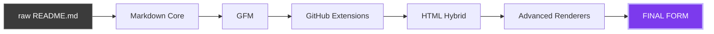
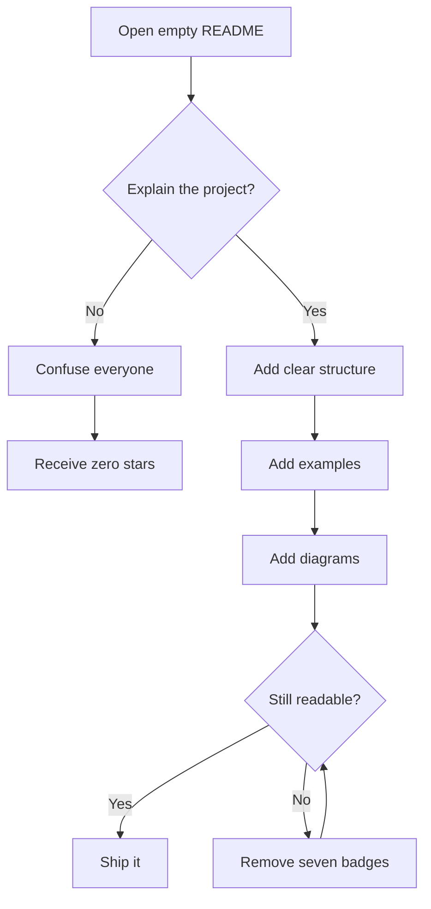
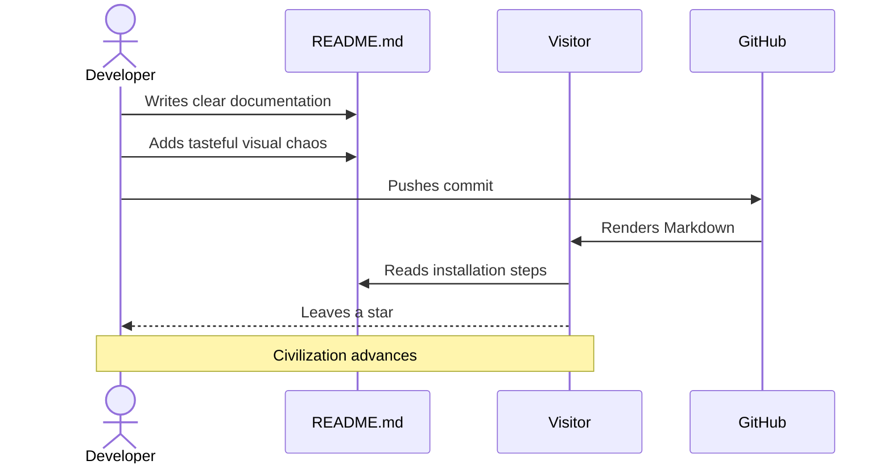
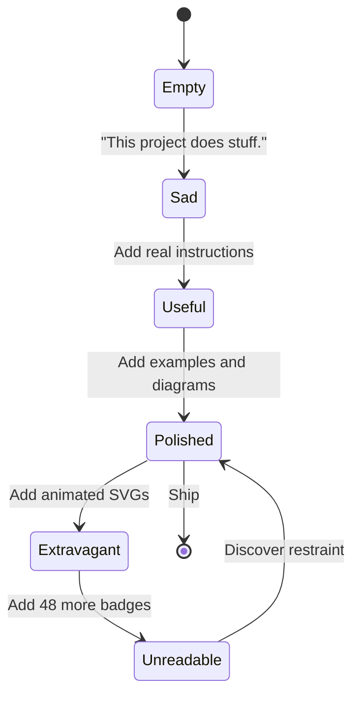

<!--
╔══════════════════════════════════════════════════════════════════════════════╗
║                          LEVEL 00: SOURCE LAYER                              ║
║                                                                              ║
║  Achievement unlocked: RAW SOURCE EXPLORER                                  ║
║  Secondary achievement: PARSER TAMER                                        ║
║                                                                              ║
║  You inspected README.md before GitHub rendered it.                         ║
║  Rendering stack: Markdown → GFM → GitHub → HTML → Advanced Renderers       ║
╚══════════════════════════════════════════════════════════════════════════════╝

M2 source-only note:
Backslashes, delimiter runs, entities, and fence lengths are now intentional.
If a strange character sequence looks unnecessary, it may be demonstrating the parser.
-->

<div align="center">

<a href="https://www.markdownguide.org/">
  
</a>

<a href="https://readme-typing-svg.demolab.com/demo/">
  
</a>

<br />

<a href="https://www.markdownguide.org/"></a>
<a href="https://github.github.com/gfm/"></a>
<a href="#act-vi--parser--source-lab"></a>
<a href="#the-chaos-index"></a>
<a href="#final-boss"></a>

<br />

<h3>🚨 This is not merely a README.</h3>
<h3>This is a <strong>layer-by-layer Markdown rendering laboratory</strong>.</h3>

<sub>Built with Markdown, GitHub Flavored Markdown, GitHub rendering extensions, HTML fragments, external SVGs, and absolutely no JavaScript.</sub>

<br /><br />

<a href="#act-i--markdown-core"><strong>⚡ Enter Markdown Core</strong></a>
&nbsp;•&nbsp;
<a href="#act-iii--github-extensions"><strong>🧪 Open GitHub Extensions</strong></a>
&nbsp;•&nbsp;
<a href="#act-vi--parser--source-lab"><strong>⌁ Enter the Parser Lab</strong></a>
&nbsp;•&nbsp;
<a href="#final-boss"><strong>👑 Fight the Final Boss</strong></a>

</div>

---

> [!CAUTION]
> **Plain text has been detected.**  
> Remain calm. Put down the `.docx`. Step away from the formatting toolbar.

> [!IMPORTANT]
> A README should explain a project clearly before it attempts visual domination.  
> This repository deliberately pushes presentation far beyond normal documentation—but every trick is assigned to a rendering layer.

---

## 🧭 README POWER MAP

This document is organized by **rendering layer**, not by random feature order. Each act moves one level farther away from plain text.

| Act | Rendering layer | Current demonstrations | Jump |
| :---: | --- | --- | :---: |
| `00` | [Source Layer](#level-00--source-layer) | Hidden comments, raw-source-only content | `RAW` |
| `I` | [Markdown Core](#act-i--markdown-core) | Typography, headings, line breaks, lists, quotes, links | `#` |
| `II` | [GitHub Flavored Markdown](#act-ii--github-flavored-markdown) | Tables, task lists, strikethrough | `GFM` |
| `III` | [GitHub Extensions](#act-iii--github-extensions) | Alerts, code highlighting, footnotes | `GH` |
| `IV` | [HTML Hybrid](#act-iv--html-hybrid) | Inline HTML, media control, collapsible interfaces | `<>` |
| `V` | [Advanced Rendering](#act-v--advanced-rendering) | Math, Mermaid diagrams | `∞` |
| `VI` | [Parser & Source Lab](#act-vi--parser--source-lab) | Escapes, entities, backticks, delimiter rules, recursion | `\` |
| `VII` | [Endgame & Reference](#act-vii--endgame--reference) | Achievements, cheat sheet, QA | `✓` |
| `∞` | [Final Boss](#final-boss) | Combined mechanics | `👑` |

### Capability classification

Every major section belongs to one or more explicit layers:

`Markdown` · `GFM` · `GitHub` · `HTML` · `External Asset`

This distinction matters: not everything rendered inside a GitHub README is technically Markdown.

---

## 🧬 THE RENDERING STACK


```mermaid
flowchart LR
    A["raw README.md"] --> B["Markdown Core"]
    B --> C["GFM"]
    C --> D["GitHub Extensions"]
    D --> E["HTML Hybrid"]
    E --> F["Advanced Renderers"]
    F --> G["FINAL FORM"]

    A:::raw
    G:::power

    classDef raw fill:#3b3b3b,color:#ffffff,stroke:#777777
    classDef power fill:#7c3aed,color:#ffffff,stroke:#c4b5fd,stroke-width:3px
```

---

# LEVEL 00 — SOURCE LAYER

`HTML` · `Source-only`

Some README behavior exists only **before** GitHub renders the document.

The giant achievement at the top of this file is hidden inside an HTML comment. Rendered-view readers never see it; raw-source readers do.

```html
<!--
This exists in README.md...
but disappears when GitHub renders it.
-->
```

<!--
Architecture invariant:
Future phases extend the correct rendering act instead of appending unrelated sections.

M2 invariant:
Do not "clean up" escape sequences or variable-length backtick fences without checking
whether they are live parser demonstrations.
-->

> [!NOTE]
> The source view and the rendered view are intentionally treated as two different surfaces of the same README.

---

# ACT I — MARKDOWN CORE

> The portable foundation: structure, inline syntax, whitespace, and delimiter behavior that make the rest possible.

## LEVEL 01 — TYPOGRAPHY & INLINE POWER

`Markdown` · `GFM` · `HTML`

Markdown offers multiple delimiter forms that can produce the same visual result.

### Delimiter arsenal

| Source | Result | Role |
| --- | --- | --- |
| `*italic*` | *italic* | Emphasis |
| `_italic_` | _italic_ | Alternate emphasis |
| `**bold**` | **bold** | Strong emphasis |
| `__bold__` | __bold__ | Alternate strong emphasis |
| `***bold italic***` | ***bold italic*** | Combined emphasis |
| `___bold italic___` | ___bold italic___ | Alternate combined emphasis |
| `~~deleted~~` | ~~deleted~~ | GFM strikethrough |
| `` `inline code` `` | `inline code` | Literal technical text |
| `<sub>small</sub>` | <sub>small</sub> | HTML subscript |
| `<sup>high</sup>` | <sup>high</sup> | HTML superscript |
| `<ins>inserted</ins>` | <ins>inserted</ins> | HTML insertion |

### Formatting combo attacks

**Bold text containing _italic text containing `inline code`_ while remaining bold.**

~~This sentence was removed for being **insufficiently dramatic**.~~

**Strong outside, _emphasis inside_, and `code at the core`.**

Asterisks and underscores are similar—but not identical in every parser context:

- `foo_bar_baz` → foo_bar_baz
- `foo*bar*baz` → foo*bar*baz

The intraword underscore is deliberately conservative, which is why identifiers such as `snake_case_variable` stay readable.

### Keyboard and scale

Press <kbd>Ctrl</kbd> + <kbd>Shift</kbd> + <kbd>V</kbd> to paste without formatting.

Press <kbd>.</kbd> on a GitHub repository to open it in the web editor.

<sub>Tiny text of humility.</sub>  
Normal text of confidence.  
<sup>Superscript of unreasonable superiority.</sup>

> [!TIP]
> Delimiters are syntax, not decoration. Choose forms that remain readable in raw source as well as rendered output.

---

## LEVEL 02 — STRUCTURE, HEADINGS & WHITESPACE

`Markdown`

### ATX heading ladder

<details>
<summary><strong>🏛️ Open the six-level heading hierarchy</strong></summary>

# Header 1 — The Emperor

## Header 2 — The Chancellor

### Header 3 — The Strategist

#### Header 4 — The Specialist

##### Header 5 — The Intern with Production Access

###### Header 6 — The Fine Print Nobody Read

</details>

### Setext: the other heading syntax

Markdown also has an older, visually different heading form. It supports only levels 1 and 2.

<details>
<summary><strong>📜 Render actual Setext headings</strong></summary>

Setext Level One
================

Setext Level Two
----------------

</details>

Source:

```md
Setext Level One
================

Setext Level Two
----------------
```

> [!NOTE]
> The heading demonstrations are collapsed so the README's real architecture remains visually dominant.

### Line-break laboratory

Three concepts matter when exact line layout matters:

1. A **blank line** starts a new paragraph.
2. Two trailing spaces create an explicit Markdown hard break.  
   This sentence begins after that hard break.
3. `<br />` gives HTML-level control.<br />This sentence begins after an HTML break.

Source:

```md
Paragraph one.

Paragraph two.

Hard break using two trailing spaces.  
Next line.

HTML break.<br />Next line.
```

> [!TIP]
> A single newline can behave as a soft break depending on the rendering context. Use explicit hard-break syntax when exact presentation matters.

---

## LEVEL 03 — LISTS, QUOTES & NAVIGATION

`Markdown` · `HTML`

### List-based domination

- Normal point
- **Strong point**
- `Inline code point`
- [Hyperlinked flex](https://www.markdownguide.org/)
  - Nested idea
    - Deeper context
      - Suspiciously deep sub-point
        - We have entered the list mines
          - **Send indentation**

### Ordered chaos

1. Write the README.
2. Add useful structure.
3. Add tasteful decoration.
4. Ignore the word “tasteful.”
5. Add an animated banner.
6. Achieve documentation transcendence.

### Mixed-species list

1. **Project setup**
   - Create `README.md`
   - Add a title
   - Explain the project
2. **Visual escalation**
   - Add badges
   - Add diagrams
   - Add collapsible sections
3. **Final verification**
   - Preview on GitHub
   - Test every link
   - Pretend this was always the plan

### Quotation fortress

> “Markdown is just plain text,” they whispered.
>
> > “Then why does it have tables?” asked the apprentice.
> >
> > > “And diagrams?” asked the architect.
> > >
> > > > “And mathematical notation?” asked the economist.
> > > >
> > > > > The room became silent.

### Ordinary links

- [Learn Markdown](https://www.markdownguide.org/)
- [Read GitHub’s formatting documentation](https://docs.github.com/en/get-started/writing-on-github)
- [Study the GitHub Flavored Markdown specification](https://github.github.com/gfm/)
- [Generate badges with Shields.io](https://shields.io/)
- [Build an animated typing SVG](https://readme-typing-svg.demolab.com/demo/)
- [Return to the top](#)

[Hover over this link before clicking](https://www.markdownguide.org/ "You have discovered tooltip technology.")

> [!NOTE]
> The dedicated link phase will expand reference links, relative repository links, autolinks, and repository-native references. M2 leaves that scope intact.

---

# ACT II — GITHUB FLAVORED MARKDOWN

> GFM adds practical extensions that make Markdown much more useful for software documentation.

## LEVEL 04 — TABLE TECHNOLOGY

`GFM`

| Syntax | Ability unlocked | Power | Recommended usage |
| :---: | --- | :---: | --- |
| `*text*` | _Italics_ | 🧍 | Gentle emphasis |
| `**text**` | **Bold** | 💪 | Important concepts |
| `***text***` | ***Galaxy brain*** | 🧠 | Controlled drama |
| `` `code` `` | `Monospace` | 🧪 | Commands and identifiers |
| `~~text~~` | ~~Strikethrough~~ | 🗡️ | Corrections and jokes |
| `[text](url)` | Teleportation | 🌀 | Useful destinations |
| `` | Image summoning | 🖼️ | Screenshots and art |

| README State | Stars | Aura |
| :--- | :---: | :---: |
| `This project does stuff.` | `0` | 🪦 |
| Clear documentation | `+10` | 📘 |
| Clear documentation with diagrams | `+100` | 🧠 |
| Clear documentation with animated SVGs | `OVER 9000` | ⚡ |

---

## LEVEL 05 — TASK-LIST SKILL TREE

`GFM`

- [x] Admit Markdown is useful
- [x] Stop treating documentation as an afterthought
- [x] Learn GitHub Flavored Markdown
- [x] Discover task lists
- [x] Learn that backslashes can prevent syntax
- [x] Discover that entities can smuggle punctuation past the parser
- [ ] Use formatting responsibly
- [ ] Resist adding seventeen more badges
- [ ] Fail to resist
  - [x] Add seventeen more badges
  - [ ] Experience regret
    - [ ] Regret not found

```diff
+ Added Markdown skills
+ Added visual hierarchy
+ Added actual documentation
+ Added parser awareness
- Removed excuses
- Removed "I'll write it later"
- Removed one tragic README
```

---

# ACT III — GITHUB EXTENSIONS

> GitHub adds behavior beyond baseline GFM: alerts, syntax highlighting, footnotes, rich rendering, and repository-aware presentation.

## LEVEL 06 — ALERT COMMAND CENTER

`GitHub`

> [!NOTE]
> Useful information for readers who skim.

> [!TIP]
> Helpful advice that improves the result.

> [!IMPORTANT]
> Information required for success.

> [!WARNING]
> Something may go wrong.

> [!CAUTION]
> Something has already gone wrong. You edited parser examples without previewing them.

---

## LEVEL 07 — CODE-BLOCK ALCHEMY

`Markdown` · `GitHub`

### JavaScript

```javascript
const excuses = [];

function upgradeReadme(readme) {
  if (!readme) {
    throw new Error("README not found. Reputation damage imminent.");
  }

  return {
    ...readme,
    clarity: 100,
    style: "extravagant",
    parserAwareness: true,
    chaos: Infinity,
  };
}

console.log(upgradeReadme({ format: "Markdown" }));
```

### Python

```python
from dataclasses import dataclass
from math import inf


@dataclass(frozen=True)
class Readme:
    clarity: int
    style: str
    parser_awareness: bool
    chaos: float


README = Readme(
    clarity=100,
    style="unreasonably polished",
    parser_awareness=True,
    chaos=inf,
)

print(README)
```

### Bash

```bash
#!/usr/bin/env bash
set -euo pipefail

printf '%s\n' "Scanning repository..."

if [[ ! -f README.md ]]; then
  echo "Critical failure: documentation missing."
  exit 1
fi

echo "README detected."
echo "Deploying unnecessary levels of style..."
```

### JSON

```json
{
  "document": "README.md",
  "phase": "M2",
  "status": "overengineered",
  "features": [
    "delimiters",
    "escapes",
    "entities",
    "nested-fences",
    "diagrams",
    "collapsible-sections"
  ],
  "excusesRemaining": 0
}
```

### The sacred diff

```diff
- Markdown is just symbols around text.
+ Markdown is a parser with delimiter, whitespace, and precedence rules.

- Backslashes are ugly.
+ Backslashes are escape hatches.

- Three backticks are enough forever.
+ Fence length is a tool.
```

### Status transmission

`$ echo "learn markdown"`  
`$ git add README.md`  
`$ git commit -m "docs: understand the parser"`  
`$ git push origin main`  
`> repository aura increased successfully`

---

## LEVEL 08 — FOOTNOTES & GITHUB KNOWLEDGE

`GitHub`

Markdown looks simple because the complexity is hiding politely.[^plain-text]

GitHub adds features beyond basic Markdown, including task lists, alerts, diagrams, and mathematical expressions.[^gfm]

Animated banners in this README are externally rendered SVG images—not JavaScript executing inside the document.[^animation]

---

# ACT IV — HTML HYBRID

> GitHub Markdown can safely render selected HTML fragments, enabling layout and interaction patterns that Markdown syntax alone cannot express.

## LEVEL 09 — INLINE HTML & MEDIA CONTROL

`HTML` · `External Asset`

### Clickable image portal

<p align="center">
  <a href="https://www.markdownguide.org/">
    
  </a>
</p>

### Theme-aware imagery

GitHub can display different images for light and dark themes:

```html
<picture>
  <source
    media="(prefers-color-scheme: dark)"
    srcset="assets/banner-dark.svg"
  />
  <source
    media="(prefers-color-scheme: light)"
    srcset="assets/banner-light.svg"
  />
  
</picture>
```

> [!TIP]
> These paths remain a syntax demonstration for now. A later media phase will convert theme-aware imagery into a live repository-owned demonstration.

---

## LEVEL 10 — COLLAPSIBLE INTERFACE SYSTEM

`HTML` · `Markdown`

<details>
<summary><strong>🧠 Click to reveal forbidden Markdown wisdom</strong></summary>

<br />

You clicked it.

This means you possess:

- curiosity,
- functional motor control,
- and at least partial immunity to boring documentation.

```md
<details>
<summary>Visible title</summary>

Hidden Markdown content goes here.

</details>
```

</details>

<details>
<summary><strong>🐉 Open the optional boss encounter</strong></summary>

### The Documentation Dragon

**HP:** `10,000`  
**Weakness:** Clear installation instructions  
**Special attack:** Outdated screenshots  
**Loot:** Contributor trust

- [x] Add prerequisites
- [x] Add copyable commands
- [x] Explain configuration
- [x] Document common failures
- [ ] Stop adding lore to the README

</details>

<details>
<summary><strong>🎁 Definitely not a trap</strong></summary>

<br />

<div align="center">
  <h2>It was a trap.</h2>
  <p>But at least it was semantic HTML.</p>
</div>

</details>

---

# ACT V — ADVANCED RENDERING

> The point where a `.md` file stops looking like plain documentation and starts behaving like a rendering surface.

## LEVEL 11 — MATHEMATICAL SUPERIORITY

`GitHub` · `Math`

Inline mathematics:

$`E = mc^2`$

A practical documentation model:

```math
\text{README Quality}
=
\frac{\text{Clarity}\times\text{Structure}\times\text{Accuracy}}
{\text{Unexplained Assumptions}+1}
```

The universal law of repository first impressions:

```math
\lim_{\text{documentation}\to 0}\text{user confidence}=0
```

And the forbidden equation:

```math
\text{Markdown}+\text{Restraint}^{-1}=\text{This README}
```

> [!NOTE]
> M2 intentionally leaves the math renderer mostly unchanged. The dedicated mathematics phase will expand this substantially.

---

## LEVEL 12 — MERMAID SUMMONING CIRCLE

`GitHub` · `Mermaid`

### The README production pipeline


```mermaid
flowchart TD
    A[Open empty README] --> B{Explain the project?}
    B -- No --> C[Confuse everyone]
    C --> D[Receive zero stars]
    B -- Yes --> E[Add clear structure]
    E --> F[Add examples]
    F --> G[Add diagrams]
    G --> H{Still readable?}
    H -- Yes --> I[Ship it]
    H -- No --> J[Remove seven badges]
    J --> H
```

### Sequence of enlightenment


```mermaid
sequenceDiagram
    actor Dev as Developer
    participant MD as README.md
    participant User as Visitor
    participant GitHub

    Dev->>MD: Writes clear documentation
    Dev->>MD: Adds tasteful visual chaos
    Dev->>GitHub: Pushes commit
    GitHub->>User: Renders Markdown
    User->>MD: Reads installation steps
    User-->>Dev: Leaves a star
    Note over Dev,User: Civilization advances
```

### Documentation state machine


```mermaid
stateDiagram-v2
    [*] --> Empty
    Empty --> Sad: "This project does stuff."
    Sad --> Useful: Add real instructions
    Useful --> Polished: Add examples and diagrams
    Polished --> Extravagant: Add animated SVGs
    Extravagant --> Unreadable: Add 48 more badges
    Unreadable --> Polished: Discover restraint
    Polished --> [*]: Ship
```

### Reserved expansion slots

```text
ACT V — ADVANCED RENDERING
├── Mathematics            ✅ current
├── Mermaid                ✅ current
├── GeoJSON                ◌ future phase
├── TopoJSON               ◌ future phase
└── STL / interactive 3D   ◌ future phase
```

---

# ACT VI — PARSER & SOURCE LAB

> This is where Markdown stops being a bag of formatting shortcuts and reveals itself as a parser with rules about delimiters, escapes, whitespace, and precedence.

## LEVEL 13 — ESCAPE HATCH

`Markdown` · `Source-aware`

A backslash can neutralize punctuation that would otherwise become Markdown syntax.

### Structural disarmament

These lines look dangerous in source but render as ordinary text:

\# Not a heading  
\> Not a blockquote  
\- Not a list item  
1\. Not an ordered-list item  
\*Not emphasis\*  
\[Not a link\](still-not-a-url)

Source:

```md
\# Not a heading
\> Not a blockquote
\- Not a list item
1\. Not an ordered-list item
\*Not emphasis\*
\[Not a link\](still-not-a-url)
```

### Escape matrix

| Desired literal | Source | If unescaped, it may start... |
| :---: | :---: | --- |
| `*` | `\*` | emphasis / list syntax |
| `_` | `\_` | emphasis |
| `#` | `\#` | heading syntax |
| `>` | `\>` | blockquote syntax |
| `[` | `\[` | link text |
| `]` | `\]` | link text termination |
| `(` | `\(` | link destination grouping |
| `)` | `\)` | link destination grouping |
| `+` | `\+` | list syntax |
| `-` | `\-` | list / thematic-break syntax |
| `.` | `\.` | ordered-list punctuation |
| `!` | `\!` | image syntax |
| `|` | `\|` | GFM table delimiter |
| `~` | `\~` | strikethrough delimiter |
| `\` | `\\` | the escape character itself |

> [!TIP]
> Escaping is not merely for showing examples. It is how documentation can safely discuss Markdown syntax using Markdown itself.

---

## LEVEL 14 — BACKTICK PARADOX

`Markdown` · `Parser`

Inline code is delimited by backticks—but the delimiter can be **longer than the backticks inside the content**.

Normal code span:

`README.md`

A code span containing literal backticks:

``Use a `backtick` inside code``

Source:

```md
`README.md`

``Use a `backtick` inside code``
```

The parser sees the two-backtick run as the outer delimiter, so the single backticks become ordinary content.

### Fence escalation

The same principle works for fenced blocks. If the content itself contains triple backticks, wrap the demonstration in a longer fence:

````md
```javascript
console.log("Three backticks can live inside four.");
```
````

That block is not fake. The outer fence really is four backticks.

> [!IMPORTANT]
> Fence length is part of the syntax. More backticks are not decoration; they are a parser-control mechanism.

---

## LEVEL 15 — DELIMITER COLLISION LAB

`Markdown` · `GFM`

Markdown has multiple delimiter systems that can coexist.

### Same visual result, different source

*asterisk emphasis*  
_underscore emphasis_

**asterisk strong**  
__underscore strong__

***asterisk triple***  
___underscore triple___

### Delimiters inside delimiters

**Strong containing _emphasis_.**

_Emphasis containing **strong** text._

~~Strikethrough containing **strong** text and `code`.~~

### Parser-safe identifiers

The source `economic_math_student` stays intact as economic_math_student rather than unexpectedly italicizing `math`.

The point is not memorizing obscure precedence rules. The point is recognizing that Markdown does **context-sensitive delimiter parsing**, not blind character replacement.

---

## LEVEL 16 — ENTITY REACTOR

`Markdown` · `HTML`

HTML character references can represent characters that would otherwise be awkward, ambiguous, or syntax-significant in source.

### Named entities

| Source | Rendered | Meaning |
| --- | :---: | --- |
| `&copy;` | &copy; | copyright |
| `&reg;` | &reg; | registered |
| `&trade;` | &trade; | trademark |
| `&rarr;` | &rarr; | right arrow |
| `&larr;` | &larr; | left arrow |
| `&harr;` | &harr; | horizontal arrow |
| `&times;` | &times; | multiplication |
| `&divide;` | &divide; | division |
| `&plusmn;` | &plusmn; | plus/minus |
| `&ne;` | &ne; | not equal |
| `&le;` | &le; | less than or equal |
| `&ge;` | &ge; | greater than or equal |
| `&infin;` | &infin; | infinity |
| `&pi;` | &pi; | pi |
| `&lambda;` | &lambda; | lambda |

### Named, decimal, hexadecimal: same character

| Encoding | Source | Result |
| --- | --- | :---: |
| Named | `&copy;` | &copy; |
| Decimal | `&#169;` | &#169; |
| Hexadecimal | `&#xA9;` | &#xA9; |

### Escaping HTML-looking text without a code span

`&lt;div&gt;not an HTML element&lt;/div&gt;` renders as:

&lt;div&gt;not an HTML element&lt;/div&gt;

Likewise:

- `&amp;` → &amp;
- `&quot;` → &quot;
- `&lt;` → &lt;
- `&gt;` → &gt;

### Parser smuggling trick

This source contains encoded asterisks:

```md
&#42;these stars are characters, not emphasis delimiters&#42;
```

Rendered:

&#42;these stars are characters, not emphasis delimiters&#42;

They visually become `*`, but they were not parsed as emphasis delimiters because the entity reference itself occupied the source position.

> [!NOTE]
> Entities are useful when you need the **character** without wanting that character to participate in Markdown syntax.

---

## LEVEL 17 — WHITESPACE & RECURSION CHAMBER

`Markdown` · `Parser`

Whitespace can change block structure, while fence length can change where parsing begins and ends.

### Paragraph boundary

```md
This is paragraph one.

This is paragraph two because a blank line separates it.
```

### Explicit hard break

```md
First line ends with two spaces.  
Second line begins immediately below it.
```

### Markdown inception

The cheat sheet later in this README uses **four outer backticks** so it can safely contain ordinary triple-backtick code fences inside itself.

````md
```md
**Markdown shown inside Markdown shown inside Markdown.**
```
````

### Source-only knowledge

The following message exists in the file but disappears from rendered output:

```html
<!--
Future maintainers:
The parser examples are intentional.
Probably do not normalize them with an aggressive formatter.
-->
```

<!--
Future maintainers:
The parser examples are intentional.
Probably do not normalize them with an aggressive formatter.
-->

---

# ACT VII — ENDGAME & REFERENCE

> The laboratory ends here; what follows measures what was unlocked and keeps the README practically useful.

## 🏅 ACHIEVEMENTS UNLOCKED

<p align="center">
  
  
  
  
  
</p>

| Achievement | Requirement | Status |
| --- | --- | :---: |
| **The Emphasizer** | Use alternate and nested emphasis delimiters | ✅ |
| **List Archaeologist** | Reach five nesting levels | ✅ |
| **Table Architect** | Align columns intentionally | ✅ |
| **Alert Commander** | Deploy all five GitHub alerts | ✅ |
| **Diagram Summoner** | Render Mermaid successfully | ✅ |
| **Source Diver** | Hide meaningful source-only content | ✅ |
| **Parser Tamer** | Neutralize syntax with escapes | ✅ |
| **Backtick Heretic** | Put backticks inside a backtick-delimited span | ✅ |
| **Entity Alchemist** | Use named, decimal, and hexadecimal entities | ✅ |
| **Recursion Engineer** | Nest fenced-code demonstrations safely | ✅ |
| **Master of Restraint** | Stop before adding too much | ❌ |

---

## THE CHAOS INDEX

```text
Clarity        ████████████████████ 100%
Structure      ████████████████████ 100%
Navigation     ████████████████████ 100%
Typography     ████████████████████ 100%
Parser Tricks  ███████████████████░  95%
Entities       ████████████████████ 100%
Animation      ████████████████░░░░  80%
Badge Density  ██████████████████░░  90%
Restraint      ██░░░░░░░░░░░░░░░░░░  10%
Raw Power      ██████████████░░░░░░  M2
```

> [!WARNING]
> A powerful README that cannot explain why its own syntax works is still just visual noise.
>
> **M2 makes the parser itself part of the showcase.**

---

## 🧰 THE ACTUALLY USEFUL CHEAT SHEET

````md
# ATX Heading 1
## ATX Heading 2
### ATX Heading 3

Setext Heading 1
================

Setext Heading 2
----------------

*italic* or _italic_
**bold** or __bold__
***bold italic*** or ___bold italic___
~~strikethrough~~
`inline code`
``code containing a `backtick` ``

\# escaped heading marker
\*literal asterisks\*
1\. escaped ordered-list marker

Hard break using two spaces.  
Next line.

HTML break.<br />Next line.

&copy; &rarr; &infin;
&#169; &#xA9;
&lt;literal-tag&gt;

[link text](https://example.com)


> Blockquote

> [!IMPORTANT]
> GitHub alert

- Bullet
  - Nested bullet

1. Ordered item
2. Another item

- [x] Complete
- [ ] Incomplete

| Column A | Column B |
| --- | --- |
| Value | Value |

```language
fenced code block
```

<details>
<summary>Click to expand</summary>

Hidden Markdown content

</details>

Here is a footnote.[^1]

[^1]: Footnote text.
````

> [!NOTE]
> The inner triple-backtick example is protected by four outer backticks. The fence length is intentional.

---

## 🧯 COMMON README CRIMES

| Crime | Sentence |
| --- | --- |
| No explanation | Visitors leave immediately |
| No installation steps | Users guess incorrectly |
| Broken image links | Permanent visual shame |
| Giant unstructured paragraphs | Nobody reads them |
| Forty badges before the title | Immediate suspicion |
| Screenshots with no alt text | Accessibility failure |
| Commands that were never tested | Production chaos |
| “Documentation coming soon” | It is not coming soon |
| Decorative overload | The content disappears |
| Flat feature dumping | The README becomes impossible to extend |
| “Cleaning up” meaningful escapes | Parser demonstrations silently break |
| Assuming every symbol is simple replacement syntax | Markdown disagrees |

---

## 🧪 README QUALITY TEST

Before pushing, verify:

- [ ] The first paragraph explains what the project does.
- [ ] The installation steps work in a clean environment when applicable.
- [ ] Every command can be copied safely.
- [ ] Every link opens the intended destination.
- [ ] Every image has useful alt text.
- [ ] The document works in light and dark mode.
- [ ] The mobile layout remains readable.
- [ ] Decorative elements support rather than bury the content.
- [ ] Every advanced feature belongs to the correct rendering layer.
- [ ] Escape sequences still render as intended.
- [ ] Nested fence lengths have not been normalized accidentally.
- [ ] Entity demonstrations render as characters rather than unintended syntax.
- [ ] The README was previewed on GitHub.

---

# FINAL BOSS

<div align="center">

<a href="https://www.markdownguide.org/">
  
</a>

<h3>The README no longer merely uses Markdown.</h3>
<h3>It now demonstrates why the source becomes the render.</h3>

</div>

```txt
SOURCE
  ↓
DELIMITERS
  ↓
ESCAPES
  ↓
WHITESPACE
  ↓
ENTITIES
  ↓
GFM + GITHUB + HTML
  ↓
ADVANCED RENDERING
  ↓
FINAL FORM
```

<div align="center">

<p>
  The parser has rules.<br />
  The rules can be demonstrated.<br />
  The demonstrations can themselves be Markdown.<br />
  Make it <s>unreadable</s> <strong><em>beautifully, strategically ridiculous</em></strong>.
</p>

<br />

<a href="https://www.markdownguide.org/"></a>
<a href="https://docs.github.com/en/get-started/writing-on-github"></a>
<a href="#"></a>

<br />

<h2>🗿 Markdown: Final Form.</h2>
<h3>The parser is now part of the exhibit.</h3>


</div>

---

[^plain-text]: Markdown remains readable as plain text while adding lightweight structural syntax.
[^gfm]: GitHub Flavored Markdown extends common Markdown behavior with GitHub-specific rendering features.
[^animation]: External SVG generators may become unavailable, change behavior, or load slowly. A later phase will move critical visual assets into the repository.
