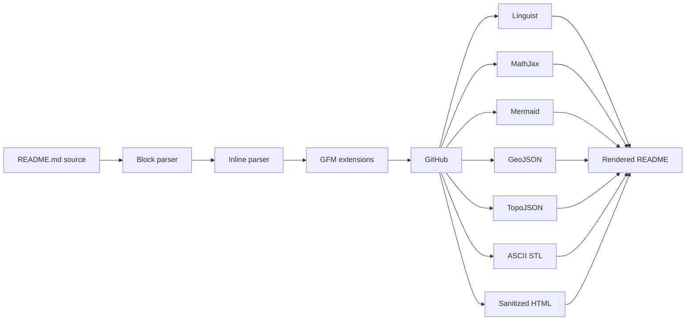
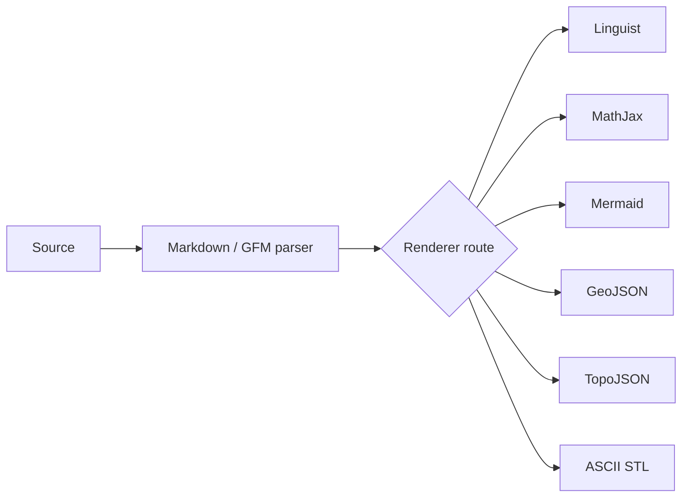
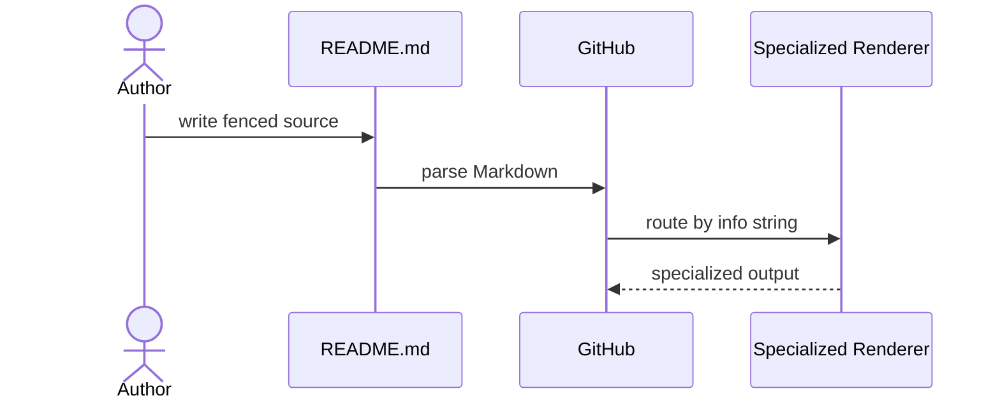
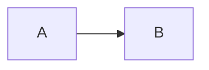
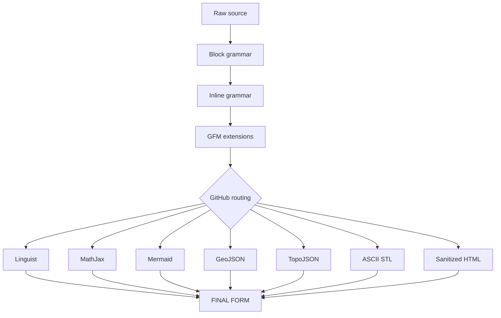

<!--
╔══════════════════════════════════════════════════════════════════════════════╗
║                       LEVEL 00: SOURCE LAYER — M13                          ║
║                                                                              ║
║  PARSER TAMER · BLOCK ARCHITECT · LINK CARTOGRAPHER · MEDIA ENGINEER         ║
║  HYBRID ENGINEER · SYNTAX CURATOR · MATHJAX ARCHITECT · MERMAID CARTOGRAPHER║
║  GEOJSON NAVIGATOR · TOPOLOGY ENGINEER · STL MESHSMITH · GRAMMAR BREAKER    ║
║                                                                              ║
║  M13 invariant: dangerous delimiters are tests, not formatting accidents.    ║
║  Do not normalize fences, escapes, whitespace, pipes, or blank lines blindly.║
╚══════════════════════════════════════════════════════════════════════════════╝
-->

<picture>
  <source media="(prefers-color-scheme: dark)" srcset="./assets/hero-dark.svg">
  <source media="(prefers-color-scheme: light)" srcset="./assets/hero-light.svg">
  
</picture>

<div align="center">

<a href="https://readme-typing-svg.demolab.com/demo/">
  
</a>

<br>

<a href="#level-27--full-parser--edge-case-torture-test"></a>
<a href="#renderer-routing"></a>
<a href="./assets/parser-torture-corpus.txt"></a>
<a href="#final-boss"></a>

<h3>MARKDOWN: FINAL FORM</h3>
<sub>Markdown · GFM · Linguist · MathJax · Mermaid · GeoJSON · TopoJSON · ASCII STL · HTML · parser torture</sub>

<br><br>

<a href="#act-i--markdown-core"><strong>⚡ Core</strong></a>
&nbsp;•&nbsp;
<a href="#act-iii--github-extensions"><strong>⌘ GitHub</strong></a>
&nbsp;•&nbsp;
<a href="#act-v--advanced-rendering"><strong>∞ Renderers</strong></a>
&nbsp;•&nbsp;
<a href="#level-27--full-parser--edge-case-torture-test"><strong>⚠ Parser Lab</strong></a>
&nbsp;•&nbsp;
<a href="#final-boss"><strong>👑 Final Boss</strong></a>

</div>

---

> [!IMPORTANT]
> **M13 adds no new major renderer.** Its job is to prove that the enormous M0–M12 document can survive Markdown/GFM precedence rules, delimiter collisions, nested containers, renderer fences, HTML boundaries, math dollars, table pipes, references, footnotes, and deliberate malformed-source demonstrations without casually collapsing into parser debris.

## 🧭 README POWER MAP

| Act | Layer | M13 responsibility | Jump |
| :---: | --- | --- | :---: |
| `00` | Source Layer | invariants + raw fixture corpus | `RAW` |
| `I` | Markdown Core | inline/block grammar | `#` |
| `II` | GFM | tables, tasks, strike, autolinks | `GFM` |
| `III` | GitHub Extensions | alerts, Linguist, footnotes | `GH` |
| `IV` | HTML Hybrid | media, details, safe semantic HTML | `<>` |
| `V` | Advanced Rendering | MathJax, Mermaid, GeoJSON, TopoJSON, STL | `∞` |
| `VI` | Parser Torture | precedence, recursion, ambiguity, failures | `⚠` |
| `VII` | Endgame | achievements, QA, cheat sheet | `✓` |
| `∞` | Final Boss | composed parser + renderer network | `👑` |

---

## 🧬 RENDERING / PARSING STACK


```mermaid
flowchart LR
    SRC[README.md source] --> BLOCK[Block parser]
    BLOCK --> INLINE[Inline parser]
    INLINE --> GFM[GFM extensions]
    GFM --> GH[GitHub]
    GH --> L[Linguist]
    GH --> MJ[MathJax]
    GH --> MM[Mermaid]
    GH --> GJ[GeoJSON]
    GH --> TJ[TopoJSON]
    GH --> STL[ASCII STL]
    GH --> HTML[Sanitized HTML]
    L --> OUT[Rendered README]
    MJ --> OUT
    MM --> OUT
    GJ --> OUT
    TJ --> OUT
    STL --> OUT
    HTML --> OUT
```

GitHub Flavored Markdown is a CommonMark-derived parser with GFM extensions. Its specification explicitly separates block parsing from inline parsing and defines precedence for code spans, links, HTML, autolinks, emphasis, tables, tasks, and other constructs.[^gfm]

---

# LEVEL 00 — SOURCE LAYER

`HTML` · `Source-only`

```html
<!-- This comment exists in README.md but disappears when rendered. -->
```

<!--
M13 invariants:
- backslashes, blank lines, trailing spaces, and fence lengths may be semantic.
- triple backticks shown as source must live inside a longer outer fence.
- table-content pipes may need escaping even when visually inside inline code.
- malformed Mermaid/GeoJSON/TopoJSON/STL belongs in inert source fences.
- duplicate headings are intentional anchor-collision tests.
- dollar signs may participate in MathJax routing.
- raw HTML and Markdown ownership boundaries are intentional.
- assets/parser-torture-corpus.txt preserves exact dangerous fixtures as plain text.
-->

**Raw source corpus:** [`assets/parser-torture-corpus.txt`](./assets/parser-torture-corpus.txt)

That `.txt` file is deliberately not Markdown. It stores exact dangerous sequences without asking GitHub to interpret them.

---

# ACT I — MARKDOWN CORE

## LEVEL 01 — TYPOGRAPHY & INLINE POWER

| Source | Rendered |
| --- | --- |
| `*italic*` | *italic* |
| `_italic_` | _italic_ |
| `**strong**` | **strong** |
| `__strong__` | __strong__ |
| `***both***` | ***both*** |
| `~~deleted~~` | ~~deleted~~ |
| `` `code` `` | `code` |
| `<sub>2</sub>` | H<sub>2</sub>O |
| `<sup>2</sup>` | x<sup>2</sup> |
| `<ins>new</ins>` | <ins>new</ins> |

**Strong containing _emphasis containing `code`_.**

Intraword comparison: `foo*bar*baz` renders as foo*bar*baz while underscores remain conservative in `foo_bar_baz` according to GFM emphasis rules.[^gfm]

---

## LEVEL 02 — STRUCTURE, HEADINGS & WHITESPACE

<details>
<summary><strong>ATX ladder</strong></summary>

# H1
## H2
### H3
#### H4
##### H5
###### H6

</details>

<details>
<summary><strong>Setext forms</strong></summary>

Setext One
==========

Setext Two
----------

</details>

A blank line starts a new paragraph.

Two trailing spaces create a hard break.  
This is the next visual line.

A backslash also creates a hard break.\
This line follows it.

And HTML can force one.<br>
This line follows the `<br>`.

---

## LEVEL 03 — LIST / QUOTE CONTAINERS

- Level one
  - Level two
    - Level three
      - Level four

1. **Quote inside list**

   > A blockquote can live inside a list item.
   >
   > - [x] task inside quote
   > - [ ] another task

2. **Fence inside list**

   ```bash
   printf '%s\n' "nested fenced block"
   ```

> **List inside quote**
>
> 1. ordered
> 2. ordered
>
> ```text
> quote-prefixed fence
> ```

---

## LEVEL 04 — LINKS / REFERENCES

[Inline](https://example.com) · [Hover title](https://example.com "Title") · [Markdown Guide][markdown-guide] · [GitHub Docs][] · [GFM Spec]

- [README](./README.md)
- [Raw torture corpus](./assets/parser-torture-corpus.txt)
- [GeoJSON asset](./assets/geojson-showcase.geojson)
- [TopoJSON asset](./assets/topojson-showcase.topojson)
- [STL asset](./assets/stl-showcase.stl)
- [Parser torture](#level-27--full-parser--edge-case-torture-test)

Autolinks:

<https://github.com/>  
<docs@example.com>  
https://github.com  
www.github.com

---

# ACT II — GITHUB FLAVORED MARKDOWN

## LEVEL 05 — TABLE ENGINE

| Left | Center | Right |
| :--- | :---: | ---: |
| alpha | beta | 100 |
| **bold** | `code` | 200 |
| alpha \| beta | `left\|right` | 300 |

> [!NOTE]
> GFM table cells are inline-parsed, but the table parser still uses `|` as a structural delimiter. Escaping pipes is therefore a real parser concern, including inside code-looking cell content.[^gfm]

---

## LEVEL 06 — TASK TREE

- [x] **M0–M12 capability acquisition**
  - [x] Markdown / GFM
  - [x] GitHub extensions
  - [x] local SVG media
  - [x] HTML hybrid
  - [x] 33 syntax modes
  - [x] MathJax
  - [x] Mermaid
  - [x] GeoJSON
  - [x] TopoJSON
  - [x] ASCII STL
- [x] **M13 parser hardening**
  - [x] delimiter precedence
  - [x] code-span lengths
  - [x] fence recursion
  - [x] tilde/backtick fence comparison
  - [x] list/quote/details nesting
  - [x] table-pipe containment
  - [x] link/reference edge cases
  - [x] duplicate headings
  - [x] HTML boundaries
  - [x] entities
  - [x] math-dollar collisions
  - [x] footnotes
  - [x] malformed renderer containment
  - [x] raw plain-text corpus
- [ ] **M14–M17 hardening / endgame**
  - [ ] progression overhaul
  - [ ] Final Boss composition
  - [ ] accessibility/mobile/themes
  - [ ] final GitHub rendering regression

---

# ACT III — GITHUB EXTENSIONS

## LEVEL 07 — ALERT COMMAND CENTER

> [!NOTE]
> Parser tests are useful only if the expected behavior is explicit.

> [!TIP]
> Use a longer outer fence instead of escaping every inner backtick.

> [!IMPORTANT]
> Code spans, links, HTML tags, and autolinks bind more tightly than emphasis in GFM's inline parser.[^gfm]

> [!WARNING]
> A formatter that removes blank lines or “normalizes” escaped pipes can silently change rendering.

> [!CAUTION]
> Deliberately malformed renderer source must stay inert. A broken live `mermaid`, `geojson`, `topojson`, or `stl` block looks like a regression, not a test.

---

## LEVEL 08 — SYNTAX-HIGHLIGHTING MUSEUM

M7's **33-mode Linguist breadth** remains represented compactly below.

<details>
<summary><strong>Web / data / markup</strong></summary>

```javascript
console.log("JavaScript");
```
```typescript
const phase: number = 13;
```
```html
<details><summary>HTML</summary></details>
```
```css
.readme { display: block; }
```
```json
{"phase":"M13"}
```
```yaml
phase: M13
```
```toml
phase = "M13"
```
```xml
<phase>M13</phase>
```
```sql
SELECT 'M13';
```

</details>

<details>
<summary><strong>Compiled / systems</strong></summary>

```c
int main(void){return 0;}
```
```cpp
#include <iostream>
int main(){std::cout << "C++";}
```
```rust
fn main(){println!("Rust");}
```
```go
package main
func main(){}
```
```java
class Main { public static void main(String[] a){} }
```
```csharp
Console.WriteLine("C#");
```
```kotlin
fun main() = println("Kotlin")
```
```swift
print("Swift")
```

</details>

<details>
<summary><strong>Scripting / scientific / functional</strong></summary>

```python
print("Python")
```
```ruby
puts "Ruby"
```
```php
<?php echo "PHP";
```
```lua
print("Lua")
```
```bash
printf '%s\n' Bash
```
```powershell
Write-Output 'PowerShell'
```
```r
print(pi)
```
```julia
println(pi)
```
```haskell
main = print pi
```
```scala
@main def run() = println(math.Pi)
```
```latex
\int_0^1 x^2\,dx
```

</details>

<details>
<summary><strong>Infrastructure / documentation / literal</strong></summary>

```dockerfile
FROM alpine:3.22
```
```markdown
# Markdown
```
```diff
- M12 acquisition
+ M13 hardening
```
```text
plaintext
```
```ini
[readme]
phase=M13
```

</details>

**Inventory: 9 + 8 + 11 + 5 = 33 modes.**

---

## LEVEL 09 — FOOTNOTES / GITHUB-AWARE BEHAVIOR

GitHub uses Linguist for fenced syntax.[^linguist] GitHub renders mathematics with MathJax.[^mathjax] GitHub supports Mermaid, GeoJSON, TopoJSON, and ASCII STL advanced renderer routes.[^github-diagrams]

Repeated footnote reference one.[^repeat] Repeated footnote reference two.[^repeat]

---

# ACT IV — HTML HYBRID

## LEVEL 10 — REPOSITORY MEDIA

<picture>
  <source media="(prefers-color-scheme: dark)" srcset="./assets/hero-dark.svg">
  <source media="(prefers-color-scheme: light)" srcset="./assets/hero-light.svg">
  
</picture>


[](#level-27--full-parser--edge-case-torture-test)

---

## LEVEL 11 — SEMANTIC HTML

Press <kbd>Ctrl</kbd> + <kbd>Shift</kbd> + <kbd>V</kbd>.  
H<sub>2</sub>O · x<sup>2</sup> · <ins>inserted</ins> · <del>deleted</del> · <s>obsolete</s>

---

## LEVEL 12 — DETAILS INTERFACE

<details>
<summary><strong>Collapsed Markdown payload</strong></summary>

### Heading inside details

- list
- **formatting**
- `code`

```text
fenced code inside details
```

</details>

<details open>
<summary><strong>Open by default</strong></summary>

Blank lines around Markdown content are intentional and preserved.

<details>
<summary><strong>Nested details</strong></summary>

Nested disclosure survives.

</details>

</details>

---

## LEVEL 13 — SANITIZATION BOUNDARY

```html
<script>alert('not a README runtime')</script>
<div style="position:fixed">not application styling</div>
<div class="app" id="root">not an app mount</div>
```

GitHub sanitizes rendered HTML. M13 tests Markdown/HTML boundaries but does not try to defeat the sanitizer.[^github-formatting]

---

# ACT V — ADVANCED RENDERING

<a name="renderer-routing"></a>

## LEVEL 17 — MATHJAX

Inline $E=mc^2$, protected inline $`x_i^2`$, and display math:

```math
A=\begin{pmatrix}1&2\\3&4\end{pmatrix},
\qquad Av=\lambda v,
\qquad e^{i\pi}+1=0
```

```math
\widehat f(\xi)=\int_{-\infty}^{\infty}f(x)e^{-2\pi i x\xi}\,dx
```

---

## LEVEL 18 — MERMAID


```mermaid
flowchart LR
    SRC[Source] --> P[Markdown / GFM parser]
    P --> R{Renderer route}
    R --> L[Linguist]
    R --> MJ[MathJax]
    R --> MM[Mermaid]
    R --> GJ[GeoJSON]
    R --> TJ[TopoJSON]
    R --> STL[ASCII STL]
```

<details>
<summary><strong>Sequence renderer route</strong></summary>


```mermaid
sequenceDiagram
    actor Author
    participant MD as README.md
    participant GH as GitHub
    participant R as Specialized Renderer
    Author->>MD: write fenced source
    MD->>GH: parse Markdown
    GH->>R: route by info string
    R-->>GH: specialized output
```

</details>

---

## LEVEL 19 — GEOJSON

```geojson
{
  "type": "FeatureCollection",
  "features": [
    {
      "type": "Feature",
      "properties": {"title": "Berlin", "marker-color": "#7c3aed"},
      "geometry": {"type": "Point", "coordinates": [13.405, 52.52]}
    },
    {
      "type": "Feature",
      "properties": {"title": "Paris", "marker-color": "#0891b2"},
      "geometry": {"type": "Point", "coordinates": [2.3522, 48.8566]}
    }
  ]
}
```

Standalone: [`assets/geojson-showcase.geojson`](./assets/geojson-showcase.geojson)

---

## LEVEL 20 — TOPOJSON

```topojson
{
  "type": "Topology",
  "objects": {
    "regions": {
      "type": "GeometryCollection",
      "geometries": [
        {"type": "Polygon", "id": "west", "arcs": [[0,1,2,3]]},
        {"type": "Polygon", "id": "east", "arcs": [[4,5,6,-2]]}
      ]
    }
  },
  "arcs": [
    [[2,48],[6,48]],
    [[6,48],[6,52]],
    [[6,52],[2,52]],
    [[2,52],[2,48]],
    [[6,48],[10,48]],
    [[10,48],[10,52]],
    [[10,52],[6,52]]
  ]
}
```

Standalone: [`assets/topojson-showcase.topojson`](./assets/topojson-showcase.topojson)

---

## LEVEL 21 — ASCII STL / 3D

```stl
solid tetrahedron
  facet normal 0 0 -1
    outer loop
      vertex 0 0 0
      vertex 0 1 0
      vertex 1 0 0
    endloop
  endfacet
  facet normal 0 -1 0
    outer loop
      vertex 0 0 0
      vertex 1 0 0
      vertex 0 0 1
    endloop
  endfacet
  facet normal -1 0 0
    outer loop
      vertex 0 0 0
      vertex 0 0 1
      vertex 0 1 0
    endloop
  endfacet
  facet normal 0.577350269 0.577350269 0.577350269
    outer loop
      vertex 1 0 0
      vertex 0 1 0
      vertex 0 0 1
    endloop
  endfacet
endsolid tetrahedron
```

Standalone cube: [`assets/stl-showcase.stl`](./assets/stl-showcase.stl)

---

# ACT VI — PARSER & SOURCE LAB

## LEVEL 27 — FULL PARSER & EDGE-CASE TORTURE TEST

`Markdown` · `GFM` · `GitHub` · `Parser` · `All Renderers`

The GFM specification parses block structure first and inline structure second. M13 deliberately attacks both phases.[^gfm]

### 27.1 — ASCII punctuation escape wall

GFM allows ASCII punctuation to be backslash-escaped.[^gfm]

```text
\! \" \# \$ \% \& \' \( \) \* \+ \, \- \. \/
\: \; \< \= \> \? \@ \[ \\ \] \^ \_ \` \{ \| \} \~
```

Live escapes:

\# not a heading  
\> not a quote  
\- not a list  
1\. not an ordered list  
\*not emphasis\*  
\[not a link\](https://example.com)

An escaped backslash changes what follows: `\\*emphasis*` conceptually yields a literal backslash followed by emphasis rather than escaping the star.[^gfm]

---

### 27.2 — Code-span length ladder

`plain code`

``Use a `backtick` inside code``

```Use ``two`` backticks inside three```

Code-span delimiters must match in length; code spans bind more tightly than emphasis and links.[^gfm]

Source comparison:

````text
`plain`
``Use a `backtick` inside code``
```Use ``two`` inside three```
`unclosed
````

---

### 27.3 — Emphasis delimiter collision

Live:

***strong emphasis***  
***strong** inside emphasis*  
***emphasis* inside strong**  
**strong *nested emphasis***  
*emphasis **nested strong***

Source-only ambiguity tests:

```text
*foo _bar* baz_
**foo **bar baz**
*[foo*](https://example.com)
foo*bar*baz
foo_bar_baz
```

GFM defines explicit delimiter-run and precedence rules instead of treating every matching pair of `*`/`_` as interchangeable.[^gfm]

---

### 27.4 — Strikethrough composition

~~deleted~~  
~~**strong inside deleted**~~  
**~~deleted inside strong~~**

A single `~not strike~` remains a useful control against the GFM double-tilde extension.

---

### 27.5 — Backtick fence length

A four-backtick outer fence can display an ordinary triple fence literally:

````markdown
```javascript
console.log("three backticks safely inside four");
```
````

And a five-backtick fence can display the four-backtick wrapper:

`````markdown
````markdown
```javascript
console.log("three inside four inside five");
```
````
`````

---

### 27.6 — Tilde fences vs backtick fences

~~~text
This block uses tildes, not backticks.
Literal `backticks` are ordinary content here.
~~~

Source form:

````text
~~~markdown
```javascript
backticks can appear inside a tilde fence
```
~~~
````

GFM supports fenced code blocks opened by backticks or tildes, with closing-fence rules tied to the opening delimiter.[^gfm]

---

### 27.7 — Indented code vs fenced code

    four-space indented code

```text
fenced code
```

Inside a list:

- parent item

      indented code belonging to the list item

- another item

  ```text
  fenced code belonging to the list item
  ```

This tests block-parser indentation ownership before inline parsing begins.

---

### 27.8 — Quote → list → task → code

> 1. Quoted ordered item
>    - [x] quoted task
>      - nested list
>
>      ```text
>      quoted fenced block
>      ```
>
> 2. Quote resumes after the fence.

---

### 27.9 — List-interruption controls

These stay source-only because the point is to inspect parser ownership:

```text
paragraph
1. ordered candidate beginning with 1

paragraph
2. ordered candidate beginning with 2

paragraph
- bullet candidate
```

CommonMark/GFM applies specific interruption rules; “looks like a list marker” is not the whole algorithm.[^gfm]

---

### 27.10 — Thematic-break ambiguity

Live break:

---

Source cases:

```text
---
***
___
* * *
- - -
_ _ _

- ---
- ***
```

Block context determines whether punctuation becomes a thematic break, list structure, or literal content.[^gfm]

---

### 27.11 — Task-list syntax controls

- [ ] unchecked
- [x] checked lowercase
- [X] checked uppercase
- [ ] **formatted task text**
  - [x] nested checked

Literal non-controls:

```text
- [ x ] spaced x
- [] empty brackets
- [yes] word
```

---

### 27.12 — Table pipe survival

| Case | Source-like payload | Status |
| --- | --- | :---: |
| escaped text pipe | alpha \| beta | ✅ |
| escaped pipe in code span | `left\|right` | ✅ |
| inline math | $a\mid b$ | ✅ |

This is one of the easiest places for an automated formatter to damage a README.

---

### 27.13 — Links with brackets and parentheses

Live balanced-parentheses URL:

[Markdown on Wikipedia](https://en.wikipedia.org/wiki/Markdown_(markup_language))

Source-only precedence cases:

```text
[escaped \[bracket\]](https://example.com)
[matched [inner] brackets](https://example.com)
[not a `link](/foo`)
*[foo*](https://example.com)
[nested [link](https://example.com)](https://example.org)
```

Links cannot recursively contain links; code spans/autolinks/raw HTML bind tightly inside link text.[^gfm]

---

### 27.14 — Reference-link family

[Reference full][parser-docs]  
[Reference collapsed][]  
[Reference shortcut]

Definitions may live elsewhere in the source and labels are normalized according to the parser's reference-link rules.[^gfm]

---

### 27.15 — Autolink precedence

<https://github.com/>  
<docs@example.com>

GFM extended forms:

https://github.com  
www.github.com  
docs@example.com

Source-only precedence probe:

```text
<http://foo.bar.`baz>
`<http://foo.bar.`baz>`
```

---

### 27.16 — Duplicate heading / anchor collision

[Jump to the first Collision Target](#collision-target)

### Collision Target

First duplicate-heading target.

### Collision Target

Second duplicate-heading target. GitHub must disambiguate repeated generated IDs; M13 deliberately does not hard-code the renderer's collision suffix into critical navigation.

### Collision Target!

Punctuation-heavy sibling.

### `Collision` Target

Inline-code sibling.

> [!TIP]
> Generated heading anchors are convenient but renderer-derived. Use explicit named anchors for critical stable destinations when appropriate.

---

### 27.17 — Raw HTML / Markdown boundary

<details>
<summary><strong>Markdown parsed inside supported details container</strong></summary>

### Heading inside details

- list
- **emphasis**

```text
fence inside details
```

</details>

Source-only ownership probe:

````html
<div>
Markdown parsing inside raw HTML blocks is context-sensitive.
</div>

<details>
<summary>Summary</summary>

### Blank lines make Markdown ownership obvious

</details>
````

---

### 27.18 — Entity reactor

| Source | Rendered |
| --- | --- |
| `&copy;` | &copy; |
| `&#169;` | &#169; |
| `&#xA9;` | &#xA9; |
| `&#42;not emphasis&#42;` | &#42;not emphasis&#42; |
| `&lt;div&gt;` | &lt;div&gt; |

Escaping the ampersand (`\&copy;`) prevents it from acting as an entity introducer under normal Markdown parsing.[^gfm]

---

### 27.19 — Hard / soft line-break matrix

Soft
line

Two spaces here.  
Hard break.

Backslash here.\
Hard break.

HTML here.<br>
Hard break.

---

### 27.20 — Footnote edge cases

First reuse.[^repeat] Second reuse.[^repeat] Named label.[^named_note]

A repeated reference shares one definition instead of requiring duplicate footnote bodies.

---

### 27.21 — Math dollar collision

Normal inline: $x^2+y^2=z^2$.

Protected inline: $`x_i^2`$.

Literal dollar inside protected math: $`\sqrt{\$4}=2`$.

Literal outside math on same line: <span>$</span>100 while $100/2=50$ remains mathematics.[^mathjax]

Inline code control: `$not-math$`.

---

### 27.22 — Renderer routing collision

The same fence mechanism routes source into fundamentally different systems:

````text
```python    → Linguist syntax highlighting
```math      → MathJax
```mermaid   → Mermaid diagram renderer
```geojson   → geographic map renderer
```topojson  → topology map renderer
```stl       → 3D mesh renderer
```text      → literal presentation
````

The info string is therefore not decorative metadata in this README.

---

### 27.23 — Malformed renderer containment

All broken examples below are inside one **five-backtick `text` fence**. GitHub should display them as source, never execute their specialized renderers.

`````text
```mermaid
flowchart LR
    A[unclosed --> B
```

```geojson
{"type":"Point","coordinates":[13.405,52.52],}
```

```topojson
{"type":"Topology","objects":{"bad":{"type":"LineString","arcs":[99]}},"arcs":[]}
```

```stl
solid missing_vertex
  facet normal 0 0 1
    outer loop
      vertex 0 0 0
      vertex 1 0 0
    endloop
  endfacet
endsolid missing_vertex
```
`````

> [!CAUTION]
> This containment pattern is a core M13 invariant. Broken syntax demonstrations must fail **conceptually**, not visually destroy the README.

---

### 27.24 — Renderer source shown inside renderer source

`````markdown
````markdown

```mermaid
flowchart LR
    A --> B
```
````
`````

`````markdown
````markdown
```geojson
{"type":"Point","coordinates":[13.405,52.52]}
```
````
`````

`````markdown
````markdown
```stl
solid t
endsolid t
```
````
`````

---

### 27.25 — Full recursion / inception chamber

The raw corpus preserves an even deeper exact fixture. Live README stops at a controlled depth:

``````markdown
`````markdown
````markdown
```markdown
**Markdown shown inside Markdown shown inside Markdown shown inside Markdown.**
```
````
`````
``````

This demonstrates why fence length is a structural resource, not a cosmetic preference.

---

### 27.26 — Plain-text raw corpus

The most dangerous exact strings live here:

**[`assets/parser-torture-corpus.txt`](./assets/parser-torture-corpus.txt)**

The corpus covers 28 fixture groups including escapes, code spans, emphasis, fences, indentation, blockquotes, lists, thematic breaks, tasks, tables, links, references, autolinks, raw HTML, entities, line breaks, duplicate headings, footnotes, math, every specialized renderer, deliberately broken renderer inputs, and recursion.

---

### M13 parser rule

```text
When source becomes ambiguous:
├── decide which parser owns the region
├── make block boundaries explicit
├── use sufficient outer-fence length
├── escape structural pipes / punctuation only where needed
├── keep malformed specialized source inert
├── preserve semantic blank lines
└── verify on GitHub instead of trusting a local preview blindly
```

---

# ACT VII — ENDGAME & REFERENCE

## 🏅 ACHIEVEMENTS UNLOCKED

<p align="center">
  
  
  
  
</p>

| Achievement | Requirement | Status |
| --- | --- | :---: |
| **Syntax Curator** | retain 33 Linguist modes | ✅ |
| **Renderer Collector** | retain MathJax, Mermaid, GeoJSON, TopoJSON, STL | ✅ |
| **Grammar Breaker** | attack block + inline parser surfaces | ✅ |
| **Escape Artist** | cover punctuation escapes | ✅ |
| **Fence Architect** | 3/4/5/6-backtick recursion | ✅ |
| **Tilde Diplomat** | demonstrate alternate fence character | ✅ |
| **Precedence Oracle** | code/link/autolink/emphasis interactions | ✅ |
| **Pipe Bender** | protect GFM table cells | ✅ |
| **Anchor Collision Tester** | duplicate/punctuation headings | ✅ |
| **HTML Boundary Mapper** | mixed Markdown/HTML ownership | ✅ |
| **Dollar Diplomat** | MathJax/literal-dollar coexistence | ✅ |
| **Failure Containment Engineer** | broken renderers remain inert | ✅ |
| **Corpus Keeper** | raw `.txt` parser fixture repository | ✅ |
| **Recursion Survivor** | nested Markdown/fence inception | ✅ |
| **Master of Restraint** | stop before writing a Markdown parser | ❌ |

---

## THE CHAOS INDEX

```text
Markdown Core       ████████████████████ 100%
GFM                 ████████████████████ 100%
HTML Hybrid         ████████████████████ 100%
Linguist            ████████████████████  33 modes
MathJax             ████████████████████ 100%
Mermaid             ████████████████████ 100%
GeoJSON             ████████████████████ 100%
TopoJSON            ████████████████████ 100%
ASCII STL           ████████████████████ 100%
Escapes             ████████████████████ 100%
Delimiter Tests     ████████████████████ 100%
Fence Control       ████████████████████ 100%
Block Nesting       ████████████████████ 100%
Renderer Containment████████████████████ 100%
Recursion           ████████████████████ 100%
Parser Confidence   ███████████████████░  95%
Restraint           ██░░░░░░░░░░░░░░░░░░  10%
Raw Power           ████████████████████  M13
```

---

## 🧰 MASTER CHEAT SHEET

The outer fence is **seven backticks** because the examples deliberately contain shorter nested fences.

```````markdown
# Heading
*italic* **strong** ***both*** ~~strike~~ `code`

\# escaped heading
\*escaped emphasis\*

[inline](https://example.com)
[reference][docs]
<https://example.com>

- [x] task
- [ ] task

| A | B |
| --- | --- |
| alpha \| beta | `left\|right` |

Inline math: $E=mc^2$
Protected math: $`x_i^2`$

```math
\int_0^1x^2\,dx=\frac13
```


```mermaid
flowchart LR
    A --> B
```

```geojson
{"type":"Point","coordinates":[13.405,52.52]}
```

```topojson
{"type":"Topology","objects":{},"arcs":[]}
```

```stl
solid triangle
  facet normal 0 0 1
    outer loop
      vertex 0 0 0
      vertex 1 0 0
      vertex 0 1 0
    endloop
  endfacet
endsolid triangle
```

````markdown
```javascript
console.log("nested fence");
```
````

<details>
<summary>Collapsed content</summary>

### Markdown inside details

</details>
```````

---

## 🧯 COMMON README CRIMES — M13 EDITION

| Crime | Consequence |
| --- | --- |
| shortening outer fences without inspecting inner content | premature fence termination |
| removing escaped table pipes | column explosion |
| converting tilde/backtick fences mechanically | delimiter collisions |
| trimming semantic trailing spaces | hard breaks disappear |
| deleting blank lines inside `<details>` | Markdown ownership changes |
| assuming every `*` or `_` pair means emphasis | delimiter-run misread |
| nesting links | invalid/rewritten link structure |
| hard-coding duplicate-heading suffixes into critical navigation | fragile anchors |
| placing broken renderer examples in live renderer fences | visible regression |
| treating `json` and `geojson` as equivalent | source vs map routing confusion |
| treating `text` and `stl` as equivalent | source vs 3D routing confusion |
| escaping punctuation inside code spans expecting Markdown semantics | escapes remain literal |
| assuming local Markdown preview equals GitHub GFM | release-only surprises |
| auto-formatting the torture suite | the test destroys itself |

---

## 🧪 M13 QUALITY TEST

- [ ] Every ATX/Setext heading still renders.
- [ ] Hard/soft line-break examples remain distinguishable.
- [ ] Backslash escapes suppress syntax where intended.
- [ ] Code spans of 1/2/3 delimiters behave as documented.
- [ ] Emphasis/strong nested cases render without leaking delimiters.
- [ ] Tilde and backtick fenced blocks remain independent.
- [ ] Indented code stays attached to intended list item.
- [ ] Quote/list/task/fence composition remains nested correctly.
- [ ] Table pipe escapes preserve three columns.
- [ ] Balanced-parentheses URL remains clickable.
- [ ] Full/collapsed/shortcut reference links resolve.
- [ ] Duplicate headings do not break critical navigation.
- [ ] Markdown inside `<details>` remains parsed.
- [ ] Sanitized HTML examples remain inert source.
- [ ] Entities render without triggering unintended Markdown.
- [ ] Reused footnote references share their definition.
- [ ] Literal-dollar and MathJax examples coexist.
- [ ] MathJax renders.
- [ ] Mermaid renders.
- [ ] GeoJSON renders interactively.
- [ ] TopoJSON renders interactively.
- [ ] ASCII STL renders interactively.
- [ ] Malformed renderer examples remain literal source.
- [ ] 5/6/7-backtick recursion chambers remain balanced.
- [ ] Raw `.txt` parser corpus opens without Markdown interpretation.
- [ ] Theme-aware local hero still works.
- [ ] Mobile and accessibility validation is deferred to M16.
- [ ] Full GitHub rendering regression is completed in M17.

---

# FINAL BOSS

<picture>
  <source media="(prefers-color-scheme: dark)" srcset="./assets/hero-dark.svg">
  <source media="(prefers-color-scheme: light)" srcset="./assets/hero-light.svg">
  
</picture>

<details open>
<summary><strong>FINAL FORM — PARSER-PROTECTED RENDERER NETWORK</strong></summary>


```mermaid
flowchart TB
    SRC[Raw source] --> BLOCK[Block grammar]
    BLOCK --> INLINE[Inline grammar]
    INLINE --> GFM[GFM extensions]
    GFM --> ROUTE{GitHub routing}

    ROUTE --> CODE[Linguist]
    ROUTE --> MATH[MathJax]
    ROUTE --> DIAGRAM[Mermaid]
    ROUTE --> GEO[GeoJSON]
    ROUTE --> TOPO[TopoJSON]
    ROUTE --> MESH[ASCII STL]
    ROUTE --> HTML[Sanitized HTML]

    CODE --> FINAL[FINAL FORM]
    MATH --> FINAL
    DIAGRAM --> FINAL
    GEO --> FINAL
    TOPO --> FINAL
    MESH --> FINAL
    HTML --> FINAL
```

```math
\boxed{
\text{source}
+\text{grammar}
+\text{precedence}
+\text{renderer routing}
+\text{containment}
=\text{M13}
}
```

<details>
<summary><strong>Inspect the parser firewall</strong></summary>

```text
PARSER FIREWALL
├── escapes
├── delimiter-run rules
├── matching code-span lengths
├── matching fence lengths
├── block indentation ownership
├── table pipe protection
├── link/reference normalization
├── HTML boundaries
├── MathJax dollar handling
├── renderer info strings
├── malformed-source containment
└── raw plain-text corpus
```

</details>

</details>

<div align="center">

<p>
  The feature-acquisition phase is over.<br>
  M13 attacks the grammar holding the features together.<br>
  Every specialized renderer remains source-driven.<br>
  Every dangerous demonstration has an explicit containment boundary.<br>
  The README is now ready for progression, composition, accessibility, and release QA.
</p>

<a href="./assets/parser-torture-corpus.txt"></a>
<a href="./assets/stl-showcase.stl"></a>
<a href="./assets/topojson-showcase.topojson"></a>
<a href="./assets/geojson-showcase.geojson"></a>

<h2>Markdown: Final Form.</h2>
<h3>The parser survived.</h3>

</div>


---

[markdown-guide]: https://www.markdownguide.org/ "Markdown Guide"
[GitHub Docs]: https://docs.github.com/en/get-started/writing-on-github "GitHub writing and formatting documentation"
[GFM Spec]: https://github.github.com/gfm/ "GitHub Flavored Markdown specification"
[parser-docs]: https://github.github.com/gfm/ "GFM parser specification"
[Reference collapsed]: https://docs.github.com/en/get-started/writing-on-github "Collapsed reference target"
[Reference shortcut]: https://github.github.com/gfm/ "Shortcut reference target"
[docs]: https://example.com/docs

[^gfm]: The GitHub Flavored Markdown specification defines block parsing, inline parsing, backslash escapes, code spans, emphasis delimiter rules, links, tables, tasks, autolinks, raw HTML, line breaks, and GFM extensions.
[^linguist]: GitHub Linguist supplies language metadata and grammars for syntax-highlighted fenced code blocks.
[^mathjax]: GitHub renders supported LaTeX-formatted mathematics with MathJax and documents inline/display math plus literal-dollar handling.
[^github-diagrams]: GitHub documents Mermaid, GeoJSON, TopoJSON, and ASCII STL as advanced diagram/rendering syntaxes in Markdown.
[^github-formatting]: GitHub documents collapsed `<details>` sections and sanitizes rendered HTML rather than providing arbitrary README JavaScript/CSS execution.
[^repeat]: This definition is intentionally referenced multiple times to test repeated footnote references.
[^named_note]: A named footnote definition used by M13.