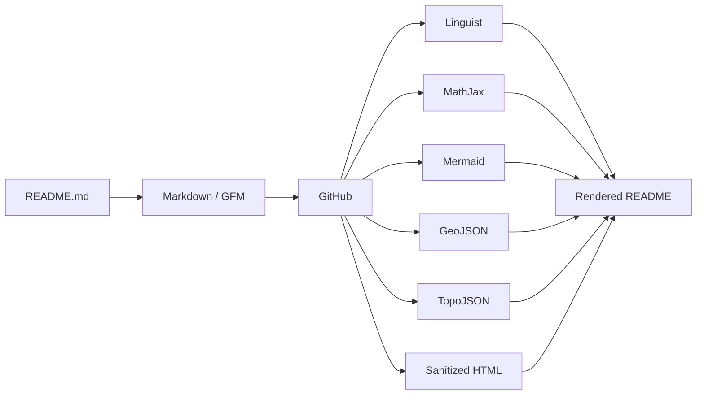
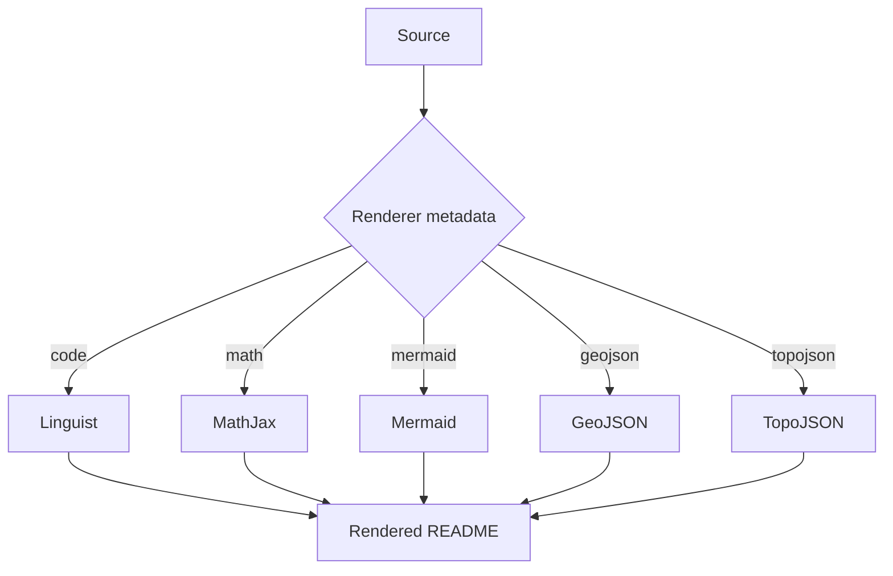
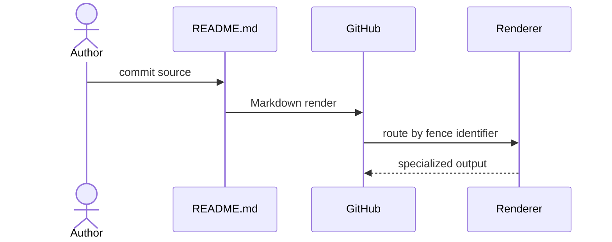
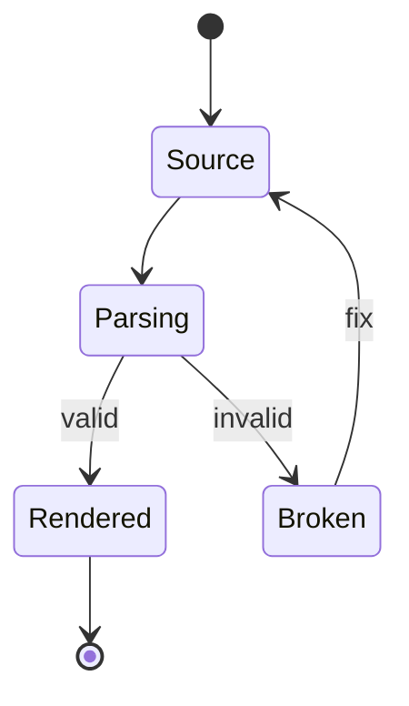
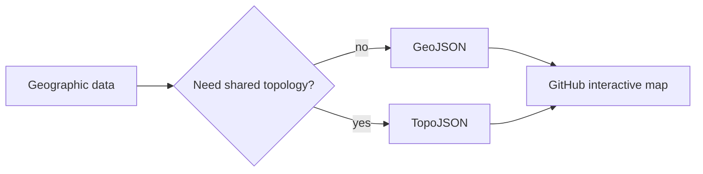
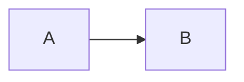
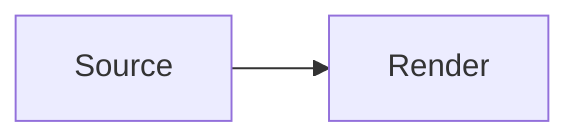
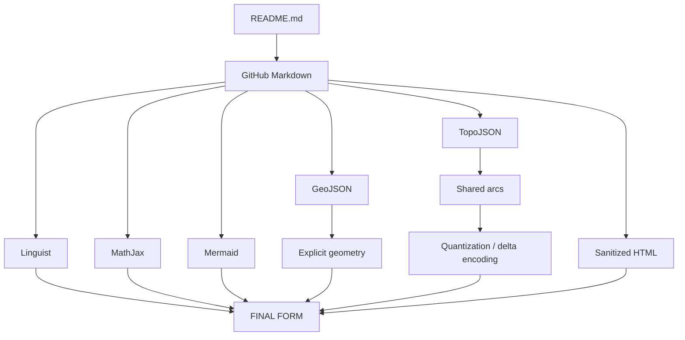

<!--
╔══════════════════════════════════════════════════════════════════════════════╗
║                          LEVEL 00: SOURCE LAYER                              ║
║                                                                              ║
║  PARSER TAMER · BLOCK ARCHITECT · LINK CARTOGRAPHER · MEDIA ENGINEER         ║
║  HYBRID ENGINEER · SYNTAX CURATOR · MATHJAX ARCHITECT · MERMAID CARTOGRAPHER║
║  GEOJSON NAVIGATOR · TOPOLOGY ENGINEER                                      ║
║                                                                              ║
║  M11 invariant: TopoJSON arcs are shared topology, not ordinary coordinates. ║
║  Negative arc references use ones' complement semantics and reverse an arc.  ║
╚══════════════════════════════════════════════════════════════════════════════╝
-->

<picture>
  <source media="(prefers-color-scheme: dark)" srcset="./assets/hero-dark.svg">
  <source media="(prefers-color-scheme: light)" srcset="./assets/hero-light.svg">
  
</picture>

<div align="center">

<a href="https://readme-typing-svg.demolab.com/demo/">
  
</a>

<br>

<a href="https://www.markdownguide.org/"></a>
<a href="#level-18--full-mermaid-diagram-gallery"></a>
<a href="#level-19--interactive-geojson-showcase"></a>
<a href="#level-20--interactive-topojson-showcase"></a>
<a href="#final-boss"></a>

<h3>This is a <strong>layer-by-layer GitHub Markdown rendering laboratory</strong>.</h3>

<sub>Markdown · GFM · Linguist · MathJax · Mermaid · GeoJSON · TopoJSON · sanitized HTML · local media</sub>

<br><br>

<a href="#act-i--markdown-core"><strong>⚡ Markdown</strong></a>
&nbsp;•&nbsp;
<a href="#level-08--full-syntax-highlighting-laboratory"><strong>⌘ Syntax</strong></a>
&nbsp;•&nbsp;
<a href="#level-17--advanced-mathjax-mathematical-showcase"><strong>∑ Math</strong></a>
&nbsp;•&nbsp;
<a href="#level-18--full-mermaid-diagram-gallery"><strong>◇ Mermaid</strong></a>
&nbsp;•&nbsp;
<a href="#level-19--interactive-geojson-showcase"><strong>⌖ GeoJSON</strong></a>
&nbsp;•&nbsp;
<a href="#level-20--interactive-topojson-showcase"><strong>◎ TopoJSON</strong></a>
&nbsp;•&nbsp;
<a href="#final-boss"><strong>👑 Final Boss</strong></a>

</div>

---

> [!IMPORTANT]
> GitHub natively renders TopoJSON in Markdown when valid topology source appears inside a fenced block labeled `topojson`. M11 demonstrates why TopoJSON is not simply GeoJSON with another extension: boundaries can be stored once as reusable **arcs**, then referenced by multiple geometries.[^github-diagrams][^topo-spec]

## 🧭 README POWER MAP

| Act | Rendering layer | Current demonstrations | Jump |
| :---: | --- | --- | :---: |
| `00` | [Source Layer](#level-00--source-layer) | Hidden comments, source invariants | `RAW` |
| `I` | [Markdown Core](#act-i--markdown-core) | Typography, structure, blocks, links | `#` |
| `II` | [GFM](#act-ii--github-flavored-markdown) | Tables, tasks, strikethrough | `GFM` |
| `III` | [GitHub Extensions](#act-iii--github-extensions) | Alerts, Linguist, footnotes | `GH` |
| `IV` | [HTML Hybrid](#act-iv--html-hybrid) | Media, details, semantic HTML, sanitizer | `<>` |
| `V` | [Advanced Rendering](#act-v--advanced-rendering) | MathJax, Mermaid, GeoJSON, **TopoJSON** | `∞` |
| `VI` | [Parser & Source Lab](#act-vi--parser--source-lab) | Escapes, fences, renderer routing | `\` |
| `VII` | [Endgame](#act-vii--endgame--reference) | Achievements, QA, cheat sheet | `✓` |
| `∞` | [Final Boss](#final-boss) | Combined renderer network | `👑` |

`Markdown` · `GFM` · `GitHub` · `Linguist` · `MathJax` · `Mermaid` · `GeoJSON` · `TopoJSON` · `HTML` · `Local Asset`

---

## 🧬 THE RENDERING STACK


```mermaid
flowchart LR
    A[README.md] --> B[Markdown / GFM]
    B --> GH[GitHub]
    GH --> L[Linguist]
    GH --> MJ[MathJax]
    GH --> MM[Mermaid]
    GH --> GJ[GeoJSON]
    GH --> TJ[TopoJSON]
    GH --> H[Sanitized HTML]
    L --> OUT[Rendered README]
    MJ --> OUT
    MM --> OUT
    GJ --> OUT
    TJ --> OUT
    H --> OUT
```

---

# LEVEL 00 — SOURCE LAYER

`HTML` · `Source-only`

```html
<!-- This source exists but disappears in GitHub's rendered README. -->
```

<!--
M11 invariants:
- topology root objects use type "Topology".
- arc indexes are zero-based.
- negative arc index i refers to the reversed arc at ~i, NOT abs(i).
- quantized arcs are delta-encoded when a transform exists.
- Point and MultiPoint still use coordinates; line/ring geometries use arcs.
- invalid topology belongs in inert text fences, never live topojson fences.
- assets/topojson-showcase.topojson is a repository-owned M11 asset.
-->

> [!NOTE]
> A rendered map is only one surface. The raw topology remains diffable JSON with explicit objects, arc references, transforms, and properties.

---

# ACT I — MARKDOWN CORE

## LEVEL 01 — TYPOGRAPHY & INLINE POWER

`Markdown` · `GFM` · `HTML`

| Source | Result |
| --- | --- |
| `*italic*` | *italic* |
| `**bold**` | **bold** |
| `***both***` | ***both*** |
| `~~deleted~~` | ~~deleted~~ |
| `` `code` `` | `code` |
| `<sub>2</sub>` | H<sub>2</sub>O |
| `<sup>2</sup>` | x<sup>2</sup> |
| `<ins>new</ins>` | <ins>new</ins> |

**Bold containing _italic containing `code`_.**

---

## LEVEL 02 — STRUCTURE, HEADINGS & WHITESPACE

`Markdown`

<details>
<summary><strong>ATX heading ladder</strong></summary>

# H1
## H2
### H3
#### H4
##### H5
###### H6

</details>

<details>
<summary><strong>Setext headings</strong></summary>

Setext One
==========

Setext Two
----------

</details>

Two trailing spaces create a hard break.  
This is the next visual line.

---

## LEVEL 03 — LIST ENGINE & QUOTATION FORTRESS

`Markdown`

- Surface
  - Nested
    - Deeper
      - Deeper still
        - List mine
          - **Maximum indentation**

1. **Quote inside a list**

   > Block containers can contain other block containers.

2. **Code inside a list**

   ```bash
   printf '%s\n' "nested code"
   ```

> **Quote containing structure**
>
> - [x] nested list
> - [x] task
> - [x] `inline code`

---

## LEVEL 04 — HYPERLINK ROUTING MATRIX

`Markdown` · `GFM` · `GitHub` · `HTML`

[Markdown Guide](https://www.markdownguide.org/)  
[Markdown Guide][markdown-guide]  
[GitHub Docs][]  
[GFM Spec]

- [This README](./README.md)
- [Repository root](./)
- [GeoJSON dataset](./assets/geojson-showcase.geojson)
- [TopoJSON dataset](./assets/topojson-showcase.topojson)
- [GeoJSON showcase](#level-19--interactive-geojson-showcase)
- [TopoJSON showcase](#level-20--interactive-topojson-showcase)
- [Final Boss](#final-boss)

<a name="m11-topology-beacon"></a>

[Jump to the custom M11 anchor](#m11-topology-beacon)

<https://github.com/>  
https://github.com  
www.github.com

```text
@octocat
#123
owner/repository#123
```

---

# ACT II — GITHUB FLAVORED MARKDOWN

## LEVEL 05 — TABLE ENGINE

`GFM`

| Alignment | Syntax | Example |
| :--- | :---: | ---: |
| Left | `:---` | `10` |
| Center | `:---:` | `100` |
| Right | `---:` | `1000` |

| Input | Result |
| --- | --- |
| `alpha \| beta` | alpha \| beta |
| `` `left\|right` `` | `left\|right` |

---

## LEVEL 06 — TASK-LIST SKILL TREE

`GFM`

- [x] **Markdown Core**
  - [x] Typography / headings / whitespace
  - [x] Lists / quotes / links
- [x] **GFM Systems**
  - [x] Tables
  - [x] Task lists
- [x] **Media + HTML Hybrid**
  - [x] Repository-owned SVGs
  - [x] Theme-aware `<picture>`
  - [x] Nested `<details>`
  - [x] Sanitization boundary
- [x] **Linguist**
  - [x] 33 syntax modes retained
  - [x] text / diff / aliases / unknown-label control
- [x] **MathJax**
  - [x] Inline / protected inline / display / `math` fence
  - [x] Matrices / calculus / probability / Fourier
- [x] **Mermaid**
  - [x] Multi-family diagram gallery
- [x] **GeoJSON**
  - [x] Seven geometry families
  - [x] FeatureCollection
  - [x] Standalone `.geojson`
- [x] **TopoJSON**
  - [x] `Topology` root
  - [x] named `objects`
  - [x] reusable `arcs`
  - [x] reversed arc references
  - [x] shared boundaries
  - [x] `transform.scale`
  - [x] `transform.translate`
  - [x] quantized integer positions
  - [x] delta-encoded arcs
  - [x] GeometryCollection topology
  - [x] Point/MultiPoint coordinate exception
  - [x] standalone `.topojson`
- [ ] **Next renderer**
  - [ ] ASCII STL / interactive 3D
- [ ] **Final Form**
  - [ ] Full rendering QA
  - [ ] Restraint discovered

---

# ACT III — GITHUB EXTENSIONS

## LEVEL 07 — ALERT COMMAND CENTER

`GitHub`

> [!NOTE]
> TopoJSON is based on GeoJSON, but line and polygon geometry can reference reusable arcs instead of repeating complete coordinate sequences.

> [!TIP]
> Shared boundaries are TopoJSON's conceptual superpower: store the boundary once, then let adjacent geometries reference it in either direction.

> [!IMPORTANT]
> A negative arc reference uses **ones' complement**. `-1` reverses arc `0`; `-2` reverses arc `1`; `-3` reverses arc `2`.[^topo-spec]

> [!WARNING]
> In quantized topology, arc coordinates are delta-encoded integer positions. Reading each pair as an absolute longitude/latitude value produces nonsense.

> [!CAUTION]
> A topology can be valid JSON while being invalid TopoJSON. JSON parsing alone does not verify arc indexes, geometry structure, or transforms.

---

## LEVEL 08 — FULL SYNTAX-HIGHLIGHTING LABORATORY

`Markdown` · `GitHub` · `Linguist`

M7 remains represented with **33 syntax modes**.

```
unlabeled fence
```

```text
literal output
```

```javascript
const phase = "M11";
```

```js
const alias = "js";
```

```totally-not-a-language
unknown-label-control = true
```

<details>
<summary><strong>Web & UI — 5</strong></summary>

```javascript
console.log("JavaScript");
```
```typescript
const phase: number = 11;
```
```html
<details><summary>HTML</summary></details>
```
```css
.readme { display: block; }
```
```json
{"phase":"M11"}
```

</details>

<details>
<summary><strong>Systems & compiled — 8</strong></summary>

```c
int main(void){return 0;}
```
```cpp
#include <iostream>
int main(){std::cout << "C++";}
```
```rust
fn main(){println!("Rust");}
```
```go
package main
func main(){}
```
```java
class Main { public static void main(String[] a){} }
```
```csharp
Console.WriteLine("C#");
```
```kotlin
fun main() = println("Kotlin")
```
```swift
print("Swift")
```

</details>

<details>
<summary><strong>Scripting — 6</strong></summary>

```python
print("Python")
```
```ruby
puts "Ruby"
```
```php
<?php echo "PHP";
```
```lua
print("Lua")
```
```bash
printf '%s\n' Bash
```
```powershell
Write-Output 'PowerShell'
```

</details>

<details>
<summary><strong>Data / config / infrastructure — 5</strong></summary>

```sql
SELECT 'SQL';
```
```yaml
phase: M11
```
```toml
phase = "M11"
```
```xml
<phase>M11</phase>
```
```dockerfile
FROM alpine:3.22
```

</details>

<details>
<summary><strong>Scientific / functional — 5</strong></summary>

```r
print(pi)
```
```julia
println(pi)
```
```haskell
main = print pi
```
```scala
@main def run() = println(math.Pi)
```
```latex
\int_0^1 x^2\,dx
```

</details>

<details>
<summary><strong>Documentation / literal — 4</strong></summary>

```markdown
# Markdown
```
```diff
- M10 GeoJSON
+ M11 TopoJSON
```
```text
plaintext
```
```ini
[readme]
phase=M11
```

</details>

**Inventory:** 5 + 8 + 6 + 5 + 5 + 4 = **33 modes**.

---

## LEVEL 09 — FOOTNOTES & GITHUB-AWARE BEHAVIOR

`GitHub`

GitHub uses Linguist for fenced-code highlighting.[^linguist]  
GitHub renders supported LaTeX math with MathJax.[^mathjax]  
GitHub renders Mermaid diagrams from `mermaid` fences.[^github-diagrams]  
GitHub renders GeoJSON and TopoJSON as interactive maps.[^github-diagrams]  
Standalone `.geojson` and `.topojson` files can render directly in repositories.[^noncode-maps]

---

# ACT IV — HTML HYBRID

## LEVEL 10 — REPOSITORY-OWNED MEDIA SYSTEM

`Markdown` · `HTML` · `Local Asset`

<picture>
  <source media="(prefers-color-scheme: dark)" srcset="./assets/hero-dark.svg">
  <source media="(prefers-color-scheme: light)" srcset="./assets/hero-light.svg">
  
</picture>


[](#level-20--interactive-topojson-showcase)

---

## LEVEL 11 — INLINE HTML SEMANTIC TOOLKIT

`HTML` · `Markdown`

Press <kbd>Ctrl</kbd> + <kbd>Shift</kbd> + <kbd>V</kbd>.  
H<sub>2</sub>O · x<sup>2</sup>  
<ins>Inserted</ins> · <del>Deleted</del> · <s>Obsolete</s>

---

## LEVEL 12 — DETAILS INTERFACE SYSTEM

`HTML` · `Markdown` · `GitHub`

<details>
<summary><strong>Collapsed panel</strong></summary>

- Markdown list
- **formatting**
- `inline code`

</details>

<details open>
<summary><strong>Open by default</strong></summary>

The `open` attribute changes the initial disclosure state without README-authored JavaScript.

</details>

<details>
<summary><strong>Nested disclosure tree</strong></summary>

<details>
<summary><strong>Tier 2</strong></summary>

<details>
<summary><strong>Tier 3</strong></summary>

**Markdown inside HTML inside Markdown.**

</details>
</details>
</details>

---

## LEVEL 13 — HTML TABLE & LAYOUT LAB

<table>
  <thead><tr><th>Element</th><th>Role</th></tr></thead>
  <tbody>
    <tr><td><code>&lt;details&gt;</code></td><td>Progressive disclosure</td></tr>
    <tr><td><code>&lt;kbd&gt;</code></td><td>Keyboard semantics</td></tr>
    <tr><td><code>&lt;picture&gt;</code></td><td>Theme-aware media</td></tr>
    <tr><td><code>&lt;table&gt;</code></td><td>Explicit HTML table structure</td></tr>
  </tbody>
</table>

---

## LEVEL 14 — MARKDOWN / HTML BOUNDARY LAB

```html
<details>
<summary>Summary</summary>

### Markdown heading

- Markdown list
- **Markdown emphasis**

</details>
```

```text
Markdown owns the document by default.
HTML enters for semantics or disclosure.
Specialized fence identifiers route source to advanced renderers.
```

---

## LEVEL 15 — SANITIZATION BOUNDARY

```html
<script>alert('nope')</script>
<div style="position:fixed">not a README application shell</div>
<div class="app" id="root">not a JavaScript mount point</div>
```

| Need | README-safe mechanism |
| --- | --- |
| Disclosure | `<details>` / `<summary>` |
| Theme-aware media | `<picture>` / `<source>` |
| Math | MathJax |
| Diagrams | Mermaid |
| Geography | GeoJSON / TopoJSON |
| Real application logic | build an actual app |

---

## LEVEL 16 — HYBRID INTERFACE BOSS

<details open>
<summary><strong>M11 SYSTEM CONSOLE</strong></summary>

<table>
  <tr><th>Subsystem</th><th>Status</th></tr>
  <tr><td>Linguist</td><td><strong>33 MODES</strong></td></tr>
  <tr><td>MathJax</td><td><strong>ONLINE</strong></td></tr>
  <tr><td>Mermaid</td><td><strong>ONLINE</strong></td></tr>
  <tr><td>GeoJSON</td><td><strong>INTERACTIVE</strong></td></tr>
  <tr><td>TopoJSON</td><td><strong>TOPOLOGICAL</strong></td></tr>
  <tr><td>README JavaScript runtime</td><td><del>ABSENT</del> BY DESIGN</td></tr>
</table>

</details>

---

# ACT V — ADVANCED RENDERING

## LEVEL 17 — ADVANCED MATHJAX MATHEMATICAL SHOWCASE

`GitHub` · `MathJax` · `LaTeX`

Inline: $E=mc^2$ · protected inline: $`x_i^2`$.

$$\left(\sum_{k=1}^{n}a_kb_k\right)^2\leq\left(\sum_{k=1}^{n}a_k^2\right)\left(\sum_{k=1}^{n}b_k^2\right)$$

```math
A=\begin{pmatrix}1&2\\3&4\end{pmatrix},
\qquad Av=\lambda v,
\qquad \operatorname{rank}(A)+\operatorname{nullity}(A)=n
```

```math
\nabla f(x)=\begin{pmatrix}
\frac{\partial f}{\partial x_1}\\
\vdots\\
\frac{\partial f}{\partial x_n}
\end{pmatrix},
\qquad
\frac{d}{dx}\int_a^x f(t)\,dt=f(x)
```

```math
P(A\mid B)=\frac{P(B\mid A)P(A)}{P(B)},
\qquad
e^{i\pi}+1=0
```

<details>
<summary><strong>Fourier chamber</strong></summary>

```math
\widehat f(\xi)=\int_{-\infty}^{\infty}f(x)e^{-2\pi i x\xi}\,dx
```

</details>

---

## LEVEL 18 — FULL MERMAID DIAGRAM GALLERY

`GitHub` · `Mermaid`

M9's major diagram families remain represented: Flowchart, Sequence, State, Class, ER, Journey, Gantt, Pie, GitGraph, Mindmap, Timeline, Quadrant, Requirement, plus the Architecture compatibility-canary concept.


```mermaid
flowchart TD
    SRC[Source] --> TYPE{Renderer metadata}
    TYPE -- code --> L[Linguist]
    TYPE -- math --> MJ[MathJax]
    TYPE -- mermaid --> MM[Mermaid]
    TYPE -- geojson --> GJ[GeoJSON]
    TYPE -- topojson --> TJ[TopoJSON]
    L --> OUT[Rendered README]
    MJ --> OUT
    MM --> OUT
    GJ --> OUT
    TJ --> OUT
```

<details>
<summary><strong>Sequence + state examples</strong></summary>


```mermaid
sequenceDiagram
    actor Author
    participant MD as README.md
    participant GH as GitHub
    participant R as Renderer
    Author->>MD: commit source
    MD->>GH: Markdown render
    GH->>R: route by fence identifier
    R-->>GH: specialized output
```


```mermaid
stateDiagram-v2
    [*] --> Source
    Source --> Parsing
    Parsing --> Rendered: valid
    Parsing --> Broken: invalid
    Broken --> Source: fix
    Rendered --> [*]
```

</details>

---

## LEVEL 19 — INTERACTIVE GEOJSON SHOWCASE

`GitHub` · `GeoJSON` · `Interactive Map` · `Local Asset`

M10 remains as the coordinate-centric geographic baseline. GeoJSON stores explicit geometry coordinates inside Features and FeatureCollections.

> [!IMPORTANT]
> GeoJSON positions remain **`[longitude, latitude]`**.

<details open>
<summary><strong>M10 GeoJSON baseline — points + route + polygon</strong></summary>

```geojson
{
  "type": "FeatureCollection",
  "features": [
    {
      "type": "Feature",
      "properties": {"title": "London", "marker-color": "#7c3aed"},
      "geometry": {"type": "Point", "coordinates": [-0.1276, 51.5072]}
    },
    {
      "type": "Feature",
      "properties": {"title": "Paris", "marker-color": "#0891b2"},
      "geometry": {"type": "Point", "coordinates": [2.3522, 48.8566]}
    },
    {
      "type": "Feature",
      "properties": {"title": "Route", "stroke": "#2563eb", "stroke-width": 4},
      "geometry": {
        "type": "LineString",
        "coordinates": [[-0.1276, 51.5072], [2.3522, 48.8566], [13.405, 52.52]]
      }
    }
  ]
}
```

</details>

Repository-owned baseline: **[`assets/geojson-showcase.geojson`](./assets/geojson-showcase.geojson)**.

```text
GeoJSON strength:
geometry is explicit and locally understandable.

TopoJSON strength:
shared geometry can become reusable topology.
```

---

## LEVEL 20 — INTERACTIVE TOPOJSON SHOWCASE

`GitHub` · `TopoJSON` · `Interactive Map` · `Topology` · `Local Asset`

GitHub supports TopoJSON maps both in fenced `topojson` blocks and as repository files such as `.topojson`.[^github-diagrams][^noncode-maps]

TopoJSON extends GeoJSON with a topology model: one root `Topology` owns named geometry `objects` plus a shared `arcs` table.[^topo-spec]

### 20.1 — Renderer anatomy

````markdown
```topojson
{
  "type": "Topology",
  "objects": { ... },
  "arcs": [ ... ]
}
```
````

```text
Markdown fence
    │
    ├── identifier: topojson
    │
    └── Topology object
         ├── objects
         ├── arcs
         ├── optional transform
         └── optional bbox
                ↓
         GitHub map renderer
                ↓
        interactive map
```

---

### 20.2 — Shared-boundary topology

The main M11 map contains two adjacent polygons. Their common vertical boundary is stored exactly once as **arc `1`**.

- West region references arc `1` forward.
- East region references `-2`, meaning **arc `1` reversed**.

<details open>
<summary><strong>SHARED TOPOLOGY — same boundary, opposite directions</strong></summary>

```topojson
{
  "type": "Topology",
  "objects": {
    "regions": {
      "type": "GeometryCollection",
      "geometries": [
        {
          "type": "Polygon",
          "id": "west",
          "properties": {"title": "West Region"},
          "arcs": [[0, 1, 2, 3]]
        },
        {
          "type": "Polygon",
          "id": "east",
          "properties": {"title": "East Region"},
          "arcs": [[4, 5, 6, -2]]
        }
      ]
    }
  },
  "arcs": [
    [[2, 48], [6, 48]],
    [[6, 48], [6, 52]],
    [[6, 52], [2, 52]],
    [[2, 52], [2, 48]],
    [[6, 48], [10, 48]],
    [[10, 48], [10, 52]],
    [[10, 52], [6, 52]]
  ]
}
```

</details>

The two polygon rings reconstruct as:

```text
west: 2,48 → 6,48 → 6,52 → 2,52 → 2,48
                    ↑
              shared arc 1
                    ↓
east: 6,48 → 10,48 → 10,52 → 6,52 → 6,48
                                   reverse of arc 1
```

---

### 20.3 — Negative arc indexes are ones' complement

This detail is easy to get wrong.

| Reference | Meaning |
| :---: | --- |
| `0` | arc 0 forward |
| `1` | arc 1 forward |
| `2` | arc 2 forward |
| `-1` | arc 0 reversed |
| `-2` | arc 1 reversed |
| `-3` | arc 2 reversed |

The rule is:

```text
negative reference i
→ actual arc index = ~i
→ reverse that arc
```

So `-2` is **not** “arc 2 backwards.” It is **arc 1 backwards**.[^topo-spec]

```math
\boxed{\text{reversed arc }k\text{ is referenced by }\sim k=-k-1}
```

---

### 20.4 — Named objects

A Topology can expose multiple named geometry objects under `objects`.

The repository-owned M11 dataset contains:

```text
objects
├── regions
│   └── GeometryCollection
│       ├── west Polygon
│       └── east Polygon
├── route
│   └── LineString
├── nodes
│   └── MultiPoint
└── sharedBoundary
    └── LineString
```

A renderer or downstream tool can choose which named object it needs without changing the shared arc table.

---

### 20.5 — GeometryCollection topology

<details>
<summary><strong>GeometryCollection — several geometries sharing one topology</strong></summary>

```topojson
{
  "type": "Topology",
  "objects": {
    "collection": {
      "type": "GeometryCollection",
      "geometries": [
        {"type": "LineString", "properties": {"name": "lower"}, "arcs": [0]},
        {"type": "LineString", "properties": {"name": "right"}, "arcs": [1]},
        {"type": "LineString", "properties": {"name": "upper-reversed"}, "arcs": [-3]}
      ]
    }
  },
  "arcs": [
    [[2, 48], [6, 48]],
    [[6, 48], [6, 52]],
    [[2, 52], [6, 52]]
  ]
}
```

</details>

---

### 20.6 — Points are the important exception

TopoJSON Point and MultiPoint geometries use `coordinates` rather than `arcs`. LineStrings, MultiLineStrings, Polygons, and MultiPolygons reference arcs.[^topo-spec]

```json
{
  "type": "MultiPoint",
  "coordinates": [[200, 1000], [600, 1000], [1000, 1000]]
}
```

In the M11 standalone file those integer point positions are interpreted through the topology's transform.

---

### 20.7 — Quantization transform

TopoJSON may include:

```json
"transform": {
  "scale": [0.01, 0.01],
  "translate": [0.0, 40.0]
}
```

A quantized position $q=(q_x,q_y)$ becomes an absolute position:

```math
x=q_xs_x+t_x,
\qquad
y=q_ys_y+t_y
```

For example:

```math
(200,800)\mapsto(200\cdot0.01+0,\;800\cdot0.01+40)=(2,48)
```

This lets integer coordinates represent geographic positions compactly.[^topo-spec]

---

### 20.8 — Delta-encoded arcs

When a Topology is quantized, each arc is delta-encoded.[^topo-spec]

This arc:

```json
[[200, 800], [400, 0]]
```

does **not** mean two absolute points `(200,800)` and `(400,0)`.

It decodes as:

```text
first quantized point = (200, 800)
next delta            = (+400, +0)
second point          = (600, 800)
```

then the transform yields:

```text
(200,800) → (2,48)
(600,800) → (6,48)
```

The next point accumulates from the previous point; it does not restart from zero.

---

### 20.9 — Full quantized topology

This is the same model used by the repository-owned `.topojson` file.

<details>
<summary><strong>Open quantized + delta-encoded topology</strong></summary>

```topojson
{
  "type": "Topology",
  "bbox": [2, 48, 10, 52],
  "transform": {
    "scale": [0.01, 0.01],
    "translate": [0, 40]
  },
  "objects": {
    "regions": {
      "type": "GeometryCollection",
      "geometries": [
        {"type": "Polygon", "id": "west", "arcs": [[0, 1, 2, 3]]},
        {"type": "Polygon", "id": "east", "arcs": [[4, 5, 6, -2]]}
      ]
    },
    "route": {
      "type": "LineString",
      "arcs": [7, 8]
    },
    "nodes": {
      "type": "MultiPoint",
      "coordinates": [[200, 1000], [600, 1000], [1000, 1000]]
    }
  },
  "arcs": [
    [[200, 800], [400, 0]],
    [[600, 800], [0, 400]],
    [[600, 1200], [-400, 0]],
    [[200, 1200], [0, -400]],
    [[600, 800], [400, 0]],
    [[1000, 800], [0, 400]],
    [[1000, 1200], [-400, 0]],
    [[200, 1000], [400, 0]],
    [[600, 1000], [400, 0]]
  ]
}
```

</details>

---

### 20.10 — Shared boundary versus duplicated coordinates

Conceptually, ordinary polygon GeoJSON often looks like:

```text
west polygon  → stores its east boundary coordinates

east polygon  → stores its west boundary coordinates again
```

TopoJSON can instead express:

```text
arcs[1] = shared boundary

west polygon → ... 1 ...
east polygon → ... -2 ...
```

The topology knows these edges are the **same boundary**, not merely two coordinate sequences that happen to contain equal numbers.

> [!TIP]
> This shared-topology model is especially useful for adjacent regions and repeated boundaries. It can also reduce redundant coordinate storage, particularly in boundary-heavy datasets.

---

### 20.11 — Arc stitching

A LineString or ring may reference several arcs.

```json
{"type":"LineString","arcs":[7,8]}
```

When reconstructing the geometry, consecutive arcs are stitched end-to-start. The duplicate junction coordinate is not repeated in the reconstructed line.[^topo-spec]

```text
arc 7: A ───── B
arc 8:         B ───── C

stitched: A ───── B ───── C
```

---

### 20.12 — Bounding box

TopoJSON may carry a `bbox`:

```json
"bbox": [2.0, 48.0, 10.0, 52.0]
```

This describes the topology's geographic extent in absolute coordinates, even when internal arcs are quantized.

---

### 20.13 — Repository-owned standalone TopoJSON

M11 adds:

**[`assets/topojson-showcase.topojson`](./assets/topojson-showcase.topojson)**

GitHub's repository viewer supports `.topojson` map files directly when they contain a valid `Topology` object.[^noncode-maps]

```text
README fenced topojson
        ↓
embedded interactive map

.topojson repository file
        ↓
standalone interactive map viewer
```

The file includes:

- quantized transform
- delta-encoded arcs
- two polygons sharing one reversed boundary
- a multi-arc route
- MultiPoint nodes
- a named shared-boundary object
- `bbox`

---

### 20.14 — GeoJSON versus TopoJSON

| Question | GeoJSON | TopoJSON |
| --- | --- | --- |
| Root model | Feature / FeatureCollection | Topology |
| Lines / polygons | explicit coordinates | arc references |
| Shared boundaries | usually repeated coordinates | reusable shared arcs |
| Reverse shared edge | repeat coordinates backwards | negative arc reference |
| Quantization | not intrinsic | optional transform |
| Delta encoding | no | quantized arcs |
| Named map objects | Features / collections | `objects` dictionary |
| Human readability | generally simpler | more compact but indirect |
| GitHub interactive map | ✅ | ✅ |
| Standalone repository rendering | `.geojson` | `.topojson` |


```mermaid
flowchart LR
    DATA[Geographic data] --> Q{Need shared topology?}
    Q -- no --> GJ[GeoJSON]
    Q -- yes --> TJ[TopoJSON]
    GJ --> MAP[GitHub interactive map]
    TJ --> MAP
```

---

### 20.15 — TopoJSON versus ordinary JSON highlighting

The source is still JSON text, but the fence chooses the renderer.

**Highlighted source:**

```json
{
  "type": "Topology",
  "objects": {},
  "arcs": []
}
```

**Interactive topology renderer:**

```topojson
{
  "type": "Topology",
  "objects": {
    "line": {"type": "LineString", "arcs": [0]}
  },
  "arcs": [
    [[2, 48], [10, 52]]
  ]
}
```

```text
json      → Linguist → highlighted source
topojson  → GitHub map renderer → interactive topology
```

---

### 20.16 — Inert failure laboratory

Broken examples stay inside a longer `text` fence.

````text
```topojson
{
  "type": "Topology",
  "objects": {
    "broken": {"type": "LineString", "arcs": [99]}
  },
  "arcs": []
}
```

```topojson
{
  "type": "Topology",
  "transform": {"scale": [0.1], "translate": [0, 0]},
  "objects": {},
  "arcs": []
}
```
````

The first references a nonexistent arc. The second has an invalid one-element `scale`; the specification requires two-element `scale` and `translate` arrays.[^topo-spec]

> [!CAUTION]
> Deliberately broken topology should never be a live M11 map. A failed renderer must be clearly educational, not indistinguishable from a regression.

---

### 20.17 — Topology accessibility and fallback

The interactive topology is an enhancement, not the only explanation.

M11 also provides:

1. prose describing the two adjacent polygons;
2. a text reconstruction of their shared boundary;
3. the raw topology source;
4. the standalone `.topojson` file;
5. a GeoJSON baseline for readers who prefer explicit coordinates.

So the conceptual meaning survives even when an interactive map cannot be operated.

---

### 20.18 — TopoJSON Final Form

<details open>
<summary><strong>TOPOLOGY FINAL FORM — one edge, two regions</strong></summary>

```topojson
{
  "type": "Topology",
  "objects": {
    "west": {
      "type": "Polygon",
      "properties": {"title": "WEST — shared arc forward"},
      "arcs": [[0, 1, 2, 3]]
    },
    "east": {
      "type": "Polygon",
      "properties": {"title": "EAST — shared arc reversed"},
      "arcs": [[4, 5, 6, -2]]
    },
    "boundary": {
      "type": "LineString",
      "properties": {"title": "THE SAME ARC"},
      "arcs": [1]
    }
  },
  "arcs": [
    [[2, 48], [6, 48]],
    [[6, 48], [6, 52]],
    [[6, 52], [2, 52]],
    [[2, 52], [2, 48]],
    [[6, 48], [10, 48]],
    [[10, 48], [10, 52]],
    [[10, 52], [6, 52]]
  ]
}
```

```math
\boxed{
\text{objects}
+\text{shared arcs}
+\text{reversed references}
+\texttt{topojson}
=\text{interactive topology}
}
```

</details>

### M11 renderer rule

```text
Need geographic data?
├── explicit independent geometry → GeoJSON
├── shared boundaries / topology → TopoJSON
│   ├── readable absolute arcs → unquantized topology
│   └── compact integer arcs → transform + delta encoding
├── 3D geometry → ASCII STL (M12)
└── full GIS behavior → dedicated mapping application
```

---

# ACT VI — PARSER & SOURCE LAB

## LEVEL 21 — ESCAPE HATCH

`Markdown` · `Parser`

\# Not a heading  
\> Not a quote  
\- Not a list  
1\. Not an ordered list  
\*Not emphasis\*

| Literal | Source |
| :---: | :---: |
| `*` | `\*` |
| `_` | `\_` |
| `#` | `\#` |
| `>` | `\>` |
| `|` | `\|` |
| `$` | `\$` where math parsing needs it |
| `\` | `\\` |

---

## LEVEL 22 — BACKTICK & FENCE PARADOX

``Use a `backtick` inside code``

````markdown
```javascript
console.log("three backticks inside four");
```
````

````markdown

```mermaid
flowchart LR
    A --> B
```
````

````markdown
```geojson
{"type":"Point","coordinates":[13.405,52.52]}
```
````

````markdown
```topojson
{"type":"Topology","objects":{},"arcs":[]}
```
````

---

## LEVEL 23 — DELIMITER & RENDERER COLLISION LAB

````text
$             → possible MathJax delimiter
`             → code delimiter / protected math boundary
```math       → MathJax block renderer
```mermaid    → Mermaid diagram renderer
```geojson    → GeoJSON map renderer
```topojson   → TopoJSON map renderer
```json       → Linguist-highlighted source
````

A fence identifier can switch the entire rendering subsystem.

---

## LEVEL 24 — ENTITY REACTOR

| Source | Rendered |
| --- | :---: |
| `&copy;` | &copy; |
| `&rarr;` | &rarr; |
| `&times;` | &times; |
| `&ne;` | &ne; |
| `&infin;` | &infin; |
| `&#169;` | &#169; |
| `&#xA9;` | &#xA9; |

&lt;div&gt;not an HTML element&lt;/div&gt;

---

## LEVEL 25 — WHITESPACE & RECURSION CHAMBER

````markdown
```markdown
**Markdown shown inside Markdown shown inside Markdown.**
```
````

````markdown
```math
\sum_{k=1}^{n}k=\frac{n(n+1)}2
```
````

````markdown

```mermaid
flowchart LR
    Source --> Render
```
````

````markdown
```geojson
{"type":"Point","coordinates":[13.405,52.52]}
```
````

````markdown
```topojson
{
  "type":"Topology",
  "objects":{"line":{"type":"LineString","arcs":[0]}},
  "arcs":[[[2,48],[10,52]]]
}
```
````

<!--
Future maintainers:
Nested renderer fences, TopoJSON arc semantics, negative arc indexes, transforms,
delta encoding, GeoJSON coordinate order, math delimiters, relative assets, and
HTML/details blank lines are intentional source demonstrations.
-->

---

# ACT VII — ENDGAME & REFERENCE

## 🏅 ACHIEVEMENTS UNLOCKED

<p align="center">
  
  
  
  
</p>

| Achievement | Requirement | Status |
| --- | --- | :---: |
| **Syntax Curator** | Retain 33 syntax modes | ✅ |
| **MathJax Architect** | Preserve advanced math rendering | ✅ |
| **Mermaid Cartographer** | Preserve multi-family diagrams | ✅ |
| **GeoJSON Navigator** | Preserve interactive coordinate maps | ✅ |
| **Topology Engineer** | Render a `Topology` object | ✅ |
| **Arc Weaver** | Build geometry from reusable arcs | ✅ |
| **Boundary Reuser** | Share one arc between adjacent polygons | ✅ |
| **Reverse Engineer** | Use negative reversed-arc references correctly | ✅ |
| **Object Librarian** | Expose multiple named topology objects | ✅ |
| **Quantizer** | Use `scale` + `translate` transform | ✅ |
| **Delta Decoder** | Explain quantized delta-encoded arcs | ✅ |
| **Geometry Collector** | Use GeometryCollection topology | ✅ |
| **Point Exception Handler** | Distinguish point coordinates from line/polygon arcs | ✅ |
| **Dataset Keeper** | Add standalone `.topojson` asset | ✅ |
| **Renderer Router** | Distinguish JSON / GeoJSON / TopoJSON / Mermaid / MathJax | ✅ |
| **Parser Tamer** | Keep malformed topology inert | ✅ |
| **Master of Restraint** | Stop before implementing a topology library | ❌ |

---

## THE CHAOS INDEX

```text
Clarity            ████████████████████ 100%
Structure          ████████████████████ 100%
Typography         ████████████████████ 100%
Links / Tables     ████████████████████ 100%
Local Media        ████████████████████ 100%
HTML Hybrid        ████████████████████ 100%
Language Breadth   ████████████████████  33 modes
MathJax            ████████████████████ 100%
Mermaid            ████████████████████ 100%
GeoJSON            ████████████████████ 100%
TopoJSON Root      ████████████████████ 100%
Shared Arcs        ████████████████████ 100%
Reverse Arcs       ████████████████████ 100%
Transforms         ████████████████████ 100%
Delta Encoding     ████████████████████ 100%
Interactive Maps   ████████████████████ 100%
Renderer Routing   ████████████████████ 100%
Parser Tricks      ███████████████████░  95%
Restraint          ██░░░░░░░░░░░░░░░░░░  10%
Raw Power          ████████████████████  M11
```

> [!WARNING]
> Compact topology does not validate geographic truth. Shared arcs can encode the wrong boundary just as efficiently as the right one.

---

## 🧰 THE ACTUALLY USEFUL CHEAT SHEET

``````markdown
# Heading
*italic* **bold** ~~strike~~ `code`

[relative](./README.md)
[same document](#final-boss)

Inline math: $E=mc^2$

```math
\int_0^1 x^2\,dx=\frac13
```


```mermaid
flowchart LR
    A --> B
```

```geojson
{"type":"Point","coordinates":[13.405,52.52]}
```

```topojson
{
  "type":"Topology",
  "objects":{"line":{"type":"LineString","arcs":[0]}},
  "arcs":[[[2,48],[10,52]]]
}
```

[GeoJSON file](./assets/geojson-showcase.geojson)
[TopoJSON file](./assets/topojson-showcase.topojson)

```python
print("highlighted source")
```

```text
literal output
```

````markdown
```topojson
{"type":"Topology","objects":{},"arcs":[]}
```
````

<details>
<summary>Collapsed renderer</summary>

```topojson
{
  "type":"Topology",
  "objects":{"line":{"type":"LineString","arcs":[0]}},
  "arcs":[[[2,48],[10,52]]]
}
```

</details>


<kbd>Ctrl</kbd> + <kbd>K</kbd>

- [x] Complete
- [ ] Incomplete

| Left | Center | Right |
| :--- | :---: | ---: |
| alpha \| beta | $x^2$ | 100 |
``````

---

## 🧯 COMMON README CRIMES

| Crime | Consequence |
| --- | --- |
| Treating `-2` as reversed arc 2 | wrong boundary is reconstructed |
| Reading quantized arc deltas as absolute coordinates | topology becomes geographic nonsense |
| Giving Point geometry an `arcs` field | invalid TopoJSON geometry model |
| Giving Polygon geometry raw coordinates | bypasses TopoJSON's arc topology |
| Referencing an arc index that does not exist | topology cannot reconstruct geometry |
| Using one-element `scale` / `translate` | invalid transform |
| Duplicating shared boundaries anyway | loses TopoJSON's main structural advantage |
| Using `json` when expecting a map | source is highlighted, not mapped |
| Using `topojson` for arbitrary JSON | specialized renderer fails |
| Hiding essential meaning only in map interaction | accessibility failure |
| Forgetting longer outer fences | renderer-source examples terminate themselves |
| Assuming compact data is correct data | efficient errors are still errors |

---

## 🧪 README QUALITY TEST

- [ ] Main shared-boundary TopoJSON map renders.
- [ ] West and east polygons reconstruct as adjacent closed regions.
- [ ] Arc `1` is used forward by west and reversed via `-2` by east.
- [ ] No explanation incorrectly treats negative indexes as ordinary negation.
- [ ] Quantized transform uses two-element `scale` and `translate`.
- [ ] Delta-encoded arcs reconstruct to expected absolute positions.
- [ ] Point/MultiPoint examples use `coordinates`, not `arcs`.
- [ ] Line/polygon examples use arc references.
- [ ] Multi-arc route stitches at matching endpoints.
- [ ] Standalone `assets/topojson-showcase.topojson` renders on GitHub.
- [ ] Standalone GeoJSON baseline still renders.
- [ ] Invalid TopoJSON examples remain inside non-TopoJSON fences.
- [ ] `json` vs `topojson` demonstrates different renderers.
- [ ] GeoJSON vs TopoJSON distinction remains clear.
- [ ] Essential topology meaning exists as prose/source, not only map interaction.
- [ ] MathJax still renders.
- [ ] Mermaid still renders.
- [ ] 33 Linguist modes remain represented.
- [ ] Theme-aware local hero still switches correctly.
- [ ] Nested fence lengths remain balanced.
- [ ] Mobile map interaction remains usable.
- [ ] README is previewed on GitHub before release.

---

# FINAL BOSS

<picture>
  <source media="(prefers-color-scheme: dark)" srcset="./assets/hero-dark.svg">
  <source media="(prefers-color-scheme: light)" srcset="./assets/hero-light.svg">
  
</picture>

<details open>
<summary><strong>FINAL FORM — MULTI-RENDERER TOPOLOGY NETWORK</strong></summary>


```mermaid
flowchart TB
    README[README.md] --> GH[GitHub Markdown]
    GH --> CODE[Linguist]
    GH --> MATH[MathJax]
    GH --> DIAGRAM[Mermaid]
    GH --> GEO[GeoJSON]
    GH --> TOPO[TopoJSON]
    GH --> HTML[Sanitized HTML]

    GEO --> COORD[Explicit geometry]
    TOPO --> ARC[Shared arcs]
    ARC --> TRANSFORM[Quantization / delta encoding]

    CODE --> FINAL[FINAL FORM]
    MATH --> FINAL
    DIAGRAM --> FINAL
    COORD --> FINAL
    TRANSFORM --> FINAL
    HTML --> FINAL
```

```math
\boxed{
\text{Markdown}
+\text{Linguist}
+\text{MathJax}
+\text{Mermaid}
+\text{GeoJSON}
+\text{TopoJSON}
+\text{HTML}
=\text{M11}
}
```

<details>
<summary><strong>Inspect the topology subsystem</strong></summary>

```text
TOPOLOGY
├── objects
│   ├── regions
│   ├── route
│   ├── nodes
│   └── sharedBoundary
├── arcs
│   ├── forward references
│   └── reversed references via ones' complement
├── transform
│   ├── scale
│   └── translate
├── quantized integer positions
└── delta-encoded arcs
```

</details>

</details>

<div align="center">

<p>
  GeoJSON stores geographic geometry.<br>
  TopoJSON stores geographic relationships.<br>
  Shared arcs make adjacency explicit.<br>
  Transform + delta encoding make coordinates indirect but compact.<br>
  The source remains inspectable beneath the interactive map.
</p>

<a href="./assets/topojson-showcase.topojson"></a>
<a href="./assets/geojson-showcase.geojson"></a>
<a href="#"></a>

<h2>Markdown: Final Form.</h2>
<h3>Interactive TopoJSON layer unlocked.</h3>

</div>


---

[markdown-guide]: https://www.markdownguide.org/ "Markdown Guide"
[GitHub Docs]: https://docs.github.com/en/get-started/writing-on-github "GitHub writing and formatting documentation"
[GFM Spec]: https://github.github.com/gfm/ "GitHub Flavored Markdown specification"

[^linguist]: GitHub Linguist supplies language metadata and grammars for fenced-code syntax highlighting.
[^mathjax]: GitHub renders supported LaTeX-formatted mathematics using MathJax.
[^github-diagrams]: GitHub documents four advanced diagram syntaxes in Markdown: Mermaid, GeoJSON, TopoJSON, and ASCII STL. GeoJSON uses `geojson`; TopoJSON uses `topojson`.
[^noncode-maps]: GitHub repository views support `.geojson` and `.topojson` map files. `.json` files can also render as maps when their root type is one of GitHub's recognized geographic structures.
[^topo-spec]: The TopoJSON specification defines `Topology`, named `objects`, reusable `arcs`, zero-based arc indexes, ones'-complement reversed arc references, transforms, quantization, and delta encoding.
