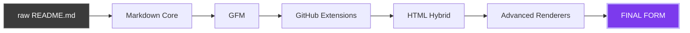
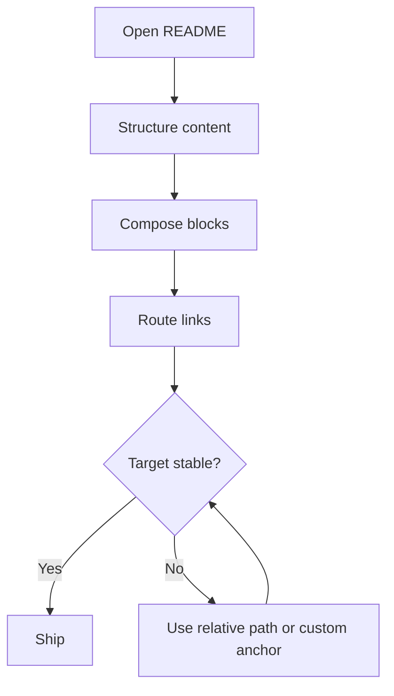
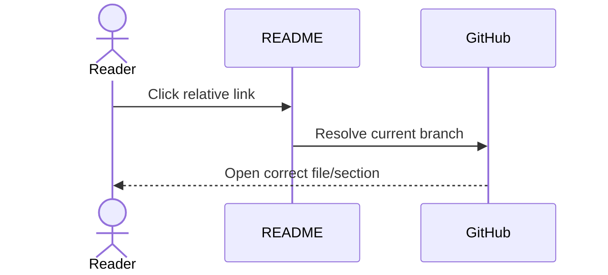
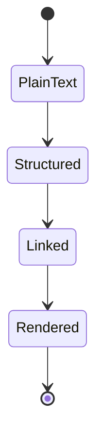

<!--
╔══════════════════════════════════════════════════════════════════════════════╗
║                          LEVEL 00: SOURCE LAYER                              ║
║                                                                              ║
║  Achievements: RAW SOURCE EXPLORER · PARSER TAMER · BLOCK ARCHITECT         ║
║                LINK CARTOGRAPHER                                             ║
║                                                                              ║
║  You inspected README.md before GitHub rendered it.                         ║
║  Rendering stack: Markdown → GFM → GitHub → HTML → Advanced Renderers       ║
╚══════════════════════════════════════════════════════════════════════════════╝

M4 source-only note:
Reference definitions, relative paths, custom anchors, autolinks, and safe examples of
GitHub-native conversation references are now intentional parts of the exhibit.
-->

<div align="center">

<a href="https://www.markdownguide.org/">
  
</a>

<a href="https://readme-typing-svg.demolab.com/demo/">
  
</a>

<br />

<a href="https://www.markdownguide.org/"></a>
<a href="https://github.github.com/gfm/"></a>
<a href="#level-04--hyperlink-routing-matrix"></a>
<a href="#the-chaos-index"></a>
<a href="#final-boss"></a>

<br />

<h3>🚨 This is not merely a README.</h3>
<h3>This is a <strong>layer-by-layer Markdown rendering laboratory</strong>.</h3>

<sub>Markdown · GFM · GitHub rendering · HTML fragments · external SVGs · zero JavaScript</sub>

<br /><br />

<a href="#act-i--markdown-core"><strong>⚡ Enter Markdown Core</strong></a>
&nbsp;•&nbsp;
<a href="#level-04--hyperlink-routing-matrix"><strong>🧭 Enter Link Routing</strong></a>
&nbsp;•&nbsp;
<a href="#act-vi--parser--source-lab"><strong>⌁ Enter Parser Lab</strong></a>
&nbsp;•&nbsp;
<a href="#final-boss"><strong>👑 Fight Final Boss</strong></a>

</div>

---

> [!CAUTION]
> **Plain text has been detected.**  
> Remain calm. Put down the `.docx`. Step away from the formatting toolbar.

> [!IMPORTANT]
> A README should explain a project clearly before it attempts visual domination.  
> This repository deliberately pushes presentation far beyond normal documentation—but every trick is assigned to a rendering layer.

---

## 🧭 README POWER MAP

| Act | Rendering layer | Current demonstrations | Jump |
| :---: | --- | --- | :---: |
| `00` | [Source Layer](#level-00--source-layer) | Hidden comments, raw-source-only content | `RAW` |
| `I` | [Markdown Core](#act-i--markdown-core) | Typography, headings, lists, quotes, links, anchors | `#` |
| `II` | [GitHub Flavored Markdown](#act-ii--github-flavored-markdown) | Tables, escaped pipes, task trees, strikethrough | `GFM` |
| `III` | [GitHub Extensions](#act-iii--github-extensions) | Alerts, code highlighting, footnotes, GitHub-aware behavior | `GH` |
| `IV` | [HTML Hybrid](#act-iv--html-hybrid) | Inline HTML, media control, collapsible interfaces | `<>` |
| `V` | [Advanced Rendering](#act-v--advanced-rendering) | Math, Mermaid | `∞` |
| `VI` | [Parser & Source Lab](#act-vi--parser--source-lab) | Escapes, entities, backticks, recursion | `\` |
| `VII` | [Endgame & Reference](#act-vii--endgame--reference) | Achievements, cheat sheet, QA | `✓` |
| `∞` | [Final Boss](#final-boss) | Combined mechanics | `👑` |

`Markdown` · `GFM` · `GitHub` · `HTML` · `External Asset`

---

## 🧬 THE RENDERING STACK


```mermaid
flowchart LR
    A["raw README.md"] --> B["Markdown Core"]
    B --> C["GFM"]
    C --> D["GitHub Extensions"]
    D --> E["HTML Hybrid"]
    E --> F["Advanced Renderers"]
    F --> G["FINAL FORM"]

    A:::raw
    G:::power

    classDef raw fill:#3b3b3b,color:#ffffff,stroke:#777777
    classDef power fill:#7c3aed,color:#ffffff,stroke:#c4b5fd,stroke-width:3px
```

---

# LEVEL 00 — SOURCE LAYER

`HTML` · `Source-only`

```html
<!--
This exists in README.md...
but disappears when GitHub renders it.
-->
```

<!--
Architecture invariant:
Future phases extend the correct rendering act instead of appending unrelated sections.

M4 invariant:
Do not delete link reference definitions at the bottom merely because they render invisibly.
Do not turn code-form GitHub mention examples into live mentions without a reason.
-->

> [!NOTE]
> The raw source and rendered document are intentionally two different surfaces of the same file.

---

# ACT I — MARKDOWN CORE

> The portable foundation: inline syntax, whitespace, block grammar, and navigation.

## LEVEL 01 — TYPOGRAPHY & INLINE POWER

`Markdown` · `GFM` · `HTML`

| Source | Result | Role |
| --- | --- | --- |
| `*italic*` | *italic* | Emphasis |
| `_italic_` | _italic_ | Alternate emphasis |
| `**bold**` | **bold** | Strong emphasis |
| `__bold__` | __bold__ | Alternate strong emphasis |
| `***bold italic***` | ***bold italic*** | Combined emphasis |
| `~~deleted~~` | ~~deleted~~ | GFM strikethrough |
| `` `inline code` `` | `inline code` | Literal technical text |
| `<sub>small</sub>` | <sub>small</sub> | HTML subscript |
| `<sup>high</sup>` | <sup>high</sup> | HTML superscript |
| `<ins>inserted</ins>` | <ins>inserted</ins> | HTML insertion |

**Bold containing _italic containing `code`_.**  
~~Strikethrough containing **strong** text.~~

Press <kbd>Ctrl</kbd> + <kbd>Shift</kbd> + <kbd>V</kbd> to paste without formatting.

---

## LEVEL 02 — STRUCTURE, HEADINGS & WHITESPACE

`Markdown`

<details>
<summary><strong>🏛️ Open the six-level ATX heading hierarchy</strong></summary>

# Header 1 — The Emperor
## Header 2 — The Chancellor
### Header 3 — The Strategist
#### Header 4 — The Specialist
##### Header 5 — The Intern with Production Access
###### Header 6 — The Fine Print Nobody Read

</details>

<details>
<summary><strong>📜 Render actual Setext headings</strong></summary>

Setext Level One
================

Setext Level Two
----------------

</details>

1. A blank line starts a new paragraph.
2. Two trailing spaces create a hard break.  
   This line follows one.
3. `<br />` creates an HTML break.<br />This line follows one.

---

## LEVEL 03 — LIST ENGINE & QUOTATION FORTRESS

`Markdown`

### Three unordered markers

- Hyphen
* Asterisk
+ Plus

### Deep list archaeology

- Surface
  - Context
    - Deeper context
      - List mines
        - Deeper still
          - **Send indentation**

### Blocks inside list items

1. **Paragraph container**

   This paragraph belongs to item 1.

2. **Quote container**

   > Quote nested inside a list.
   >
   > - Quote-contained list
   > - Another item

3. **Code container**

   ```bash
   printf '%s\n' "code inside a list item"
   ```

### Quote fortress

> First level.
>
> > Second level.
> >
> > > Third level.
> > >
> > > > Fourth level.

> **Quote containing structure**
>
> - [x] List
> - [x] Task
> - [x] `inline code`
>
> ```text
> quote
>   └── list
>       └── task
> ```

---

## LEVEL 04 — HYPERLINK ROUTING MATRIX

`Markdown` · `GFM` · `GitHub` · `HTML`

A link is not one feature. Markdown has several link grammars, while GitHub adds repository-aware navigation and automatic section anchors.

### Inline links

[Markdown Guide](https://www.markdownguide.org/)  
[GitHub writing docs](https://docs.github.com/en/get-started/writing-on-github)  
[Hover title](https://www.markdownguide.org/ "Tooltip unlocked")

Source:

```md
[Markdown Guide](https://www.markdownguide.org/)
[Hover title](https://www.markdownguide.org/ "Tooltip unlocked")
```

### Reference-style trilogy

**Full reference:** [Markdown Guide][markdown-guide]  
**Collapsed reference:** [GitHub Docs][]  
**Shortcut reference:** [GFM Spec]

Source:

```md
[Markdown Guide][markdown-guide]
[GitHub Docs][]
[GFM Spec]

[markdown-guide]: https://www.markdownguide.org/
[GitHub Docs]: https://docs.github.com/en/get-started/writing-on-github
[GFM Spec]: https://github.github.com/gfm/
```

The definitions live at the bottom of the file and do not render as visible paragraphs.

### Relative repository links

These stay branch-aware because they are relative to the current Markdown file:

- [Open this README through a relative path](./README.md)
- [Open the repository root](./)
- [Jump to the Table Engine through a relative file + fragment](./README.md#level-05--table-engine)

Source:

```md
[README](./README.md)
[Repository root](./)
[Table Engine](./README.md#level-05--table-engine)
```

> [!TIP]
> Relative links are usually superior for files inside the same repository because GitHub resolves them against the branch currently being viewed.

### Automatic section anchors

Every heading receives a GitHub-generated section anchor. This README's Power Map and navigation controls use them heavily.

- [Jump to Markdown Core](#act-i--markdown-core)
- [Jump to Advanced Rendering](#act-v--advanced-rendering)
- [Jump to Final Boss](#final-boss)

### Custom anchor beacon

<a name="m4-routing-beacon"></a>

This line has no heading, yet it has a deliberate navigation target.

[Jump to the custom routing beacon](#m4-routing-beacon)

Source:

```html
<a name="m4-routing-beacon"></a>
```

Custom anchors are useful when you need a stable target that should not become another heading in the document outline.

### Standard autolinks

Angle-bracket autolinks:

<https://github.com/>  
<documentation@example.com>

Source:

```md
<https://github.com/>
<documentation@example.com>
```

### GFM extended autolinks

GitHub Flavored Markdown also recognizes common bare forms:

https://github.com  
www.github.com  
documentation@example.com

These are parser features, not hand-written `[text](url)` links.

### Parentheses and punctuation

Balanced parentheses can live in link destinations:

[Markdown on Wikipedia](https://en.wikipedia.org/wiki/Markdown_(markup_language))

Extended GFM autolinking also contains rules that avoid swallowing common trailing punctuation.

### Linked image syntax

The media phase owns the real asset expansion, but link composition already permits an image to become the clickable label:

```md
[](https://example.com)
```

The existing badge portals elsewhere in this README use the HTML equivalent of the same idea.

### Permanent explicit GitHub links

Markdown links can point at immutable repository history directly:

[M3 block-systems commit](https://github.com/thiepn/markdown/commit/433b375397103a47f467c8b575b9acbd7ef27c2e)

That is an explicit link, not an assumed autolink.

### GitHub-native references: context matters

GitHub supports rich references such as these in issue, pull-request, discussion, and comment contexts:

```text
@octocat
#123
GH-123
owner/repository#123
0123456789abcdef0123456789abcdef01234567
```

> [!IMPORTANT]
> A repository Markdown file is **not** the same rendering context as a GitHub conversation. Issue/PR short references are not automatically converted into rich shortlinks inside repository files, and this README intentionally keeps mention examples inside code so it does not ping real people.

### Custom external autolinks

Repositories can be configured with custom autolink patterns for external systems such as ticket trackers. Because that configuration is repository-specific, M4 documents the capability rather than pretending a custom rule exists here.

### Routing matrix

| Need | Best mechanism | Example |
| --- | --- | --- |
| External destination | Inline link | `[Docs](https://...)` |
| Reused destination | Reference link | `[Docs][docs]` |
| Same repository file | Relative link | `./README.md` |
| Same-document section | Heading fragment | `#final-boss` |
| Non-heading destination | Custom anchor | `<a name="...">` |
| Bare URI | Autolink | `<https://...>` |
| Branch-safe repo navigation | Relative path | `./path/file.md` |
| GitHub conversation reference | Native reference syntax | `#123` in comments/issues/PRs |
| Immutable repository history | Explicit commit URL | `/commit/<sha>` |

---

# ACT II — GITHUB FLAVORED MARKDOWN

> GFM adds practical block systems for documentation: tables, task lists, strikethrough, and extended autolinking.

## LEVEL 05 — TABLE ENGINE

`GFM`

| Alignment | Syntax | Example |
| :--- | :---: | ---: |
| Left | `:---` | `10` |
| Center | `:---:` | `100` |
| Right | `---:` | `1000` |

### Formatting inside cells

| Family | Render | Status |
| --- | --- | :---: |
| emphasis | _italic_ / **bold** | ✅ |
| code | `README.md` | ✅ |
| strike | ~~deleted~~ | ✅ |
| link | [Markdown Guide](https://www.markdownguide.org/) | ✅ |
| HTML inline | H<sub>2</sub>O / x<sup>2</sup> | ✅ |

### Escaped pipe survival test

| Input | Result |
| --- | --- |
| `alpha \| beta` | alpha \| beta |
| `` `left\|right` `` | `left\|right` |
| `A \| B \| C` | A \| B \| C |

> [!IMPORTANT]
> An unescaped content pipe may be interpreted as another table-column delimiter.

---

## LEVEL 06 — TASK-LIST SKILL TREE

`GFM`

- [x] **Markdown Core**
  - [x] Typography
  - [x] Lists and quotes
  - [x] Link routing
    - [x] Inline links
    - [x] Reference links
    - [x] Relative paths
    - [x] Section anchors
    - [x] Custom anchors
    - [x] Autolinks
- [x] **GFM Systems**
  - [x] Tables
  - [x] Task lists
- [x] **Parser Lab**
  - [x] Escapes
  - [x] Entities
  - [x] Nested fences
- [ ] **Advanced Rendering**
  - [x] Math baseline
  - [x] Mermaid baseline
  - [ ] GeoJSON
  - [ ] TopoJSON
  - [ ] STL / 3D
- [ ] **Final Form**
  - [ ] Repository-owned media
  - [ ] Full rendering QA
  - [ ] Restraint discovered

---

# ACT III — GITHUB EXTENSIONS

> GitHub adds behavior beyond baseline Markdown/GFM, but some features depend on where the Markdown is rendered.

## LEVEL 07 — ALERT COMMAND CENTER

`GitHub`

> [!NOTE]
> Useful context.

> [!TIP]
> Helpful optimization.

> [!IMPORTANT]
> Required information.

> [!WARNING]
> Something may go wrong.

> [!CAUTION]
> You converted a code-only mention example into a live mention without checking context.

---

## LEVEL 08 — CODE-BLOCK ALCHEMY

`Markdown` · `GitHub`

### JavaScript

```javascript
const readme = {
  phase: "M4",
  links: "routed",
  anchors: "stable",
  references: "context-aware",
  chaos: Infinity,
};
```

### Python

```python
from dataclasses import dataclass

@dataclass(frozen=True)
class Route:
    label: str
    target: str
    relative: bool = False

route = Route("README", "./README.md", relative=True)
```

### Bash

```bash
printf '%s\n' "Checking anchors..."
printf '%s\n' "Checking relative paths..."
printf '%s\n' "Checking reference definitions..."
```

### Diff

```diff
- Paste the same long URL everywhere.
+ Define a reference once and reuse it.

- Hard-code branch-specific repository URLs.
+ Prefer relative links for repository files.

- Assume #123 behaves identically everywhere.
+ Respect GitHub rendering context.
```

---

## LEVEL 09 — FOOTNOTES & GITHUB-AWARE BEHAVIOR

`GitHub`

Markdown looks simple because the complexity is hiding politely.[^plain-text]

Relative repository links are resolved against the branch currently being viewed.[^relative-links]

GitHub conversation references and repository-file rendering are not identical contexts.[^github-context]

Animated banners here are externally rendered SVGs, not JavaScript executing in Markdown.[^animation]

### Safe GitHub-reference rule

Use explicit Markdown links inside repository files when you need guaranteed navigation. Use GitHub-native reference syntax when you are actually in a GitHub surface that supports it.

---

# ACT IV — HTML HYBRID

> Selected HTML fragments add layout, media control, and interaction patterns Markdown syntax alone cannot express.

## LEVEL 10 — INLINE HTML & MEDIA CONTROL

`HTML` · `External Asset`

<p align="center">
  <a href="https://www.markdownguide.org/">
    
  </a>
</p>

Theme-aware syntax:

```html
<picture>
  <source media="(prefers-color-scheme: dark)" srcset="assets/banner-dark.svg" />
  <source media="(prefers-color-scheme: light)" srcset="assets/banner-light.svg" />
  
</picture>
```

> [!TIP]
> M5 will turn repository-owned media from a syntax example into a live asset system.

---

## LEVEL 11 — COLLAPSIBLE INTERFACE SYSTEM

`HTML` · `Markdown`

<details>
<summary><strong>🧠 Open a Markdown container</strong></summary>

Inside `<details>`:

- lists
- **formatting**
- `code`
- [links](#level-04--hyperlink-routing-matrix)

</details>

<details>
<summary><strong>🐉 Documentation Dragon</strong></summary>

**HP:** `10,000`  
**Weakness:** correct links  
**Special attack:** stale anchors

- [x] Verify relative paths
- [x] Verify reference definitions
- [x] Verify section fragments
- [ ] Stop adding lore

</details>

---

# ACT V — ADVANCED RENDERING

> The point where a `.md` file starts behaving like a specialized rendering surface.

## LEVEL 12 — MATHEMATICAL SUPERIORITY

`GitHub` · `Math`

Inline: $`E = mc^2`$

```math
\text{README Quality}
=
\frac{\text{Clarity}\times\text{Structure}\times\text{Accuracy}}
{\text{Unexplained Assumptions}+1}
```

```math
\lim_{\text{documentation}\to 0}\text{user confidence}=0
```

> [!NOTE]
> M8 owns the major mathematics expansion.

---

## LEVEL 13 — MERMAID SUMMONING CIRCLE

`GitHub` · `Mermaid`


```mermaid
flowchart TD
    A[Open README] --> B[Structure content]
    B --> C[Compose blocks]
    C --> D[Route links]
    D --> E{Target stable?}
    E -- Yes --> F[Ship]
    E -- No --> G[Use relative path or custom anchor]
    G --> E
```


```mermaid
sequenceDiagram
    actor Reader
    participant README
    participant GitHub
    Reader->>README: Click relative link
    README->>GitHub: Resolve current branch
    GitHub-->>Reader: Open correct file/section
```


```mermaid
stateDiagram-v2
    [*] --> PlainText
    PlainText --> Structured
    Structured --> Linked
    Linked --> Rendered
    Rendered --> [*]
```

---

# ACT VI — PARSER & SOURCE LAB

> Delimiters, escapes, whitespace, precedence, and source/render differences.

## LEVEL 14 — ESCAPE HATCH

`Markdown` · `Source-aware`

\# Not a heading  
\> Not a quote  
\- Not a list  
1\. Not an ordered list  
\*Not emphasis\*

| Literal | Source |
| :---: | :---: |
| `*` | `\*` |
| `_` | `\_` |
| `#` | `\#` |
| `>` | `\>` |
| `[` | `\[` |
| `]` | `\]` |
| `|` | `\|` |
| `\` | `\\` |

---

## LEVEL 15 — BACKTICK PARADOX

`Markdown` · `Parser`

`README.md`

``Use a `backtick` inside code``

````md
```javascript
console.log("Three backticks can live inside four.");
```
````

---

## LEVEL 16 — DELIMITER COLLISION LAB

`Markdown` · `GFM`

*asterisk emphasis*  
_underscore emphasis_  
**strong**  
__alternate strong__  
~~strike containing **bold** and `code`~~

`economic_math_student` remains parser-safe.

---

## LEVEL 17 — ENTITY REACTOR

`Markdown` · `HTML`

| Source | Rendered |
| --- | :---: |
| `&copy;` | &copy; |
| `&rarr;` | &rarr; |
| `&times;` | &times; |
| `&ne;` | &ne; |
| `&infin;` | &infin; |
| `&#169;` | &#169; |
| `&#xA9;` | &#xA9; |

&lt;div&gt;not an HTML element&lt;/div&gt;

```md
&#42;these stars are characters, not emphasis delimiters&#42;
```

Rendered: &#42;these stars are characters, not emphasis delimiters&#42;

---

## LEVEL 18 — WHITESPACE & RECURSION CHAMBER

`Markdown` · `Parser`

````md
```md
**Markdown shown inside Markdown shown inside Markdown.**
```
````

<!--
Future maintainers:
Nested fences, reference definitions, and anchor examples are intentional.
Do not run aggressive normalization without checking GitHub rendering.
-->

---

# ACT VII — ENDGAME & REFERENCE

## 🏅 ACHIEVEMENTS UNLOCKED

<p align="center">
  
  
  
  
</p>

| Achievement | Requirement | Status |
| --- | --- | :---: |
| **The Emphasizer** | Alternate and nested emphasis | ✅ |
| **Block Architect** | Compose nested block structures | ✅ |
| **Table Architect** | Alignment + escaped pipes | ✅ |
| **Taskmaster** | Multi-level task hierarchy | ✅ |
| **Parser Tamer** | Escapes + variable fences | ✅ |
| **Link Cartographer** | Use multiple link grammars | ✅ |
| **Reference Librarian** | Full, collapsed, and shortcut reference links | ✅ |
| **Branch Navigator** | Use relative repository paths | ✅ |
| **Anchor Smith** | Use heading and custom anchors | ✅ |
| **Autolink Handler** | Standard + extended GFM autolinks | ✅ |
| **Context Aware** | Distinguish file links from conversation references | ✅ |
| **Master of Restraint** | Stop before adding too much | ❌ |

---

## THE CHAOS INDEX

```text
Clarity        ████████████████████ 100%
Structure      ████████████████████ 100%
Typography     ████████████████████ 100%
Lists          ████████████████████ 100%
Tables         ████████████████████ 100%
Tasks          ████████████████████ 100%
Quotes         ████████████████████ 100%
Links          ████████████████████ 100%
Anchors        ████████████████████ 100%
References     ████████████████████ 100%
Parser Tricks  ███████████████████░  95%
Animation      ████████████████░░░░  80%
Restraint      ██░░░░░░░░░░░░░░░░░░  10%
Raw Power      ████████████████░░░░  M4
```

> [!WARNING]
> A link system is only powerful if readers land somewhere stable.
>
> **M4 turns navigation itself into part of the showcase.**

---

## 🧰 THE ACTUALLY USEFUL CHEAT SHEET

````md
# Heading
Setext Heading
==============

*italic* **bold** ~~strike~~ `code`

[inline](https://example.com)
[full reference][docs]
[collapsed][]
[shortcut]

[docs]: https://example.com/docs
[collapsed]: https://example.com/collapsed
[shortcut]: https://example.com/shortcut

[relative file](./README.md)
[same document](#final-boss)
<a name="custom-anchor"></a>

<https://example.com>
<docs@example.com>
https://example.com
www.example.com

- bullet
  - nested

- [x] Complete
- [ ] Incomplete

| Left | Center | Right |
| :--- | :---: | ---: |
| alpha \| beta | `code` | 100 |

> Blockquote
>
> ```text
> code inside quote
> ```

``code containing a `backtick` ``

```
fenced code
```
````

---

## 🧯 COMMON README CRIMES

| Crime | Consequence |
| --- | --- |
| Absolute links to repo files everywhere | Branch navigation becomes brittle |
| Repeating giant destinations | Source becomes noisy |
| Guessing generated anchors | Section jumps break |
| Renaming headings without checking inbound fragments | Internal navigation silently rots |
| Turning example `@mentions` live | Unnecessary notifications |
| Assuming `#123` shortlinks work in files | Misleading documentation |
| Missing reference definitions | Links render as plain bracket text |
| Unescaped table pipes | Columns split |
| Overwide tables | Mobile suffering |
| Decorative overload | Content disappears |

---

## 🧪 README QUALITY TEST

- [ ] Every internal fragment lands on the intended heading or custom anchor.
- [ ] Relative file links work from the current branch.
- [ ] Reference definitions exist and labels match.
- [ ] Full, collapsed, and shortcut references render correctly.
- [ ] Bare autolinks do not swallow trailing punctuation unexpectedly.
- [ ] Example mentions remain inert unless a real mention is intended.
- [ ] GitHub conversation-only behavior is labeled accurately.
- [ ] Table column counts remain consistent.
- [ ] Nested fences remain intact.
- [ ] Mobile layout remains readable.
- [ ] Light/dark behavior remains acceptable.
- [ ] README is previewed on GitHub.

---

# FINAL BOSS

<div align="center">

<a href="https://www.markdownguide.org/">
  
</a>

<h3>The README no longer merely contains links.</h3>
<h3>It now demonstrates a <em>navigation system</em>.</h3>

</div>

```text
LINK
 ├── INLINE
 ├── REFERENCE
 │    ├── FULL
 │    ├── COLLAPSED
 │    └── SHORTCUT
 ├── RELATIVE PATH
 ├── SECTION ANCHOR
 ├── CUSTOM ANCHOR
 ├── AUTOLINK
 └── EXPLICIT GITHUB HISTORY

GITHUB CONTEXT
 ├── REPOSITORY FILE
 │    └── EXPLICIT / RELATIVE NAVIGATION
 └── CONVERSATION
      └── MENTIONS / ISSUE / PR REFERENCES

↓
FINAL FORM
```

<div align="center">

<p>
  Syntax creates structure.<br />
  Structure creates destinations.<br />
  Links turn the README into a navigable system.<br />
  Make it <s>unreadable</s> <strong><em>beautifully, strategically ridiculous</em></strong>.
</p>

<br />

<a href="https://www.markdownguide.org/"></a>
<a href="https://docs.github.com/en/get-started/writing-on-github"></a>
<a href="#"></a>

<br />

<h2>🗿 Markdown: Final Form.</h2>
<h3>Navigation layer unlocked.</h3>


</div>

---

[markdown-guide]: https://www.markdownguide.org/ "Markdown Guide"
[GitHub Docs]: https://docs.github.com/en/get-started/writing-on-github "GitHub writing and formatting documentation"
[GFM Spec]: https://github.github.com/gfm/ "GitHub Flavored Markdown specification"

[^plain-text]: Markdown remains readable as plain text while adding lightweight structural syntax.
[^relative-links]: GitHub resolves relative links in rendered repository files against the branch currently being viewed.
[^github-context]: GitHub supports rich mentions and issue/PR references in conversation surfaces, while repository Markdown files have different automatic-link behavior.
[^animation]: External SVG generators may become unavailable, change behavior, or load slowly. A later phase will move critical visual assets into the repository.