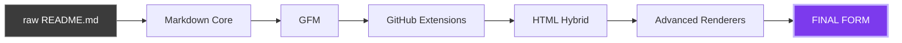
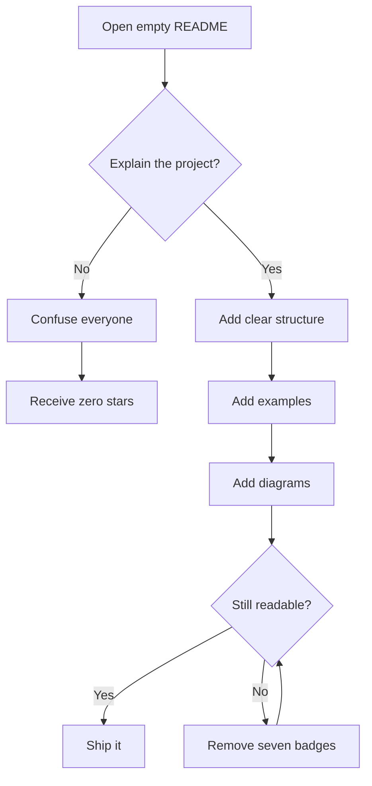
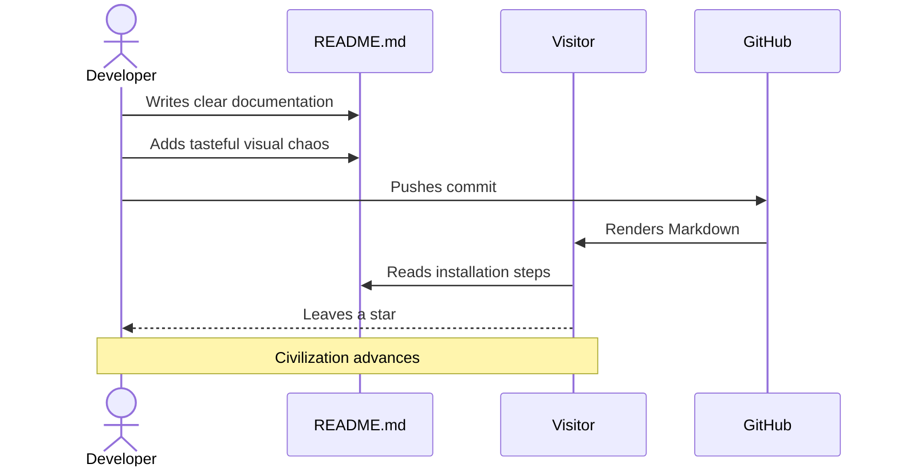
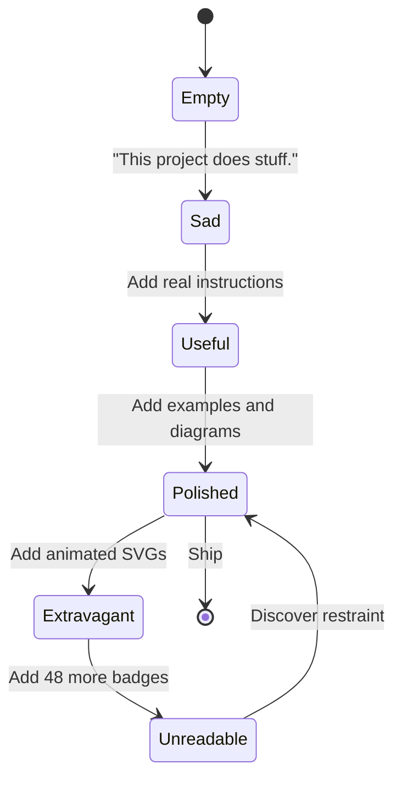

<!--
╔══════════════════════════════════════════════════════════════════════════════╗
║                          LEVEL 00: SOURCE LAYER                              ║
║                                                                              ║
║  Achievement unlocked: RAW SOURCE EXPLORER                                  ║
║  You inspected README.md before GitHub rendered it.                         ║
║                                                                              ║
║  Rendering stack: Markdown → GFM → GitHub → HTML → Advanced Renderers       ║
╚══════════════════════════════════════════════════════════════════════════════╝
-->

<div align="center">

<a href="https://www.markdownguide.org/">
  
</a>

<a href="https://readme-typing-svg.demolab.com/demo/">
  
</a>

<br />

<a href="https://www.markdownguide.org/"></a>
<a href="https://github.github.com/gfm/"></a>
<a href="#act-v--advanced-rendering"></a>
<a href="#the-chaos-index"></a>
<a href="#final-boss"></a>

<br />

<h3>🚨 This is not merely a README.</h3>
<h3>This is a <strong>layer-by-layer Markdown rendering laboratory</strong>.</h3>

<sub>Built with Markdown, GitHub Flavored Markdown, GitHub rendering extensions, HTML fragments, external SVGs, and absolutely no JavaScript.</sub>

<br /><br />

<a href="#act-i--markdown-core"><strong>⚡ Enter Markdown Core</strong></a>
&nbsp;•&nbsp;
<a href="#act-iii--github-extensions"><strong>🧪 Open GitHub Extensions</strong></a>
&nbsp;•&nbsp;
<a href="#act-v--advanced-rendering"><strong>🗺️ Enter Advanced Rendering</strong></a>
&nbsp;•&nbsp;
<a href="#final-boss"><strong>👑 Fight the Final Boss</strong></a>

</div>

---

> [!CAUTION]
> **Plain text has been detected.**  
> Remain calm. Put down the `.docx`. Step away from the formatting toolbar.

> [!IMPORTANT]
> A README should explain a project clearly before it attempts visual domination.  
> This repository deliberately pushes presentation far beyond normal documentation—but the structure now makes every trick traceable.

---

## 🧭 README POWER MAP

This document is organized by **rendering layer**, not by random feature order. Each act moves one level farther away from plain text.

| Act | Rendering layer | Current demonstrations | Jump |
| :---: | --- | --- | :---: |
| `00` | [Source Layer](#level-00--source-layer) | Hidden comments, raw-source-only content | `RAW` |
| `I` | [Markdown Core](#act-i--markdown-core) | Typography, hierarchy, lists, quotes, links | `#` |
| `II` | [GitHub Flavored Markdown](#act-ii--github-flavored-markdown) | Tables, task lists, strikethrough | `GFM` |
| `III` | [GitHub Extensions](#act-iii--github-extensions) | Alerts, code highlighting, footnotes | `GH` |
| `IV` | [HTML Hybrid](#act-iv--html-hybrid) | Inline HTML, media control, collapsible interfaces | `<>` |
| `V` | [Advanced Rendering](#act-v--advanced-rendering) | MathJax-style math, Mermaid diagrams | `∞` |
| `VI` | [Parser & Source Lab](#act-vi--parser--source-lab) | Escaping, recursion, hidden knowledge | `\` |
| `VII` | [Endgame & Reference](#act-vii--endgame--reference) | Achievements, cheat sheet, QA | `✓` |
| `∞` | [Final Boss](#final-boss) | Combined mechanics | `👑` |

### Capability classification

Every major section now belongs to one or more explicit layers:

`Markdown` · `GFM` · `GitHub` · `HTML` · `External Asset`

This distinction matters: not everything rendered inside a GitHub README is technically Markdown.

---

## 🧬 THE RENDERING STACK


```mermaid
flowchart LR
    A["raw README.md"] --> B["Markdown Core"]
    B --> C["GFM"]
    C --> D["GitHub Extensions"]
    D --> E["HTML Hybrid"]
    E --> F["Advanced Renderers"]
    F --> G["FINAL FORM"]

    A:::raw
    G:::power

    classDef raw fill:#3b3b3b,color:#ffffff,stroke:#777777
    classDef power fill:#7c3aed,color:#ffffff,stroke:#c4b5fd,stroke-width:3px
```

---

# LEVEL 00 — SOURCE LAYER

`HTML` · `Source-only`

Some README behavior exists only **before** GitHub renders the document.

The giant achievement at the top of this file is hidden inside an HTML comment. Rendered-view readers never see it; raw-source readers do.

```html
<!--
This exists in README.md...
but disappears when GitHub renders it.
-->
```

<!--
M1 architecture note:
The old flat 13-level sequence was deliberately replaced by a rendering-stack model.
Future phases should extend the correct act instead of appending unrelated sections.
-->

> [!NOTE]
> The source view and the rendered view are now intentionally treated as two different surfaces of the same README.

---

# ACT I — MARKDOWN CORE

> The portable foundation: structure and inline syntax that remain useful even without GitHub-specific rendering.

## LEVEL 01 — TYPOGRAPHY & INLINE POWER

`Markdown` · `HTML`

Markdown gives ordinary words several increasingly dramatic forms.

| Source | Rendered intention | Threat level |
| --- | --- | :---: |
| `*italic*` | _Subtle emphasis_ | 🟢 |
| `**bold**` | **Important emphasis** | 🟡 |
| `***bold italic***` | ***Maximum emphasis*** | 🟠 |
| `` `inline code` `` | `Technical credibility` | 🔵 |
| `~~deleted~~` | ~~Evidence removal~~ | 🔴 |
| `<sub>small</sub>` | <sub>whispering</sub> | 🤫 |
| `<sup>high</sup>` | <sup>ascending</sup> | 🚀 |
| `<ins>inserted</ins>` | <ins>newly important</ins> | ✨ |

### Formatting combo attack

**Bold text containing _italic text containing `inline code`_ while remaining bold.**

~~This sentence was removed for being insufficiently dramatic.~~

<ins>This sentence was added after the README gained self-awareness.</ins>

### Keyboard and scale

Press <kbd>Ctrl</kbd> + <kbd>Shift</kbd> + <kbd>V</kbd> to paste without formatting.

Press <kbd>.</kbd> on a GitHub repository to open it in the web editor.

<sub>Tiny text of humility.</sub>  
Normal text of confidence.  
<sup>Superscript of unreasonable superiority.</sup>

> [!TIP]
> Emphasis creates hierarchy. If everything is emphasized, nothing is.

---

## LEVEL 02 — STRUCTURE, LISTS & HIERARCHY

`Markdown`

### List-based domination

- Normal point
- **Strong point**
- `Inline code point`
- [Hyperlinked flex](https://www.markdownguide.org/)
  - Nested idea
    - Deeper context
      - Suspiciously deep sub-point
        - We have entered the list mines
          - **Send indentation**

### Ordered chaos

1. Write the README.
2. Add useful structure.
3. Add tasteful decoration.
4. Ignore the word “tasteful.”
5. Add an animated banner.
6. Achieve documentation transcendence.

### Mixed-species list

1. **Project setup**
   - Create `README.md`
   - Add a title
   - Explain the project
2. **Visual escalation**
   - Add badges
   - Add diagrams
   - Add collapsible sections
3. **Final verification**
   - Preview on GitHub
   - Test every link
   - Pretend this was always the plan

### Header hierarchy laboratory

<details>
<summary><strong>🏛️ Open the six-level heading ladder</strong></summary>

# Header 1 — The Emperor

## Header 2 — The Chancellor

### Header 3 — The Strategist

#### Header 4 — The Specialist

##### Header 5 — The Intern with Production Access

###### Header 6 — The Fine Print Nobody Read

</details>

> [!NOTE]
> The demonstration is collapsed so the README's main architecture remains visually dominant even while all six rendered heading sizes remain available.

### Quotation fortress

> “Markdown is just plain text,” they whispered.
>
> > “Then why does it have tables?” asked the apprentice.
> >
> > > “And diagrams?” asked the architect.
> > >
> > > > “And mathematical notation?” asked the economist.
> > > >
> > > > > The room became silent.

---

## LEVEL 03 — LINKS & NAVIGATION

`Markdown` · `HTML`

### Ordinary links

- [Learn Markdown](https://www.markdownguide.org/)
- [Read GitHub’s formatting documentation](https://docs.github.com/en/get-started/writing-on-github)
- [Study the GitHub Flavored Markdown specification](https://github.github.com/gfm/)
- [Generate badges with Shields.io](https://shields.io/)
- [Build an animated typing SVG](https://readme-typing-svg.demolab.com/demo/)
- [Return to the top](#)

### Links with hover titles

[Hover over this link before clicking](https://www.markdownguide.org/ "You have discovered tooltip technology.")

### Navigation principle

The README now uses **act-level navigation first** and **feature-level headings second**. This prevents the table of contents from becoming a 20-row wall as later phases add more renderers.

---

# ACT II — GITHUB FLAVORED MARKDOWN

> GFM adds practical extensions that make Markdown much more useful for software documentation.

## LEVEL 04 — TABLE TECHNOLOGY

`GFM`

| Syntax | Ability unlocked | Power | Recommended usage |
| :---: | --- | :---: | --- |
| `*text*` | _Italics_ | 🧍 | Gentle emphasis |
| `**text**` | **Bold** | 💪 | Important concepts |
| `***text***` | ***Galaxy brain*** | 🧠 | Controlled drama |
| `` `code` `` | `Monospace` | 🧪 | Commands and identifiers |
| `~~text~~` | ~~Strikethrough~~ | 🗡️ | Corrections and jokes |
| `[text](url)` | Teleportation | 🌀 | Useful destinations |
| `` | Image summoning | 🖼️ | Screenshots and art |

| README State | Stars | Aura |
| :--- | :---: | :---: |
| `This project does stuff.` | `0` | 🪦 |
| Clear documentation | `+10` | 📘 |
| Clear documentation with diagrams | `+100` | 🧠 |
| Clear documentation with animated SVGs | `OVER 9000` | ⚡ |

---

## LEVEL 05 — TASK-LIST SKILL TREE

`GFM`

- [x] Admit Markdown is useful
- [x] Stop treating documentation as an afterthought
- [x] Learn GitHub Flavored Markdown
- [x] Discover task lists
- [ ] Use formatting responsibly
- [ ] Resist adding seventeen more badges
- [ ] Fail to resist
  - [x] Add seventeen more badges
  - [ ] Experience regret
    - [ ] Regret not found

```diff
+ Added Markdown skills
+ Added visual hierarchy
+ Added actual documentation
- Removed excuses
- Removed "I'll write it later"
- Removed one tragic README
```

---

# ACT III — GITHUB EXTENSIONS

> GitHub adds behavior beyond baseline GFM: alerts, syntax highlighting, footnotes, rich rendering, and repository-aware presentation.

## LEVEL 06 — ALERT COMMAND CENTER

`GitHub`

> [!NOTE]
> Useful information for readers who skim.

> [!TIP]
> Helpful advice that improves the result.

> [!IMPORTANT]
> Information required for success.

> [!WARNING]
> Something may go wrong.

> [!CAUTION]
> Something has already gone wrong. You used spaces instead of checking the preview.

---

## LEVEL 07 — CODE-BLOCK ALCHEMY

`Markdown` · `GitHub`

### JavaScript

```javascript
const excuses = [];

function upgradeReadme(readme) {
  if (!readme) {
    throw new Error("README not found. Reputation damage imminent.");
  }

  return {
    ...readme,
    clarity: 100,
    style: "extravagant",
    chaos: Infinity,
  };
}

console.log(upgradeReadme({ format: "Markdown" }));
```

### Python

```python
from dataclasses import dataclass
from math import inf


@dataclass(frozen=True)
class Readme:
    clarity: int
    style: str
    chaos: float


README = Readme(
    clarity=100,
    style="unreasonably polished",
    chaos=inf,
)

print(README)
```

### Bash

```bash
#!/usr/bin/env bash
set -euo pipefail

printf '%s\n' "Scanning repository..."

if [[ ! -f README.md ]]; then
  echo "Critical failure: documentation missing."
  exit 1
fi

echo "README detected."
echo "Deploying unnecessary levels of style..."
```

### JSON

```json
{
  "document": "README.md",
  "status": "overengineered",
  "features": [
    "badges",
    "alerts",
    "tables",
    "diagrams",
    "collapsible-sections",
    "animated-svg"
  ],
  "excusesRemaining": 0
}
```

### The sacred diff

```diff
- This project does stuff.
+ This project solves a clearly defined problem.

- Installation: figure it out.
+ Installation: follow the three verified steps below.

- Documentation coming soon.
+ Documentation has arrived wearing a cape.
```

### Status transmission

`$ echo "learn markdown"`  
`$ git add README.md`  
`$ git commit -m "docs: achieve enlightenment"`  
`$ git push origin main`  
`> repository aura increased successfully`

---

## LEVEL 08 — FOOTNOTES & GITHUB KNOWLEDGE

`GitHub`

Markdown looks simple because the complexity is hiding politely.[^plain-text]

GitHub adds features beyond basic Markdown, including task lists, alerts, diagrams, and mathematical expressions.[^gfm]

Animated banners in this README are externally rendered SVG images—not JavaScript executing inside the document.[^animation]

---

# ACT IV — HTML HYBRID

> GitHub Markdown can safely render selected HTML fragments, enabling layout and interaction patterns that Markdown syntax alone cannot express.

## LEVEL 09 — INLINE HTML & MEDIA CONTROL

`HTML` · `External Asset`

### Clickable image portal

<p align="center">
  <a href="https://www.markdownguide.org/">
    
  </a>
</p>

### Theme-aware imagery

GitHub can display different images for light and dark themes:

```html
<picture>
  <source
    media="(prefers-color-scheme: dark)"
    srcset="assets/banner-dark.svg"
  />
  <source
    media="(prefers-color-scheme: light)"
    srcset="assets/banner-light.svg"
  />
  
</picture>
```

> [!TIP]
> The paths above are still a syntax demonstration in M1. A later asset phase will convert theme-aware media into a live repository-owned demonstration.

---

## LEVEL 10 — COLLAPSIBLE INTERFACE SYSTEM

`HTML` · `Markdown`

<details>
<summary><strong>🧠 Click to reveal forbidden Markdown wisdom</strong></summary>

<br />

You clicked it.

This means you possess:

- curiosity,
- functional motor control,
- and at least partial immunity to boring documentation.

```md
<details>
<summary>Visible title</summary>

Hidden Markdown content goes here.

</details>
```

</details>

<details>
<summary><strong>🐉 Open the optional boss encounter</strong></summary>

### The Documentation Dragon

**HP:** `10,000`  
**Weakness:** Clear installation instructions  
**Special attack:** Outdated screenshots  
**Loot:** Contributor trust

- [x] Add prerequisites
- [x] Add copyable commands
- [x] Explain configuration
- [x] Document common failures
- [ ] Stop adding lore to the README

</details>

<details>
<summary><strong>🎁 Definitely not a trap</strong></summary>

<br />

<div align="center">
  <h2>It was a trap.</h2>
  <p>But at least it was semantic HTML.</p>
</div>

</details>

---

# ACT V — ADVANCED RENDERING

> The point where a `.md` file stops looking like plain documentation and starts behaving like a rendering surface.

## LEVEL 11 — MATHEMATICAL SUPERIORITY

`GitHub` · `Math`

Inline mathematics:

$`E = mc^2`$

A practical documentation model:

```math
\text{README Quality}
=
\frac{\text{Clarity}\times\text{Structure}\times\text{Accuracy}}
{\text{Unexplained Assumptions}+1}
```

The universal law of repository first impressions:

```math
\lim_{\text{documentation}\to 0}\text{user confidence}=0
```

And the forbidden equation:

```math
\text{Markdown}+\text{Restraint}^{-1}=\text{This README}
```

> [!NOTE]
> M1 only relocates the current math showcase. The dedicated mathematics phase will expand this renderer substantially.

---

## LEVEL 12 — MERMAID SUMMONING CIRCLE

`GitHub` · `Mermaid`

### The README production pipeline


```mermaid
flowchart TD
    A[Open empty README] --> B{Explain the project?}
    B -- No --> C[Confuse everyone]
    C --> D[Receive zero stars]
    B -- Yes --> E[Add clear structure]
    E --> F[Add examples]
    F --> G[Add diagrams]
    G --> H{Still readable?}
    H -- Yes --> I[Ship it]
    H -- No --> J[Remove seven badges]
    J --> H
```

### Sequence of enlightenment


```mermaid
sequenceDiagram
    actor Dev as Developer
    participant MD as README.md
    participant User as Visitor
    participant GitHub

    Dev->>MD: Writes clear documentation
    Dev->>MD: Adds tasteful visual chaos
    Dev->>GitHub: Pushes commit
    GitHub->>User: Renders Markdown
    User->>MD: Reads installation steps
    User-->>Dev: Leaves a star
    Note over Dev,User: Civilization advances
```

### Documentation state machine


```mermaid
stateDiagram-v2
    [*] --> Empty
    Empty --> Sad: "This project does stuff."
    Sad --> Useful: Add real instructions
    Useful --> Polished: Add examples and diagrams
    Polished --> Extravagant: Add animated SVGs
    Extravagant --> Unreadable: Add 48 more badges
    Unreadable --> Polished: Discover restraint
    Polished --> [*]: Ship
```

### Reserved expansion slots

The architecture now has room for advanced GitHub-native renderers without creating another unrelated top-level section:

```text
ACT V — ADVANCED RENDERING
├── Mathematics            ✅ current
├── Mermaid                ✅ current
├── GeoJSON                ◌ future phase
├── TopoJSON               ◌ future phase
└── STL / interactive 3D   ◌ future phase
```

---

# ACT VI — PARSER & SOURCE LAB

> This act is for syntax that becomes interesting specifically because Markdown has parsing rules, escaping rules, and source/render differences.

## LEVEL 13 — ESCAPING & FORBIDDEN KNOWLEDGE

`Markdown` · `HTML` · `Source-only`

### Escaping special characters

| Desired character | Escaped source |
| :---: | :---: |
| `*` | `\*` |
| `_` | `\_` |
| `#` | `\#` |
| `>` | `\>` |
| `[` | `\[` |
| `\` | `\\` |

### Hidden comments

The following source disappears from the rendered README:

```html
<!--
Future maintainers:
The animated banner is not sentient.
Probably.
-->
```

<!--
Future maintainers:
The animated banner is not sentient.
Probably.
-->

### Markdown inception

The cheat sheet later in this README uses **four outer backticks** so it can safely contain ordinary triple-backtick code fences inside itself.

That recursion now lives conceptually in the parser lab rather than being treated as an accidental footnote.

---

# ACT VII — ENDGAME & REFERENCE

> The laboratory ends here; what follows measures what was unlocked and keeps the README practically useful.

## 🏅 ACHIEVEMENTS UNLOCKED

<p align="center">
  
  
  
  
  
</p>

| Achievement | Requirement | Status |
| --- | --- | :---: |
| **The Emphasizer** | Use bold, italics, and code together | ✅ |
| **List Archaeologist** | Reach five nesting levels | ✅ |
| **Table Architect** | Align columns intentionally | ✅ |
| **Alert Commander** | Deploy all five GitHub alerts | ✅ |
| **Diagram Summoner** | Render Mermaid successfully | ✅ |
| **Source Diver** | Hide meaningful source-only content | ✅ |
| **Architecture Engineer** | Organize by rendering layer | ✅ |
| **Master of Restraint** | Stop before adding too much | ❌ |

---

## THE CHAOS INDEX

```text
Clarity        ████████████████████ 100%
Structure      ████████████████████ 100%
Navigation     ████████████████████ 100%
Usefulness     ███████████████████░  95%
Animation      ████████████████░░░░  80%
Badge Density  ██████████████████░░  90%
Restraint      ██░░░░░░░░░░░░░░░░░░  10%
Raw Power      ████████████░░░░░░░░  M1
```

> [!WARNING]
> A beautiful README that does not explain its own structure is still bad documentation.
>
> **M1 fixes the architecture first. Later phases increase the power.**

---

## 🧰 THE ACTUALLY USEFUL CHEAT SHEET

````md
# Heading 1
## Heading 2
### Heading 3

**bold**
*italic*
***bold italic***
~~strikethrough~~
`inline code`

[link text](https://example.com)


> Blockquote

> [!IMPORTANT]
> GitHub alert

- Bullet
  - Nested bullet

1. Ordered item
2. Another item

- [x] Complete
- [ ] Incomplete

| Column A | Column B |
| --- | --- |
| Value | Value |

```language
fenced code block
```

<details>
<summary>Click to expand</summary>

Hidden content

</details>

Here is a footnote.[^1]

[^1]: Footnote text.
````

> [!NOTE]
> The inner fenced-code example above is protected by four outer backticks. Markdown enjoys recursion almost as much as programmers do.

---

## 🧯 COMMON README CRIMES

| Crime | Sentence |
| --- | --- |
| No explanation | Visitors leave immediately |
| No installation steps | Users guess incorrectly |
| Broken image links | Permanent visual shame |
| Giant unstructured paragraphs | Nobody reads them |
| Forty badges before the title | Immediate suspicion |
| Screenshots with no alt text | Accessibility failure |
| Commands that were never tested | Production chaos |
| “Documentation coming soon” | It is not coming soon |
| Decorative overload | The content disappears |
| Flat feature dumping | The README becomes impossible to extend |

---

## 🧪 README QUALITY TEST

Before pushing, verify:

- [ ] The first paragraph explains what the project does.
- [ ] The installation steps work in a clean environment.
- [ ] Every command can be copied safely.
- [ ] Every link opens the intended destination.
- [ ] Every image has useful alt text.
- [ ] The document works in light and dark mode.
- [ ] The mobile layout remains readable.
- [ ] Decorative elements support rather than bury the content.
- [ ] Every advanced feature belongs to the correct rendering layer.
- [ ] The README was previewed on GitHub.
- [ ] No one wrote “just figure it out.”

---

# FINAL BOSS

<div align="center">

<a href="https://www.markdownguide.org/">
  
</a>

<h3>M1 did not add the strongest weapons.</h3>
<h3>It built the arena that can contain them.</h3>

</div>

```txt
SOURCE
  ↓
MARKDOWN CORE
  ↓
GFM
  ↓
GITHUB EXTENSIONS
  ↓
HTML HYBRID
  ↓
ADVANCED RENDERING
  ↓
PARSER LAB
  ↓
FINAL FORM
```

<div align="center">

<p>
  Structure first. Then capability.<br />
  Every future feature now has a deliberate home.<br />
  Make it <s>unreadable</s> <strong><em>beautifully, strategically ridiculous</em></strong>.
</p>

<br />

<a href="https://www.markdownguide.org/"></a>
<a href="https://docs.github.com/en/get-started/writing-on-github"></a>
<a href="#"></a>

<br />

<h2>🗿 Markdown: Final Form.</h2>
<h3>Architecture before escalation.</h3>


</div>

---

[^plain-text]: Markdown remains readable as plain text while adding lightweight structural syntax.
[^gfm]: GitHub Flavored Markdown extends common Markdown behavior with GitHub-specific rendering features.
[^animation]: External SVG generators may become unavailable, change behavior, or load slowly. A later phase will move critical visual assets into the repository.
