<!--
╔══════════════════════════════════════════════════════════════════════════════╗
║                      LEVEL 00: SOURCE LAYER — M17                           ║
║                                                                              ║
║  RAW SOURCE EXPLORER · PARSER TAMER · BLOCK ARCHITECT · LINK CARTOGRAPHER   ║
║  MEDIA ENGINEER · HYBRID ENGINEER · SYNTAX CURATOR · MATHJAX ARCHITECT      ║
║  MERMAID CARTOGRAPHER · GEOJSON NAVIGATOR · TOPOLOGY ENGINEER               ║
║  STL MESHSMITH · GRAMMAR BREAKER · PROGRESSION ARCHITECT · FINAL COMPOSER   ║
║  ACCESSIBILITY WARDEN · RELEASE KEEPER                                      ║
║                                                                              ║
║  M17 invariant: release means capability + regression + honest fallbacks.   ║
║  No new renderer family. No hidden release blocker. No critical remote media.║
╚══════════════════════════════════════════════════════════════════════════════╝
-->

<!--
SECRET ACHIEVEMENTS — SOURCE VIEW ONLY

[S1] RAW SOURCE EXPLORER        — unlocked
[S2] COMMENT ARCHAEOLOGIST      — unlocked
[S3] THE SOURCE IS THE UI       — unlocked
[S4] NO NEW MECHANICS           — unlocked
[S5] MOTION TAMER               — unlocked
[S6] RELEASE KEEPER             — unlocked in M17
[S7] MASTER OF RESTRAINT        — unlocked: M15–M17 added no new renderer family
-->

<picture>
  <source media="(prefers-color-scheme: dark)" srcset="./assets/hero-dark.svg">
  <source media="(prefers-color-scheme: light)" srcset="./assets/hero-light.svg">
  
</picture>

<div align="center">

<a href="#campaign-status"></a>
<a href="#m17-release-regression"></a>
<a href="#final-boss"></a>

</div>

# MARKDOWN: FINAL FORM

**One README · seven Acts · thirty-nine numbered levels · six specialized renderer routes · one canonical Final Boss · release regression complete.**

[Campaign](#campaign-status) · [Core](#act-i--markdown-core) · [Renderers](#act-v--advanced-rendering) · [Parser Trials](#act-vi--parser-trials) · [Achievements](#achievement-codex) · [Final Boss](#final-boss) · [Release](#m17-release-regression)

> [!IMPORTANT]
> **FINAL FORM — RELEASED.** M17 introduces no new Markdown capability. It closes the campaign by regression-checking the source structure, repository assets, critical anchors, renderer routes, parser containment, theme/mobile/accessibility fallbacks, and release-state consistency against GitHub's current documented Markdown behavior.[^github-diagrams][^mathjax][^linguist][^theme-picture]

<a name="campaign-status"></a>

## CAMPAIGN STATUS

| Metric | Final state | Meaning |
| --- | :---: | --- |
| Campaign | **18 / 18** | M0 through M17 complete |
| Showcase mastery | **100 / 100** | planned breadth retained |
| Specialized routes | **6 / 6** | Linguist, MathJax, Mermaid, GeoJSON, TopoJSON, ASCII STL |
| Final Boss | **cleared** | canonical M15 composition retained |
| Accessibility/mobile/theme | **certified** | M16 hardening retained |
| Final release regression | **passed** | M17 source/repository regression complete |
| Release state | **FINAL FORM — RELEASED** | no remaining project gate |

```text
M0 ─ M1 ─ M2 ─ M3 ─ M4 ─ M5 ─ M6 ─ M7 ─ M8 ─ M9 ─ M10 ─ M11 ─ M12 ─ M13 ─ M14 ─ M15 ─ M16 ─ M17
✓    ✓    ✓    ✓    ✓    ✓    ✓    ✓    ✓    ✓     ✓     ✓     ✓     ✓     ✓     ✓     ✓     ✓
```

### Final scoreboards

```text
SHOWCASE MASTERY
████████████████████ 100 / 100

RELEASE CONFIDENCE
████████████████████ 100 / 100

CAMPAIGN COMPLETION
████████████████████ 18 / 18
```

The final release score is intentionally simple: all five endgame gates are complete and the repository/source regression has no unresolved blocker.

---

## THE CAMPAIGN MAP

**Text equivalent:** Source Layer → Markdown Core → GFM → GitHub Extensions → HTML Hybrid → Advanced Renderers → Parser Trials → Endgame → Final Boss → Accessibility Certification → Release Regression → Released.

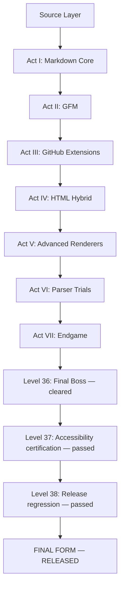
```mermaid
flowchart TB
    S[Source Layer] --> A1[Act I: Markdown Core]
    A1 --> A2[Act II: GFM]
    A2 --> A3[Act III: GitHub Extensions]
    A3 --> A4[Act IV: HTML Hybrid]
    A4 --> A5[Act V: Advanced Renderers]
    A5 --> A6[Act VI: Parser Trials]
    A6 --> A7[Act VII: Endgame]
    A7 --> B[Level 36: Final Boss — cleared]
    B --> C[Level 37: Accessibility certification — passed]
    C --> R[Level 38: Release regression — passed]
    R --> REL[FINAL FORM — RELEASED]
```

| Stage | Boss / gate | Final state |
| --- | --- | :---: |
| Source | Source Gate | ✅ |
| Act I | Core Grammar | ✅ |
| Act II | Pipe & Task Engine | ✅ |
| Act III | Extension Router | ✅ |
| Act IV | Sanitizer Survivor | ✅ |
| Act V | Renderer Gauntlet | ✅ |
| Act VI | Parser Firewall | ✅ |
| Act VII | Progression Architect | ✅ |
| Final composition | Canonical Final Boss | ✅ |
| M16 | Accessibility / Mobile / Theme | ✅ |
| M17 | Release Regression | ✅ |

---

## LEVEL 00 — SOURCE LAYER

`HTML comment` · `source-only` · `secret progression`

```html
<!-- Rendered output cannot show everything the source knows. -->
```

The source layer stores invariants, optional secrets, and exact parser fixtures. No essential release instruction exists only inside a hidden comment.

[Open raw parser corpus](./assets/parser-torture-corpus.txt)

---

<a name="act-i--markdown-core"></a>

## ACT I — MARKDOWN CORE

### LEVEL 01 — TYPOGRAPHY

| Source | Rendered |
| --- | --- |
| `*italic*` | *italic* |
| `_italic_` | _italic_ |
| `**strong**` | **strong** |
| `__strong__` | __strong__ |
| `***both***` | ***both*** |
| `~~deleted~~` | ~~deleted~~ |
| `` `code` `` | `code` |
| `<sub>2</sub>` | H<sub>2</sub>O |
| `<sup>2</sup>` | x<sup>2</sup> |
| `<ins>new</ins>` | <ins>new</ins> |

**Strong containing _emphasis containing `code`_.**

Intraword control: `foo*bar*baz` versus `foo_bar_baz`.

### LEVEL 02 — HEADINGS / BREAKS

The released document keeps exactly one live H1. The full heading syntax remains demonstrated as source:

```markdown
# H1
## H2
### H3
#### H4
##### H5
###### H6

Setext One
==========

Setext Two
----------
```

Two trailing spaces create a hard break.  
This line follows.

A backslash creates one too.\
This line follows.

### LEVEL 03 — CONTAINERS

1. Ordered list
   - nested bullet
     - [x] nested task

> Blockquote
>
> - list inside quote
> - `code`

```text
ordinary fenced block
```

### LEVEL 04 — LINKS / REFERENCES

[Inline example](https://example.com) · [Markdown Guide][markdown-guide] · [GitHub writing documentation][GitHub Docs] · [GFM specification][GFM Spec]

[Open this README](./README.md) · [Open parser corpus](./assets/parser-torture-corpus.txt) · [Go to Final Boss](#final-boss) · [Go to Release](#m17-release-regression)

<https://github.com/>  
https://github.com  
www.github.com

#### ACT I BOSS — CORE GRAMMAR

**Victory condition:** inline formatting, headings, blocks, links, references, and line breaks coexist with readable source and one primary document title.

---

## ACT II — GITHUB FLAVORED MARKDOWN

### LEVEL 05 — TABLE ENGINE

| Left | Center | Right |
| :--- | :---: | ---: |
| alpha | beta | 100 |
| alpha \| beta | `left\|right` | 200 |
| **formatting** | $x^2$ | 300 |

> [!TIP]
> Critical tables stay narrow; high-dimensional data belongs in collapsed source blocks or vertical lists instead of forcing a permanent mobile overflow.

### LEVEL 06 — TASK TREE

- [x] Markdown Core
- [x] GFM
- [x] GitHub Extensions
- [x] HTML Hybrid
- [x] 33-mode Linguist museum
- [x] MathJax
- [x] Mermaid
- [x] GeoJSON
- [x] TopoJSON
- [x] ASCII STL
- [x] Parser torture
- [x] Progression overhaul
- [x] Canonical Final Boss
- [x] Light/dark/mobile/accessibility certification
- [x] **Final GitHub release regression**

#### ACT II BOSS — PIPE & TASK ENGINE

**Victory condition:** escaped pipes survive, tasks remain meaningful without color, and state is always written in text.

---

<a name="act-iii--github-extensions"></a>

## ACT III — GITHUB EXTENSIONS

### LEVEL 07 — ALERT COMMAND CENTER

> [!NOTE]
> Final release status is stated in ordinary text, not only in badges.

> [!TIP]
> Source-first renderer examples remain inspectable and copyable.

> [!IMPORTANT]
> M17 is complete; no campaign gate remains.

> [!WARNING]
> A successful visual render does not replace semantic validation of the source.

> [!CAUTION]
> Deliberately malformed renderer examples remain inert inside ordinary source fences.

### LEVEL 08 — LINGUIST SYNTAX MUSEUM

GitHub uses Linguist to select syntax grammars for fenced code blocks.[^linguist] The final release retains the **33-mode** museum, collapsed by family.

<details>
<summary><strong>Web / data / markup — 9 languages</strong></summary>

```javascript
console.log("JavaScript");
```
```typescript
const phase: number = 17;
```
```html
<details><summary>HTML</summary></details>
```
```css
.readme { display: block; }
```
```json
{"phase":"M17","released":true}
```
```yaml
phase: M17
released: true
```
```toml
phase = "M17"
released = true
```
```xml
<phase released="true">M17</phase>
```
```sql
SELECT 'M17' AS phase, TRUE AS released;
```

</details>

<details>
<summary><strong>Compiled / systems — 8 languages</strong></summary>

```c
int main(void){return 0;}
```
```cpp
#include <iostream>
int main(){std::cout << "C++";}
```
```rust
fn main(){println!("Rust");}
```
```go
package main
func main(){}
```
```java
class Main { public static void main(String[] a){} }
```
```csharp
Console.WriteLine("C#");
```
```kotlin
fun main() = println("Kotlin")
```
```swift
print("Swift")
```

</details>

<details>
<summary><strong>Scripting / scientific / functional — 11 languages</strong></summary>

```python
print("Python")
```
```ruby
puts "Ruby"
```
```php
<?php echo "PHP";
```
```lua
print("Lua")
```
```bash
printf '%s\n' Bash
```
```powershell
Write-Output 'PowerShell'
```
```r
print(pi)
```
```julia
println(pi)
```
```haskell
main = print pi
```
```scala
@main def run() = println(math.Pi)
```
```latex
\int_0^1 x^2\,dx
```

</details>

<details>
<summary><strong>Infrastructure / documentation / literal — 5 modes</strong></summary>

```dockerfile
FROM alpine:3.22
```
```markdown
# Markdown
```
```diff
- release candidate
+ FINAL FORM — RELEASED
```
```text
plaintext
```
```ini
[readme]
phase=M17
released=true
```

</details>

**Inventory:** 9 + 8 + 11 + 5 = **33 modes**.

### LEVEL 09 — FOOTNOTES / GITHUB-AWARE BEHAVIOR

GitHub renders supported LaTeX-formatted mathematics with MathJax.[^mathjax] GitHub documents Mermaid, GeoJSON, TopoJSON, and ASCII STL as advanced Markdown renderer routes.[^github-diagrams]

Repeated footnote reference one.[^repeat] Repeated footnote reference two.[^repeat]

#### ACT III BOSS — EXTENSION ROUTER

**Victory condition:** alerts, syntax routing, references, footnotes, and autolinks remain source-controlled and release-safe.

---

## ACT IV — HTML HYBRID

### LEVEL 10 — REPOSITORY MEDIA

GitHub documents `<picture>` plus `prefers-color-scheme` for light/dark README imagery, including a default `` fallback and alt text.[^theme-picture] GitHub also notes an SVG-rendering caveat in Firefox; this banner is therefore noncritical and its alt text plus the ordinary H1/status text carry the same essential identity.[^noncode]

<picture>
  <source media="(prefers-color-scheme: dark)" srcset="./assets/hero-dark.svg">
  <source media="(prefers-color-scheme: light)" srcset="./assets/hero-light.svg">
  
</picture>


<a href="#final-boss"></a>

> [!NOTE]
> Critical identity and documentation remain repository-owned. Remote Shields badges are supplemental and never the sole carrier of state.

### LEVEL 11 — INLINE HTML SEMANTICS

Press <kbd>Ctrl</kbd> + <kbd>K</kbd>.  
H<sub>2</sub>O · x<sup>2</sup> · <ins>inserted</ins> · <del>deleted</del> · <s>obsolete</s>

### LEVEL 12 — DETAILS INTERFACE

Critical status remains outside disclosures; `<details>` is used for optional depth.

<details>
<summary><strong>Open Markdown-inside-details demonstration</strong></summary>

#### Heading inside details

- list
- **emphasis**
- `code`

</details>

<details open>
<summary><strong>Default-open disclosure demonstration</strong></summary>

The `open` attribute changes initial state without README-authored JavaScript.

</details>

### LEVEL 13 — HTML TABLE

<table>
  <thead><tr><th>Mechanism</th><th>Role</th></tr></thead>
  <tbody>
    <tr><td><code>&lt;details&gt;</code></td><td>optional disclosure</td></tr>
    <tr><td><code>&lt;picture&gt;</code></td><td>theme-aware media</td></tr>
    <tr><td><code>&lt;kbd&gt;</code></td><td>keyboard semantics</td></tr>
    <tr><td><code>&lt;table&gt;</code></td><td>explicit table structure</td></tr>
  </tbody>
</table>

### LEVEL 14 — MARKDOWN / HTML OWNERSHIP

````html
<details>
<summary>Descriptive summary</summary>

#### Markdown heading

- Markdown list

```text
fence inside details
```

</details>
````

### LEVEL 15 — SANITIZATION BOUNDARY

```html
<script>alert('not a README runtime')</script>
<div style="position:fixed">not an app shell</div>
<div class="app" id="root">not a JavaScript mount point</div>
```

### LEVEL 16 — HYBRID BOSS

| Subsystem | Final state |
| --- | --- |
| Local SVG | ONLINE |
| Theme-aware picture | ONLINE |
| Details UI | ONLINE |
| Semantic HTML | ONLINE |
| README-authored JavaScript runtime | ABSENT BY DESIGN |

#### ACT IV BOSS — SANITIZER SURVIVOR

**Victory condition:** HTML extends Markdown semantics without pretending the README is an unrestricted web application.

---

<a name="act-v--advanced-rendering"></a>

## ACT V — ADVANCED RENDERING

<a name="renderer-mastery"></a>

### LEVEL 17 — MATHJAX

Inline: $E=mc^2$. Protected inline: $`x_i^2`$.

```math
A=\begin{pmatrix}1&2\\3&4\end{pmatrix},
\qquad Av=\lambda v
```

```math
\begin{aligned}
e^{i\pi}+1&=0,\\
\widehat f(\xi)&=\int_{-\infty}^{\infty}f(x)e^{-2\pi i x\xi}\,dx.
\end{aligned}
```

<details>
<summary><strong>Open advanced MathJax laboratory retained from M8</strong></summary>

#### Algebra / piecewise

```math
f(x)=\begin{cases}
x^2,&x\ge0,\\
-x,&x<0.
\end{cases}
```

#### Linear algebra

```math
\det(A-\lambda I)=0,\qquad
\operatorname{rank}(A)+\operatorname{nullity}(A)=n,\qquad
A=Q\Lambda Q^{-1}.
```

#### Calculus

```math
\lim_{h\to0}\frac{f(x+h)-f(x)}{h}=f'(x),\qquad
\nabla f=(\partial_1f,\ldots,\partial_nf),\qquad
\int_a^b f'(x)\,dx=f(b)-f(a).
```

#### Probability

```math
P(A\mid B)=\frac{P(B\mid A)P(A)}{P(B)},\qquad
\mathbb E[X]=\sum_x xP(X=x),\qquad
\operatorname{Var}(X)=\mathbb E[(X-\mu)^2].
```

#### Series / operators

```math
\sum_{k=0}^{n}r^k=\frac{1-r^{n+1}}{1-r},\qquad
\prod_{k=1}^{n}k=n!,\qquad
\zeta(s)=\sum_{n=1}^{\infty}\frac1{n^s}.
```

#### Complex / Gaussian / Fourier

```math
 e^{i\theta}=\cos\theta+i\sin\theta,\qquad
 \int_{-\infty}^{\infty}e^{-x^2}\,dx=\sqrt\pi,\qquad
 \widehat f(\xi)=\int_{-\infty}^{\infty}f(x)e^{-2\pi i x\xi}\,dx.
```

#### Multivariable calculus / optimization

```math
\nabla f(x)=\begin{pmatrix}\partial_1 f\\\vdots\\\partial_n f\end{pmatrix},\qquad
H_f=(\partial_i\partial_j f)_{i,j},\qquad
\nabla_x\!\left(f(x)+\lambda g(x)\right)=0.
```

#### Sets / logic / mappings

```math
\mathbb N\subset\mathbb Z\subset\mathbb Q\subset\mathbb R\subset\mathbb C,\qquad
\forall\varepsilon>0\;\exists\delta>0,\qquad
f:A\to B.
```

#### Literal-dollar boundary

Literal-dollar handling remains demonstrated in Level 28 below, where protected MathJax and inline-code controls are kept separate.

</details>

### LEVEL 18 — MERMAID

**Text equivalent:** Source is routed to Linguist, MathJax, Mermaid, GeoJSON, TopoJSON, or ASCII STL depending on its syntax route.

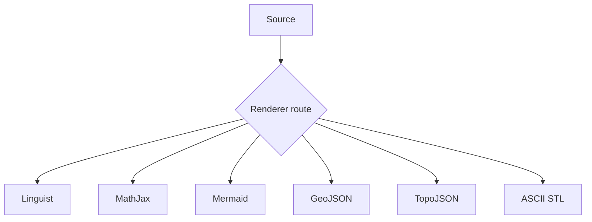
```mermaid
flowchart TB
    SOURCE[Source] --> ROUTE{Renderer route}
    ROUTE --> L[Linguist]
    ROUTE --> MJ[MathJax]
    ROUTE --> MM[Mermaid]
    ROUTE --> GJ[GeoJSON]
    ROUTE --> TJ[TopoJSON]
    ROUTE --> STL[ASCII STL]
```

<details>
<summary><strong>Open optional sequence diagram</strong></summary>

**Text equivalent:** Author commits source → GitHub parses Markdown → specialized renderer produces output.

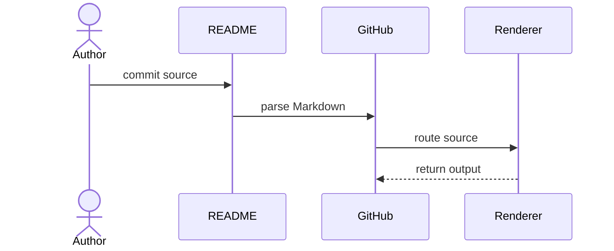
```mermaid
sequenceDiagram
    actor Author
    participant MD as README
    participant GH as GitHub
    participant R as Renderer
    Author->>MD: commit source
    MD->>GH: parse Markdown
    GH->>R: route source
    R-->>GH: return output
```

</details>

> [!IMPORTANT]
> Mermaid remains supplementary visualization. Its essential relationships are repeated in text because GitHub documents that not every Mermaid chart is fully accessibility-compliant.[^noncode]

<details>
<summary><strong>Open full Mermaid diagram gallery retained from M9</strong></summary>

#### State
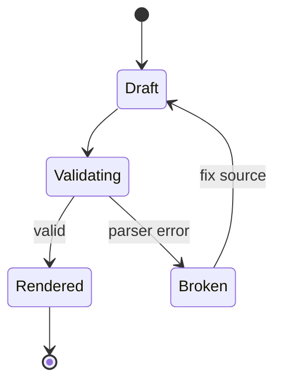
```mermaid
stateDiagram-v2
    [*] --> Draft
    Draft --> Validating
    Validating --> Rendered: valid
    Validating --> Broken: parser error
    Broken --> Draft: fix source
    Rendered --> [*]
```

#### Class
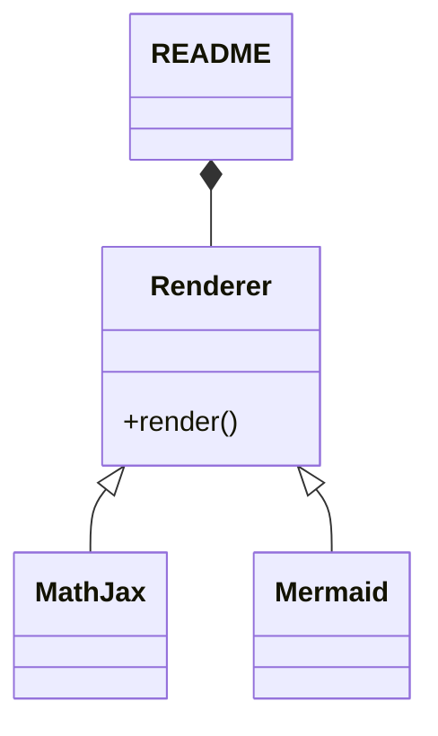
```mermaid
classDiagram
    Renderer <|-- MathJax
    Renderer <|-- Mermaid
    README *-- Renderer
    class Renderer { +render() }
```

#### Entity relationship
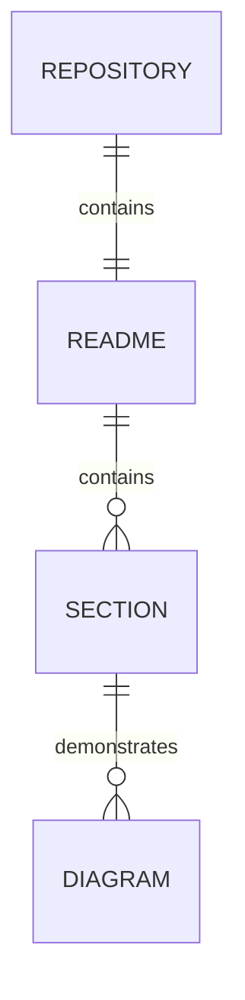
```mermaid
erDiagram
    REPOSITORY ||--|| README : contains
    README ||--o{ SECTION : contains
    SECTION ||--o{ DIAGRAM : demonstrates
```

#### User journey
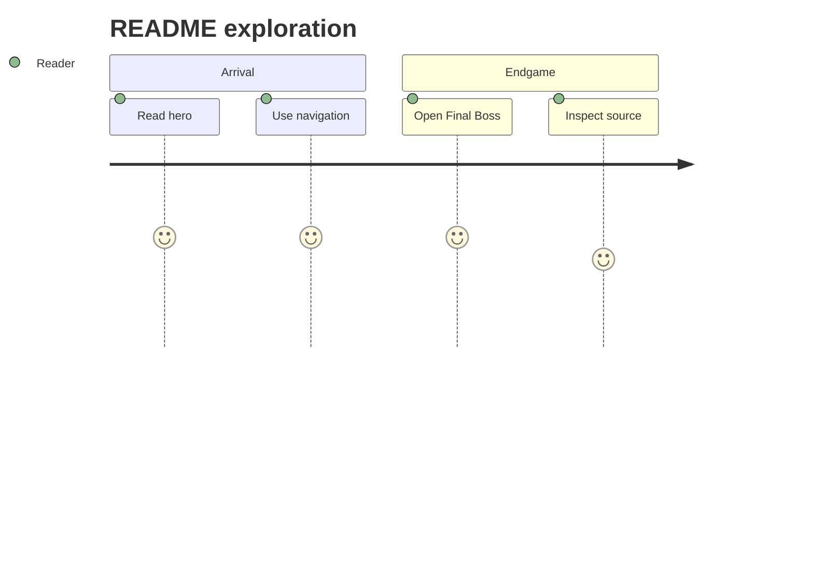
```mermaid
journey
    title README exploration
    section Arrival
      Read hero: 5: Reader
      Use navigation: 5: Reader
    section Endgame
      Open Final Boss: 5: Reader
      Inspect source: 4: Reader
```

#### Gantt
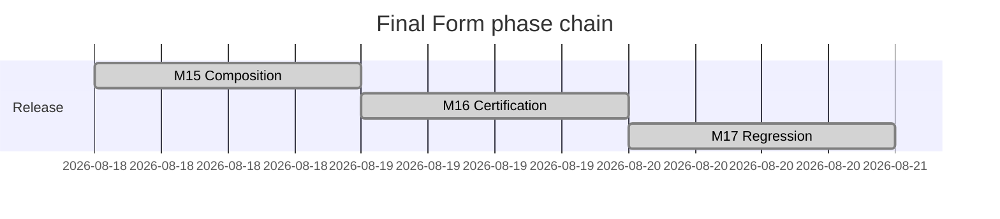
```mermaid
gantt
    title Final Form phase chain
    dateFormat  YYYY-MM-DD
    section Release
    M15 Composition :done, m15, 2026-08-18, 1d
    M16 Certification :done, m16, after m15, 1d
    M17 Regression :done, m17, after m16, 1d
```

#### Pie
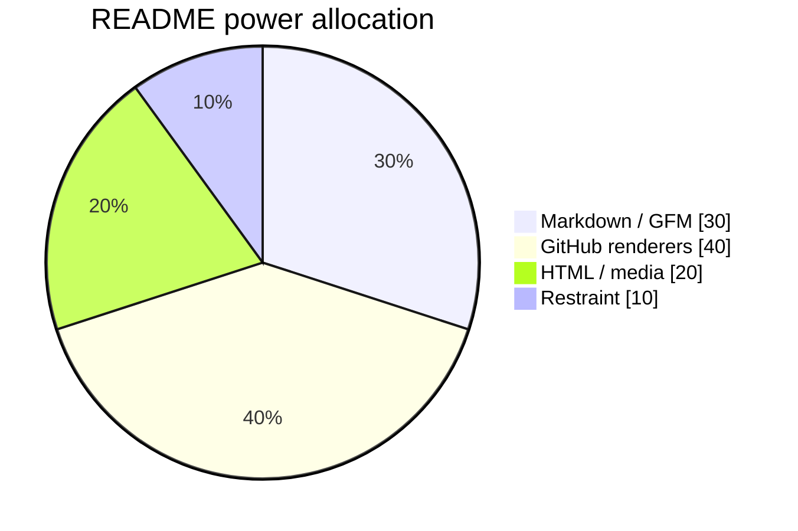
```mermaid
pie showData
    title README power allocation
    "Markdown / GFM" : 30
    "GitHub renderers" : 40
    "HTML / media" : 20
    "Restraint" : 10
```

#### Git graph
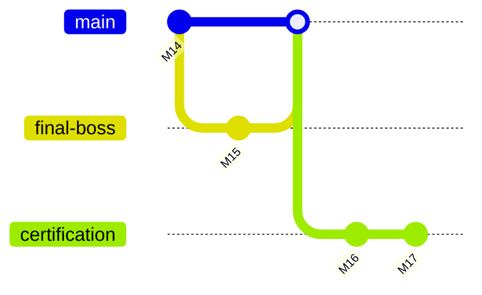
```mermaid
gitGraph
    commit id: "M14"
    branch final-boss
    commit id: "M15"
    checkout main
    merge final-boss
    branch certification
    commit id: "M16"
    commit id: "M17"
```

#### Mindmap
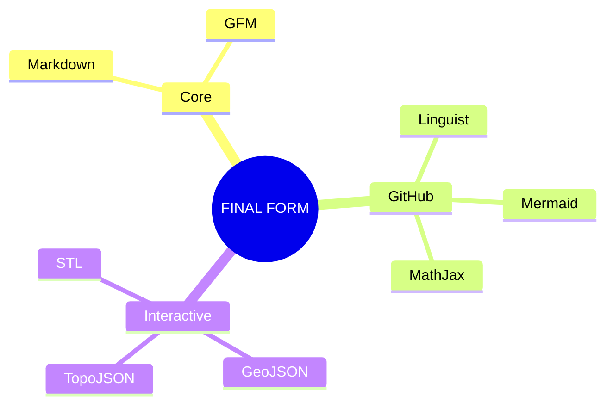
```mermaid
mindmap
  root((FINAL FORM))
    Core
      Markdown
      GFM
    GitHub
      Linguist
      MathJax
      Mermaid
    Interactive
      GeoJSON
      TopoJSON
      STL
```

#### Timeline
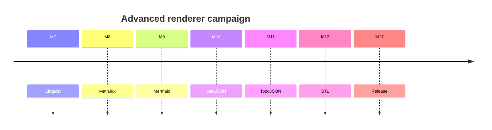
```mermaid
timeline
    title Advanced renderer campaign
    M7 : Linguist
    M8 : MathJax
    M9 : Mermaid
    M10 : GeoJSON
    M11 : TopoJSON
    M12 : STL
    M17 : Release
```

#### Quadrant chart
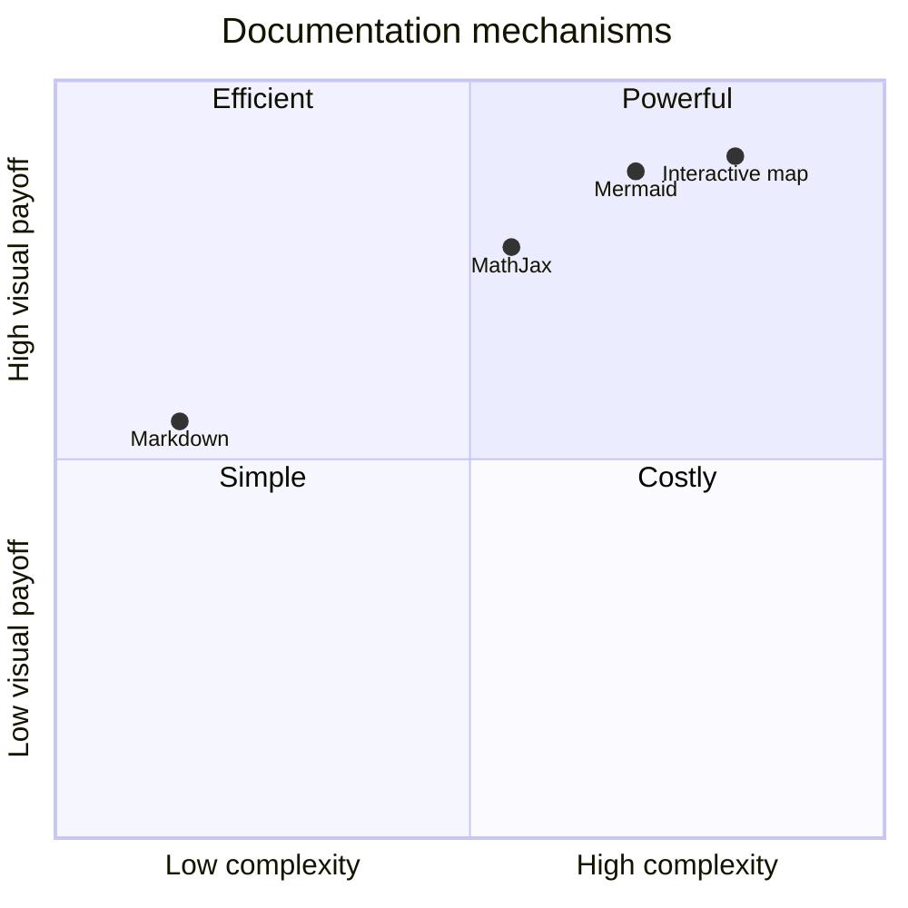
```mermaid
quadrantChart
    title Documentation mechanisms
    x-axis Low complexity --> High complexity
    y-axis Low visual payoff --> High visual payoff
    quadrant-1 Powerful
    quadrant-2 Efficient
    quadrant-3 Simple
    quadrant-4 Costly
    Markdown: [0.15, 0.55]
    MathJax: [0.55, 0.78]
    Mermaid: [0.70, 0.88]
    Interactive map: [0.82, 0.90]
```

#### Requirement diagram
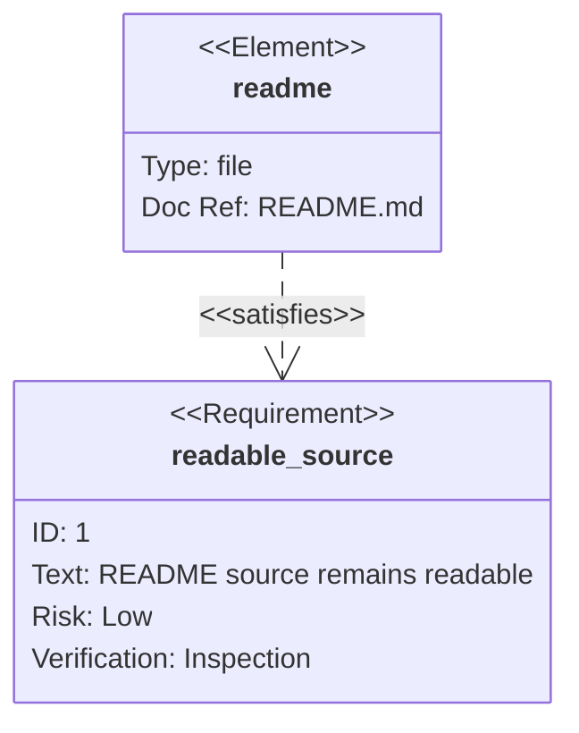
```mermaid
requirementDiagram
    requirement readable_source {
      id: 1
      text: README source remains readable
      risk: low
      verifymethod: inspection
    }
    element readme {
      type: file
      docref: README.md
    }
    readme - satisfies -> readable_source
```

#### Architecture compatibility shelf

Architecture diagrams are a newer Mermaid family and remain intentionally **source-only** here rather than release-critical:

````text
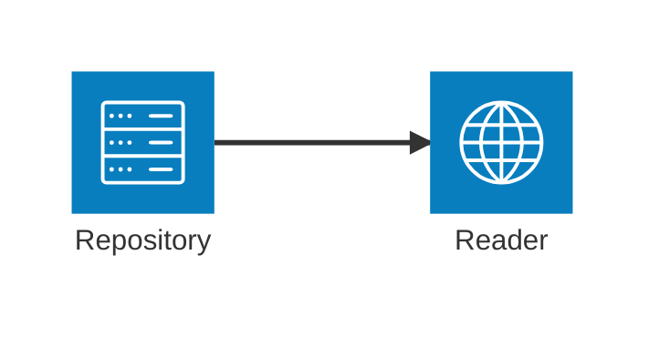
```mermaid
architecture-beta
    service repo(server)[Repository]
    service reader(internet)[Reader]
    repo:R --> L:reader
```
````

</details>

### LEVEL 19 — GEOJSON

**Text equivalent:** Berlin is at longitude `13.405`, latitude `52.52`; Paris is at longitude `2.3522`, latitude `48.8566`.

```geojson
{
  "type": "FeatureCollection",
  "features": [
    {"type":"Feature","properties":{"title":"Berlin"},"geometry":{"type":"Point","coordinates":[13.405,52.52]}},
    {"type":"Feature","properties":{"title":"Paris"},"geometry":{"type":"Point","coordinates":[2.3522,48.8566]}}
  ]
}
```

[Open repository GeoJSON source/map](./assets/geojson-showcase.geojson)

### LEVEL 20 — TOPOJSON

**Text equivalent:** two adjacent regions share physical boundary arc `1`; the east polygon reuses that arc in reverse as `-2`.

```topojson
{
  "type": "Topology",
  "objects": {
    "regions": {
      "type": "GeometryCollection",
      "geometries": [
        {"type":"Polygon","id":"west","arcs":[[0,1,2,3]]},
        {"type":"Polygon","id":"east","arcs":[[4,5,6,-2]]}
      ]
    }
  },
  "arcs": [
    [[2,48],[6,48]], [[6,48],[6,52]], [[6,52],[2,52]], [[2,52],[2,48]],
    [[6,48],[10,48]], [[10,48],[10,52]], [[10,52],[6,52]]
  ]
}
```

[Open repository TopoJSON source/map](./assets/topojson-showcase.topojson)

### LEVEL 21 — ASCII STL / 3D

**Text equivalent:** this tetrahedron has vertices `(0,0,0)`, `(1,0,0)`, `(0,1,0)`, `(0,0,1)` and four triangular faces. The repository asset is a separate validated twelve-facet unit cube.

```stl
solid tetrahedron
  facet normal 0 0 -1
    outer loop
      vertex 0 0 0
      vertex 0 1 0
      vertex 1 0 0
    endloop
  endfacet
  facet normal 0 -1 0
    outer loop
      vertex 0 0 0
      vertex 1 0 0
      vertex 0 0 1
    endloop
  endfacet
  facet normal -1 0 0
    outer loop
      vertex 0 0 0
      vertex 0 0 1
      vertex 0 1 0
    endloop
  endfacet
  facet normal 0.577350269 0.577350269 0.577350269
    outer loop
      vertex 1 0 0
      vertex 0 1 0
      vertex 0 0 1
    endloop
  endfacet
endsolid tetrahedron
```

[Open repository STL cube](./assets/stl-showcase.stl)

GitHub's standalone STL viewer uses WebGL and documents a 10 MB viewer limit, so the text description and ASCII source remain first-class fallbacks.[^noncode]

### RENDERER MASTERY — FINAL

| Renderer | Mastery | Durable evidence |
| --- | :---: | --- |
| Linguist | V | 33-mode museum |
| MathJax | V | inline + block equations |
| Mermaid | V | diagram + text equivalent |
| GeoJSON | V | live block + `.geojson` asset |
| TopoJSON | V | live block + `.topojson` asset |
| ASCII STL | V | live block + `.stl` asset |

**Mastery V:** syntax + live route + composition + failure containment + durable evidence.

#### ACT V BOSS — RENDERER GAUNTLET

**Victory condition:** all six specialized routes retain a source path, live demonstration, and nonvisual/source fallback where needed.

---

<a name="act-vi--parser-trials"></a>

## ACT VI — PARSER TRIALS

[Open the exact M13 raw fixture](./assets/parser-torture-corpus.txt).

### LEVEL 22 — ESCAPES

\# not a heading  
\> not a quote  
\- not a list  
1\. not an ordered list  
\*not emphasis\*

### LEVEL 23 — CODE-SPAN LENGTH

`plain code`

``Use a `backtick` inside code``

Triple delimiter example: ```Use ``two`` backticks inside three```

### LEVEL 24 — DELIMITER PRECEDENCE

***strong emphasis***  
**strong *nested emphasis***  
*emphasis **nested strong***  
foo*bar*baz  
foo_bar_baz

### LEVEL 25 — FENCE ARCHITECTURE

````markdown
```javascript
console.log("three inside four");
```
````

`````markdown
````markdown
```javascript
console.log("three inside four inside five");
```
````
`````

~~~text
Tilde fence: literal `backticks` are ordinary content here.
~~~

### LEVEL 26 — CONTAINER OWNERSHIP

> 1. quoted ordered item
>    - [x] quoted task
>
>      ```text
>      fenced block inside quote/list structure
>      ```

### LEVEL 27 — LINKS / PIPES / ANCHORS

| Case | Payload |
| --- | --- |
| escaped pipe | alpha \| beta |
| code-span pipe | `left\|right` |
| balanced URL | [Markdown article](https://en.wikipedia.org/wiki/Markdown_(markup_language)) |

[Reference full][parser-docs] · [Reference collapsed][] · [Reference shortcut]

#### Collision Target

First duplicate-heading test.

#### Collision Target

Second duplicate-heading test. No critical navigation depends on its generated collision suffix.

### LEVEL 28 — HTML / MATH BOUNDARIES

<details>
<summary><strong>Open Markdown and math boundary example</strong></summary>

#### Heading inside details

- **Markdown**
- $x^2+y^2=z^2$

</details>

Literal dollar inside protected math: $`\sqrt{\$4}=2`$.

Inline-code control: `$not-math$`.

### LEVEL 29 — MALFORMED RENDERER FIREWALL

Broken specialized source remains inside one longer **text** fence:

`````text
```mermaid
flowchart LR
    A[unclosed --> B
```

```geojson
{"type":"Point","coordinates":[13.405,52.52],}
```

```topojson
{"type":"Topology","objects":{"bad":{"type":"LineString","arcs":[99]}} ,"arcs":[]}
```

```stl
solid missing_vertex
  facet normal 0 0 1
    outer loop
      vertex 0 0 0
      vertex 1 0 0
    endloop
  endfacet
endsolid missing_vertex
```
`````

### LEVEL 30 — RECURSION

``````markdown
`````markdown
````markdown
```markdown
**Markdown shown inside Markdown shown inside Markdown shown inside Markdown.**
```
````
`````
``````

#### ACT VI BOSS — PARSER FIREWALL

**Victory condition:** dangerous syntax is parsed intentionally or contained intentionally; release polish does not normalize away the delimiter lengths that keep the torture suite safe.

---

## ACT VII — ENDGAME

<a name="achievement-codex"></a>

### LEVEL 31 — ACHIEVEMENT CODEX

<details>
<summary><strong>Open final achievement ledger</strong></summary>

| Achievement | Rarity | Evidence / unlock |
| --- | :---: | --- |
| Core Scribe | COMMON | M1–M2 · typography / structure |
| Block Architect | UNCOMMON | M3 · block composition |
| Link Cartographer | RARE | M4 · links / anchors |
| Media Engineer | RARE | M5 · local/theme media |
| Hybrid Engineer | RARE | M6 · semantic HTML |
| Syntax Curator | EPIC | M7 · 33 modes |
| MathJax Architect | EPIC | M8 · mathematical rendering |
| Mermaid Cartographer | EPIC | M9 · diagram breadth |
| GeoJSON Navigator | LEGENDARY | M10 · interactive maps |
| Topology Engineer | LEGENDARY | M11 · shared topology |
| STL Meshsmith | LEGENDARY | M12 · interactive 3D |
| Grammar Breaker | MYTHIC | M13 · parser firewall |
| Progression Architect | MYTHIC | M14 · campaign system |
| Final Form Composer | MYTHIC | M15 · canonical composition |
| Accessibility Warden | MYTHIC | M16 · theme/mobile/a11y |
| **Release Keeper** | **MYTHIC** | **M17 · final regression** |
| **Master of Restraint** | **SECRET** | **M17 · no new renderer family in M15–M17** |

</details>

Achievement rule: **evidence beats decoration**. If the evidence disappears, the achievement is no longer earned.

### LEVEL 32 — PHASE HISTORY

| Phase range | Milestone | Final state |
| --- | --- | :---: |
| M0–M4 | audit → architecture → parser basics → blocks → links | ✅ |
| M5–M7 | repository media → HTML Hybrid → syntax museum | ✅ |
| M8–M12 | MathJax → Mermaid → GeoJSON → TopoJSON → STL | ✅ |
| M13 | parser torture / containment | ✅ |
| M14 | progression / Chaos Index | ✅ |
| M15 | canonical Final Boss | ✅ |
| M16 | light/dark/mobile/accessibility | ✅ |
| **M17** | **final GitHub release regression / polish** | **✅ RELEASED** |

### LEVEL 33 — CHAOS INDEX 3.0

```text
CAPABILITY
Markdown / GFM      ████████████████████ 100
GitHub / HTML       ████████████████████ 100
Linguist            ████████████████████ 100
MathJax / Mermaid   ████████████████████ 100
Geo / Topology / 3D ████████████████████ 100

ROBUSTNESS
Parser / Containment████████████████████ 100
Local Assets        ████████████████████ 100
Theme / A11Y        ████████████████████ 100
Mobile Structure    ████████████████████ 100
Release Regression  ████████████████████ 100

ENDGAME
Showcase Mastery    ████████████████████ 100
Campaign Completion ████████████████████ 100
Release Confidence  ████████████████████ 100
Restraint           ████████████████████ 100
RAW POWER           ████████████████████ FINAL
```

### LEVEL 34 — UNLOCK TREE

**Text equivalent:** M13 → M14 → M15 → M16 → M17 → Released; every gate is complete.

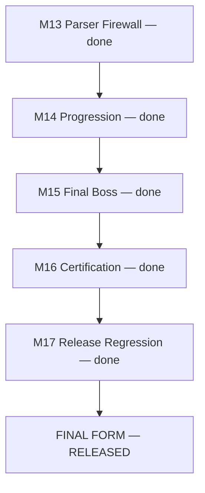
```mermaid
flowchart TB
    M13[M13 Parser Firewall — done] --> M14[M14 Progression — done]
    M14 --> M15[M15 Final Boss — done]
    M15 --> M16[M16 Certification — done]
    M16 --> M17[M17 Release Regression — done]
    M17 --> REL[FINAL FORM — RELEASED]
```

### LEVEL 35 — SOURCE-ONLY SECRETS

```text
SECRET ACHIEVEMENTS
├── Raw Source Explorer
├── Comment Archaeologist
├── The Source Is the UI
├── No New Mechanics
├── Motion Tamer
├── Release Keeper
└── Master of Restraint  [UNLOCKED]
```

> [!TIP]
> Source view remains part of the experience, but release-critical information is fully visible in rendered Markdown.

---

<a name="final-boss"></a>

### LEVEL 36 — CANONICAL FINAL BOSS

`M0–M17 composition` · `no new mechanics`

<!-- FINAL BOSS SECRET: the composition survived release regression. -->

> [!IMPORTANT]
> **Final Boss rule:** every mechanism below was introduced before the release-hardening phases. M17 verifies and polishes; it does not expand the feature surface.

<picture>
  <source media="(prefers-color-scheme: dark)" srcset="./assets/hero-dark.svg">
  <source media="(prefers-color-scheme: light)" srcset="./assets/hero-light.svg">
  
</picture>

#### Boss status

| Layer | Mechanic | Final state |
| --- | --- | :---: |
| Core | Markdown / GFM | ONLINE |
| GitHub | alerts / footnotes / Linguist | ONLINE |
| Hybrid | picture / details / semantic HTML | ONLINE |
| Advanced | MathJax / Mermaid | ONLINE |
| Interactive | GeoJSON / TopoJSON / STL | ONLINE |
| Defense | parser firewall | ARMED |
| Accessibility | M16 fallbacks | PASSED |
| Release | M17 regression | PASSED |

- [x] repository-owned theme media
- [x] Markdown + GFM + HTML composition
- [x] six specialized renderer routes
- [x] parser containment
- [x] text equivalents for visual/interactive content
- [x] motion removed from critical path
- [x] source-only secrets remain optional
- [x] release regression complete

#### Boss manifest

```yaml
boss: MARKDOWN_FINAL_FORM
phase: M17
state: released
rule: verify_do_not_expand
specialized_routes: 6
parser_firewall: armed
text_fallbacks: required
critical_remote_media: false
campaign: 18/18
```

#### Renderer network

**Text equivalent:** GitHub parses Markdown/GFM, routes specialized source to the appropriate renderer, and combines those outputs with sanitized HTML, parser containment, local assets, and text fallbacks.

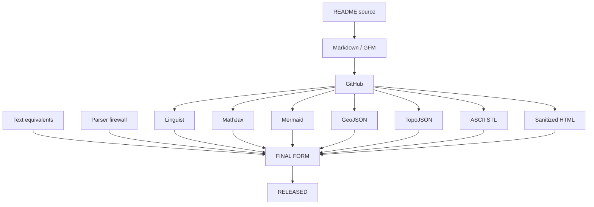
```mermaid
flowchart TB
    SRC[README source] --> MD[Markdown / GFM]
    MD --> GH[GitHub]
    GH --> CODE[Linguist]
    GH --> MATH[MathJax]
    GH --> MM[Mermaid]
    GH --> GEO[GeoJSON]
    GH --> TOPO[TopoJSON]
    GH --> STL[ASCII STL]
    GH --> HTML[Sanitized HTML]
    FALLBACK[Text equivalents] --> FINAL[FINAL FORM]
    FIRE[Parser firewall] --> FINAL
    CODE --> FINAL
    MATH --> FINAL
    MM --> FINAL
    GEO --> FINAL
    TOPO --> FINAL
    STL --> FINAL
    HTML --> FINAL
    FINAL --> RELEASED[RELEASED]
```

#### Mathematical victory condition

```math
\begin{aligned}
\text{Final Form}
&=\text{Capability}+\text{Composition}+\text{Parser Safety}\\
&\quad+\text{Accessibility}+\text{Regression},\\
\text{New renderer families in M15--M17}&=0,\\
\text{Campaign completion}&=18/18.
\end{aligned}
```

#### Interactive chambers

<details>
<summary><strong>Open GeoJSON chamber — Paris to Berlin route</strong></summary>

**Text fallback:** start at Paris `(2.3522, 48.8566)`, finish at Berlin `(13.405, 52.52)`, connected by one line segment.

```geojson
{
  "type":"FeatureCollection",
  "features":[
    {"type":"Feature","properties":{"title":"Paris"},"geometry":{"type":"Point","coordinates":[2.3522,48.8566]}},
    {"type":"Feature","properties":{"title":"Berlin"},"geometry":{"type":"Point","coordinates":[13.405,52.52]}},
    {"type":"Feature","properties":{"title":"Route"},"geometry":{"type":"LineString","coordinates":[[2.3522,48.8566],[13.405,52.52]]}}
  ]
}
```

[Open repository GeoJSON source/map](./assets/geojson-showcase.geojson)

</details>

<details>
<summary><strong>Open TopoJSON chamber — shared boundary</strong></summary>

**Text fallback:** west and east polygons share arc `1`; east reuses that boundary in reverse with `-2`.

```topojson
{
  "type":"Topology",
  "objects":{
    "west":{"type":"Polygon","arcs":[[0,1,2,3]]},
    "east":{"type":"Polygon","arcs":[[4,5,6,-2]]}
  },
  "arcs":[
    [[2,48],[6,48]], [[6,48],[6,52]], [[6,52],[2,52]], [[2,52],[2,48]],
    [[6,48],[10,48]], [[10,48],[10,52]], [[10,52],[6,52]]
  ]
}
```

[Open repository TopoJSON source/map](./assets/topojson-showcase.topojson)

</details>

<details>
<summary><strong>Open ASCII STL chamber — tetrahedron</strong></summary>

**Text fallback:** four vertices and four triangular faces form a closed tetrahedron; the repository asset is a validated unit cube made from twelve facets.

```stl
solid final_form_tetrahedron
  facet normal 0 0 -1
    outer loop
      vertex 0 0 0
      vertex 0 1 0
      vertex 1 0 0
    endloop
  endfacet
  facet normal 0 -1 0
    outer loop
      vertex 0 0 0
      vertex 1 0 0
      vertex 0 0 1
    endloop
  endfacet
  facet normal -1 0 0
    outer loop
      vertex 0 0 0
      vertex 0 0 1
      vertex 0 1 0
    endloop
  endfacet
  facet normal 0.577350269 0.577350269 0.577350269
    outer loop
      vertex 1 0 0
      vertex 0 1 0
      vertex 0 0 1
    endloop
  endfacet
endsolid final_form_tetrahedron
```

[Open repository STL cube](./assets/stl-showcase.stl)

</details>

#### Parser shield

`````text
```mermaid
flowchart LR
    BROKEN[unclosed --> B
```

```geojson
{"type":"Point","coordinates":[13.405,52.52],}
```

```topojson
{"type":"Topology","objects":{"bad":{"type":"LineString","arcs":[99]}},"arcs":[]}
```

```stl
solid missing_vertex
  facet normal 0 0 1
    outer loop
      vertex 0 0 0
      vertex 1 0 0
    endloop
  endfacet
endsolid missing_vertex
```
`````

---

<a name="m16-certification"></a>

### LEVEL 37 — LIGHT/DARK, MOBILE & ACCESSIBILITY CERTIFICATION

`M16` · `retained in final release`

- [x] one primary H1
- [x] theme-aware `<picture>` with fallback and alt text
- [x] repository-owned critical identity
- [x] no autoplaying critical media
- [x] descriptive disclosure summaries
- [x] critical state outside `<details>`
- [x] narrow critical tables
- [x] top-to-bottom critical Mermaid diagrams
- [x] text equivalents for Mermaid, maps, and STL
- [x] mobile-friendly `width="100%"` media
- [x] color is not the sole completion signal

**M16 verdict:** retained and regression-checked in M17.

---

<a name="m17-release-regression"></a>

### LEVEL 38 — FINAL GITHUB RENDERING REGRESSION & RELEASE

`M17` · `release certification` · `FINAL`

#### Repository integrity — PASS

- [x] `README.md` is present on the release branch.
- [x] `assets/hero-light.svg` and `assets/hero-dark.svg` are present.
- [x] `assets/media-card.svg` is present.
- [x] `assets/clickable-portal.svg` is present.
- [x] `assets/media-divider.svg` is present.
- [x] `assets/parser-torture-corpus.txt` is present.
- [x] `assets/geojson-showcase.geojson` is present.
- [x] `assets/topojson-showcase.topojson` is present.
- [x] `assets/stl-showcase.stl` is present.

#### Critical-link / anchor regression — PASS

Critical navigation uses either explicit named anchors or stable relative repository paths:

- [x] `#campaign-status`
- [x] `#act-i--markdown-core`
- [x] `#act-v--advanced-rendering`
- [x] `#act-vi--parser-trials`
- [x] `#achievement-codex`
- [x] `#final-boss`
- [x] `#m16-certification`
- [x] `#m17-release-regression`
- [x] all release-critical asset links are relative and branch-safe

Duplicate generated-heading anchors remain deliberate parser tests and are not release-critical destinations.

#### Renderer contract regression — PASS

Current GitHub documentation still identifies:

1. **Linguist** for fenced syntax highlighting.[^linguist]
2. **MathJax** for LaTeX-formatted math.[^mathjax]
3. **Mermaid** fenced diagrams.[^github-diagrams]
4. **GeoJSON** fenced interactive maps.[^github-diagrams]
5. **TopoJSON** fenced interactive maps.[^github-diagrams]
6. **ASCII STL** fenced interactive 3D models.[^github-diagrams]

All six routes remain represented in this README, while intentionally malformed renderer examples remain contained inside longer ordinary source fences.

#### Standalone specialized assets — PASS

GitHub documents repository viewers for GeoJSON/TopoJSON maps and STL 3D files.[^noncode]

- [x] standalone GeoJSON is under the documented browser-size threshold
- [x] standalone TopoJSON is compact and repository-owned
- [x] standalone STL is far below GitHub's documented 10 MB viewer limit
- [x] each interactive asset has prose/source fallback in the README

#### Source parser regression — PASS

- [x] 3/4/5/6-backtick examples remain intentionally nested
- [x] tilde fence remains separate from backtick fences
- [x] escaped table pipes remain escaped
- [x] malformed specialized renderers remain inert
- [x] duplicate heading collision test remains noncritical
- [x] math-dollar boundary examples remain explicit
- [x] raw parser torture corpus remains plain text

#### Theme / mobile / accessibility regression — PASS

- [x] responsive theme image uses GitHub's documented `<picture>` pattern.[^theme-picture]
- [x] GitHub documents a Firefox SVG-rendering caveat; the hero is noncritical and has complete alt/text fallback.[^noncode]
- [x] hero SVGs retain accessible metadata and high-contrast self-contained backgrounds
- [x] static text repeats badge/status meaning
- [x] critical tables remain three columns or fewer
- [x] critical Mermaid flow is vertical
- [x] interactive renderers have text equivalents
- [x] no autoplaying external image is in the critical path
- [x] no essential content requires hover, WebGL, map interaction, color discrimination, or source-view discovery

#### Final release verdict

```text
SOURCE STRUCTURE       PASS
CRITICAL ANCHORS       PASS
RELATIVE ASSETS        PASS
LINGUIST               PASS
MATHJAX                PASS
MERMAID CONTRACT       PASS
GEOJSON CONTRACT       PASS
TOPOJSON CONTRACT      PASS
ASCII STL CONTRACT     PASS
PARSER CONTAINMENT     PASS
LIGHT / DARK DESIGN    PASS
MOBILE STRUCTURE       PASS
ACCESSIBILITY FALLBACK PASS
CAMPAIGN CONSISTENCY   PASS
--------------------------------
RELEASE                FINAL FORM
```

> [!NOTE]
> GitHub owns the final browser renderer/runtime for Mermaid, maps, STL, theme selection, and responsive shells. This release therefore treats documented renderer support plus repository/source integrity and explicit fallbacks as the durable contract; no critical meaning depends on a single visual runtime succeeding.

**Achievements unlocked:** `RELEASE KEEPER` · `MASTER OF RESTRAINT`.

---

## RELEASE STATE

```text
M15 FINAL BOSS          ████████████████████ CLEARED
M16 CERTIFICATION       ████████████████████ CLEARED
M17 RELEASE REGRESSION  ████████████████████ CLEARED
FINAL FORM              ████████████████████ RELEASED
```

<div align="center">

<a href="#m17-release-regression"></a>
<a href="#final-boss"></a>
<a href="./assets/parser-torture-corpus.txt"></a>

</div>

**M17 complete. MARKDOWN: FINAL FORM is released.**


---

[markdown-guide]: https://www.markdownguide.org/ "Markdown Guide"
[GitHub Docs]: https://docs.github.com/en/get-started/writing-on-github "GitHub writing and formatting documentation"
[GFM Spec]: https://github.github.com/gfm/ "GitHub Flavored Markdown specification"
[parser-docs]: https://github.github.com/gfm/ "GFM parser specification"
[Reference collapsed]: https://docs.github.com/en/get-started/writing-on-github "Collapsed reference target"
[Reference shortcut]: https://github.github.com/gfm/ "Shortcut reference target"

[^linguist]: GitHub documents Linguist-backed syntax highlighting for fenced code blocks: https://docs.github.com/en/get-started/writing-on-github/working-with-advanced-formatting/creating-and-highlighting-code-blocks
[^mathjax]: GitHub documents MathJax-backed LaTeX math in Markdown: https://docs.github.com/en/get-started/writing-on-github/working-with-advanced-formatting/writing-mathematical-expressions
[^github-diagrams]: GitHub documents Mermaid, GeoJSON, TopoJSON, and ASCII STL as advanced Markdown rendering syntaxes: https://docs.github.com/en/enterprise-cloud@latest/get-started/writing-on-github/working-with-advanced-formatting/creating-diagrams
[^noncode]: GitHub documents standalone GeoJSON/TopoJSON maps and the STL 3D viewer, including viewer limitations: https://docs.github.com/en/repositories/working-with-files/using-files/working-with-non-code-files
[^theme-picture]: GitHub's writing quickstart documents `<picture>` with `prefers-color-scheme`, light/dark sources, a default fallback, and alt text: https://docs.github.com/en/get-started/writing-on-github/getting-started-with-writing-and-formatting-on-github/quickstart-for-writing-on-github
[^repeat]: This definition is intentionally referenced more than once.
